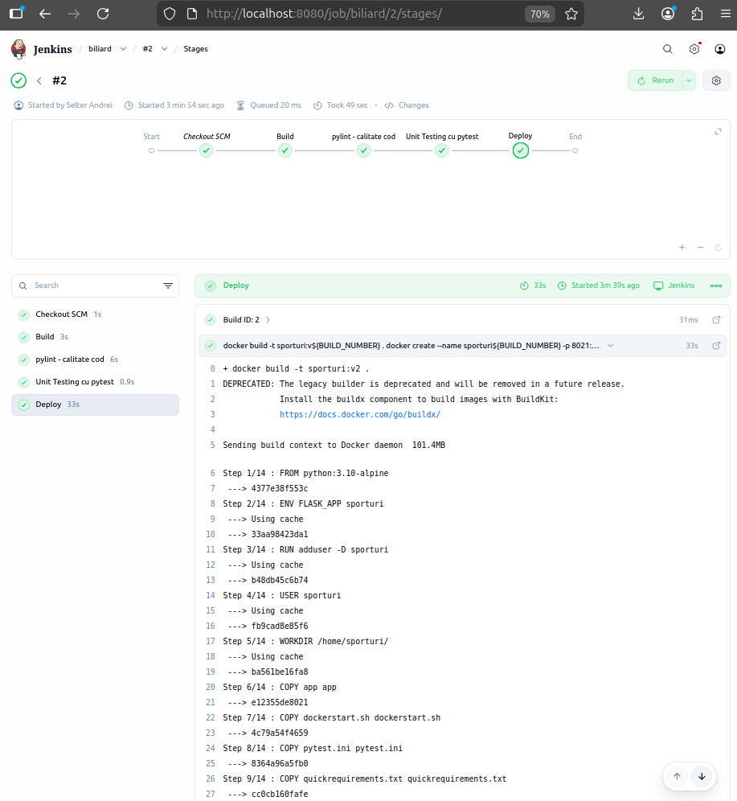

# Proiect SCC - Sporturi

## Dezvoltator

- **Nume:** Andriu Cosmin
- **Grupa:** 442D
- **Element alocat:** Biliard
- **Branch de dezvoltare:** `dev_andriu_cosmin`
- **Branch personal main:** `main_andriu_cosmin`

---

## Cuprins

- [Descriere generală](#descriere-generală)
- [Obiectivul proiectului](#obiectivul-proiectului)
- [Funcționalitate implementată](#funcționalitate-implementată)
- [Structura proiectului](#structura-proiectului)
- [Rute implementate](#rute-implementate)
- [Biblioteca implementată](#biblioteca-implementată)
- [Rulare locală](#rulare-locală)
- [Testare manuală în browser](#testare-manuală-în-browser)
- [Testare automată cu pytest](#testare-automată-cu-pytest)
- [Validare cod cu pylint](#validare-cod-cu-pylint)
- [Testare cu Docker](#testare-cu-docker)
- [DevOps CI - Jenkins](#devops-ci---jenkins)
- [Flux Git și Pull Request](#flux-git-și-pull-request)
- [Stadiu dezvoltare](#stadiu-dezvoltare)
- [Concluzii](#concluzii)
- [Bibliografie](#bibliografie)

---

## Descriere generală

Acest proiect a fost realizat în cadrul disciplinei SCC și are ca scop dezvoltarea unei aplicații web simple folosind framework-ul Flask. Proiectul urmărește parcurgerea unui flux complet de dezvoltare software, pornind de la implementarea codului sursă, organizarea funcționalităților în fișiere separate, testarea automată, analiza statică a codului, containerizarea aplicației și automatizarea procesului de build și testare cu Jenkins.

Tema generală a proiectului este **Sporturi**, iar elementul implementat individual este **Biliard**. Aplicația prezintă informații despre biliard printr-o interfață web simplă, accesibilă din browser. Pentru o organizare mai bună, informațiile afișate sunt generate prin funcții definite într-o bibliotecă Python separată.

Proiectul utilizează următoarele tehnologii:

- **Python** pentru implementarea aplicației;
- **Flask** pentru dezvoltarea aplicației web;
- **Git și GitHub** pentru versionare;
- **pytest** pentru testare automată;
- **pylint** pentru analiza calității codului;
- **Docker** pentru containerizarea aplicației;
- **Jenkins** pentru automatizarea pașilor de build, testare și deploy.

---

## Obiectivul proiectului

Obiectivul principal al proiectului este realizarea unei aplicații web funcționale, organizate modular, care să poată fi rulată local, testată automat, verificată din punct de vedere al calității codului și executată într-un container Docker.

În plus, proiectul urmărește integrarea unui flux DevOps simplu prin utilizarea Jenkins. Prin intermediul pipeline-ului Jenkins, procesul de build, rularea testelor și etapa de deploy sunt automatizate, reducând riscul de erori manuale și oferind o metodă clară de validare a proiectului.

---

## Funcționalitate implementată

În cadrul proiectului au fost implementate următoarele componente:

- aplicație Flask pentru tema **Sporturi**;
- pagină principală pentru tema generală;
- pagină dedicată elementului **Biliard**;
- două funcții publice într-o bibliotecă Python separată;
- două rute suplimentare care folosesc funcțiile din bibliotecă;
- teste automate pentru funcțiile implementate;
- fișier `pytest.ini` pentru configurarea testelor;
- fișier `Dockerfile` pentru construirea imaginii Docker;
- fișier `dockerstart.sh` pentru pornirea aplicației în container;
- fișier `Jenkinsfile` pentru pipeline-ul Jenkins;
- documentație în README cu pașii de rulare și capturile relevante.

---

## Structura proiectului

Structura principală a proiectului este următoarea:

```text
curs_scc_442D_Sporturi/
│
├── app/
│   ├── __init__.py
│   │
│   ├── lib/
│   │   ├── __init__.py
│   │   └── biblioteca_sporturi.py
│   │
│   └── tests/
│       ├── __init__.py
│       └── test_biblioteca_sporturi.py
│
├── doc/
│   ├── doc.jenkinsPipeline.png
│   ├── jenkinsPipeline.png
│   ├── dockerimages.png
│   ├── dockerconsola.png
│   ├── dockerps.png
│   ├── paginaTemaLocal.png
│   ├── paginaElementLocal.png
│   ├── paginaFunctie1Local.png
│   ├── paginaFunctie2Local.png
│   ├── paginaTemaContainer.png
│   ├── paginaElementContainer.png
│   ├── paginaFunctie1Container.png
│   └── paginaFunctie2Container.png
│
├── sporturi.py
├── quickrequirements.txt
├── activeaza_venv
├── activeaza_venv_jenkins
├── ruleaza_aplicatia
├── Dockerfile
├── dockerstart.sh
├── Jenkinsfile
├── pytest.ini
├── .gitignore
└── README.md
```

Folderul `app/lib/` conține biblioteca în care sunt implementate funcțiile cerute. Folderul `app/tests/` conține testele automate, iar folderul `doc/` conține capturile de ecran folosite în README.

---

## Rute implementate

Aplicația Flask are patru rute principale:

| Rută | Descriere |
|---|---|
| `/sporturi` | Pagina principală a temei Sporturi |
| `/sporturi/biliard` | Pagina elementului ales: Biliard |
| `/sporturi/biliard/functie_1_biliard` | Pagina care afișează informațiile returnate de prima funcție |
| `/sporturi/biliard/functie_2_biliard` | Pagina care afișează informațiile returnate de a doua funcție |

Prima rută prezintă tema generală a proiectului, a doua rută prezintă elementul ales, iar ultimele două rute afișează informațiile generate de funcțiile definite în biblioteca proiectului.

---

## Biblioteca implementată

Fișierul bibliotecă este:

```text
app/lib/biblioteca_sporturi.py
```

Acesta conține cele două funcții publice cerute în proiect:

```text
functie_1_biliard()
functie_2_biliard()
```

Funcția `functie_1_biliard()` returnează informații generale despre biliard în format HTML. Funcția `functie_2_biliard()` returnează reguli, caracteristici sau informații importante despre biliard, tot în format HTML.

Separarea acestor funcții într-un fișier dedicat ajută la organizarea codului și permite testarea lor independentă cu `pytest`.

---

## Rulare locală

Pentru rularea locală a aplicației se folosesc următoarele comenzi:

```bash
git clone https://github.com/vlad-barbu18/curs_scc_442D_Sporturi.git
cd curs_scc_442D_Sporturi
git checkout dev_andriu_cosmin
source ./activeaza_venv
source ./ruleaza_aplicatia
```

Aplicația rulează local la adresa:

```text
http://127.0.0.1:5012/sporturi
```

Pentru oprirea aplicației se folosește combinația:

```text
Ctrl + C
```

Scriptul `activeaza_venv` activează mediul virtual Python, iar scriptul `ruleaza_aplicatia` setează aplicația Flask și pornește serverul local pe portul `5012`.

---

## Testare manuală în browser

După pornirea aplicației, au fost testate manual cele patru rute implementate.

Pagina principală a temei:

```text
http://127.0.0.1:5012/sporturi
```

Pagina elementului Biliard:

```text
http://127.0.0.1:5012/sporturi/biliard
```

Pagina pentru prima funcție:

```text
http://127.0.0.1:5012/sporturi/biliard/functie_1_biliard
```

Pagina pentru a doua funcție:

```text
http://127.0.0.1:5012/sporturi/biliard/functie_2_biliard
```

Capturi de ecran pentru rularea locală:


---

## Testare automată cu pytest

Pentru verificarea automată a funcțiilor implementate în bibliotecă a fost folosit framework-ul `pytest`.

Fișierul de teste este:

```text
app/tests/test_biblioteca_sporturi.py
```

Testele verifică dacă funcțiile returnează conținut HTML, dacă rezultatul nu este gol și dacă în răspuns apar elemente specifice implementării.

Comanda de rulare a testelor este:

```bash
source ./activeaza_venv
pytest
```

Rezultatul așteptat este ca toate testele să treacă, de forma:

```text
N passed
```

Captură de ecran cu rezultatul testelor:


---

## Validare cod cu pylint

Pentru analiza statică a codului a fost folosit `pylint`. Acesta verifică stilul codului, posibile probleme de scriere și respectarea unor convenții de programare.

Comenzile folosite pentru validare sunt:

```bash
pylint --exit-zero app/lib/*.py
pylint --exit-zero app/tests/*.py
pylint --exit-zero sporturi.py
```

Opțiunea `--exit-zero` permite afișarea avertismentelor fără oprirea pipeline-ului Jenkins. Astfel, rezultatele `pylint` pot fi analizate fără ca execuția automată să fie întreruptă din cauza unor warning-uri minore.

Captură de ecran cu rezultatul `pylint`:


---

## Testare cu Docker

Pentru containerizarea aplicației a fost creat fișierul:

```text
Dockerfile
```

Acesta definește imaginea Docker a aplicației, copiază fișierele necesare în container, creează mediul virtual și instalează dependențele din `quickrequirements.txt`.

Pornirea aplicației în container se face prin scriptul:

```text
dockerstart.sh
```

Comenzile folosite pentru construirea și rularea containerului sunt:

```bash
docker build -t sporturi:v01 .
docker run --name sporturi1 -p 8021:5012 sporturi:v01
```

Aplicația din container este accesibilă la adresa:

```text
http://127.0.0.1:8021/sporturi
```

Pentru verificarea imaginilor Docker:

```bash
docker images | grep sporturi
```

Pentru verificarea containerelor active:

```bash
docker ps
```

Capturi de ecran pentru Docker:


Capturi de ecran cu aplicația rulată în container:


---

## DevOps CI - Jenkins

Pentru automatizarea procesului de build, testare și deploy a fost folosit Jenkins. Pipeline-ul este definit în fișierul:

```text
Jenkinsfile
```

Pipeline-ul a fost configurat în Jenkins folosind opțiunea:

```text
Pipeline script from SCM
```

Repository-ul folosit este:

```text
https://github.com/vlad-barbu18/curs_scc_442D_Sporturi.git
```

Branch-ul folosit în Jenkins este:

```text
*/dev_andriu_cosmin
```

Prin această configurare, Jenkins citește automat fișierul `Jenkinsfile` din branch-ul de dezvoltare personal și rulează pașii definiți în pipeline.

Pipeline-ul conține următoarele etape:

1. **Build**  
   În această etapă se afișează workspace-ul Jenkins, se listează fișierele proiectului și se activează/creează mediul virtual prin scriptul `activeaza_venv_jenkins`. De asemenea, sunt instalate dependențele necesare proiectului.

2. **pylint - calitate cod**  
   Această etapă rulează analiza statică asupra fișierelor Python din proiect. Sunt analizate fișierele din bibliotecă, fișierele de test și fișierul principal `sporturi.py`.

3. **Unit Testing cu pytest**  
   În această etapă sunt rulate testele automate definite în folderul `app/tests/`. Testele verifică funcțiile din biblioteca proiectului.

4. **Deploy**  
   În etapa de deploy, Jenkins construiește imaginea Docker a aplicației și creează containerul pe baza imaginii generate.

Exemplu de comenzi executate în pipeline:

```bash
. ./activeaza_venv_jenkins
pylint --exit-zero app/lib/*.py
pylint --exit-zero app/tests/*.py
pylint --exit-zero sporturi.py
pytest
docker build -t sporturi:v${BUILD_NUMBER} .
docker create --name sporturi${BUILD_NUMBER} -p 8021:5012 sporturi:v${BUILD_NUMBER}
```

Pentru ca etapa de Docker să funcționeze, utilizatorul `jenkins` trebuie să aibă permisiuni pentru Docker. Acest lucru se face cu:

```bash
sudo usermod -aG docker jenkins
sudo systemctl restart jenkins
```

Verificarea accesului se poate face cu:

```bash
sudo -u jenkins docker ps
```

După configurare, pipeline-ul a fost rulat din interfața Jenkins folosind butonul **Build Now**. Build-ul a trecut cu succes prin etapele principale: Build, pylint, pytest și Deploy.

Capturi de ecran pentru Jenkins:




Prima captură arată faptul că build-ul Jenkins a rulat cu succes, iar a doua captură prezintă vizual etapele pipeline-ului.

---

## Flux Git și Pull Request

Pentru dezvoltarea proiectului a fost folosit un branch personal de lucru:

```text
dev_andriu_cosmin
```

Pe acest branch au fost realizate modificările pentru elementul Biliard. După implementare, modificările au fost urcate pe GitHub folosind comenzile:

```bash
git status
git add .
git commit -m "mesaj commit"
git push
```

După finalizarea implementării, a fost creat un Pull Request din branch-ul de dezvoltare către branch-ul personal de main:

```text
dev_andriu_cosmin -> main_andriu_cosmin
```

Acest flux permite lucrul separat față de branch-ul principal al repository-ului și evită suprascrierea modificărilor realizate de alți colegi.

---

## Stadiu dezvoltare

Stadiul proiectului este următorul:

- aplicația Flask este implementată;
- cele patru rute cerute sunt funcționale;
- biblioteca Python conține cele două funcții publice;
- testele automate cu pytest sunt implementate;
- analiza statică prin pylint este integrată;
- aplicația poate fi rulată local;
- aplicația poate fi rulată în container Docker;
- Jenkinsfile este configurat;
- pipeline-ul Jenkins rulează etapele Build, pylint, pytest și Deploy;
- README-ul conține explicații și capturi de ecran relevante.

---

## Concluzii

Prin realizarea acestui proiect a fost parcurs un flux complet de dezvoltare software, de la scrierea codului până la automatizarea verificărilor prin Jenkins.

Aplicația Flask implementată pentru tema **Sporturi** și elementul **Biliard** demonstrează folosirea rutelor web, separarea funcționalităților în module Python, testarea automată și rularea într-un mediu containerizat.

Utilizarea Docker oferă portabilitate aplicației, deoarece aceasta poate fi rulată într-un container independent de configurația sistemului gazdă. Integrarea Jenkins adaugă o etapă importantă de automatizare, permițând verificarea rapidă a codului după fiecare modificare.

Proiectul evidențiază importanța următoarelor concepte:

- organizarea codului în module;
- versionarea cu Git;
- testarea automată;
- analiza statică a codului;
- containerizarea aplicațiilor;
- automatizarea proceselor prin pipeline-uri CI/CD.

---

## Bibliografie

- Documentația oficială Flask: https://flask.palletsprojects.com/
- Documentația oficială pytest: https://docs.pytest.org/
- Documentația oficială Docker: https://docs.docker.com/
- Documentația oficială Jenkins: https://www.jenkins.io/doc/
- Repository de referință: https://github.com/crchende/sysinfo.git
