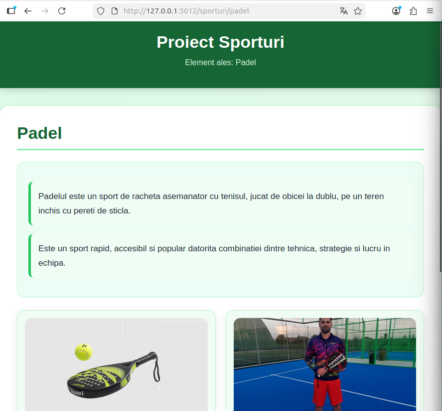
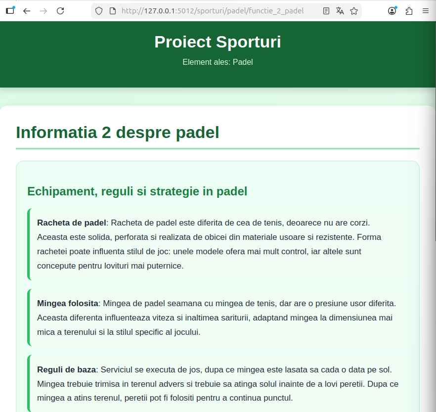

# Proiect SCC - Badminton

## Dezvoltator
- **Nume:** Preda Gabriela-Fabiana
- **Grupa:** 442D
- **Element alocat:** Sport - Badminton

## Cuprins
- [Descriere generală](#descriere-generală)
- [Funcționalitate implementată](#funcționalitate-implementată)
- [Stadiu dezvoltare](#stadiu-dezvoltare)
- [Testare manuală în browser](#testare-manuală-în-browser-rulare-locală)
- [Testare automată cu pytest](#testare-automată-cu-pytest)
- [Validare cod cu pylint](#validare-cod-cu-pylint)
- [Testare cu Docker](#testare-cu-docker)
- [DevOps CI](#devops-ci)
- [Probleme întâlnite și rezolvare](#probleme-întâlnite-și-rezolvare)
- [Concluzii](#concluzii)
- [Bibliografie](#bibliografie)

## Descriere generală

Obiectivul proiectului a fost realizarea unei aplicații web folosind framework-ul Flask. Proiectul urmărește parcurgerea unui flux complet de dezvoltare software, folosind Python pentru programare, GitHub pentru versionare, Jenkins pentru automatizare și Docker pentru containerizare.

Tema aleasă este **Badminton**, aplicația prezentând informații despre acest sport, regulile de bază și echipamentul necesar pentru practicarea lui.

## Funcționalitate implementată

În acest branch am adăugat și personalizat aplicația pentru tema **Badminton**.

Au fost implementate următoarele fișiere și funcționalități:

- Fișierul `app/lib/biblioteca_badminton.py`, care conține funcțiile:
  - `reguli_badminton()` – afișează informații despre regulile de bază ale badmintonului.
  - `echipament_badminton()` – afișează informații despre echipamentul necesar pentru badminton.

- Fișierul principal `sporturi.py`, care conține rutele aplicației:
  - `/badminton` – pagina principală a temei.
  - `/badminton/prezentare` – pagina de prezentare a sportului.
  - `/badminton/prezentare/reguli_badminton` – pagina cu reguli de badminton.
  - `/badminton/prezentare/echipament_badminton` – pagina cu echipamentul necesar.

- Fișierul `app/tests/test_biblioteca_badminton.py`, care conține testele automate pentru funcțiile implementate.

- Folderul `static/images`, care conține imaginea folosită în aplicație:
  - `static/images/badminton.png`

## Stadiu dezvoltare

- Funcționalitatea aplicației este complet implementată.
- Codul a fost adăugat în branch-ul `main_fabiana_preda`.
- Aplicația rulează local în browser.
- Testele automate cu `pytest` rulează cu succes.
- Verificarea codului cu `pylint` este integrată în pipeline.
- Dockerfile-ul este configurat pentru rularea aplicației în container.
- Jenkinsfile-ul este configurat pentru build, verificare cod, testare și deploy.

## Testare manuală în browser (rulare locală)

Pentru rularea aplicației local:

```bash
git clone <url-repo>
cd curs_scc_442D_Sporturi
git checkout main_fabiana_preda
. ./activeaza_venv
python sporturi.py

Aplicația se accesează la: `http://127.0.0.1:5012/sporturi`







## Validare cod cu `pylint`

```bash
pylint --exit-zero app/lib/biblioteca_<tema>.py
pylint --exit-zero app/tests/test_biblioteca_<tema>.py
pylint --exit-zero <tema>.py
```


## Testare cu Docker

```bash
docker build -t sporturi:v02 .
docker run --name sporturi2 -p 8021:5012 sporturi:v02
```

Aplicația din container, accesată la `http://localhost:8021/sporturi`

# DevOps CI

Pipeline declarativ definit în `Jenkinsfile`, cu 4 stages:
1. **Build** - venv + dependențe
2. **pylint** - analiză statică (warning-only)
3. **Unit Tests** - pytest
4. **Deploy** - build Docker + creare container

## Concluzii

- **Dezvoltare modulară:** aplicație Flask cu separarea datelor și logicii.
- **Portabilitate:** Docker asigură rulare consistentă.
- **Automatizare:** Jenkins automatizează testarea și deploy-ul.
- **Asigurarea calității:** pytest și pylint integrate în pipeline.

## Bibliografie

https://github.com/crchende/sysinfo.git
