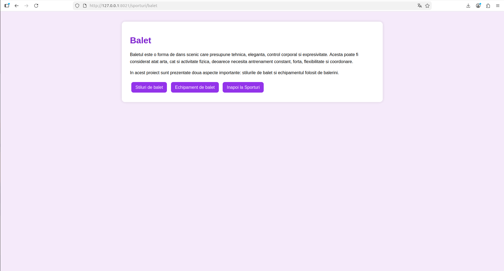
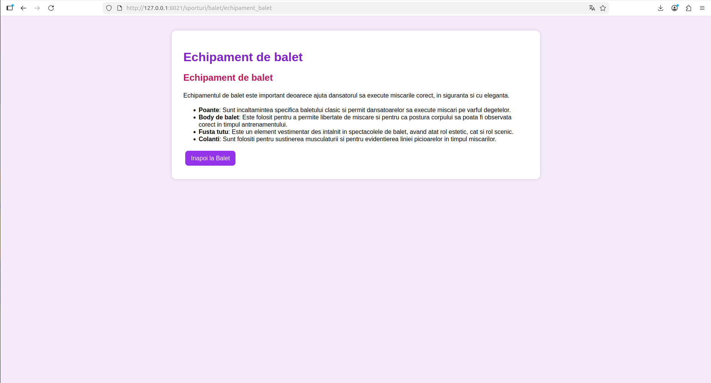

# Proiect SCC - Sporturi

## Dezvoltator

- **Nume:** Borza Iustin
- **Grupa:** 442D
- **Element alocat:** Balet
- **Branch dezvoltare:** `dev_borza_iustin`
- **Branch personal main:** `main_borza_iustin`

---

## Cuprins

- [Descriere generală](#descriere-generală)
- [Funcționalitate implementată](#funcționalitate-implementată)
- [Stadiu dezvoltare](#stadiu-dezvoltare)
- [Structura proiectului](#structura-proiectului)
- [Rulare locală](#rulare-locală)
- [Testare manuală în browser - rulare locală](#testare-manuală-în-browser---rulare-locală)
- [Testare automată cu pytest](#testare-automată-cu-pytest)
- [Validare cod cu pylint](#validare-cod-cu-pylint)
- [Testare cu Docker](#testare-cu-docker)
- [DevOps CI cu Jenkins](#devops-ci-cu-jenkins)
- [Exemplu execuție pipeline Jenkins](#exemplu-execuție-pipeline-jenkins)
- [Probleme întâlnite și rezolvări](#probleme-întâlnite-și-rezolvări)
- [Concluzii](#concluzii)
- [Bibliografie](#bibliografie)

---

## Descriere generală

Obiectivul proiectului a fost realizarea unei aplicații web folosind framework-ul Flask și parcurgerea unui proces complet de dezvoltare software, în care sunt utilizate tehnologii precum Python, GitHub, Docker și Jenkins.

Tema generală a proiectului este **Sporturi**, iar elementul ales pentru implementare este **Baletul**. Aplicația prezintă informații despre balet, despre stilurile principale de balet și despre echipamentul utilizat de dansatori.

Baletul poate fi privit atât ca formă de artă, cât și ca activitate fizică, deoarece presupune disciplină, antrenament constant, coordonare, flexibilitate, forță și expresivitate. Din acest motiv, baletul se încadrează în tema proiectului, fiind o activitate care combină mișcarea sportivă cu interpretarea artistică.

Prin acest proiect s-a urmărit realizarea unei aplicații web simple, dar complete, care să respecte cerințele de dezvoltare, testare, containerizare și automatizare.

Proiectul include:

- aplicație Flask cu patru rute;
- bibliotecă Python separată pentru funcționalități;
- teste automate cu `pytest`;
- analiză statică a codului cu `pylint`;
- rulare locală;
- rulare în container Docker;
- automatizare CI/CD prin Jenkins;
- documentare prin capturi de ecran și README.

---

## Funcționalitate implementată

În cadrul proiectului am implementat o aplicație Flask pentru tema **Sporturi**, personalizată pentru elementul **Balet**.

Funcționalitatea principală este împărțită în mai multe fișiere:

- `sporturi.py` - fișierul principal al aplicației Flask;
- `app/lib/biblioteca_sporturi.py` - biblioteca în care sunt definite funcțiile pentru balet;
- `app/tests/test_biblioteca_sporturi.py` - fișierul cu teste automate;
- `Dockerfile` - fișierul folosit pentru containerizarea aplicației;
- `dockerstart.sh` - scriptul de pornire a aplicației în container;
- `Jenkinsfile` - fișierul folosit pentru automatizarea procesului de build, testare și deploy;
- `quickrequirements.txt` - fișierul cu dependențele Python;
- `pytest.ini` - fișierul de configurare pentru testele automate;
- `README.md` - documentația proiectului.

Cele două funcții principale implementate în biblioteca proiectului sunt:

- `stiluri_balet()` - returnează cod HTML cu informații despre principalele stiluri de balet:
  - balet clasic;
  - balet romantic;
  - balet neoclasic;
  - balet contemporan.

- `echipament_balet()` - returnează cod HTML cu informații despre echipamentul folosit în balet:
  - poante;
  - body de balet;
  - fustă tutu;
  - colanți.

Aplicația are patru rute principale:

- `/sporturi` - pagina principală a temei Sporturi;
- `/sporturi/balet` - pagina principală pentru elementul ales, Balet;
- `/sporturi/balet/stiluri_balet` - pagina cu informații despre stilurile de balet;
- `/sporturi/balet/echipament_balet` - pagina cu informații despre echipamentul de balet.

---

## Stadiu dezvoltare

Stadiul actual al proiectului este complet funcțional.

Au fost realizate următoarele activități:

- aplicația Flask a fost creată și personalizată pentru elementul Balet;
- au fost definite cele patru rute cerute;
- au fost implementate cele două funcții în biblioteca separată;
- au fost create teste automate cu `pytest`;
- codul a fost verificat cu `pylint`;
- aplicația a fost rulată local în browser;
- aplicația a fost containerizată folosind Docker;
- imaginea Docker a fost construită cu succes;
- containerul Docker a fost rulat și testat în browser;
- pipeline-ul Jenkins a fost creat;
- pipeline-ul Jenkins a rulat cu succes;
- etapa de deploy din Jenkins a fost finalizată cu succes;
- fișierele au fost urcate pe branch-ul `dev_borza_iustin`;
- README-ul a fost completat cu descriere, comenzi, rezultate și capturi.

Branch-ul de lucru folosit pentru dezvoltare:

```bash
dev_borza_iustin
```

Branch-ul personal de main:

```bash
main_borza_iustin
```

---

## Structura proiectului

Structura principală a proiectului este următoarea:

```bash
curs_scc_442D_Sporturi/
│
├── app/
│   ├── __init__.py
│   ├── lib/
│   │   ├── __init__.py
│   │   └── biblioteca_sporturi.py
│   │
│   └── tests/
│       ├── __init__.py
│       └── test_biblioteca_sporturi.py
│
├── doc/
│   ├── paginaSporturiLocal.png
│   ├── paginaBaletLocal.png
│   ├── paginaStiluriBaletLocal.png
│   ├── paginaEchipamentBaletLocal.png
│   ├── pytest.png
│   ├── pylint.png
│   ├── dockerimages.png
│   ├── dockerconsola.png
│   ├── dockerps.png
│   ├── paginaSporturiContainer.png
│   ├── paginaBaletContainer.png
│   ├── paginaStiluriBaletContainer.png
│   ├── paginaEchipamentBaletContainer.png
│   ├── jenkinsSimplu.png
│   ├── jenkinsConsoleOutput.png
│   └── jenkinsBlueOcean.png
│
├── activeaza_venv
├── activeaza_venv_jenkins
├── dockerstart.sh
├── Dockerfile
├── Jenkinsfile
├── pytest.ini
├── quickrequirements.txt
├── ruleaza_aplicatia
├── sporturi.py
└── README.md
```

---

## Rulare locală

Pentru rularea locală a proiectului, se clonează repository-ul și se selectează branch-ul de dezvoltare:

```bash
mkdir proiect_iustin
cd proiect_iustin
git clone <URL_REPOSITORY>
cd curs_scc_442D_Sporturi
git checkout dev_borza_iustin
```

Se activează mediul virtual și se pornește aplicația Flask:

```bash
. ./activeaza_venv
./ruleaza_aplicatia
```

Dacă apar probleme de permisiuni la rularea scripturilor, se poate folosi comanda:

```bash
chmod +x activeaza_venv activeaza_venv_jenkins ruleaza_aplicatia dockerstart.sh
```

Aplicația se accesează în browser la adresa:

```bash
http://127.0.0.1:5012/sporturi
```

Pentru oprirea aplicației se folosește combinația de taste:

```bash
CTRL + C
```

---

## Testare manuală în browser - rulare locală

Capturile de mai jos prezintă cele patru rute ale aplicației, accesate în browser în timpul rulării locale.

### Pagina principală a temei Sporturi

Ruta accesată:

```bash
/sporturi
```


### Pagina elementului ales - Balet

Ruta accesată:

```bash
/sporturi/balet
```


### Pagina cu stilurile de balet

Ruta accesată:

```bash
/sporturi/balet/stiluri_balet
```


### Pagina cu echipamentul de balet

Ruta accesată:

```bash
/sporturi/balet/echipament_balet
```


---

## Testare automată cu pytest

Pentru verificarea funcțiilor implementate în biblioteca proiectului, au fost scrise teste automate folosind `pytest`.

Fișierul de teste este:

```bash
app/tests/test_biblioteca_sporturi.py
```

Testele verifică următoarele aspecte:

- funcția `stiluri_balet()` returnează conținut HTML;
- rezultatul funcției conține textul „Stiluri de balet”;
- rezultatul conține informații despre baletul clasic;
- rezultatul conține informații despre baletul contemporan;
- funcția `echipament_balet()` returnează conținut HTML;
- rezultatul conține listă HTML;
- rezultatul conține informații despre poante;
- rezultatul conține informații despre fusta tutu.

Rularea testelor se face cu:

```bash
pytest
```

sau:

```bash
python3 -m pytest
```

Rezultatul obținut indică faptul că toate testele au trecut cu succes.


---

## Validare cod cu pylint

Pentru verificarea calității codului sursă a fost utilizat `pylint`.

Acesta analizează codul Python și poate raporta:

- probleme de formatare;
- importuri neutilizate;
- lipsa docstring-urilor;
- nume de variabile sau funcții care nu respectă convențiile;
- alte recomandări de stil.

Comenzile utilizate pentru verificare au fost:

```bash
pylint --exit-zero app/lib/biblioteca_sporturi.py
pylint --exit-zero app/tests/test_biblioteca_sporturi.py
pylint --exit-zero sporturi.py
```

Flag-ul `--exit-zero` permite afișarea mesajelor `pylint` fără oprirea procesului de build. Astfel, eventualele avertismente sunt vizibile, dar nu blochează pipeline-ul Jenkins.


---

## Testare cu Docker

Pentru asigurarea portabilității aplicației, proiectul a fost containerizat folosind Docker.

Containerizarea permite rularea aplicației într-un mediu izolat, independent de configurația sistemului gazdă. Astfel, aplicația poate fi pornită în același mod pe mai multe sisteme, atât timp cât Docker este instalat.

### Construirea imaginii Docker

Imaginea Docker a fost construită folosind comanda:

```bash
docker build -t sporturi:v01 .
```

După rularea comenzii, imaginea `sporturi:v01` apare în lista locală de imagini Docker.

Verificarea imaginii se face cu:

```bash
docker images | grep sporturi
```


### Rularea containerului

Containerul a fost pornit folosind comanda:

```bash
docker run --name sporturi1 -p 8021:5012 sporturi:v01
```

Prin această comandă, portul `5012` din container este mapat pe portul `8021` al sistemului gazdă.

La pornirea containerului, în consolă sunt afișate mesajele de activare a mediului virtual și de pornire a serverului Flask.


### Verificarea containerului activ

Containerul activ poate fi verificat cu:

```bash
docker ps
```


### Accesarea aplicației din container

Aplicația rulată în container se accesează în browser la adresa:

```bash
http://127.0.0.1:8021/sporturi
```

sau:

```bash
http://localhost:8021/sporturi
```

Capturile următoare prezintă aplicația rulată din containerul Docker.

### Pagina principală Sporturi - container


### Pagina Balet - container



### Pagina Stiluri Balet - container


### Pagina Echipament Balet - container



### Oprirea containerului

După testare, containerul poate fi oprit cu:

```bash
CTRL + C
```

Dacă rămâne containerul creat, acesta poate fi șters cu:

```bash
docker rm -f sporturi1
```

---

## DevOps CI cu Jenkins

Pentru automatizarea procesului de build, testare și deploy a fost utilizat Jenkins.

Pipeline-ul este definit în fișierul:

```bash
Jenkinsfile
```

Acesta conține patru etape principale:

1. **Build**
2. **pylint - calitate cod**
3. **Unit Testing cu pytest**
4. **Deploy**

### 1. Build

În etapa de build, Jenkins:

- clonează repository-ul;
- intră în workspace;
- afișează fișierele proiectului;
- creează sau activează mediul virtual;
- instalează dependențele din `quickrequirements.txt`.

### 2. pylint - calitate cod

În această etapă, Jenkins rulează `pylint` pentru:

- biblioteca proiectului;
- fișierele de test;
- fișierul principal `sporturi.py`.

Comenzile sunt rulate cu `--exit-zero`, astfel încât eventualele avertismente să fie afișate, dar să nu oprească pipeline-ul.

### 3. Unit Testing cu pytest

În această etapă, Jenkins rulează testele automate cu `pytest`.

Testele validează funcțiile:

- `stiluri_balet()`;
- `echipament_balet()`.

După corectarea structurii proiectului și includerea folderului `app/lib` în repository, testele au rulat cu succes și etapa a fost finalizată corect.

### 4. Deploy

În etapa de deploy, Jenkins construiește imaginea Docker și creează containerul asociat build-ului.

Comenzile utilizate în pipeline sunt de forma:

```bash
docker build -t sporturi:v${BUILD_NUMBER} .
docker create --name sporturi${BUILD_NUMBER} -p 8021:5012 sporturi:v${BUILD_NUMBER}
```

Astfel, fiecare build Jenkins poate genera o imagine Docker nouă, versionată după numărul build-ului.

---

## Exemplu execuție pipeline Jenkins

Pipeline-ul Jenkins a fost rulat pentru branch-ul:

```bash
dev_borza_iustin
```

Jobul Jenkins folosit pentru proiect:

```bash
sporturi-balet-borza-iustin
```

După configurarea repository-ului și a branch-ului corect, pipeline-ul a fost executat cu succes.

Etapele afișate în Jenkins au fost:

- Checkout SCM;
- Build;
- pylint - calitate cod;
- Unit Testing cu pytest;
- Deploy.

Captura de mai jos prezintă execuția pipeline-ului în Jenkins:


Captura următoare prezintă log-ul de execuție din Console Output:


Dacă este disponibilă interfața Blue Ocean, execuția poate fi vizualizată și grafic:


---

## Probleme întâlnite și rezolvări

Pe parcursul realizării proiectului au apărut câteva probleme, care au fost analizate și rezolvate.

### 1. Jenkins nu găsea biblioteca proiectului

În timpul rulării etapei `Unit Testing cu pytest`, Jenkins a returnat eroarea:

```bash
ModuleNotFoundError: No module named 'app.lib'
```

Această eroare apărea deoarece folderul `app/lib` exista local, dar nu era inclus în repository. Folderul era ignorat de una dintre regulile existente în `.gitignore`.

Pentru rezolvare, fișierele necesare au fost adăugate forțat în Git:

```bash
git add -f app/lib/__init__.py app/lib/biblioteca_sporturi.py
git commit -m "fix: include biblioteca sporturi in repository"
git push
```

După această modificare, Jenkins a putut importa corect biblioteca, iar testele `pytest` au trecut cu succes.

### 2. Permisiuni Docker pentru Jenkins

Pentru ca Jenkins să poată rula comenzile Docker, utilizatorul `jenkins` trebuie să aibă drepturi pentru Docker.

Comanda utilizată:

```bash
sudo usermod -aG docker jenkins
sudo systemctl restart jenkins
```

După restartarea serviciului Jenkins, etapa de deploy a putut fi executată corect.

### 3. Container sau port deja existent

Dacă exista deja un container cu același nume sau portul era ocupat, containerul vechi putea fi șters cu:

```bash
docker rm -f sporturi1
```

sau, pentru containerele create de Jenkins:

```bash
docker ps -a
docker rm -f NUME_CONTAINER
```

### 4. Fișiere ignorate de Git

În timpul dezvoltării, fișierele din `app/lib` nu apăreau în repository, deși existau local. Verificarea s-a făcut cu:

```bash
git ls-files app
```

și:

```bash
find app -maxdepth 3 -type f
```

Soluția a fost folosirea comenzii `git add -f`, deoarece folderul era ignorat de `.gitignore`.

---

## Concluzii

Proiectul realizat îndeplinește cerințele principale pentru disciplina SCC, deoarece include o aplicație Flask funcțională, versionare cu GitHub, testare automată, containerizare Docker și automatizare CI/CD cu Jenkins.

Prin implementarea acestui proiect am urmărit nu doar realizarea unei aplicații web simple, ci și parcurgerea unui flux complet de dezvoltare software.

Principalele rezultate obținute sunt:

- **Aplicație web funcțională:** proiectul rulează local și afișează pagini dedicate temei Sporturi și elementului Balet.
- **Structură modulară:** logica pentru informațiile despre balet este separată în fișierul `app/lib/biblioteca_sporturi.py`.
- **Testare automată:** funcțiile implementate sunt verificate cu `pytest`.
- **Verificare calitate cod:** codul este analizat cu `pylint`.
- **Containerizare:** aplicația rulează cu succes într-un container Docker.
- **Automatizare CI/CD:** Jenkins rulează automat etapele de build, analiză, testare și deploy.
- **Documentare:** proiectul este documentat prin README și capturi de ecran.
- **Rezolvare probleme reale:** au fost identificate și rezolvate probleme legate de importuri, fișiere ignorate de Git și permisiuni Docker.

În concluzie, proiectul demonstrează utilizarea practică a unui flux complet de lucru pentru dezvoltarea, testarea, containerizarea și automatizarea unei aplicații web Python.

---

## Bibliografie

- Flask Documentation: https://flask.palletsprojects.com/
- Pytest Documentation: https://docs.pytest.org/
- Pylint Documentation: https://pylint.pycqa.org/
- Docker Documentation: https://docs.docker.com/
- Jenkins Documentation: https://www.jenkins.io/doc/
- Exemplu proiect de referință: https://github.com/crchende/sysinfo.git
