# Proiect SCC - Sporturi

## Dezvoltator
- **Nume:** Selter Andrei
- **Grupa:** 442D
- **Element alocat:** Golf

## Cuprins
- [Descriere generala](#descriere-generala)
- [Functionalitate implementata](#functionalitate-implementata)
- [Stadiu dezvoltare](#stadiu-dezvoltare)
- [Testare manuala in browser - rulare locala](#testare-manuala-in-browser---rulare-locala)
- [Testare automata cu pytest](#testare-automata-cu-pytest)
- [Validare cod cu pylint](#validare-cod-cu-pylint)
- [Testare cu Docker](#testare-cu-docker)
- [DevOps CI](#devops-ci)
  - [Exemplu executie pipeline Jenkins](#exemplu-executie-pipeline-jenkins)
- [Concluzii](#concluzii)
- [Bibliografie](#bibliografie)

---

## Descriere generala

Obiectivul proiectului a fost realizarea unei aplicatii web folosind framework-ul Flask si parcurgerea unui proces complet de dezvoltare software. In cadrul proiectului au fost utilizate mai multe unelte specifice dezvoltarii moderne: Python, Flask, GitHub, Docker si Jenkins.

Tema generala a grupei 442D este **Sporturi**, iar elementul ales pentru implementarea individuala este **Golf**.

Aplicatia permite accesarea unor pagini web simple care prezinta informatii despre sportul Golf, regulile de baza, echipamentul utilizat si terenul de joc.

---

## Functionalitate implementata

In acest branch am adaugat si personalizat functionalitatea pentru sportul **Golf**.

Au fost modificate sau adaugate urmatoarele componente:

- Fisierul `app/lib/biblioteca_sporturi.py`, care contine functiile pentru sportul Golf:
  - `reguli_golf()` - returneaza informatii despre regulile principale ale jocului de golf.
  - `echipament_golf()` - returneaza informatii despre echipamentul utilizat in golf.
  - `teren_golf()` - returneaza informatii despre terenul de golf.

- Fisierul principal `sporturi.py`, care contine rutele Flask pentru accesarea paginilor:
  - `/` - pagina principala a aplicatiei.
  - `/golf` - pagina principala a elementului ales.
  - `/golf/reguli` - pagina cu regulile jocului de golf.
  - `/golf/echipament` - pagina cu echipamentul utilizat in golf.
  - `/golf/teren` - pagina cu informatii despre terenul de golf.

- Fisierul `app/test/test_biblioteca_sporturi.py`, care contine testele automate pentru functiile implementate.

- Fisierul `Dockerfile`, folosit pentru containerizarea aplicatiei.

- Fisierul `dockerstart.sh`, folosit pentru pornirea aplicatiei in interiorul containerului Docker.

- Fisierul `Jenkinsfile`, folosit pentru automatizarea etapelor de build, analiza statica, testare si creare container Docker.

---

## Stadiu dezvoltare

- Functionalitatea pentru Golf este implementata.
- Codul a fost adaugat in branch-ul de lucru `dev_selter_andrei`.
- Aplicatia Flask ruleaza local pe portul `5011`.
- Testele automate cu `pytest` au fost rulate cu succes.
- Dockerfile-ul este functional, iar aplicatia ruleaza in container.
- Jenkinsfile-ul a fost configurat pentru pipeline.
- Urmeaza rularea pipeline-ului Jenkins si adaugarea capturilor corespunzatoare.

---

## Testare manuala in browser - rulare locala

Clonarea repository-ului si selectarea branch-ului de dezvoltare:

```bash
mkdir proiect
cd proiect
git clone https://github.com/vlad-barbu18/curs_scc_442D_Sporturi.git
cd curs_scc_442D_Sporturi
git checkout dev_selter_andrei
```

Activarea mediului virtual si pornirea aplicatiei:

```bash
. ./activeaza_venv
. ./ruleaza_aplicatia
```

Daca apar erori de permisiuni, se pot folosi comenzile:

```bash
chmod +x activeaza_venv
chmod +x ruleaza_aplicatia
chmod +x dockerstart.sh
```

Aplicatia poate fi accesata in browser la adresa:

```text
http://127.0.0.1:5011/golf
```

sau, in masina virtuala:

```text
http://10.0.2.15:5011/golf
```

Capturile de mai jos prezinta paginile aplicatiei accesate din browser in timpul rularii locale.

Pagina elementului ales, Golf:

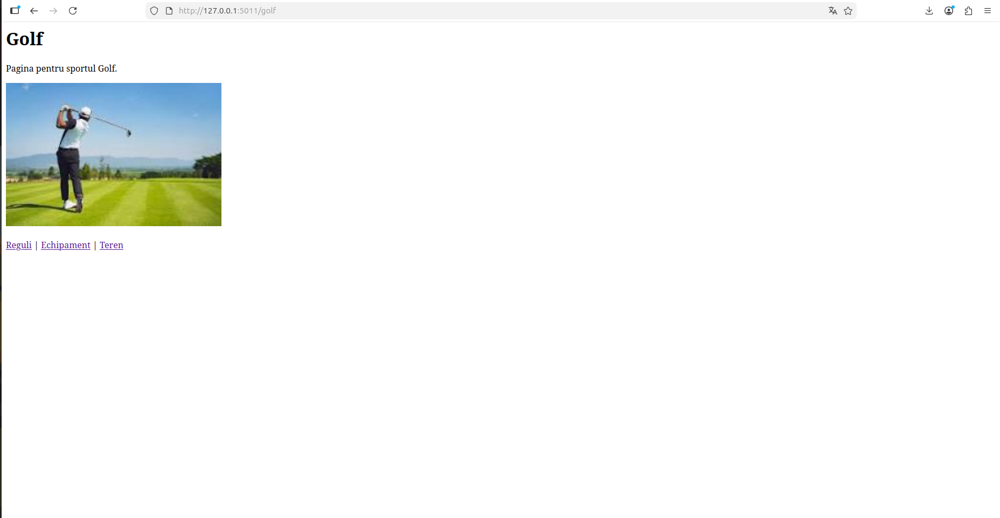

Pagina cu regulile jocului de golf:

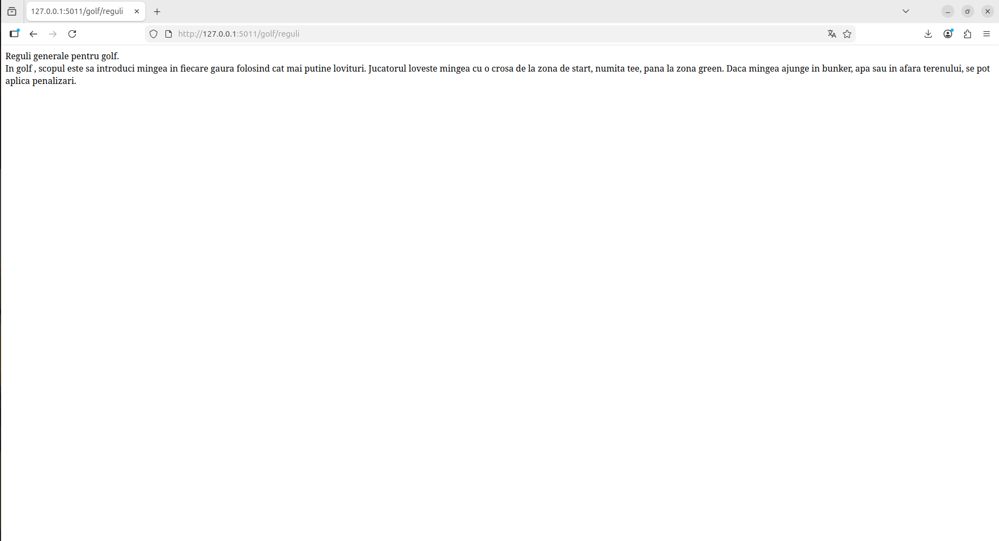

Pagina cu echipamentul utilizat in golf:

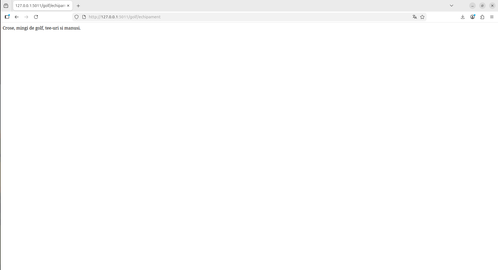

Pagina cu informatii despre terenul de golf:

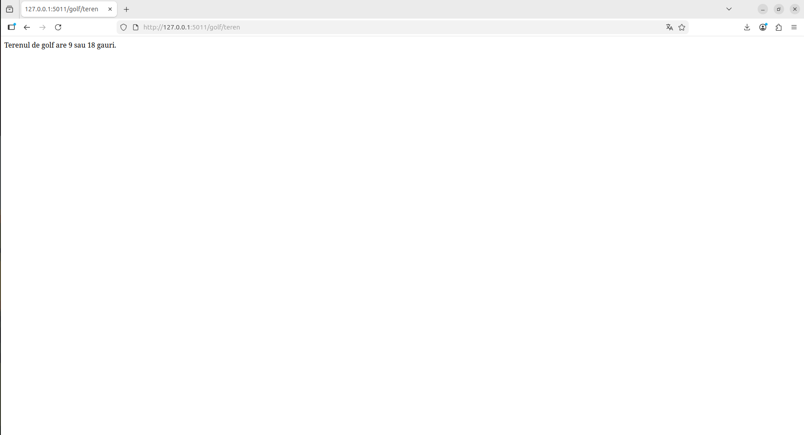

---

## Testare automata cu pytest

Testele au fost scrise in fisierul:

```text
app/test/test_biblioteca_sporturi.py
```

Acestea verifica daca functiile pentru Golf returneaza textele asteptate.

Comanda folosita pentru rularea testelor:

```bash
PYTHONPATH=. pytest app/test/test_biblioteca_sporturi.py -v
```

Rezultatul obtinut:

```text
3 passed
```

Captura de mai jos prezinta rularea testelor automate:

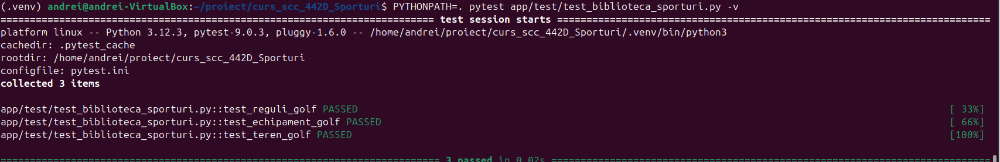

---

## Validare cod cu pylint

Pentru verificarea calitatii codului sursa se utilizeaza pachetul `pylint`. Acesta analizeaza codul Python si semnaleaza eventuale probleme legate de stil, conventii de numire, docstring-uri sau alte aspecte.

In cadrul acestui proiect, problemele raportate de `pylint` sunt doar afisate pentru monitorizare, fara a opri executia pipeline-ului Jenkins.

Comenzi de rulare:

```bash
pylint --exit-zero app/lib/biblioteca_sporturi.py
pylint --exit-zero app/test/test_biblioteca_sporturi.py
pylint --exit-zero sporturi.py
```

Captura cu rezultatul validarii codului:

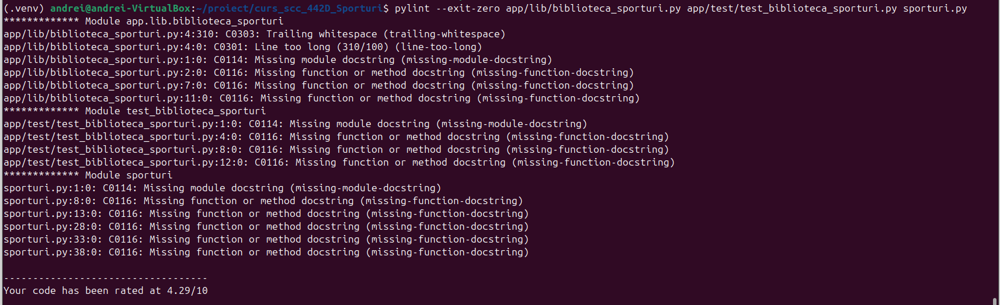

---

## Testare cu Docker

Pentru asigurarea portabilitatii aplicatiei, a fost creat un container Docker pornind de la fisierul `Dockerfile` din radacina proiectului.

### 1. Construirea imaginii Docker

Comanda folosita pentru construirea imaginii:

```bash
docker build -t sporturi-golf:v01 .
```

Imaginea creata poate fi vizualizata cu:

```bash
docker images | grep sporturi-golf
```

Captura cu imaginea Docker creata:


### 2. Rularea containerului Docker

Comanda folosita pentru rularea containerului:

```bash
docker run --name sporturi-golf1 -p 8021:5011 sporturi-golf:v01
```

La pornirea containerului, in consola sunt afisate mesajele de configurare si pornire a serverului Flask:

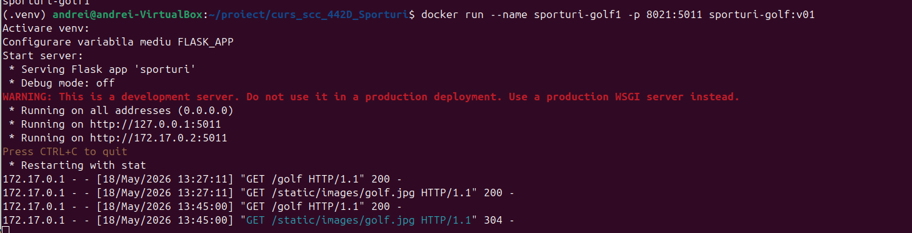

Containerul activ se poate verifica folosind comanda:

```bash
docker ps
```

Captura cu lista containerelor active:


### 3. Accesarea aplicatiei in browser din container

Aplicatia rulata in container poate fi accesata la adresa:

```text
http://127.0.0.1:8021/golf
```

Capturile de mai jos prezinta rutele aplicatiei accesate din browser, in timp ce aplicatia ruleaza in containerul Docker.

Pagina Golf accesata din container:

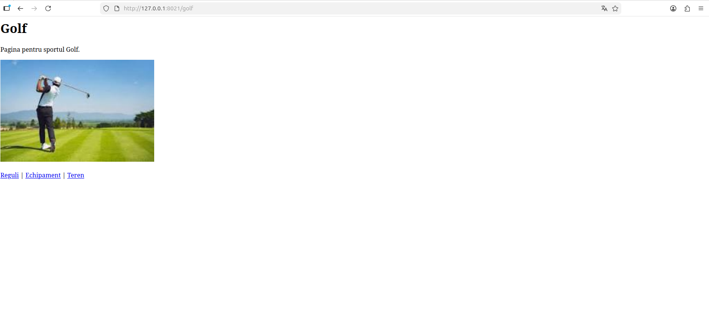

Pagina Reguli Golf accesata din container:

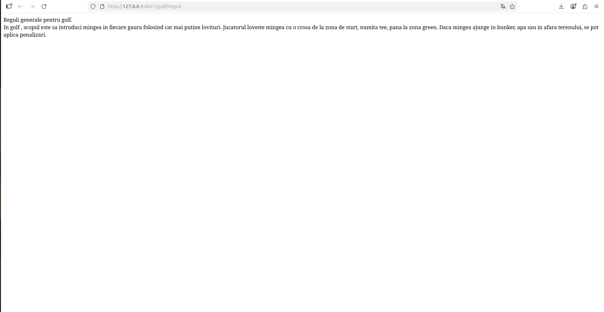

Pagina Echipament Golf accesata din container:

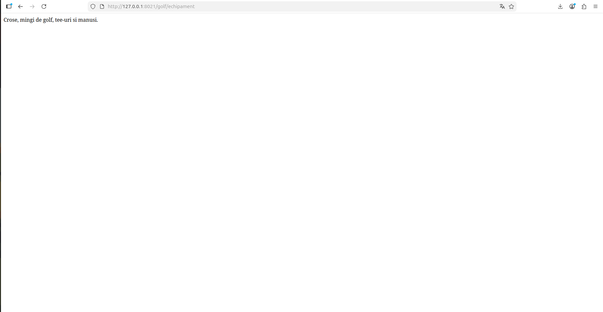

Pagina Teren Golf accesata din container:

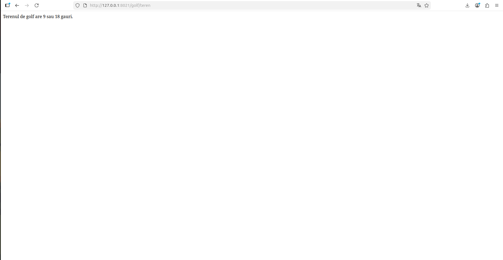

Dupa testare, containerul poate fi oprit si sters folosind comenzile:

```bash
docker stop sporturi-golf1
docker rm sporturi-golf1
```

---

## DevOps CI

- **CI** = Continuous Integration
- **CD** = Continuous Delivery / Continuous Deployment

Proiectul utilizeaza un flux de automatizare definit in fisierul `Jenkinsfile`. Acesta permite validarea automata a codului si pregatirea aplicatiei pentru rulare in container.

Pipeline-ul Jenkins contine urmatoarele etape:

1. **Build** - verificarea continutului proiectului si pregatirea mediului virtual.
2. **Pylint** - analiza statica a codului.
3. **Unit Testing cu pytest** - rularea testelor automate.
4. **Deploy Docker** - construirea imaginii Docker si crearea containerului.

Fisierul `Jenkinsfile` foloseste branch-ul:

```text
dev_selter_andrei
```

Pentru executia corecta a ultimei etape din pipeline, utilizatorul `jenkins` trebuie sa aiba permisiuni de rulare a comenzilor Docker.

Permisiunile au fost configurate cu:

```bash
sudo usermod -aG docker jenkins
sudo systemctl restart jenkins
```

---

### Exemplu executie pipeline Jenkins

Jenkins se acceseaza local in browser la adresa:

```text
http://127.0.0.1:8080
```

Dupa configurarea job-ului/pipeline-ului, se foloseste optiunea **Build Now** pentru pornirea executiei.

Rezultatul executiei pipeline-ului in Jenkins:

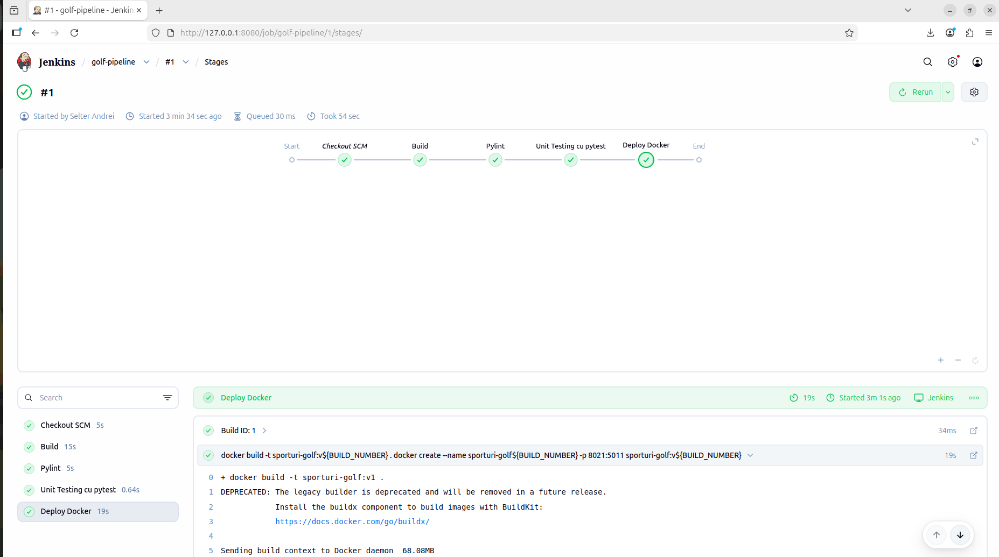

Vizualizarea clasica Jenkins cu detaliile build-ului:

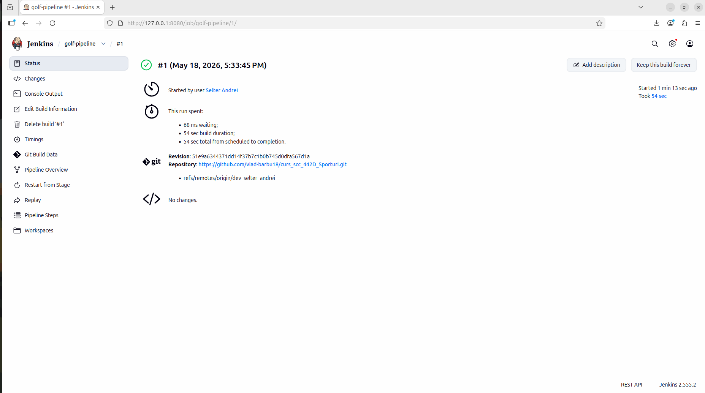

---

## Concluzii

Prin realizarea acestui proiect au fost atinse obiectivele principale legate de dezvoltarea, testarea si containerizarea unei aplicatii web simple.

Aplicatia Flask a fost dezvoltata modular, folosind fisierul principal `sporturi.py` pentru rute si fisierul `app/lib/biblioteca_sporturi.py` pentru logica specifica elementului Golf.

Testarea automata cu `pytest` a confirmat functionarea corecta a functiilor implementate, iar analiza statica prin `pylint` ajuta la imbunatatirea calitatii codului.

Prin Docker, aplicatia poate fi rulata intr-un mediu izolat si portabil, independent de configuratia locala a sistemului. Jenkins permite automatizarea procesului de build, testare si creare a containerului, ceea ce reproduce un flux de lucru apropiat de cel folosit in proiectele software reale.

Proiectul a fost actualizat final pentru etapa de review.

---

## Bibliografie

- https://github.com/crchende/sysinfo.git
- Flask Documentation
- Docker Documentation
- Jenkins Documentation
- GitHub Documentation

