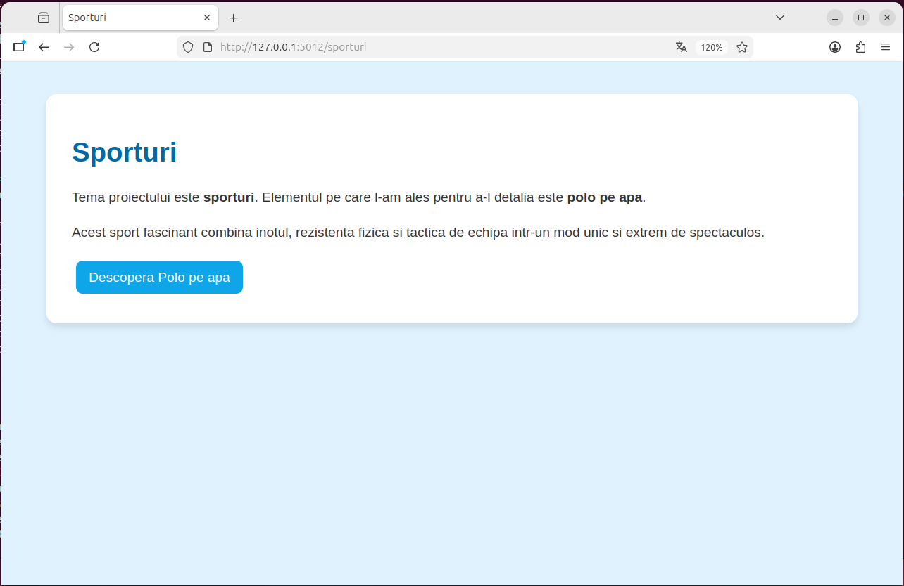
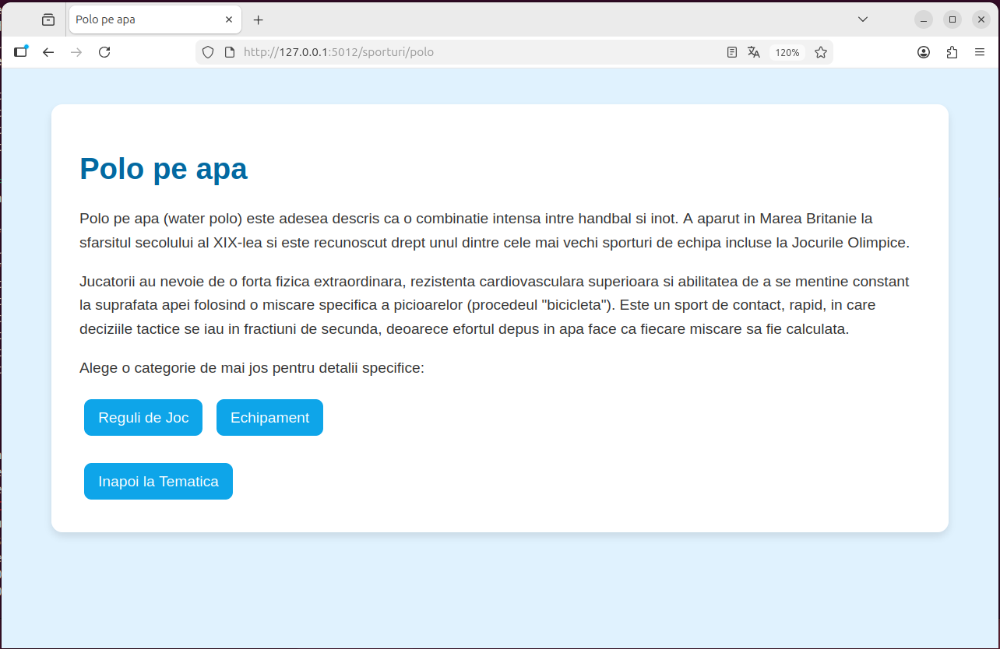
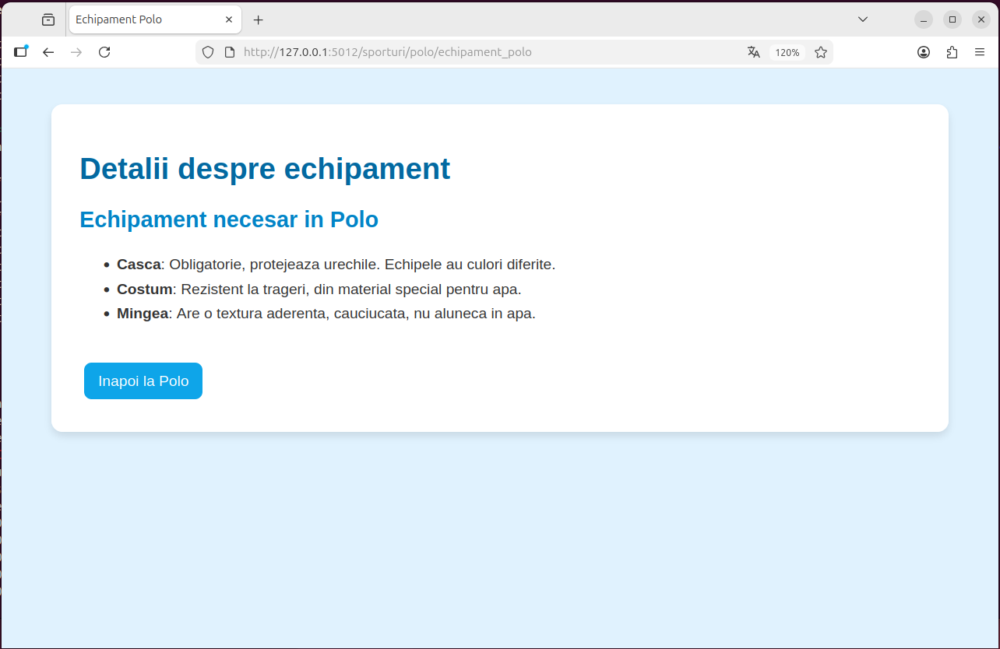
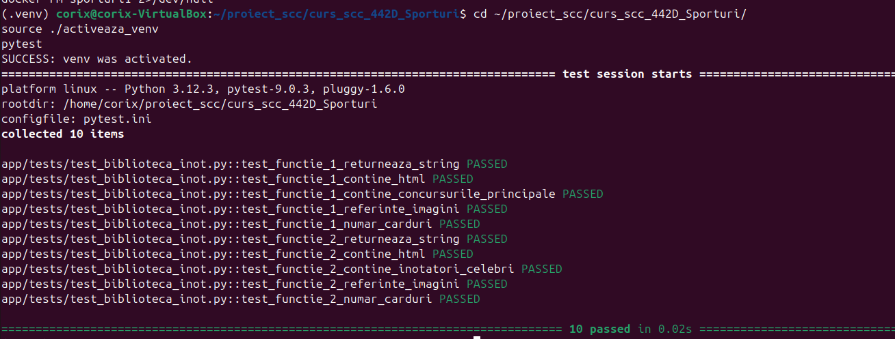
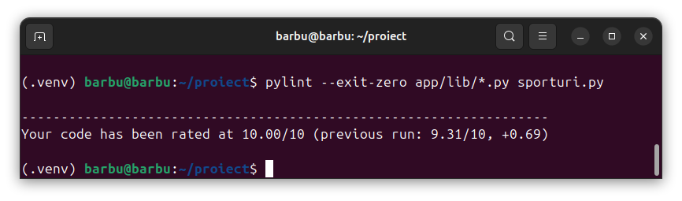
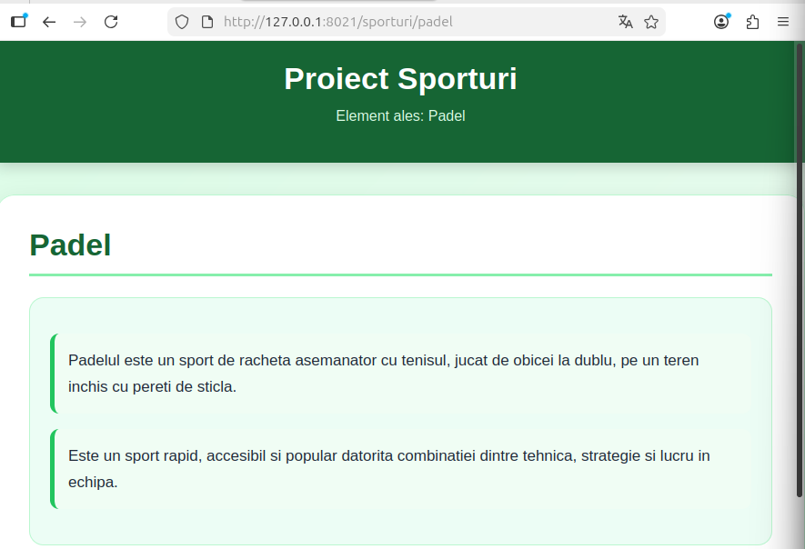
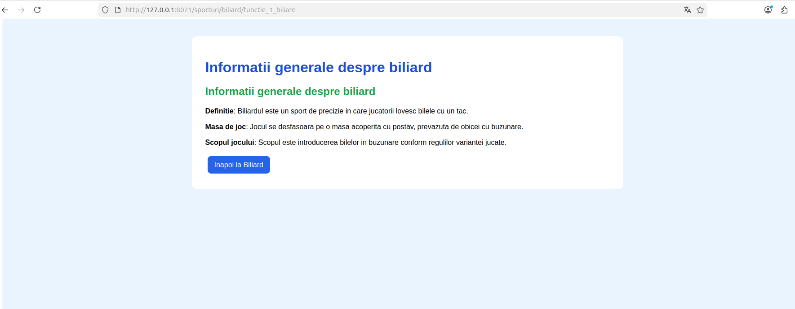
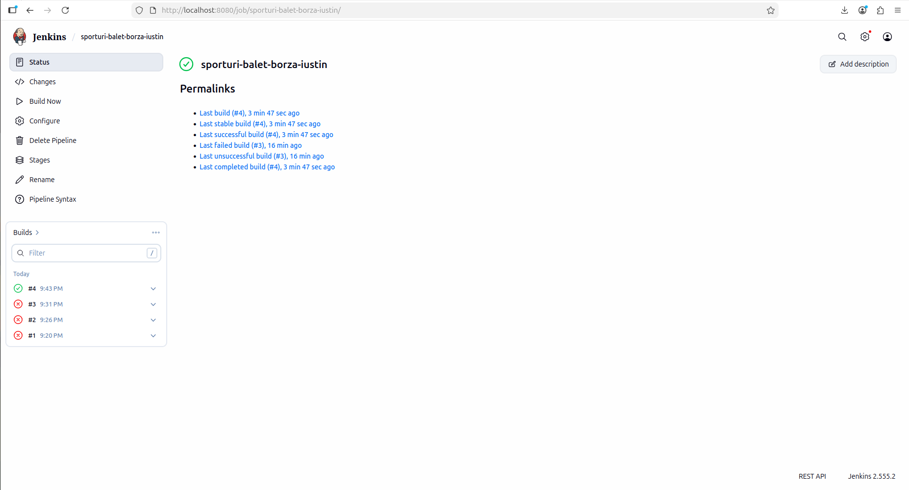
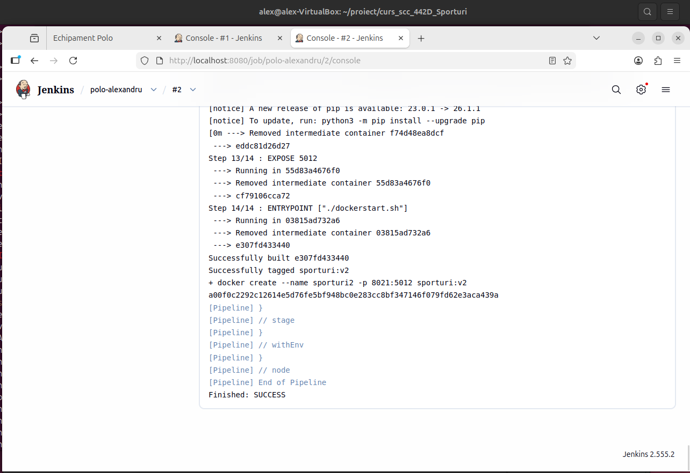

# Proiect SCC - Sporturi

## Student
- **Nume:** Dumitrascu Alexandru
- **Grupa:** 442D
- **Element alocat:** Polo pe apa
- **Branch dezvoltare:** `dev_dumitrascu_alexandru`
- **Branch personal main:** `main_dumitrascu_alexandru`

## Cuprins
- [Descriere generală](#descriere-generală)
- [Funcționalitate implementată](#funcționalitate-implementată)
- [Stadiu dezvoltare](#stadiu-dezvoltare)
- [Structura proiectului](#structura-proiectului)
- [Testare manuală în browser (rulare locală)](#testare-manuală-în-browser-rulare-locală)
- [Testare automată cu pytest](#testare-automată-cu-pytest)
- [Validare cod cu pylint](#validare-cod-cu-pylint)
- [Testare cu Docker](#testare-cu-docker)
- [DevOps CI](#devops-ci)
- [Concluzii](#concluzii)
- [Bibliografie](#bibliografie)

## Descriere generală

Obiectivul acestui proiect este dezvoltarea unei aplicații web utilizând limbajul Python și framework-ul Flask, având ca temă principală sporturile și ca subtemă polo pe apă. Aplicația are rolul de a prezenta informații generale despre acest sport de echipă intens, regulamentul de joc și echipamentul necesar.

Proiectul urmărește implementarea unor concepte de bază din dezvoltarea aplicațiilor web și din zona DevOps, precum organizarea codului pe module, testarea automată cu pytest, validarea calității codului cu pylint, containerizarea aplicației folosind Docker și automatizarea procesului de build și testare prin Jenkins Pipeline.

## Funcționalitate implementată

În acest branch am adăugat și personalizat aplicația pentru tema „Sporturi”, având ca subtemă polo pe apa.

- Fișierul `app/lib/biblioteca_sporturi.py` contine cele două funcții principale cerute:
  - `reguli_polo()` – returnează informații generale despre regulamentul jocului de polo.
  - `echipament_polo()` –  returnează informații despre echipamentul utilizat de jucători.

- Fișierul principal `sporturi.py` implementeaza cele patru rute conform cerinței:
  - `/sporturi` – pagina principală a temei, cu introducere generală despre sporturi și polo.
  - `/sporturi/polo` – pagina dedicată sportului ales.
  - `/sporturi/polo/reguli_polo` – afișează informațiile despre regulament.
  - `/sporturi/polo/echipament_polo` – afișează informațiile despre echipament.

- Interfața aplicației a fost personalizată folosind HTML și CSS, având o structură simplă și ușor de navigat.

- Fișierul `app/tests/test_biblioteca_sporturi.py` conține testele automate realizate cu pytest pentru verificarea funcțiilor implementate.

- Pentru partea DevOps au fost adăugate:
  - `Dockerfile` pentru containerizarea aplicației,
  - `dockerstart.sh` pentru pornirea automată a aplicației în container,
  - `Jenkinsfile` pentru automatizarea etapelor de build, testare și deploy.

## Stadiu dezvoltare


Funcționalitatea aplicației a fost implementată complet.
- Codul sursă a fost dezvoltat și organizat în branch-ul `dev_dumitrascu_alexandru`.
- Rutele Flask și funcțiile bibliotecii Python sunt funcționale și testate.
- Testarea automată cu pytest a fost realizată cu succes.
- Validarea codului folosind pylint a fost integrată în pipeline-ul Jenkins.
- Aplicația a fost containerizată utilizând Docker.
- Pipeline-ul Jenkins pentru build, testare și deploy funcționează corect.
- Capturile de ecran și documentația README au fost adăugate în proiect.
- Testarea locală, automată și containerizată a fost realizată cu succes.

## Structura proiectului 

Structura principală a codului dezvoltat este următoarea:

```text
curs_scc_442D_Sporturi/
│
├── app/
│   ├── __init__.py
│   ├── lib/
│   │   ├── __init__.py
│   │   └── biblioteca_sporturi.py
│   └── tests/
│       ├── __init__.py
│       └── test_biblioteca_sporturi.py
├── doc/
│   ├── dockerconsola.png
│   ├── dockerimages.png
│   ├── dockerps.png
│   ├── jenkinsBlueOcean.png
│   ├── jenkinsConsoleOutput.png
│   ├── jenkinsSimplu.png
│   ├── paginaEchipamentPoloLocal.png
│   ├── paginaElementContainer.png
│   ├── paginaFunctie1Container.png
│   ├── paginaFunctie2Container.png
│   ├── paginaPoloLocal.png
│   ├── paginaReguliPoloLocal.png
│   ├── paginaSporturiLocal.png
│   ├── paginaTemaContainer.png
│   ├── pylint.png
│   ├── pytest.png
├── activeaza_venv
├── activeaza_venv_jenkins
├── dockerstart.sh
├── Dockerfile
├── Jenkinsfile
├── quickrequirements.txt
├── ruleaza_aplicatia
├── sporturi.py
└── README.md
```
  
## Testare manuală în browser (rulare locală)

```bash
git clone https://github.com/vlad-barbu18/curs_scc_442D_Sporturi.git
cd curs_scc_442D_Sporturi
git checkout dev_dumitrascu_alexandru
. ./activeaza_venv
./ruleaza_aplicatia
```

Aplicația se accesează la: `http://127.0.0.1:5012/sporturi`






## Testare automată cu `pytest`

```bash
pytest
```
Pentru a ne asigura de corectitudinea funcționalităților înainte de integrarea pe server, am dezvoltat teste unitare folosind `pytest`. 
Aceste teste validează automat faptul că funcțiile de backend (`reguli_polo()` și `echipament_polo()`) returnează cod HTML valid, nu sunt goale și conțin markerii textuali specifici acestui sport (elemente cheie din regulament și echipament).



## Validare cod cu `pylint`

```bash
pylint --exit-zero app/lib/biblioteca_sporturi.py
pylint --exit-zero app/tests/test_biblioteca_sporturi.py
pylint --exit-zero sporturi.py
```
Analiza statică a codului a fost realizată cu `pylint` pentru a menține un standard ridicat de programare în Python, verificând formatarea, importurile neutilizate și existența docstring-urilor. 



## Testare cu Docker

```bash
docker build -t sporturi:v01 .
docker run --name sporturi1 -p 8021:5012 sporturi:v01
```
Pentru a garanta portabilitatea aplicației pe orice sistem de operare, fără a fi necesară instalarea manuală a dependențelor locale din `quickrequirements.txt`, am containerizat aplicația folosind Docker, asigurând un mediu complet izolat.

- Construirea imaginii: s-a făcut folosind comanda `docker build -t sporturi:v01 .`, creând pachetul de bază al aplicației.
- Rularea containerului: s-a realizat cu `docker run --name sporturi1 -p 8021:5012 sporturi:v01`. Prin această comandă, portul intern `5012` expus de serverul Flask în container a fost mapat pe portul `8021` al mașinii gazdă.
- Managementul containerelor: Pentru un mediu de dezvoltare curat și pentru a evita eroarea `Port already in use` la testări succesive, am utilizat comenzile de curățare `docker stop sporturi1` și `docker rm sporturi1`.


Aplicația din container, accesată la `http://localhost:8021/sporturi`:






# DevOps CI
Pentru a asigura o integrare și livrare continuă, procesul a fost automatizat complet printr-un pipeline declarativ definit în fișierul `Jenkinsfile`, structurat în 4 etape fundamentale:

* **1. Etapa de Build (Construire mediu):** Jenkins preia codul sursă, instanțiază mediul virtual Python izolat și instalează toate dependențele necesare din fișierul `quickrequirements.txt`.
* **2. Etapa de Analiză a calității (Pylint):** Se rulează linter-ul static pe fișierele sursă pentru a asigura respectarea standardelor de programare. Comenzile utilizează flag-ul `--exit-zero` pentru a afișa avertismentele de stil în consolă, fără a întrerupe prematur execuția pipeline-ului.
* **3. Etapa de Testare Automată (Unit Testing):** Se execută suita de teste folosind framework-ul `pytest` pentru a valida automat corectitudinea funcțiilor dedicate sportului polo pe apă.
* **4. Etapa de Deploy (Lansare):** În faza finală, Jenkins construiește noua imagine Docker și creează instantaneu containerul asociat noului build, pregătind aplicația pentru rulare.
 
## Pipeline Jenkins clasic


## Pipeline Console Output


## Pipeline Blue Ocean


## Concluzii

Proiectul realizat demonstrează dezvoltarea cu succes a unei aplicații web folosind framework-ul Flask împreună cu tehnologii moderne utilizate în zona DevOps.

Principalele rezultate obținute sunt:
- **Proiectare web și modularitate:** Dezvoltarea rutelor Flask și a interfeței aplicației a fost realizată cu o separare clară între logica de rutare și datele specifice (regulamentul și echipamentul de polo), stocate într-o bibliotecă Python independentă (`biblioteca_sporturi.py`).
- **Filtre de calitate și testare:** Pentru asigurarea robusteții funcțiilor, codul a fost supus unor verificări stricte. Validarea automată a rezultatelor HTML s-a realizat prin intermediul `pytest`, iar pentru menținerea unui standard curat de programare a fost integrat utilitarul `pylint`.
* **Încapsulare și portabilitate:** Dependențele mediului local au fost izolate prin construirea unei imagini Docker, garantând astfel o rulare consistentă și independentă a aplicației în propriul container.
- **Orchestrarea proceselor (CI/CD):** Instrumentele menționate anterior au fost integrate și automatizate cu succes prin intermediul Jenkins. Definirea unui pipeline declarativ a demonstrat capacitatea de a executa complet autonom procesele de preluare a codului, testare și lansare în execuție (Deploy).
- **Depanare și infrastructură:** Pe parcursul integrării tehnologiilor au fost identificate și soluționate erori reale de sistem, incluzând conflicte de porturi pe rețea, alocarea permisiunilor de execuție în Docker și remedieri de formatare în mediul Linux.

În urma implementării, aplicația a funcționat corect atât local, cât și în containerul Docker, iar pipeline-ul Jenkins a executat cu succes toate etapele configurate.

## Bibliografie

https://github.com/crchende/sysinfo.git
