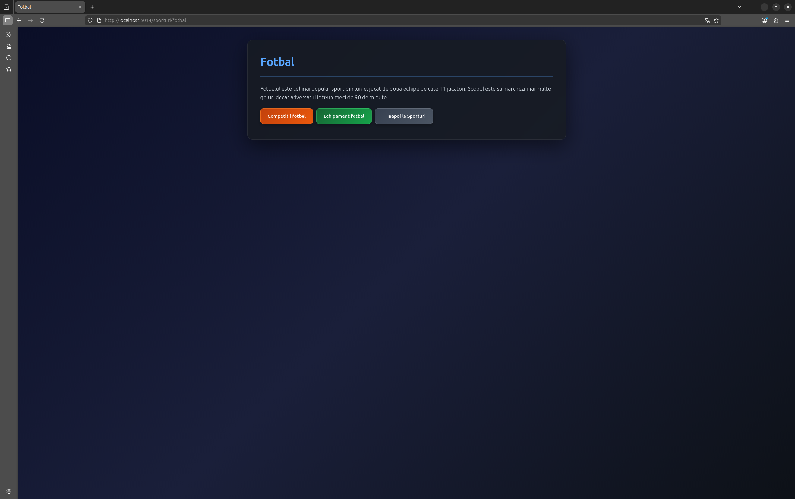
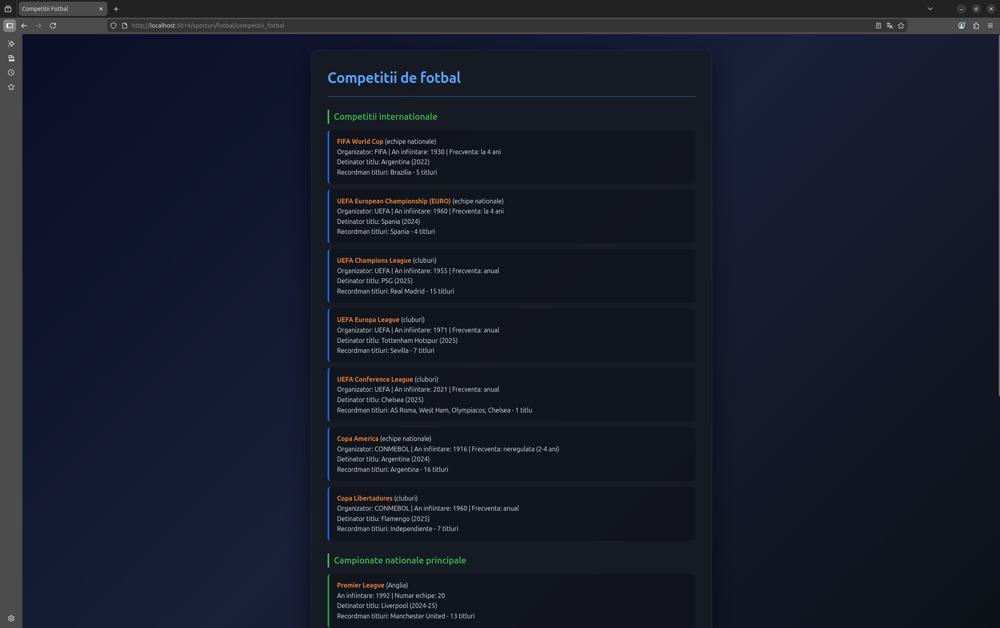
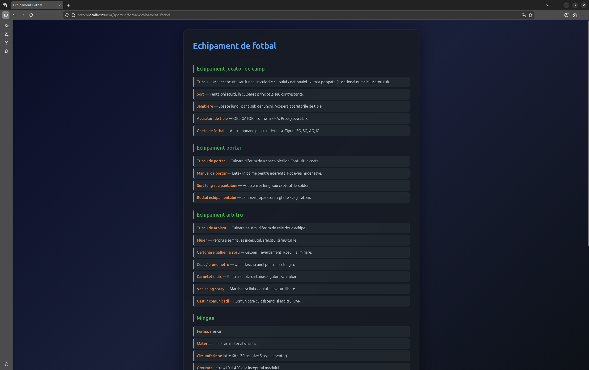

# Proiect SCC - Sporturi

## Dezvoltator
- **Nume:** Barbu Vlad-Cătălin
- **Grupa:** 442D
- **Element alocat:** Fotbal

## Cuprins
- [Descriere generală](#descriere-generală)
- [Funcționalitate implementată](#funcționalitate-implementată)
- [Stadiu dezvoltare](#stadiu-dezvoltare)
- [Testare manuală în browser (rulare locală)](#testare-manuală-în-browser-rulare-locală)
- [Testare automată cu pytest](#testare-automată-cu-pytest)
- [Validare cod cu pylint](#validare-cod-cu-pylint)
- [Testare cu Docker](#testare-cu-docker)
- [DevOps CI](#devops-ci)
  - [Exemplu execuție pipeline Jenkins](#exemplu-execuție-pipeline-jenkins)
- [Concluzii](#concluzii)
- [Bibliografie](#bibliografie)

## Descriere generală

Obiectivul proiectului a fost realizarea unei aplicatii web folosind framework-ul Flask, parcurgerea unui proces complet de dezvoltare software in care folosim Jenkins, Docker, Python, GitHub pentru versionare, containerizare, programare si automatizare.

## Funcționalitate implementată

În acest branch am adăugat și personalizat:

- Fișierul `app/lib/biblioteca_sporturi.py` cu cele două funcții cerute:
  - `competitii_fotbal()` – returnează codul HTML cu informațiile despre competițiile internaționale (World Cup, EURO, Champions League, Europa League, Conference League, Copa America, Copa Libertadores) și campionatele naționale (Premier League, La Liga, Serie A, Bundesliga, Ligue 1, SuperLiga României).
  - `echipament_fotbal()` – returnează codul HTML cu informațiile despre echipamentul folosit de jucător, portar, arbitru, precum și caracteristicile mingii și ale terenului de joc.

- Fișierul principal `sporturi.py` care are cele patru rute conform cerinței:
  - `/sporturi` – pagina principală a temei.
  - `/sporturi/fotbal` – pagina principală a elementului.
  - `/sporturi/fotbal/competitii_fotbal` – informații despre competițiile de fotbal.
  - `/sporturi/fotbal/echipament_fotbal` – informații despre echipamentul de fotbal.

- Fișierul `app/test/test_biblioteca_sporturi.py` care conține testele automate pentru cele două funcții definite, validând prezența în HTML-ul generat a unor markeri specifici (FIFA World Cup, Champions League, Premier League, SuperLiga România, mănușile de portar, dimensiunile reglementare ale porții 7.32 × 2.44 m etc.).

## Stadiu dezvoltare

- Funcționalitate complet implementată.
- Cod adăugat în branch-ul de lucru `dev_barbu_vlad`.
- Dockerfile și Jenkinsfile sunt funcționale, urmând pipeline-ul de CI/CD.
- Testare locală, automată și containerizată realizată cu succes.

## Testare manuală în browser (rulare locală)

Clonarea repository-ului și selectarea ramurii de dezvoltare:

```bash
mkdir scc
cd scc
git clone https://github.com/vlad-barbu18/curs_scc_442D_Sporturi.git
cd curs_scc_442D_Sporturi
git checkout dev_barbu_vlad
```

Se activează mediul virtual și se pornește aplicația cu scripturile bash existente (din rădăcina proiectului):

```bash
. ./activeaza_venv
./ruleaza_aplicatia
```

Dacă apar erori de permisiuni se introduce comanda:

```bash
sudo chmod 764 ./activeaza_venv ./ruleaza_aplicatia
```

Aplicația poate fi accesată în browser la adresa:

```
http://127.0.0.1:5014/sporturi
```

Capturile de mai jos prezintă cele patru rute ale aplicației, accesate din browser în timp ce serverul Flask rulează local.

Pagina principală a temei (`/sporturi`):


Pagina elementului ales, fotbalul (`/sporturi/fotbal`):



Pagina cu competițiile de fotbal (`/sporturi/fotbal/competitii_fotbal`):



Pagina cu echipamentele de fotbal (`/sporturi/fotbal/echipament_fotbal`):


## Testare automată cu `pytest`

Testele au fost scrise în fișierul `app/test/test_biblioteca_sporturi.py`. Cu mediul virtual activ, rularea testelor se face astfel:

```bash
pytest app/test/test_biblioteca_sporturi.py -v
```

Toate cele 8 teste au fost executate cu succes, validând corectitudinea celor două funcții definite.


## Validare cod cu `pylint`

Pentru verificarea calității codului sursă se utilizează pachetul **pylint**. Acesta analizează conformitatea codului cu standardele Python (verifică spații, convenții de numire a variabilelor, variabile neutilizate, prezența docstring-urilor etc.).

În cadrul acestui proiect, problemele raportate de **pylint** sunt doar afișate pentru monitorizare, nu sunt considerate erori (se utilizează flag-ul `--exit-zero`).

```bash
pylint --exit-zero app/lib/biblioteca_sporturi.py
pylint --exit-zero app/tests/test_biblioteca_sporturi.py
pylint --exit-zero sporturi.py
```


## Testare cu Docker

Pentru asigurarea portabilității aplicației, am creat un container Docker pornind de la `Dockerfile`-ul din rădăcina proiectului. Pașii efectuați au fost:

1. Construirea imaginii Docker:

```bash
docker build -t sporturi:v01 .
```

Imaginea creată poate fi vizualizată în lista locală de imagini Docker (alături de imaginea de bază `python:3.10-alpine` care a fost descărcată automat):


2. Rularea containerului din imaginea creată:

```bash
docker run --name sporturi1 -p 8014:5014 sporturi:v01
```

La pornirea containerului, în consolă sunt afișate mesajele de activare a mediului virtual și de pornire a serverului Flask:


Containerul activ se poate vizualiza cu comanda `docker ps`:


3. Accesarea aplicației în browser, de această dată servită din interiorul containerului Docker:

```
http://localhost:8014/sporturi
```

Capturile de mai jos prezintă cele patru rute ale aplicației, accesate din browser în timp ce aplicația rulează în containerul Docker. Comportamentul este identic cu cel din rulare locală, însă aplicația este complet izolată în container, ceea ce confirmă reușita procesului de containerizare.

Pagina principală a temei accesată din container:


Pagina elementului ales accesată din container:


Pagina cu competițiile de fotbal accesată din container:


Pagina cu echipamentele de fotbal accesată din container:



# DevOps CI

- **CI** = Continuous Integration (Integrare Continuă)

Proiectul utilizează un flux de automatizare definit în `Jenkinsfile`, care asigură validarea codului și livrarea aplicației.

## Exemplu execuție pipeline Jenkins

Pentru a se putea executa cu succes ultimul pas din pipeline-ul de Jenkins (crearea și lansarea containerului Docker), este necesar ca utilizatorul `jenkins` să aibă permisiuni de rulare a comenzilor Docker fără `sudo`.

Puteți găsi pașii de configurare pe [docs.docker.com - linux-postinstall](https://docs.docker.com/engine/install/linux-postinstall/).
Dacă folosiți mașină virtuală Linux, restartați mașina după ce faceți configurația.

**Etapele Pipeline-ului:**
1. **Build**: Crearea mediului virtual și instalarea dependințelor.
2. **Linter**: Verificarea stilului codului cu `pylint`.
3. **Unit Tests**: Rularea testelor cu `pytest`.
4. **Deploy**: Construirea imaginii Docker și pornirea containerului pe portul **8014**.

Pentru a porni serviciul, se rulează în terminal comanda:

```bash
jenkins
```
Se creează pipeline-ul în Jenkins, care este accesat local pe portul 8080 și se conectează cu repository-ul. Odată creat, se verifică funcționalitatea cu **Build Now**, urmat de confirmarea execuției cu succes în Console Output (log-uri).

Vizualizarea modernă a pipeline-ului din **Blue Ocean** arată toate cele 4 stages cu execuție reușită:


Detaliile build-ului în interfața clasică Jenkins, cu link către commit-ul de pe GitHub și informații despre durata fiecărui pas:


## Concluzii
Acest proiect atinge cu succes atât obiectivele funcționale, cât și pe cele tehnice, evidențiind următoarele aspecte:

- **Dezvoltare modulară:** Implementarea unei aplicații web folosind framework-ul Flask, integrând bune practici de inginerie software prin separarea datelor și a logicii în module distincte (`app/lib/biblioteca_sporturi.py`).
- **Arhitectură extensibilă:** Structura proiectului permite adăugarea facilă de noi elemente sportive sau noi categorii de informații, fără modificarea fișierului principal de rutare.
- **Portabilitate:** Containerizarea prin Docker a asigurat un mediu de rulare izolat, rapid și consistent pe diverse platforme, indiferent de versiunea de Python instalată pe sistemul gazdă. Capturile de ecran demonstrează că aplicația rulează identic atât local cât și în container.
- **Automatizare (CI/CD):** Pipeline-ul configurat în Jenkins a optimizat procesul de dezvoltare prin integrare și livrare continuă, automatizând complet ciclul de testare și deploy.
- **Asigurarea calității:** Testarea automată cu `pytest` și analiza statică a codului cu `pylint` au garantat stabilitatea aplicației la fiecare modificare a codului sursă.

## Bibliografie

https://github.com/crchende/sysinfo.git
