# Proiect SCC - Sporturi

Aplicația **Sporturi** gestionează și afișează informații detaliate despre principalele sporturi practicate la nivel mondial, prezentând competițiile, echipamentele și regulile specifice fiecărui sport într-o interfață web intuitivă.
Sistemul de operare țintă este Linux, aplicația fiind dezvoltată și testată pe distribuția `Ubuntu 24.04`.
Componenta WEB a proiectului utilizează framework-ul `Flask`.

Arhitectura este una modulară: datele sunt procesate și extrase prin funcții dedicate localizate în pachetul `app/lib/`, fiind ulterior preluate și returnate cu ajutorul funcțiilor view (localizate în `sporturi.py`) către client sub formă de pagini HTML.

Pentru o experiență de utilizare facilă, interfața include un sistem de navigare între pagini:

* **Pagina principală:** Conține link-uri/butoane către sporturile alocate fiecărui student.
* **Pagina specifică sportului:** Odată selectat sportul, se afișează o descriere scurtă a acestuia și un meniu cu butoane suplimentare.
* **Sistemul de retur:** Fiecare pagină conține link-uri de navigare înapoi pentru a asigura fluiditatea navigării.

Aplicația include suport pentru containerizare în fișierul `Dockerfile` din directorul principal al aplicației.

Din punct de vedere al verificării calității, aplicația include:

*    Unit testing: Realizat cu `pytest` pentru funcțiile din `app/lib/`, testele fiind organizate în directorul `app/tests/`.

*    Analiză statică: Verificarea conformității codului utilizând `pylint`.

`DevOps CI`.
Pipeline-ul pentru Jenkins este definit în fișierul `Jenkinsfile`.
Acesta asigură parcurgerea automată a etapelor de Build (creare venv), Linter (verificare calitate), Testare (pytest) și Deploy (lansarea containerului Docker).

---

## Sporturi integrate în README.md

1. [Biliard — Andriu Cosmin](#biliard-andriu-cosmin)
2. [Fotbal — Barbu Vlad-Cătălin](#fotbal-barbu-vlad-catalin)
3. [Tir cu arcul — Bădițeanu Mădălina](#tir-cu-arcul-baditeanu-madalina)
4. [Rugby — Blîndu Andrei](#rugby-blindu-andrei)
5. [Volei — Bocai Alexandra](#volei-bocai-alexandra)
6. [Balet — Borza Iustin](#balet-borza-iustin)
7. [Box — Boțoc David Ștefan](#box-botoc-david-stefan)
8. [Șah — Bulău Andrei Cristian](#sah-bulau-andrei-cristian)
9. [Baschet — Dima Tiberiu](#baschet-dima-tiberiu)
10. [Tenis de masă — Dinu Christian](#tenis-de-masa-dinu-christian)
11. [Polo pe apă — Dumitrașcu Alexandru](#polo-pe-apa-dumitrascu-alexandru)
12. [Echitație — Gulap Andra](#echitatie-gulap-andra)
13. [Padel — Iordănescu Răzvan](#padel-iordanescu-razvan)
14. [Minifotbal — Lazăr Iulian](#minifotbal-lazar-iulian)
15. [Biatlon — Manea Teodora](#biatlon-manea-teodora)
16. [MMA — Mitu Marian](#mma-mitu-marian)
17. [Ski — Nedelcu Alexandru](#ski-nedelcu-alexandru)
18. [Patinaj artistic — Oprea Andreea](#patinaj-artistic-oprea-andreea)
19. [Înot — Ovezea Corina](#inot-ovezea-corina)
20. [Tenis de câmp — Petre Ana Maria](#tenis-de-camp-petre-ana-maria)
21. [Badminton — Preda Gabriela-Fabiana](#badminton-preda-gabriela-fabiana)
22. [Formula 1 — Stancu Andreea](#formula-1-stancu-andreea)
23. [Golf — Șelțer Andrei](#golf-selter-andrei)
24. [Ciclism — Țaga Andrei](#ciclism-taga-andrei)
25. [Sailing — Verde Mihai Gabriel](#sailing-verde-mihai-gabriel)
26. [Scrimă — Voica Alina-Maria](#scrima-voica-alina-maria)

---

# Biliard — Andriu Cosmin
[↑ Cuprins](#sporturi-integrate-în-readmemd)

# Proiect SCC - Sporturi

## Dezvoltator

- **Nume:** Andriu Cosmin
- **Grupa:** 442D
- **Element alocat:** Biliard
- **Branch de dezvoltare:** `dev_andriu_cosmin`
- **Branch personal main:** `main_andriu_cosmin`

---

## Cuprins

- [Descriere generală](#descriere-generală)
- [Obiectivul proiectului](#obiectivul-proiectului)
- [Funcționalitate implementată](#funcționalitate-implementată)
- [Structura proiectului](#structura-proiectului)
- [Rute implementate](#rute-implementate)
- [Biblioteca implementată](#biblioteca-implementată)
- [Rulare locală](#rulare-locală)
- [Testare manuală în browser](#testare-manuală-în-browser)
- [Testare automată cu pytest](#testare-automată-cu-pytest)
- [Validare cod cu pylint](#validare-cod-cu-pylint)
- [Testare cu Docker](#testare-cu-docker)
- [DevOps CI - Jenkins](#devops-ci---jenkins)
- [Flux Git și Pull Request](#flux-git-și-pull-request)
- [Stadiu dezvoltare](#stadiu-dezvoltare)
- [Concluzii](#concluzii)
- [Bibliografie](#bibliografie)

---

## Descriere generală

Acest proiect a fost realizat în cadrul disciplinei SCC și are ca scop dezvoltarea unei aplicații web simple folosind framework-ul Flask. Proiectul urmărește parcurgerea unui flux complet de dezvoltare software, pornind de la implementarea codului sursă, organizarea funcționalităților în fișiere separate, testarea automată, analiza statică a codului, containerizarea aplicației și automatizarea procesului de build și testare cu Jenkins.

Tema generală a proiectului este **Sporturi**, iar elementul implementat individual este **Biliard**. Aplicația prezintă informații despre biliard printr-o interfață web simplă, accesibilă din browser. Pentru o organizare mai bună, informațiile afișate sunt generate prin funcții definite într-o bibliotecă Python separată.

Proiectul utilizează următoarele tehnologii:

- **Python** pentru implementarea aplicației;
- **Flask** pentru dezvoltarea aplicației web;
- **Git și GitHub** pentru versionare;
- **pytest** pentru testare automată;
- **pylint** pentru analiza calității codului;
- **Docker** pentru containerizarea aplicației;
- **Jenkins** pentru automatizarea pașilor de build, testare și deploy.

---

## Obiectivul proiectului

Obiectivul principal al proiectului este realizarea unei aplicații web funcționale, organizate modular, care să poată fi rulată local, testată automat, verificată din punct de vedere al calității codului și executată într-un container Docker.

În plus, proiectul urmărește integrarea unui flux DevOps simplu prin utilizarea Jenkins. Prin intermediul pipeline-ului Jenkins, procesul de build, rularea testelor și etapa de deploy sunt automatizate, reducând riscul de erori manuale și oferind o metodă clară de validare a proiectului.

---

## Funcționalitate implementată

În cadrul proiectului au fost implementate următoarele componente:

- aplicație Flask pentru tema **Sporturi**;
- pagină principală pentru tema generală;
- pagină dedicată elementului **Biliard**;
- două funcții publice într-o bibliotecă Python separată;
- două rute suplimentare care folosesc funcțiile din bibliotecă;
- teste automate pentru funcțiile implementate;
- fișier `pytest.ini` pentru configurarea testelor;
- fișier `Dockerfile` pentru construirea imaginii Docker;
- fișier `dockerstart.sh` pentru pornirea aplicației în container;
- fișier `Jenkinsfile` pentru pipeline-ul Jenkins;
- documentație în README cu pașii de rulare și capturile relevante.

---

## Structura proiectului

Structura principală a proiectului este următoarea:

```text
curs_scc_442D_Sporturi/
│
├── app/
│   ├── __init__.py
│   │
│   ├── lib/
│   │   ├── __init__.py
│   │   └── biblioteca_sporturi.py
│   │
│   └── tests/
│       ├── __init__.py
│       └── test_biblioteca_sporturi.py
│
├── doc/
│   ├── doc.jenkinsPipeline.png
│   ├── jenkinsPipeline.png
│   ├── dockerimages.png
│   ├── dockerconsola.png
│   ├── dockerps.png
│   ├── paginaTemaLocal.png
│   ├── paginaElementLocal.png
│   ├── paginaFunctie1Local.png
│   ├── paginaFunctie2Local.png
│   ├── paginaTemaContainer.png
│   ├── paginaElementContainer.png
│   ├── paginaFunctie1Container.png
│   └── paginaFunctie2Container.png
│
├── sporturi.py
├── quickrequirements.txt
├── activeaza_venv
├── activeaza_venv_jenkins
├── ruleaza_aplicatia
├── Dockerfile
├── dockerstart.sh
├── Jenkinsfile
├── pytest.ini
├── .gitignore
└── README.md
```

Folderul `app/lib/` conține biblioteca în care sunt implementate funcțiile cerute. Folderul `app/tests/` conține testele automate, iar folderul `doc/` conține capturile de ecran folosite în README.

---

## Rute implementate

Aplicația Flask are patru rute principale:

| Rută | Descriere |
|---|---|
| `/sporturi` | Pagina principală a temei Sporturi |
| `/sporturi/biliard` | Pagina elementului ales: Biliard |
| `/sporturi/biliard/functie_1_biliard` | Pagina care afișează informațiile returnate de prima funcție |
| `/sporturi/biliard/functie_2_biliard` | Pagina care afișează informațiile returnate de a doua funcție |

Prima rută prezintă tema generală a proiectului, a doua rută prezintă elementul ales, iar ultimele două rute afișează informațiile generate de funcțiile definite în biblioteca proiectului.

---

## Biblioteca implementată

Fișierul bibliotecă este:

```text
app/lib/biblioteca_sporturi.py
```

Acesta conține cele două funcții publice cerute în proiect:

```text
functie_1_biliard()
functie_2_biliard()
```

Funcția `functie_1_biliard()` returnează informații generale despre biliard în format HTML. Funcția `functie_2_biliard()` returnează reguli, caracteristici sau informații importante despre biliard, tot în format HTML.

Separarea acestor funcții într-un fișier dedicat ajută la organizarea codului și permite testarea lor independentă cu `pytest`.

---

## Rulare locală

Pentru rularea locală a aplicației se folosesc următoarele comenzi:

```bash
git clone https://github.com/vlad-barbu18/curs_scc_442D_Sporturi.git
cd curs_scc_442D_Sporturi
git checkout dev_andriu_cosmin
source ./activeaza_venv
source ./ruleaza_aplicatia
```

Aplicația rulează local la adresa:

```text
http://127.0.0.1:5012/sporturi
```

Pentru oprirea aplicației se folosește combinația:

```text
Ctrl + C
```

Scriptul `activeaza_venv` activează mediul virtual Python, iar scriptul `ruleaza_aplicatia` setează aplicația Flask și pornește serverul local pe portul `5012`.

---

## Testare manuală în browser

După pornirea aplicației, au fost testate manual cele patru rute implementate.

Pagina principală a temei:

```text
http://127.0.0.1:5012/sporturi
```

Pagina elementului Biliard:

```text
http://127.0.0.1:5012/sporturi/biliard
```

Pagina pentru prima funcție:

```text
http://127.0.0.1:5012/sporturi/biliard/functie_1_biliard
```

Pagina pentru a doua funcție:

```text
http://127.0.0.1:5012/sporturi/biliard/functie_2_biliard
```

Capturi de ecran pentru rularea locală:


---

## Testare automată cu pytest

Pentru verificarea automată a funcțiilor implementate în bibliotecă a fost folosit framework-ul `pytest`.

Fișierul de teste este:

```text
app/tests/test_biblioteca_sporturi.py
```

Testele verifică dacă funcțiile returnează conținut HTML, dacă rezultatul nu este gol și dacă în răspuns apar elemente specifice implementării.

Comanda de rulare a testelor este:

```bash
source ./activeaza_venv
pytest
```

Rezultatul așteptat este ca toate testele să treacă, de forma:

```text
N passed
```

Captură de ecran cu rezultatul testelor:


---

## Validare cod cu pylint

Pentru analiza statică a codului a fost folosit `pylint`. Acesta verifică stilul codului, posibile probleme de scriere și respectarea unor convenții de programare.

Comenzile folosite pentru validare sunt:

```bash
pylint --exit-zero app/lib/*.py
pylint --exit-zero app/tests/*.py
pylint --exit-zero sporturi.py
```

Opțiunea `--exit-zero` permite afișarea avertismentelor fără oprirea pipeline-ului Jenkins. Astfel, rezultatele `pylint` pot fi analizate fără ca execuția automată să fie întreruptă din cauza unor warning-uri minore.

Captură de ecran cu rezultatul `pylint`:


---

## Testare cu Docker

Pentru containerizarea aplicației a fost creat fișierul:

```text
Dockerfile
```

Acesta definește imaginea Docker a aplicației, copiază fișierele necesare în container, creează mediul virtual și instalează dependențele din `quickrequirements.txt`.

Pornirea aplicației în container se face prin scriptul:

```text
dockerstart.sh
```

Comenzile folosite pentru construirea și rularea containerului sunt:

```bash
docker build -t sporturi:v01 .
docker run --name sporturi1 -p 8021:5012 sporturi:v01
```

Aplicația din container este accesibilă la adresa:

```text
http://127.0.0.1:8021/sporturi
```

Pentru verificarea imaginilor Docker:

```bash
docker images | grep sporturi
```

Pentru verificarea containerelor active:

```bash
docker ps
```

Capturi de ecran pentru Docker:

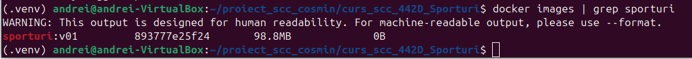

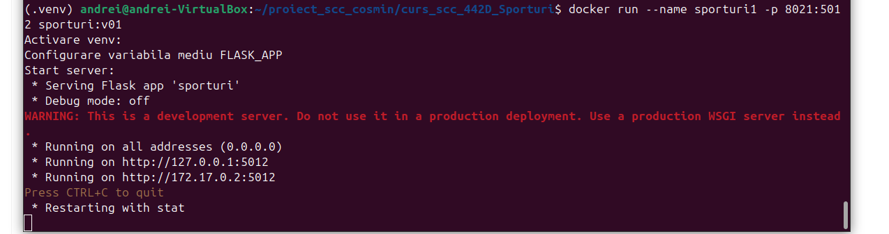

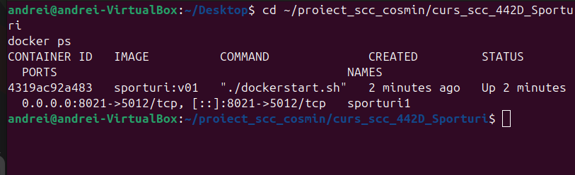

Capturi de ecran cu aplicația rulată în container:

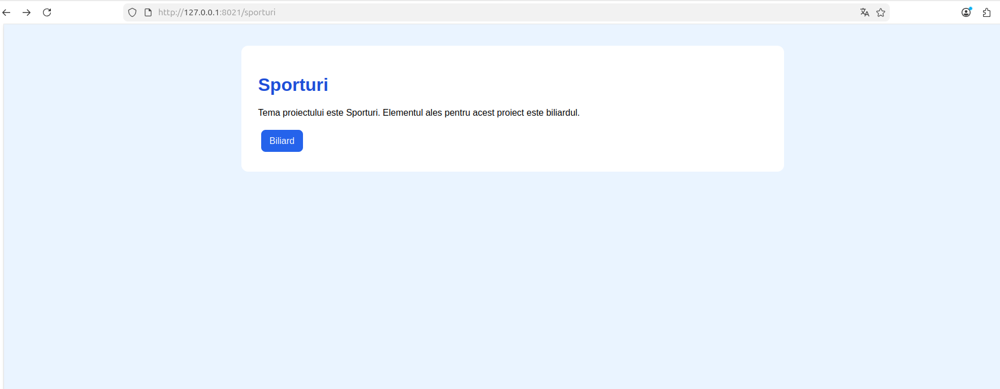

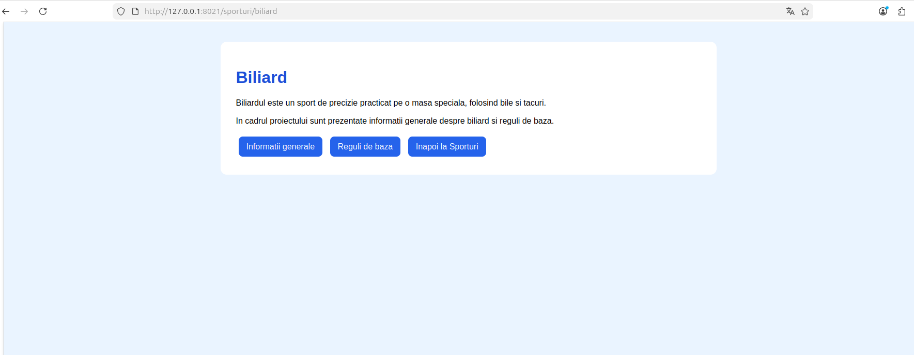


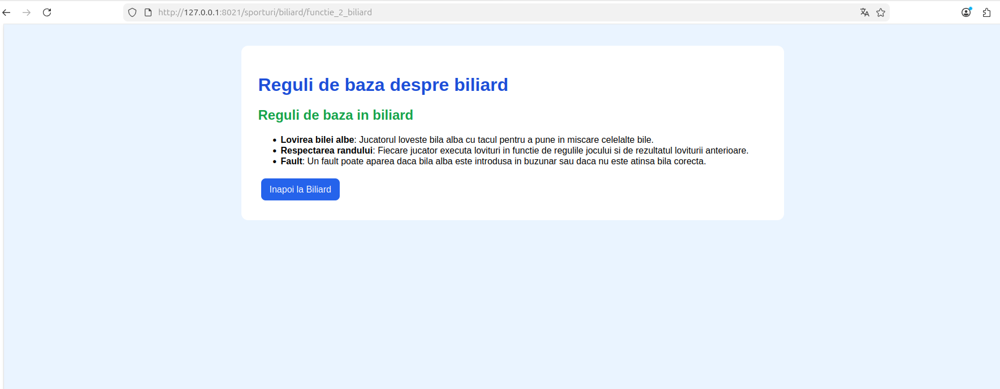

---

## DevOps CI - Jenkins

Pentru automatizarea procesului de build, testare și deploy a fost folosit Jenkins. Pipeline-ul este definit în fișierul:

```text
Jenkinsfile
```

Pipeline-ul a fost configurat în Jenkins folosind opțiunea:

```text
Pipeline script from SCM
```

Repository-ul folosit este:

```text
https://github.com/vlad-barbu18/curs_scc_442D_Sporturi.git
```

Branch-ul folosit în Jenkins este:

```text
*/dev_andriu_cosmin
```

Prin această configurare, Jenkins citește automat fișierul `Jenkinsfile` din branch-ul de dezvoltare personal și rulează pașii definiți în pipeline.

Pipeline-ul conține următoarele etape:

1. **Build**  
   În această etapă se afișează workspace-ul Jenkins, se listează fișierele proiectului și se activează/creează mediul virtual prin scriptul `activeaza_venv_jenkins`. De asemenea, sunt instalate dependențele necesare proiectului.

2. **pylint - calitate cod**  
   Această etapă rulează analiza statică asupra fișierelor Python din proiect. Sunt analizate fișierele din bibliotecă, fișierele de test și fișierul principal `sporturi.py`.

3. **Unit Testing cu pytest**  
   În această etapă sunt rulate testele automate definite în folderul `app/tests/`. Testele verifică funcțiile din biblioteca proiectului.

4. **Deploy**  
   În etapa de deploy, Jenkins construiește imaginea Docker a aplicației și creează containerul pe baza imaginii generate.

Exemplu de comenzi executate în pipeline:

```bash
. ./activeaza_venv_jenkins
pylint --exit-zero app/lib/*.py
pylint --exit-zero app/tests/*.py
pylint --exit-zero sporturi.py
pytest
docker build -t sporturi:v${BUILD_NUMBER} .
docker create --name sporturi${BUILD_NUMBER} -p 8021:5012 sporturi:v${BUILD_NUMBER}
```

Pentru ca etapa de Docker să funcționeze, utilizatorul `jenkins` trebuie să aibă permisiuni pentru Docker. Acest lucru se face cu:

```bash
sudo usermod -aG docker jenkins
sudo systemctl restart jenkins
```

Verificarea accesului se poate face cu:

```bash
sudo -u jenkins docker ps
```

După configurare, pipeline-ul a fost rulat din interfața Jenkins folosind butonul **Build Now**. Build-ul a trecut cu succes prin etapele principale: Build, pylint, pytest și Deploy.

Capturi de ecran pentru Jenkins:

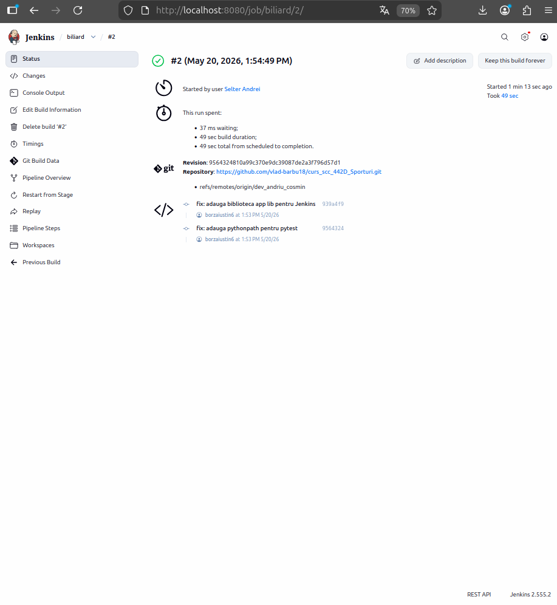


Prima captură arată faptul că build-ul Jenkins a rulat cu succes, iar a doua captură prezintă vizual etapele pipeline-ului.

---

## Flux Git și Pull Request

Pentru dezvoltarea proiectului a fost folosit un branch personal de lucru:

```text
dev_andriu_cosmin
```

Pe acest branch au fost realizate modificările pentru elementul Biliard. După implementare, modificările au fost urcate pe GitHub folosind comenzile:

```bash
git status
git add .
git commit -m "mesaj commit"
git push
```

După finalizarea implementării, a fost creat un Pull Request din branch-ul de dezvoltare către branch-ul personal de main:

```text
dev_andriu_cosmin -> main_andriu_cosmin
```

Acest flux permite lucrul separat față de branch-ul principal al repository-ului și evită suprascrierea modificărilor realizate de alți colegi.

---

## Stadiu dezvoltare

Stadiul proiectului este următorul:

- aplicația Flask este implementată;
- cele patru rute cerute sunt funcționale;
- biblioteca Python conține cele două funcții publice;
- testele automate cu pytest sunt implementate;
- analiza statică prin pylint este integrată;
- aplicația poate fi rulată local;
- aplicația poate fi rulată în container Docker;
- Jenkinsfile este configurat;
- pipeline-ul Jenkins rulează etapele Build, pylint, pytest și Deploy;
- README-ul conține explicații și capturi de ecran relevante.

---

## Concluzii

Prin realizarea acestui proiect a fost parcurs un flux complet de dezvoltare software, de la scrierea codului până la automatizarea verificărilor prin Jenkins.

Aplicația Flask implementată pentru tema **Sporturi** și elementul **Biliard** demonstrează folosirea rutelor web, separarea funcționalităților în module Python, testarea automată și rularea într-un mediu containerizat.

Utilizarea Docker oferă portabilitate aplicației, deoarece aceasta poate fi rulată într-un container independent de configurația sistemului gazdă. Integrarea Jenkins adaugă o etapă importantă de automatizare, permițând verificarea rapidă a codului după fiecare modificare.

Proiectul evidențiază importanța următoarelor concepte:

- organizarea codului în module;
- versionarea cu Git;
- testarea automată;
- analiza statică a codului;
- containerizarea aplicațiilor;
- automatizarea proceselor prin pipeline-uri CI/CD.

---

## Bibliografie

- Documentația oficială Flask: https://flask.palletsprojects.com/
- Documentația oficială pytest: https://docs.pytest.org/
- Documentația oficială Docker: https://docs.docker.com/
- Documentația oficială Jenkins: https://www.jenkins.io/doc/
- Repository de referință: https://github.com/crchende/sysinfo.git


---

# Fotbal — Barbu Vlad-Cătălin
[↑ Cuprins](#sporturi-integrate-în-readmemd)

# Proiect SCC - Sporturi

## Dezvoltator
- **Nume:** Barbu Vlad-Cătălin
- **Grupa:** 442D
- **Element alocat:** Fotbal

## Cuprins
- [Descriere generală](#descriere-generală)
- [Funcționalitate implementată](#funcționalitate-implementată)
- [Stadiu dezvoltare](#stadiu-dezvoltare)
- [Testare manuală în browser (rulare locală)](#testare-manuală-în-browser-rulare-locală)
- [Testare automată cu pytest](#testare-automată-cu-pytest)
- [Validare cod cu pylint](#validare-cod-cu-pylint)
- [Testare cu Docker](#testare-cu-docker)
- [DevOps CI](#devops-ci)
  - [Exemplu execuție pipeline Jenkins](#exemplu-execuție-pipeline-jenkins)
- [Concluzii](#concluzii)
- [Bibliografie](#bibliografie)

## Descriere generală

Obiectivul proiectului a fost realizarea unei aplicatii web folosind framework-ul Flask, parcurgerea unui proces complet de dezvoltare software in care folosim Jenkins, Docker, Python, GitHub pentru versionare, containerizare, programare si automatizare.

## Funcționalitate implementată

În acest branch am adăugat și personalizat:

- Fișierul `app/lib/biblioteca_sporturi.py` cu cele două funcții cerute:
  - `competitii_fotbal()` – returnează codul HTML cu informațiile despre competițiile internaționale (World Cup, EURO, Champions League, Europa League, Conference League, Copa America, Copa Libertadores) și campionatele naționale (Premier League, La Liga, Serie A, Bundesliga, Ligue 1, SuperLiga României).
  - `echipament_fotbal()` – returnează codul HTML cu informațiile despre echipamentul folosit de jucător, portar, arbitru, precum și caracteristicile mingii și ale terenului de joc.

- Fișierul principal `sporturi.py` care are cele patru rute conform cerinței:
  - `/sporturi` – pagina principală a temei.
  - `/sporturi/fotbal` – pagina principală a elementului.
  - `/sporturi/fotbal/competitii_fotbal` – informații despre competițiile de fotbal.
  - `/sporturi/fotbal/echipament_fotbal` – informații despre echipamentul de fotbal.

- Fișierul `app/test/test_biblioteca_sporturi.py` care conține testele automate pentru cele două funcții definite, validând prezența în HTML-ul generat a unor markeri specifici (FIFA World Cup, Champions League, Premier League, SuperLiga România, mănușile de portar, dimensiunile reglementare ale porții 7.32 × 2.44 m etc.).

## Stadiu dezvoltare

- Funcționalitate complet implementată.
- Cod adăugat în branch-ul de lucru `dev_barbu_vlad`.
- Dockerfile și Jenkinsfile sunt funcționale, urmând pipeline-ul de CI/CD.
- Testare locală, automată și containerizată realizată cu succes.

## Testare manuală în browser (rulare locală)

Clonarea repository-ului și selectarea ramurii de dezvoltare:

```bash
mkdir scc
cd scc
git clone https://github.com/vlad-barbu18/curs_scc_442D_Sporturi.git
cd curs_scc_442D_Sporturi
git checkout dev_barbu_vlad
```

Se activează mediul virtual și se pornește aplicația cu scripturile bash existente (din rădăcina proiectului):

```bash
. ./activeaza_venv
./ruleaza_aplicatia
```

Dacă apar erori de permisiuni se introduce comanda:

```bash
sudo chmod 764 ./activeaza_venv ./ruleaza_aplicatia
```

Aplicația poate fi accesată în browser la adresa:

```
http://127.0.0.1:5014/sporturi
```

Capturile de mai jos prezintă cele patru rute ale aplicației, accesate din browser în timp ce serverul Flask rulează local.

Pagina principală a temei (`/sporturi`):


Pagina elementului ales, fotbalul (`/sporturi/fotbal`):

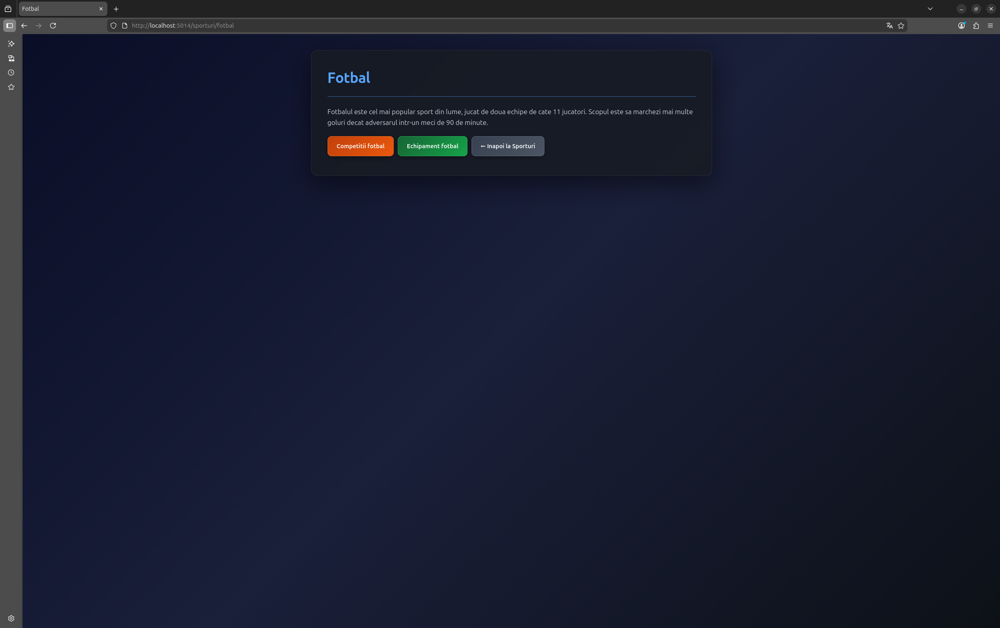

Pagina cu competițiile de fotbal (`/sporturi/fotbal/competitii_fotbal`):


Pagina cu echipamentele de fotbal (`/sporturi/fotbal/echipament_fotbal`):


## Testare automată cu `pytest`

Testele au fost scrise în fișierul `app/test/test_biblioteca_sporturi.py`. Cu mediul virtual activ, rularea testelor se face astfel:

```bash
pytest app/test/test_biblioteca_sporturi.py -v
```

Toate cele 8 teste au fost executate cu succes, validând corectitudinea celor două funcții definite.

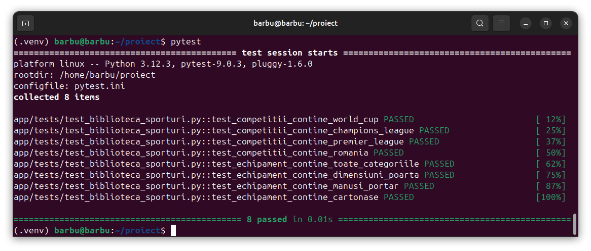

## Validare cod cu `pylint`

Pentru verificarea calității codului sursă se utilizează pachetul **pylint**. Acesta analizează conformitatea codului cu standardele Python (verifică spații, convenții de numire a variabilelor, variabile neutilizate, prezența docstring-urilor etc.).

În cadrul acestui proiect, problemele raportate de **pylint** sunt doar afișate pentru monitorizare, nu sunt considerate erori (se utilizează flag-ul `--exit-zero`).

```bash
pylint --exit-zero app/lib/biblioteca_sporturi.py
pylint --exit-zero app/tests/test_biblioteca_sporturi.py
pylint --exit-zero sporturi.py
```


## Testare cu Docker

Pentru asigurarea portabilității aplicației, am creat un container Docker pornind de la `Dockerfile`-ul din rădăcina proiectului. Pașii efectuați au fost:

1. Construirea imaginii Docker:

```bash
docker build -t sporturi:v01 .
```

Imaginea creată poate fi vizualizată în lista locală de imagini Docker (alături de imaginea de bază `python:3.10-alpine` care a fost descărcată automat):

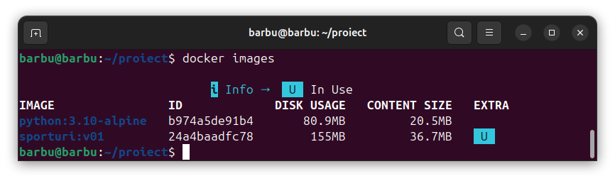

2. Rularea containerului din imaginea creată:

```bash
docker run --name sporturi1 -p 8014:5014 sporturi:v01
```

La pornirea containerului, în consolă sunt afișate mesajele de activare a mediului virtual și de pornire a serverului Flask:

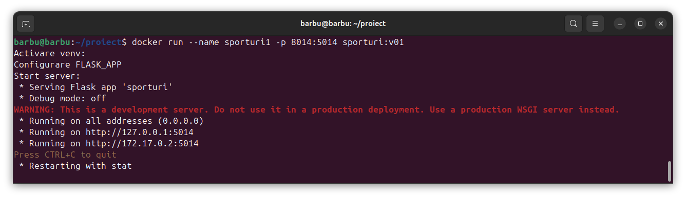

Containerul activ se poate vizualiza cu comanda `docker ps`:

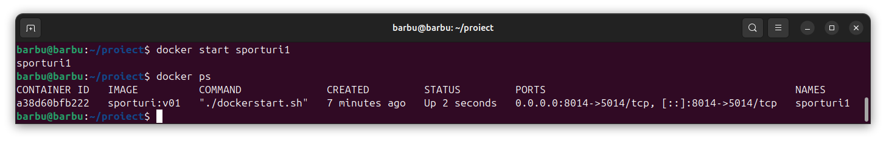

3. Accesarea aplicației în browser, de această dată servită din interiorul containerului Docker:

```
http://localhost:8014/sporturi
```

Capturile de mai jos prezintă cele patru rute ale aplicației, accesate din browser în timp ce aplicația rulează în containerul Docker. Comportamentul este identic cu cel din rulare locală, însă aplicația este complet izolată în container, ceea ce confirmă reușita procesului de containerizare.

Pagina principală a temei accesată din container:

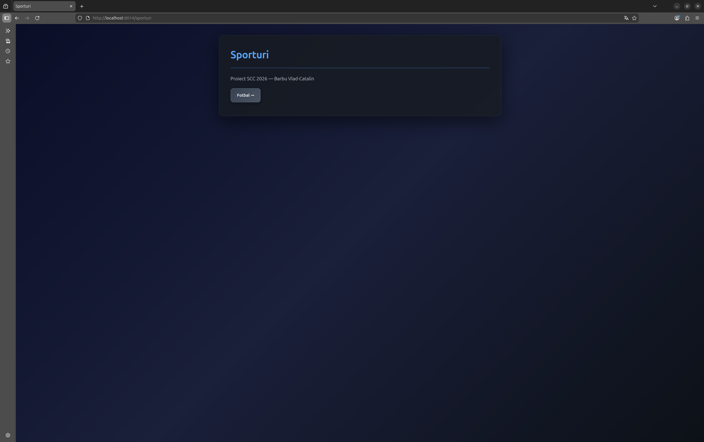

Pagina elementului ales accesată din container:


Pagina cu competițiile de fotbal accesată din container:

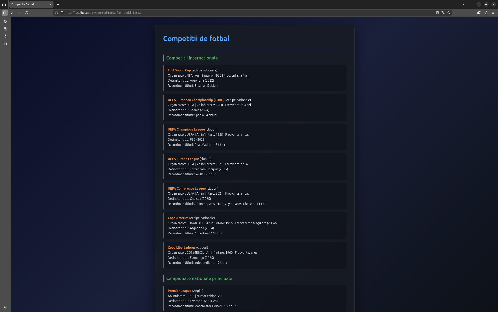

Pagina cu echipamentele de fotbal accesată din container:

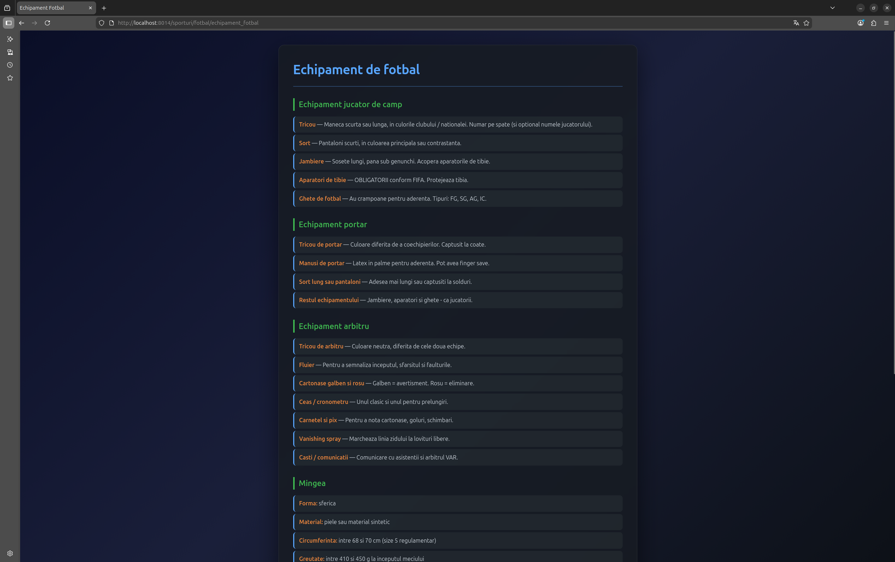

# DevOps CI

- **CI** = Continuous Integration (Integrare Continuă)

Proiectul utilizează un flux de automatizare definit în `Jenkinsfile`, care asigură validarea codului și livrarea aplicației.

## Exemplu execuție pipeline Jenkins

Pentru a se putea executa cu succes ultimul pas din pipeline-ul de Jenkins (crearea și lansarea containerului Docker), este necesar ca utilizatorul `jenkins` să aibă permisiuni de rulare a comenzilor Docker fără `sudo`.

Puteți găsi pașii de configurare pe [docs.docker.com - linux-postinstall](https://docs.docker.com/engine/install/linux-postinstall/).
Dacă folosiți mașină virtuală Linux, restartați mașina după ce faceți configurația.

**Etapele Pipeline-ului:**
1. **Build**: Crearea mediului virtual și instalarea dependințelor.
2. **Linter**: Verificarea stilului codului cu `pylint`.
3. **Unit Tests**: Rularea testelor cu `pytest`.
4. **Deploy**: Construirea imaginii Docker și pornirea containerului pe portul **8014**.

Pentru a porni serviciul, se rulează în terminal comanda:

```bash
jenkins
```
Se creează pipeline-ul în Jenkins, care este accesat local pe portul 8080 și se conectează cu repository-ul. Odată creat, se verifică funcționalitatea cu **Build Now**, urmat de confirmarea execuției cu succes în Console Output (log-uri).

Vizualizarea modernă a pipeline-ului din **Blue Ocean** arată toate cele 4 stages cu execuție reușită:

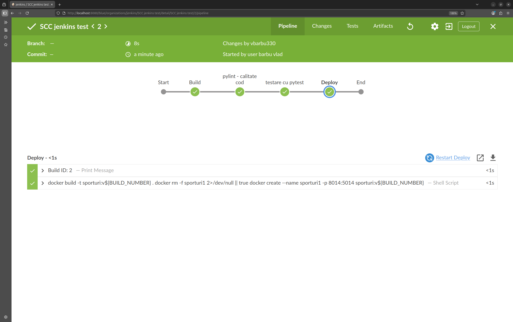

Detaliile build-ului în interfața clasică Jenkins, cu link către commit-ul de pe GitHub și informații despre durata fiecărui pas:

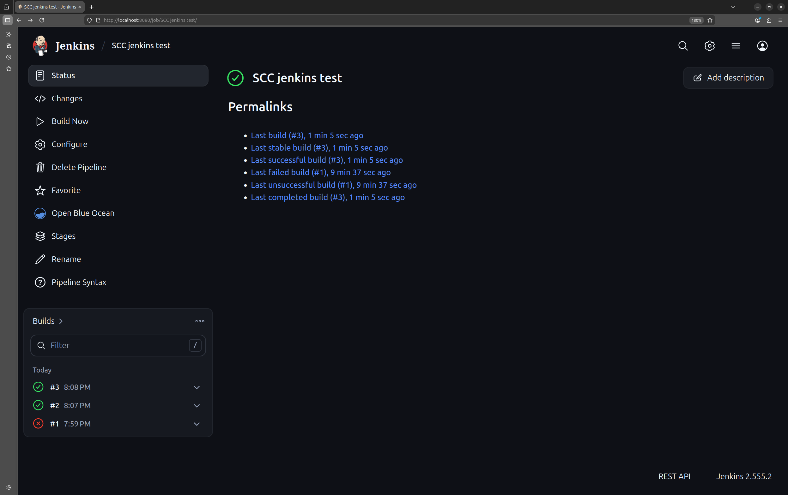

## Concluzii
Acest proiect atinge cu succes atât obiectivele funcționale, cât și pe cele tehnice, evidențiind următoarele aspecte:

- **Dezvoltare modulară:** Implementarea unei aplicații web folosind framework-ul Flask, integrând bune practici de inginerie software prin separarea datelor și a logicii în module distincte (`app/lib/biblioteca_sporturi.py`).
- **Arhitectură extensibilă:** Structura proiectului permite adăugarea facilă de noi elemente sportive sau noi categorii de informații, fără modificarea fișierului principal de rutare.
- **Portabilitate:** Containerizarea prin Docker a asigurat un mediu de rulare izolat, rapid și consistent pe diverse platforme, indiferent de versiunea de Python instalată pe sistemul gazdă. Capturile de ecran demonstrează că aplicația rulează identic atât local cât și în container.
- **Automatizare (CI/CD):** Pipeline-ul configurat în Jenkins a optimizat procesul de dezvoltare prin integrare și livrare continuă, automatizând complet ciclul de testare și deploy.
- **Asigurarea calității:** Testarea automată cu `pytest` și analiza statică a codului cu `pylint` au garantat stabilitatea aplicației la fiecare modificare a codului sursă.

## Bibliografie

https://github.com/crchende/sysinfo.git


---

# Tir cu arcul — Bădițeanu Mădălina
[↑ Cuprins](#sporturi-integrate-în-readmemd)

# Proiect SCC - Sporturi

## Dezvoltator
- **Nume:** Baditeanu Madalina
- **Grupa:** 442D
- **Element alocat:** Tir cu arcul

## Cuprins
- [Descriere generala](#descriere-generala)
- [Functionalitate implementata](#functionalitate-implementata)
- [Stadiu dezvoltare](#stadiu-dezvoltare)
- [Testare manuala in browser (rulare locala)](#testare-manuala-in-browser-rulare-locala)
- [Testare automata cu pytest](#testare-automata-cu-pytest)
- [Validare cod cu pylint](#validare-cod-cu-pylint)
- [Testare cu Docker](#testare-cu-docker)
- [DevOps CI](#devops-ci)
- [Pull Requests review](#pull-requests-review)
- [Concluzii](#concluzii)
- [Bibliografie](#bibliografie)

## Descriere generala

Obiectivul proiectului a fost realizarea unei aplicatii web folosind framework-ul Flask, parcurgerea unui proces complet de dezvoltare software in care folosim Jenkins, Docker, Python, GitHub pentru versionare, containerizare, programare si automatizare.

## Functionalitate implementata

In acest branch am adaugat si personalizat:

- Fisierul `app/lib/biblioteca_sporturi.py` cu cele doua functii cerute:
  - `reguli_tir_cu_arcul()` - returneaza HTML cu regulile de baza ale tirului cu arcul.
  - `campioni_tir_cu_arcul()` - returneaza HTML cu campioni mondiali celebri 
- Fisierul principal `sporturi.py` cu cele patru rute conform cerintei:
  - `/sporturi` - pagina principala a temei.
  - `/sporturi/tir_cu_arcul` - pagina elementului ales.
  - `/sporturi/tir_cu_arcul/reguli_tir_cu_arcul` - regulile tirului cu arcul.
  - `/sporturi/tir_cu_arcul/campioni_tir_cu_arcul` - campionii la tir cu arcul.

- Fisierul `app/tests/test_biblioteca_sporturi.py` cu 8 teste automate.

## Stadiu dezvoltare

- Functionalitate complet implementata.
- Cod adaugat in branch-ul `dev_baditeanu_madalina`.
- Dockerfile si Jenkinsfile sunt functionale.
- Testare locala, automata si containerizata realizata cu succes.

## Testare manuala in browser (rulare locala)

```bash
git clone <url-repo>
cd <folder-repo>
git checkout dev_baditeanu_madalina
. ./activeaza_venv
./ruleaza_aplicatia
```

Aplicatia se acceseaza la: `http://127.0.0.1:5012/sporturi`

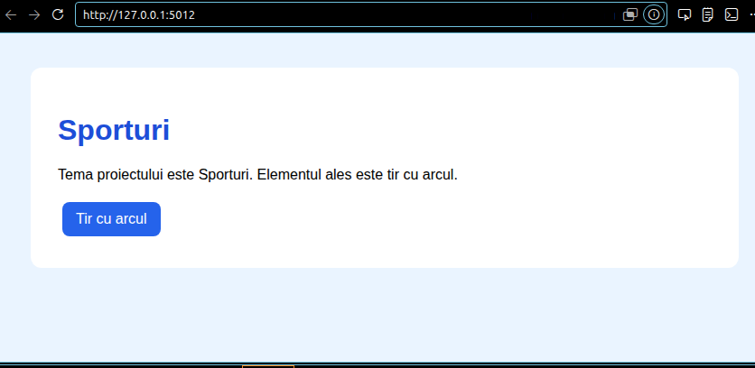


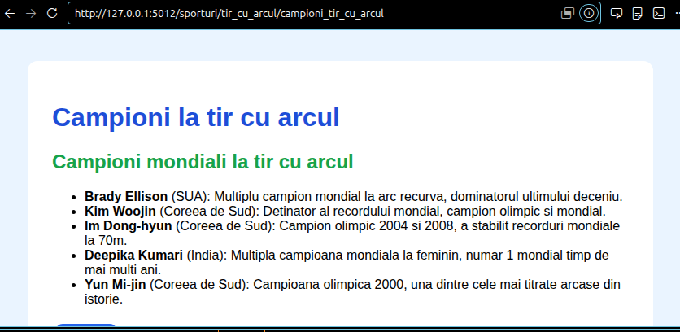

## Testare automata cu `pytest`

```bash
pytest
```

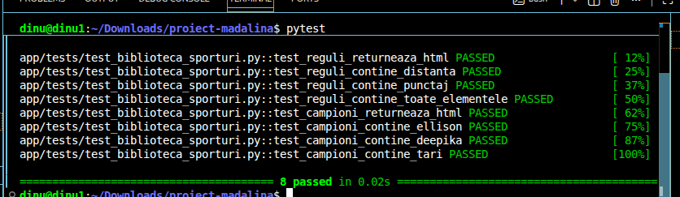

## Validare cod cu `pylint`

```bash
pylint --exit-zero app/lib/biblioteca_sporturi.py
pylint --exit-zero app/tests/test_biblioteca_sporturi.py
pylint --exit-zero sporturi.py
```

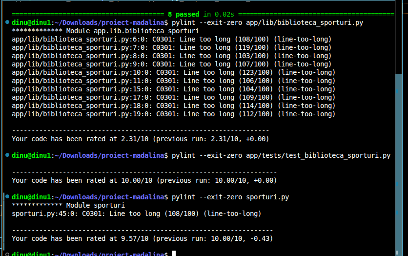

## Testare cu Docker

```bash
docker build -t sporturi:v01 .
docker run --name sporturi1 -p 8021:5012 sporturi:v01
```

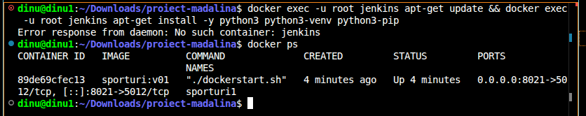
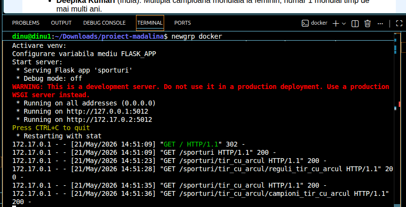

Aplicatia din container, accesata la `http://localhost:8021/sporturi`:


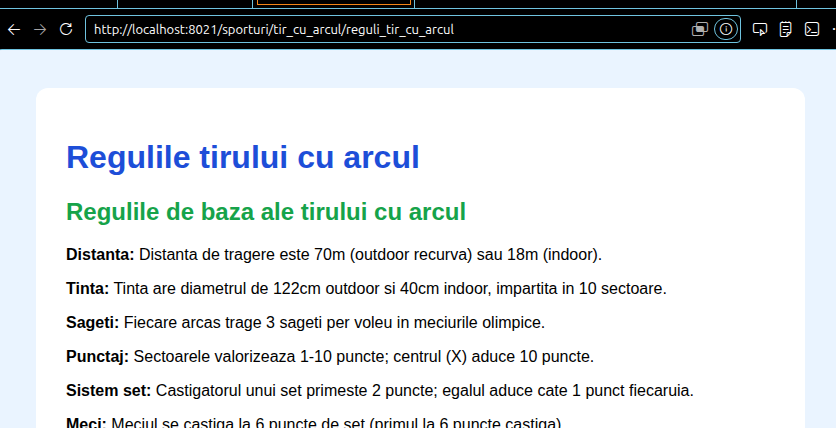
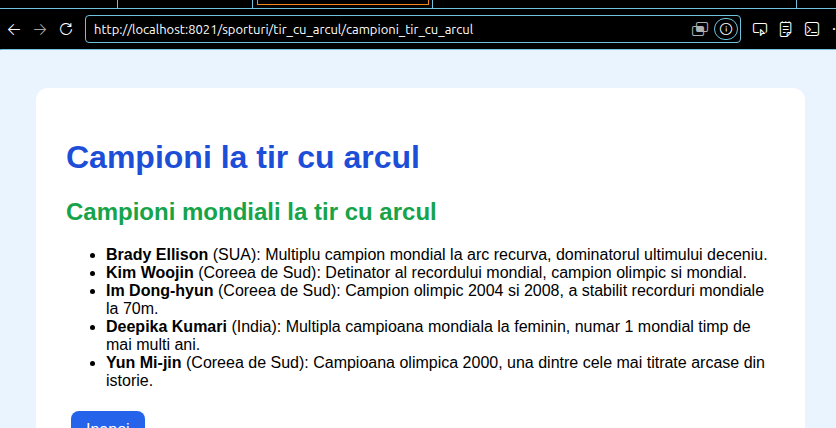

## DevOps CI

Pipeline declarativ definit in `Jenkinsfile`, cu 4 stages:
1. **Build** - creare venv si instalare dependente
2. **pylint** - analiza statica a codului (warning-only, `--exit-zero`)
3. **Unit Tests** - rulare teste cu pytest
4. **Deploy** - build imagine Docker si creare container

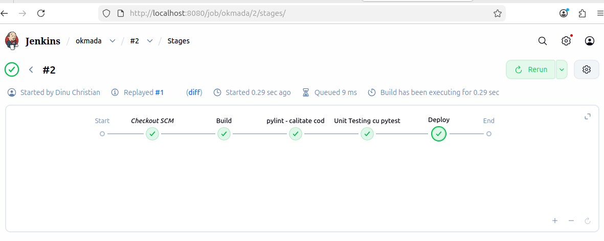


## Concluzii

- **Dezvoltare modulara:** aplicatie Flask cu separarea datelor si logicii in fisiere dedicate.
- **Portabilitate:** Docker asigura rulare consistenta indiferent de mediu.
- **Automatizare:** Jenkins automatizeaza testarea si deploy-ul la fiecare push.
- **Asigurarea calitatii:** pytest si pylint integrate in pipeline CI/CD.

## Bibliografie

https://github.com/crchende/sysinfo.git


---

# Rugby — Blîndu Andrei
[↑ Cuprins](#sporturi-integrate-în-readmemd)

# Proiect SCC - Sporturi

## Dezvoltator

Andrei Blindu

## Tema proiectului

Tema proiectului este **Sporturi**, iar elementul ales pentru implementare este **Rugby**.

## Descriere proiect

Acest proiect reprezintă o aplicație web simplă realizată în Flask pentru disciplina **Servicii Cloud și Containerizare**.

Aplicația prezintă informații despre sportul Rugby și include pagini web pentru afișarea regulilor de bază și a echipamentului folosit în rugby.

Scopul proiectului este utilizarea unor instrumente specifice dezvoltării software și DevOps, precum Git, GitHub, Flask, pytest, Jenkins și Docker.

## Funcționalitate implementată

Pentru sportul ales, Rugby, au fost implementate două funcții în fișierul `app/lib/biblioteca_rugby.py`.

Funcțiile implementate sunt `reguli_rugby()` și `echipament_rugby()`.

Funcția `reguli_rugby()` returnează informații formatate HTML despre regulile de bază din rugby, precum pasele, eseul, placajul și lovitura de pedeapsă.

Funcția `echipament_rugby()` returnează informații formatate HTML despre echipamentul folosit în rugby, precum mingea, tricoul, ghetele, protecția dentară și terenul.

## Structura proiectului

Proiectul conține aplicația principală Flask în fișierul `sporturi.py`, biblioteca pentru funcționalitatea Rugby în `app/lib/biblioteca_rugby.py`, testele automate în `app/tests/test_biblioteca_rugby.py`, fișierul `Jenkinsfile` pentru rularea pipeline-ului Jenkins, fișierul `Dockerfile` pentru containerizare, scriptul `dockerstart.sh` pentru pornirea aplicației în container, fișierul `quickrequirements.txt` pentru dependențe și folderul `doc/` pentru capturile de ecran Docker.

## Rute implementate

Aplicația conține următoarele rute:

- `/` redirecționează către `/sporturi`
- `/sporturi` afișează pagina principală a temei Sporturi
- `/sporturi/rugby` afișează pagina principală pentru sportul Rugby
- `/sporturi/rugby/reguli` afișează regulile de bază din rugby
- `/sporturi/rugby/echipament` afișează echipamentul folosit în rugby

## Rulare locală

Pentru rularea aplicației local, se activează mediul virtual:

source ./activeaza_venv


---

# Volei — Bocai Alexandra
[↑ Cuprins](#sporturi-integrate-în-readmemd)

# curs_scc_442D_Sporturi

# Funcționalitate Volei - Bocai Alexandra

## Cuprins

1. [Prezentarea proiectului](#1-prezentarea-proiectului)
2. [Funcționalități realizate](#2-funcționalități-realizate)
3. [Structura implementării](#3-structura-implementării)
4. [Fișiere adăugate sau modificate](#4-fișiere-adăugate-sau-modificate)
5. [Rute disponibile](#5-rute-disponibile)
6. [Stadiul proiectului](#6-stadiul-proiectului)
7. [Rulare locală](#7-rulare-locală)
8. [Capturi aplicație](#8-capturi-aplicație)
9. [Testare automată cu pytest](#9-testare-automată-cu-pytest)
10. [Verificare cu pylint](#10-verificare-cu-pylint)
11. [Containerizare Docker](#11-containerizare-docker)
12. [Pipeline Jenkins](#12-pipeline-jenkins)
13. [Integrare GitHub](#13-integrare-github)
14. [Review Pull Request-uri](#14-review-pull-request-uri)
15. [Ce mai este de făcut](#15-ce-mai-este-de-făcut)

---

## 1. Prezentarea proiectului

Proiectul face parte din disciplina **Servicii Cloud și Containerizare**, grupa **442D**. Tema generală a proiectului este **Sporturi**, iar elementul implementat de mine este **Volei**.

Aplicația este realizată în Flask și prezintă informații despre sportul ales, regulile principale și echipamentul folosit. Pentru partea de dezvoltare și verificare am inclus teste automate, analiză statică, configurare Docker și pipeline Jenkins.

---

## 2. Funcționalități realizate

Pentru elementul Volei am implementat:

- pagina principală a temei Sporturi;
- pagina dedicată sportului Volei;
- pagina pentru regulile jocului de volei;
- pagina pentru echipamentul folosit în volei;
- două funcții publice în biblioteca proiectului:
  - `reguli_volei()`;
  - `echipament_volei()`;
- teste automate pentru funcțiile din bibliotecă;
- fișiere de configurare pentru rulare locală, Docker și Jenkins.

---

## 3. Structura implementării

```text
curs_scc_442D_Sporturi/
│
├── sporturi.py
├── Dockerfile
├── Jenkinsfile
├── README.md
├── requirements.txt
├── quickrequirements.txt
├── pytest.ini
├── activeaza_venv
├── activeaza_venv_jenkins
├── ruleaza_aplicatia
├── dockerstart.sh
├── .gitignore
│
├── app/
│   ├── __init__.py
│   │
│   ├── lib/
│   │   ├── __init__.py
│   │   └── biblioteca_sporturi.py
│   │
│   └── tests/
│       ├── __init__.py
│       └── test_biblioteca_sporturi.py
│
├── templates/
│   ├── index.html
│   ├── volei.html
│   ├── reguli.html
│   └── echipament.html
│
├── static/
│   └── images/
│       ├── volei.jpg
│       ├── reguli.jpg
│       └── echipament.jpg
│
└── doc/
    └── screenshots/
        ├── home.png
        ├── volei.png
        ├── reguli.png
        └── echipament.png
```

---

## 4. Fișiere adăugate sau modificate

- `sporturi.py`
- `app/lib/biblioteca_sporturi.py`
- `app/tests/test_biblioteca_sporturi.py`
- `templates/reguli.html`
- `templates/echipament.html`
- `requirements.txt`
- `quickrequirements.txt`
- `pytest.ini`
- `Dockerfile`
- `dockerstart.sh`
- `Jenkinsfile`
- `activeaza_venv`
- `activeaza_venv_jenkins`
- `ruleaza_aplicatia`
- `README.md`

---

## 5. Rute disponibile

| Rută | Ce afișează |
|---|---|
| `/` | Pagina principală a aplicației |
| `/sporturi` | Pagina generală pentru tema Sporturi |
| `/sporturi/volei` | Pagina elementului ales, Volei |
| `/sporturi/volei/reguli` | Reguli generate prin `reguli_volei()` |
| `/sporturi/volei/echipament` | Echipamente generate prin `echipament_volei()` |

---

## 6. Stadiul proiectului

| Componentă | Stadiu |
|---|---|
| Aplicație Flask | Implementată |
| Rute pentru Volei | Implementate |
| Funcții în bibliotecă | Implementate |
| Teste cu pytest | Implementate și rulate local |
| Pylint | Rulat local |
| Dockerfile | Configurat |
| Jenkinsfile | Configurat |
| Capturi aplicație locală | Adăugate |
| Capturi Docker/Jenkins | De adăugat după rulare |

---

# Testare și rulare

## 7. Rulare locală

Pentru pregătirea mediului virtual se folosește:

```bash
. ./activeaza_venv_jenkins
```

Pentru pornirea aplicației:

```bash
. ./activeaza_venv
. ./ruleaza_aplicatia
```

Aplicația pornește pe portul `5000` și poate fi accesată la:

```text
http://127.0.0.1:5000/sporturi
```

Rutele verificate local:

- `http://127.0.0.1:5000/sporturi`
- `http://127.0.0.1:5000/sporturi/volei`
- `http://127.0.0.1:5000/sporturi/volei/reguli`
- `http://127.0.0.1:5000/sporturi/volei/echipament`

---

## 8. Capturi aplicație

### Pagina Sporturi

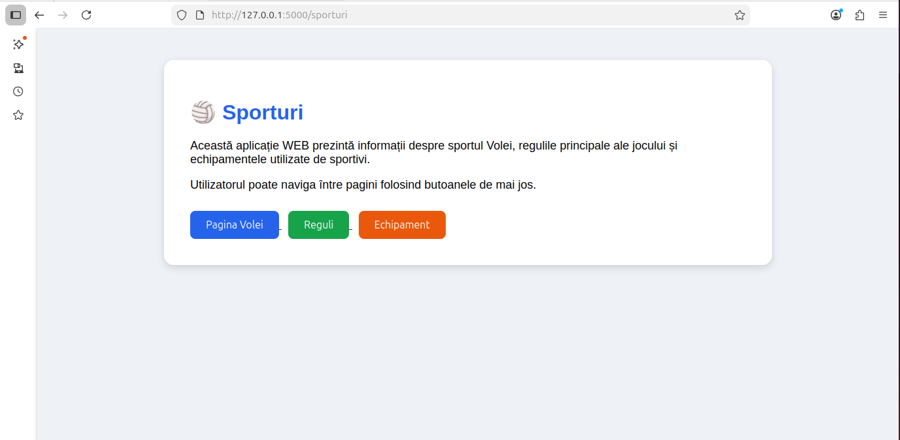

### Pagina Volei


### Pagina Reguli Volei


### Pagina Echipament Volei

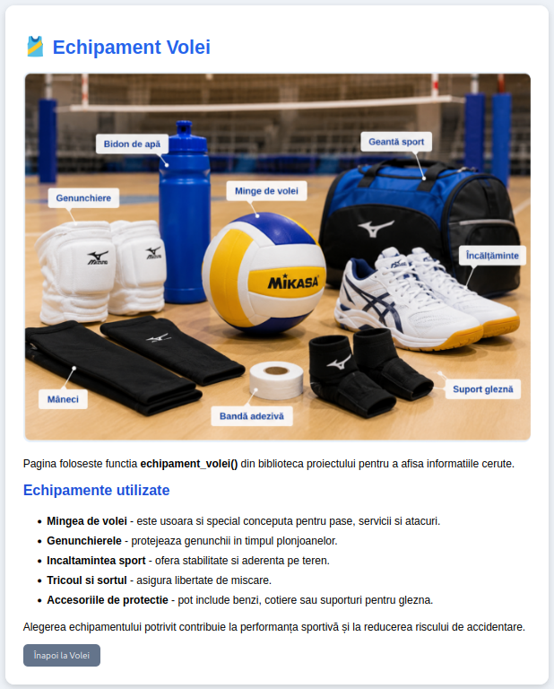

---

## 9. Testare automată cu pytest

Testele sunt în fișierul:

```text
app/tests/test_biblioteca_sporturi.py
```

Comanda de rulare:

```bash
pytest
```

Rezultatul obținut local:

```text
4 passed
```

Testele verifică faptul că funcțiile `reguli_volei()` și `echipament_volei()` returnează HTML și conțin informații relevante despre Volei.

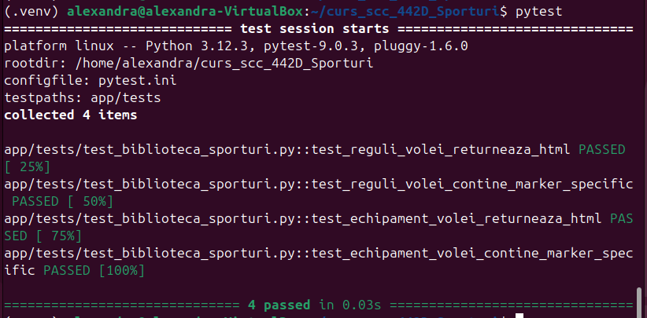

---

## 10. Verificare cu pylint

Pentru analiza statică am folosit `pylint`.

Comenzi:

```bash
export PYLINTHOME=.pylint.d
pylint --exit-zero app/lib/*.py
pylint --exit-zero app/tests/*.py
pylint --exit-zero sporturi.py
```

Rezultatul obținut local:

```text
Your code has been rated at 10.00/10
```

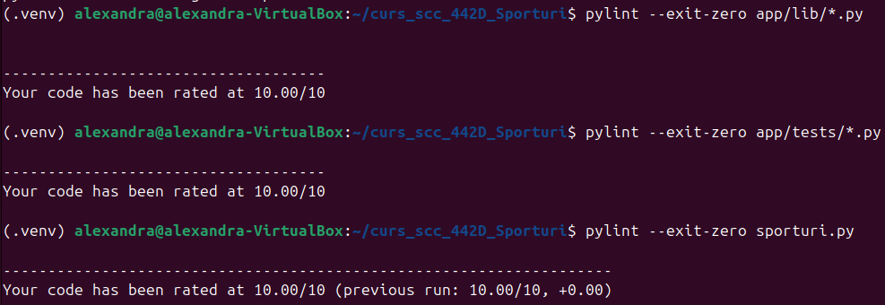

---

## 11. Containerizare Docker

Aplicația este pregătită pentru rulare în container.

Construirea imaginii:

```bash
docker build -t sporturi:v01 .
```

Pornirea containerului:

```bash
docker run --name sporturi1 -p 5000:5000 sporturi:v01
```

Ruta aplicației din container:

```text
http://127.0.0.1:5000/sporturi
```

Oprirea containerului:

```bash
docker stop sporturi1
docker rm sporturi1
```

Capturi pentru rularea Docker:

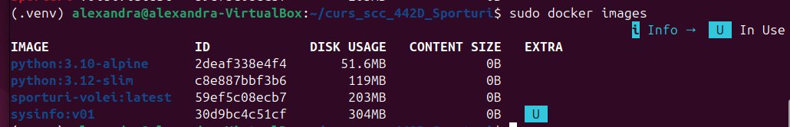

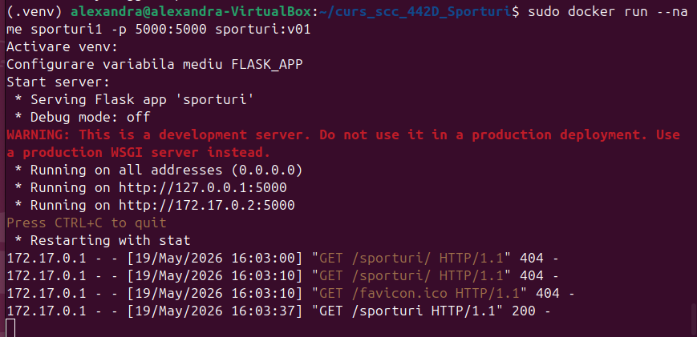

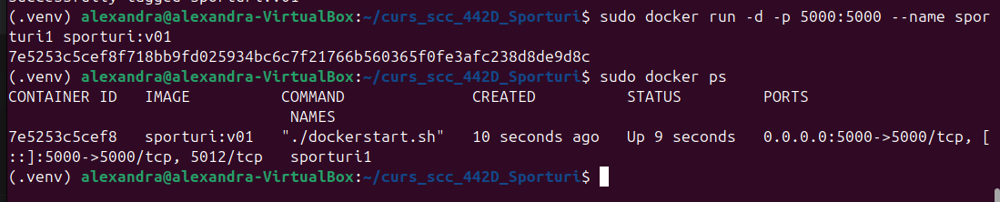

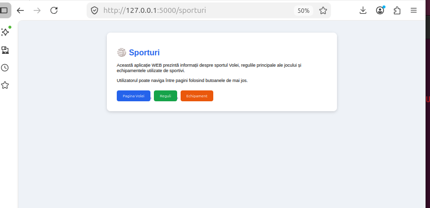

---

## 12. Pipeline Jenkins

Pipeline-ul este definit în `Jenkinsfile` și este pregătit pentru rulare pe branch-ul:

```text
dev_bocai_alexandra
```

Etapele configurate sunt:

| Stage | Rol |
|---|---|
| `Build` | Creează mediul virtual și instalează dependențele |
| `pylint - calitate cod` | Rulează analiza statică |
| `Unit Testing cu pytest` | Rulează testele automate |
| `Deploy` | Construiește imaginea Docker și creează containerul |

Capturi pentru rularea Jenkins:

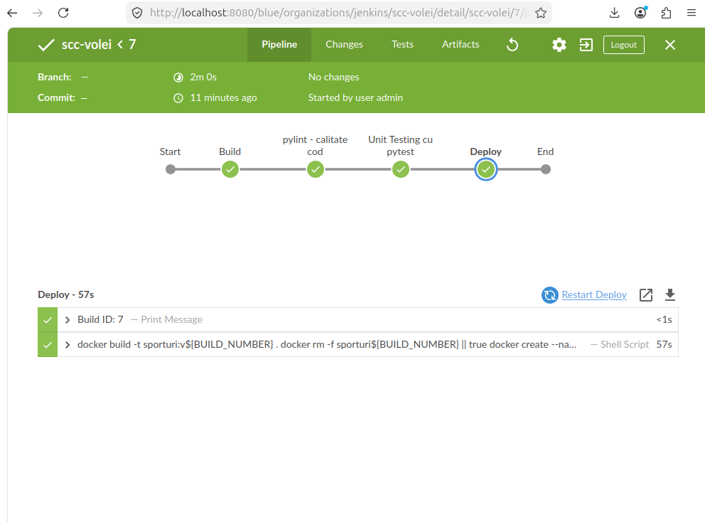

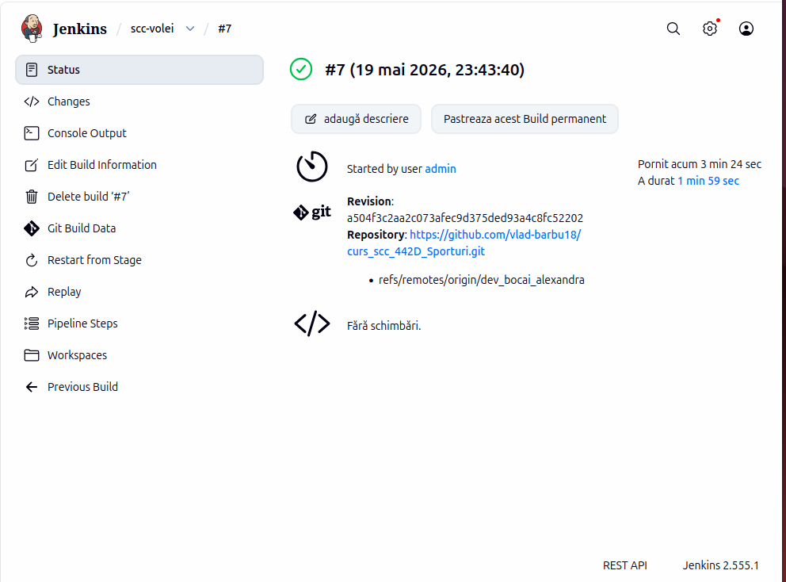

---

## 13. Integrare GitHub

Branch-ul de dezvoltare folosit:

```text
dev_bocai_alexandra
```

Branch-ul către care se va face Pull Request:

```text
main_bocai_alexandra
```

Fluxul de integrare:

```text
dev_bocai_alexandra -> main_bocai_alexandra
```

Status actual:

```text
Modificările au fost pregătite pe branch-ul de dezvoltare și urmează integrarea prin Pull Request.
```

---

## 14. Pull Request-uri și review

Pentru integrarea funcționalității Volei am deschis Pull Request din branch-ul `dev_bocai_alexandra` către branch-ul `main_bocai_alexandra`.

Am primit review de la colega cu username-ul GitHub **andragulap** pentru Pull Request-ul meu.

De asemenea, am realizat review pentru Pull Request-ul colegei cu username-ul GitHub **andragulap**.

Review-urile au fost realizate prin verificarea modificărilor din tab-ul `Files changed` și trimiterea review-ului din opțiunea `Review changes`.

---

## 15. Ce mai este de făcut

- Obținerea unui review de la un coleg;
- Efectuarea unui review pentru Pull Request-ul unui coleg;
- Integrarea modificărilor după aprobare.


---

# Balet — Borza Iustin
[↑ Cuprins](#sporturi-integrate-în-readmemd)

# Proiect SCC - Sporturi

## Dezvoltator

- **Nume:** Borza Iustin
- **Grupa:** 442D
- **Element alocat:** Balet
- **Branch dezvoltare:** `dev_borza_iustin`
- **Branch personal main:** `main_borza_iustin`

---

## Cuprins

- [Descriere generală](#descriere-generală)
- [Funcționalitate implementată](#funcționalitate-implementată)
- [Stadiu dezvoltare](#stadiu-dezvoltare)
- [Structura proiectului](#structura-proiectului)
- [Rulare locală](#rulare-locală)
- [Testare manuală în browser - rulare locală](#testare-manuală-în-browser---rulare-locală)
- [Testare automată cu pytest](#testare-automată-cu-pytest)
- [Validare cod cu pylint](#validare-cod-cu-pylint)
- [Testare cu Docker](#testare-cu-docker)
- [DevOps CI cu Jenkins](#devops-ci-cu-jenkins)
- [Exemplu execuție pipeline Jenkins](#exemplu-execuție-pipeline-jenkins)
- [Probleme întâlnite și rezolvări](#probleme-întâlnite-și-rezolvări)
- [Concluzii](#concluzii)
- [Bibliografie](#bibliografie)

---

## Descriere generală

Obiectivul proiectului a fost realizarea unei aplicații web folosind framework-ul Flask și parcurgerea unui proces complet de dezvoltare software, în care sunt utilizate tehnologii precum Python, GitHub, Docker și Jenkins.

Tema generală a proiectului este **Sporturi**, iar elementul ales pentru implementare este **Baletul**. Aplicația prezintă informații despre balet, despre stilurile principale de balet și despre echipamentul utilizat de dansatori.

Baletul poate fi privit atât ca formă de artă, cât și ca activitate fizică, deoarece presupune disciplină, antrenament constant, coordonare, flexibilitate, forță și expresivitate. Din acest motiv, baletul se încadrează în tema proiectului, fiind o activitate care combină mișcarea sportivă cu interpretarea artistică.

Prin acest proiect s-a urmărit realizarea unei aplicații web simple, dar complete, care să respecte cerințele de dezvoltare, testare, containerizare și automatizare.

Proiectul include:

- aplicație Flask cu patru rute;
- bibliotecă Python separată pentru funcționalități;
- teste automate cu `pytest`;
- analiză statică a codului cu `pylint`;
- rulare locală;
- rulare în container Docker;
- automatizare CI/CD prin Jenkins;
- documentare prin capturi de ecran și README.

---

## Funcționalitate implementată

În cadrul proiectului am implementat o aplicație Flask pentru tema **Sporturi**, personalizată pentru elementul **Balet**.

Funcționalitatea principală este împărțită în mai multe fișiere:

- `sporturi.py` - fișierul principal al aplicației Flask;
- `app/lib/biblioteca_sporturi.py` - biblioteca în care sunt definite funcțiile pentru balet;
- `app/tests/test_biblioteca_sporturi.py` - fișierul cu teste automate;
- `Dockerfile` - fișierul folosit pentru containerizarea aplicației;
- `dockerstart.sh` - scriptul de pornire a aplicației în container;
- `Jenkinsfile` - fișierul folosit pentru automatizarea procesului de build, testare și deploy;
- `quickrequirements.txt` - fișierul cu dependențele Python;
- `pytest.ini` - fișierul de configurare pentru testele automate;
- `README.md` - documentația proiectului.

Cele două funcții principale implementate în biblioteca proiectului sunt:

- `stiluri_balet()` - returnează cod HTML cu informații despre principalele stiluri de balet:
  - balet clasic;
  - balet romantic;
  - balet neoclasic;
  - balet contemporan.

- `echipament_balet()` - returnează cod HTML cu informații despre echipamentul folosit în balet:
  - poante;
  - body de balet;
  - fustă tutu;
  - colanți.

Aplicația are patru rute principale:

- `/sporturi` - pagina principală a temei Sporturi;
- `/sporturi/balet` - pagina principală pentru elementul ales, Balet;
- `/sporturi/balet/stiluri_balet` - pagina cu informații despre stilurile de balet;
- `/sporturi/balet/echipament_balet` - pagina cu informații despre echipamentul de balet.

---

## Stadiu dezvoltare

Stadiul actual al proiectului este complet funcțional.

Au fost realizate următoarele activități:

- aplicația Flask a fost creată și personalizată pentru elementul Balet;
- au fost definite cele patru rute cerute;
- au fost implementate cele două funcții în biblioteca separată;
- au fost create teste automate cu `pytest`;
- codul a fost verificat cu `pylint`;
- aplicația a fost rulată local în browser;
- aplicația a fost containerizată folosind Docker;
- imaginea Docker a fost construită cu succes;
- containerul Docker a fost rulat și testat în browser;
- pipeline-ul Jenkins a fost creat;
- pipeline-ul Jenkins a rulat cu succes;
- etapa de deploy din Jenkins a fost finalizată cu succes;
- fișierele au fost urcate pe branch-ul `dev_borza_iustin`;
- README-ul a fost completat cu descriere, comenzi, rezultate și capturi.

Branch-ul de lucru folosit pentru dezvoltare:

```bash
dev_borza_iustin
```

Branch-ul personal de main:

```bash
main_borza_iustin
```

---

## Structura proiectului

Structura principală a proiectului este următoarea:

```bash
curs_scc_442D_Sporturi/
│
├── app/
│   ├── __init__.py
│   ├── lib/
│   │   ├── __init__.py
│   │   └── biblioteca_sporturi.py
│   │
│   └── tests/
│       ├── __init__.py
│       └── test_biblioteca_sporturi.py
│
├── doc/
│   ├── paginaSporturiLocal.png
│   ├── paginaBaletLocal.png
│   ├── paginaStiluriBaletLocal.png
│   ├── paginaEchipamentBaletLocal.png
│   ├── pytest.png
│   ├── pylint.png
│   ├── dockerimages.png
│   ├── dockerconsola.png
│   ├── dockerps.png
│   ├── paginaSporturiContainer.png
│   ├── paginaBaletContainer.png
│   ├── paginaStiluriBaletContainer.png
│   ├── paginaEchipamentBaletContainer.png
│   ├── jenkinsSimplu.png
│   ├── jenkinsConsoleOutput.png
│   └── jenkinsBlueOcean.png
│
├── activeaza_venv
├── activeaza_venv_jenkins
├── dockerstart.sh
├── Dockerfile
├── Jenkinsfile
├── pytest.ini
├── quickrequirements.txt
├── ruleaza_aplicatia
├── sporturi.py
└── README.md
```

---

## Rulare locală

Pentru rularea locală a proiectului, se clonează repository-ul și se selectează branch-ul de dezvoltare:

```bash
mkdir proiect_iustin
cd proiect_iustin
git clone <URL_REPOSITORY>
cd curs_scc_442D_Sporturi
git checkout dev_borza_iustin
```

Se activează mediul virtual și se pornește aplicația Flask:

```bash
. ./activeaza_venv
./ruleaza_aplicatia
```

Dacă apar probleme de permisiuni la rularea scripturilor, se poate folosi comanda:

```bash
chmod +x activeaza_venv activeaza_venv_jenkins ruleaza_aplicatia dockerstart.sh
```

Aplicația se accesează în browser la adresa:

```bash
http://127.0.0.1:5012/sporturi
```

Pentru oprirea aplicației se folosește combinația de taste:

```bash
CTRL + C
```

---

## Testare manuală în browser - rulare locală

Capturile de mai jos prezintă cele patru rute ale aplicației, accesate în browser în timpul rulării locale.

### Pagina principală a temei Sporturi

Ruta accesată:

```bash
/sporturi
```

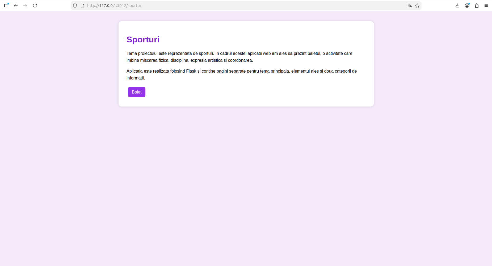

### Pagina elementului ales - Balet

Ruta accesată:

```bash
/sporturi/balet
```


### Pagina cu stilurile de balet

Ruta accesată:

```bash
/sporturi/balet/stiluri_balet
```

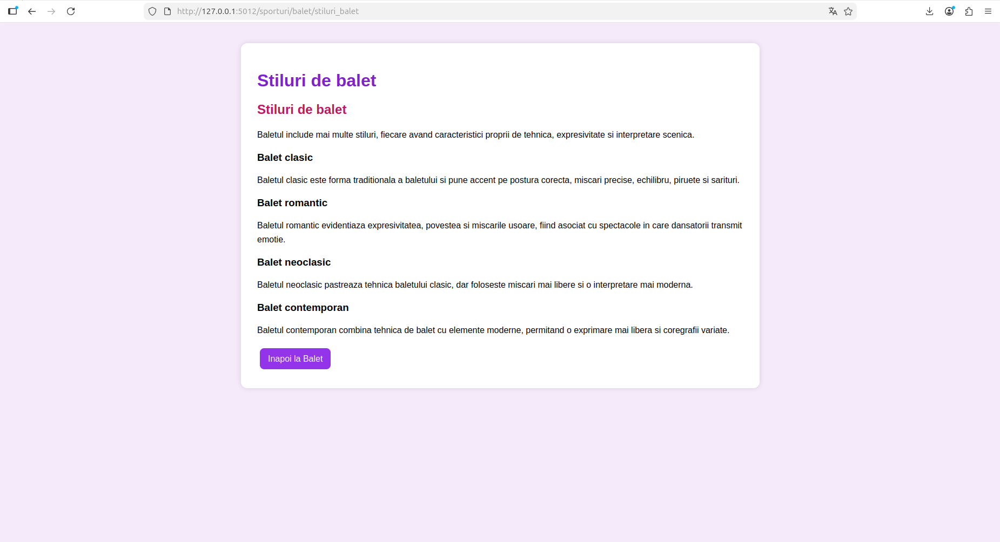

### Pagina cu echipamentul de balet

Ruta accesată:

```bash
/sporturi/balet/echipament_balet
```


---

## Testare automată cu pytest

Pentru verificarea funcțiilor implementate în biblioteca proiectului, au fost scrise teste automate folosind `pytest`.

Fișierul de teste este:

```bash
app/tests/test_biblioteca_sporturi.py
```

Testele verifică următoarele aspecte:

- funcția `stiluri_balet()` returnează conținut HTML;
- rezultatul funcției conține textul „Stiluri de balet”;
- rezultatul conține informații despre baletul clasic;
- rezultatul conține informații despre baletul contemporan;
- funcția `echipament_balet()` returnează conținut HTML;
- rezultatul conține listă HTML;
- rezultatul conține informații despre poante;
- rezultatul conține informații despre fusta tutu.

Rularea testelor se face cu:

```bash
pytest
```

sau:

```bash
python3 -m pytest
```

Rezultatul obținut indică faptul că toate testele au trecut cu succes.

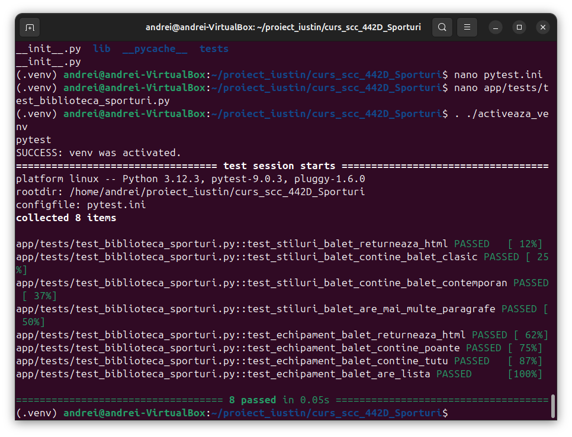

---

## Validare cod cu pylint

Pentru verificarea calității codului sursă a fost utilizat `pylint`.

Acesta analizează codul Python și poate raporta:

- probleme de formatare;
- importuri neutilizate;
- lipsa docstring-urilor;
- nume de variabile sau funcții care nu respectă convențiile;
- alte recomandări de stil.

Comenzile utilizate pentru verificare au fost:

```bash
pylint --exit-zero app/lib/biblioteca_sporturi.py
pylint --exit-zero app/tests/test_biblioteca_sporturi.py
pylint --exit-zero sporturi.py
```

Flag-ul `--exit-zero` permite afișarea mesajelor `pylint` fără oprirea procesului de build. Astfel, eventualele avertismente sunt vizibile, dar nu blochează pipeline-ul Jenkins.

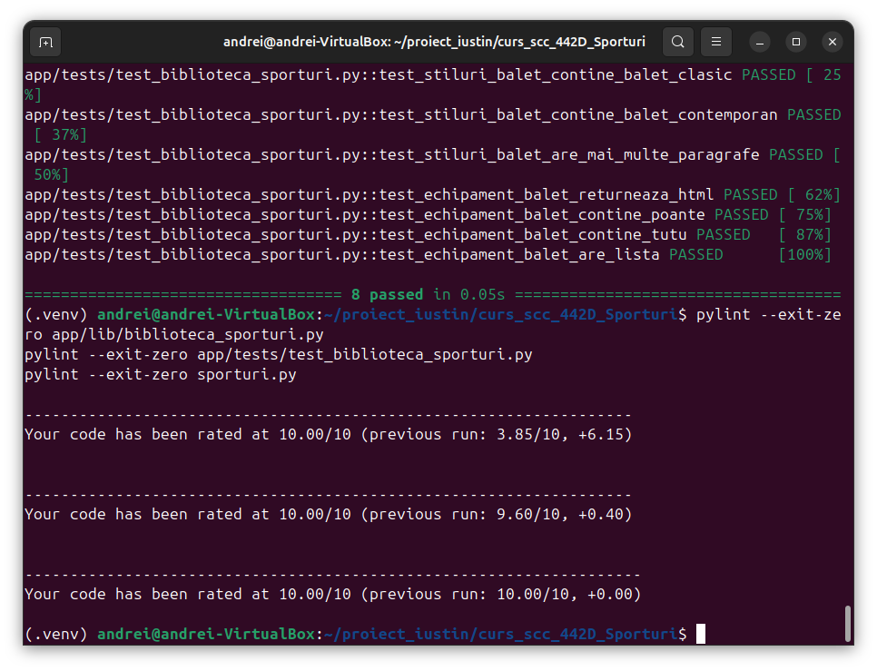

---

## Testare cu Docker

Pentru asigurarea portabilității aplicației, proiectul a fost containerizat folosind Docker.

Containerizarea permite rularea aplicației într-un mediu izolat, independent de configurația sistemului gazdă. Astfel, aplicația poate fi pornită în același mod pe mai multe sisteme, atât timp cât Docker este instalat.

### Construirea imaginii Docker

Imaginea Docker a fost construită folosind comanda:

```bash
docker build -t sporturi:v01 .
```

După rularea comenzii, imaginea `sporturi:v01` apare în lista locală de imagini Docker.

Verificarea imaginii se face cu:

```bash
docker images | grep sporturi
```

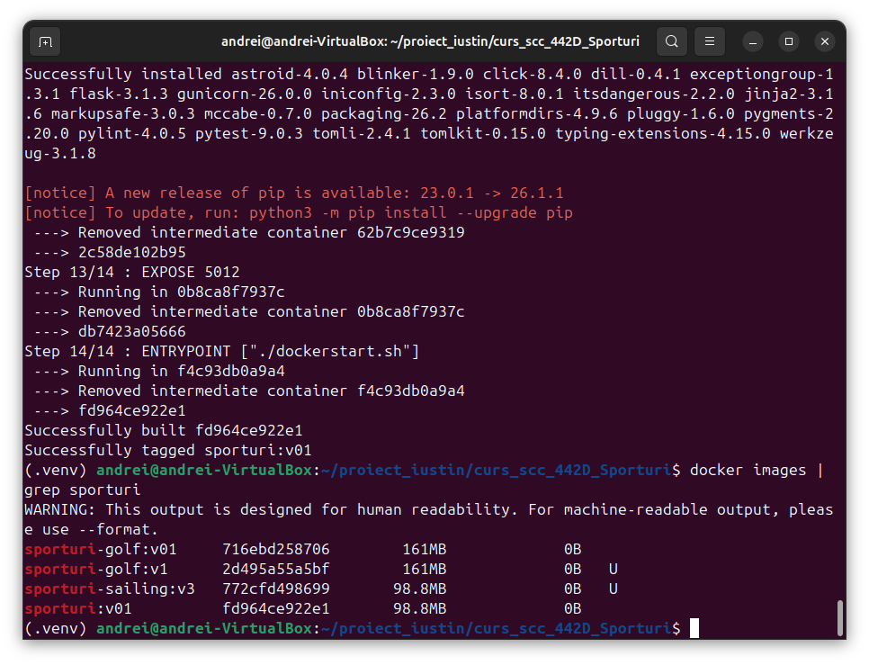

### Rularea containerului

Containerul a fost pornit folosind comanda:

```bash
docker run --name sporturi1 -p 8021:5012 sporturi:v01
```

Prin această comandă, portul `5012` din container este mapat pe portul `8021` al sistemului gazdă.

La pornirea containerului, în consolă sunt afișate mesajele de activare a mediului virtual și de pornire a serverului Flask.

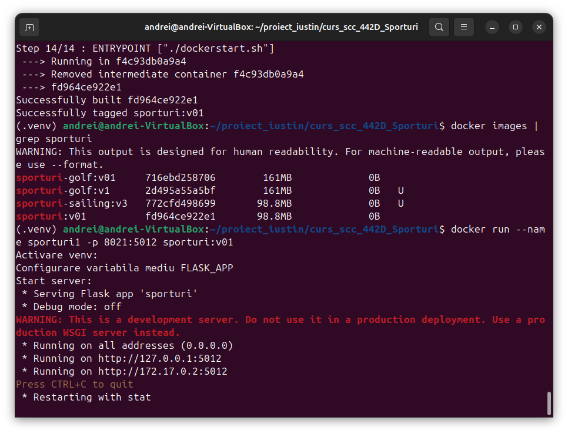

### Verificarea containerului activ

Containerul activ poate fi verificat cu:

```bash
docker ps
```

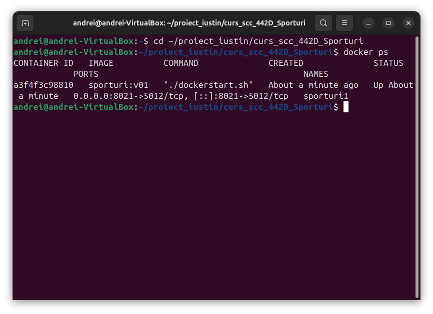

### Accesarea aplicației din container

Aplicația rulată în container se accesează în browser la adresa:

```bash
http://127.0.0.1:8021/sporturi
```

sau:

```bash
http://localhost:8021/sporturi
```

Capturile următoare prezintă aplicația rulată din containerul Docker.

### Pagina principală Sporturi - container

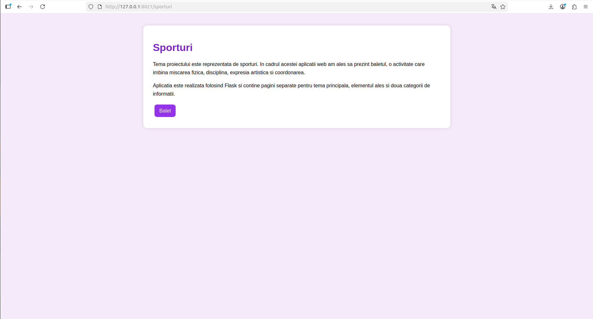

### Pagina Balet - container


### Pagina Stiluri Balet - container

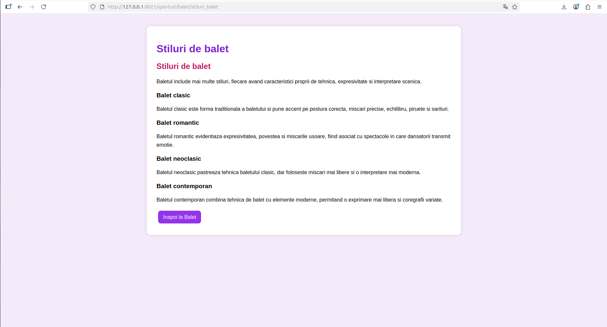

### Pagina Echipament Balet - container


### Oprirea containerului

După testare, containerul poate fi oprit cu:

```bash
CTRL + C
```

Dacă rămâne containerul creat, acesta poate fi șters cu:

```bash
docker rm -f sporturi1
```

---

## DevOps CI cu Jenkins

Pentru automatizarea procesului de build, testare și deploy a fost utilizat Jenkins.

Pipeline-ul este definit în fișierul:

```bash
Jenkinsfile
```

Acesta conține patru etape principale:

1. **Build**
2. **pylint - calitate cod**
3. **Unit Testing cu pytest**
4. **Deploy**

### 1. Build

În etapa de build, Jenkins:

- clonează repository-ul;
- intră în workspace;
- afișează fișierele proiectului;
- creează sau activează mediul virtual;
- instalează dependențele din `quickrequirements.txt`.

### 2. pylint - calitate cod

În această etapă, Jenkins rulează `pylint` pentru:

- biblioteca proiectului;
- fișierele de test;
- fișierul principal `sporturi.py`.

Comenzile sunt rulate cu `--exit-zero`, astfel încât eventualele avertismente să fie afișate, dar să nu oprească pipeline-ul.

### 3. Unit Testing cu pytest

În această etapă, Jenkins rulează testele automate cu `pytest`.

Testele validează funcțiile:

- `stiluri_balet()`;
- `echipament_balet()`.

După corectarea structurii proiectului și includerea folderului `app/lib` în repository, testele au rulat cu succes și etapa a fost finalizată corect.

### 4. Deploy

În etapa de deploy, Jenkins construiește imaginea Docker și creează containerul asociat build-ului.

Comenzile utilizate în pipeline sunt de forma:

```bash
docker build -t sporturi:v${BUILD_NUMBER} .
docker create --name sporturi${BUILD_NUMBER} -p 8021:5012 sporturi:v${BUILD_NUMBER}
```

Astfel, fiecare build Jenkins poate genera o imagine Docker nouă, versionată după numărul build-ului.

---

## Exemplu execuție pipeline Jenkins

Pipeline-ul Jenkins a fost rulat pentru branch-ul:

```bash
dev_borza_iustin
```

Jobul Jenkins folosit pentru proiect:

```bash
sporturi-balet-borza-iustin
```

După configurarea repository-ului și a branch-ului corect, pipeline-ul a fost executat cu succes.

Etapele afișate în Jenkins au fost:

- Checkout SCM;
- Build;
- pylint - calitate cod;
- Unit Testing cu pytest;
- Deploy.

Captura de mai jos prezintă execuția pipeline-ului în Jenkins:


Captura următoare prezintă log-ul de execuție din Console Output:

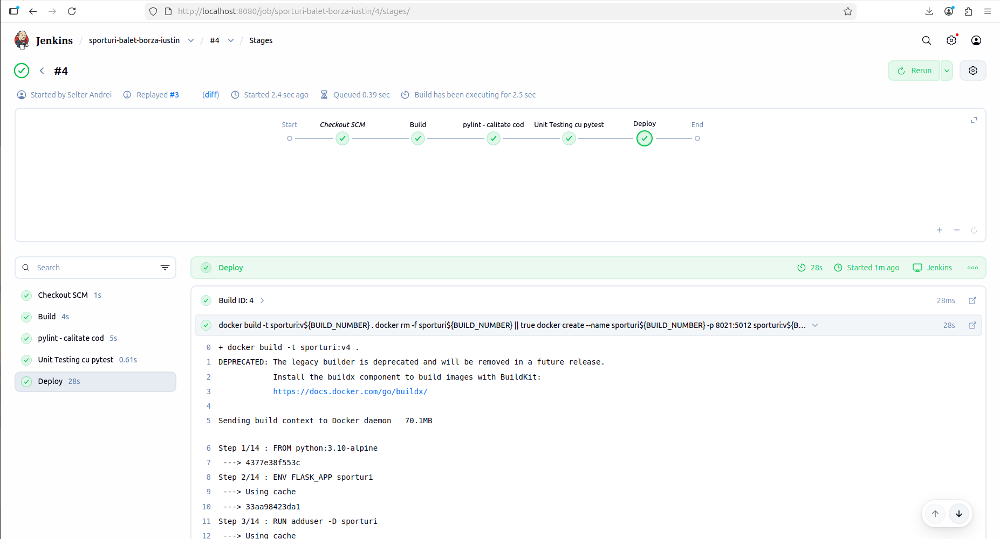

Dacă este disponibilă interfața Blue Ocean, execuția poate fi vizualizată și grafic:


---

## Probleme întâlnite și rezolvări

Pe parcursul realizării proiectului au apărut câteva probleme, care au fost analizate și rezolvate.

### 1. Jenkins nu găsea biblioteca proiectului

În timpul rulării etapei `Unit Testing cu pytest`, Jenkins a returnat eroarea:

```bash
ModuleNotFoundError: No module named 'app.lib'
```

Această eroare apărea deoarece folderul `app/lib` exista local, dar nu era inclus în repository. Folderul era ignorat de una dintre regulile existente în `.gitignore`.

Pentru rezolvare, fișierele necesare au fost adăugate forțat în Git:

```bash
git add -f app/lib/__init__.py app/lib/biblioteca_sporturi.py
git commit -m "fix: include biblioteca sporturi in repository"
git push
```

După această modificare, Jenkins a putut importa corect biblioteca, iar testele `pytest` au trecut cu succes.

### 2. Permisiuni Docker pentru Jenkins

Pentru ca Jenkins să poată rula comenzile Docker, utilizatorul `jenkins` trebuie să aibă drepturi pentru Docker.

Comanda utilizată:

```bash
sudo usermod -aG docker jenkins
sudo systemctl restart jenkins
```

După restartarea serviciului Jenkins, etapa de deploy a putut fi executată corect.

### 3. Container sau port deja existent

Dacă exista deja un container cu același nume sau portul era ocupat, containerul vechi putea fi șters cu:

```bash
docker rm -f sporturi1
```

sau, pentru containerele create de Jenkins:

```bash
docker ps -a
docker rm -f NUME_CONTAINER
```

### 4. Fișiere ignorate de Git

În timpul dezvoltării, fișierele din `app/lib` nu apăreau în repository, deși existau local. Verificarea s-a făcut cu:

```bash
git ls-files app
```

și:

```bash
find app -maxdepth 3 -type f
```

Soluția a fost folosirea comenzii `git add -f`, deoarece folderul era ignorat de `.gitignore`.

---

## Concluzii

Proiectul realizat îndeplinește cerințele principale pentru disciplina SCC, deoarece include o aplicație Flask funcțională, versionare cu GitHub, testare automată, containerizare Docker și automatizare CI/CD cu Jenkins.

Prin implementarea acestui proiect am urmărit nu doar realizarea unei aplicații web simple, ci și parcurgerea unui flux complet de dezvoltare software.

Principalele rezultate obținute sunt:

- **Aplicație web funcțională:** proiectul rulează local și afișează pagini dedicate temei Sporturi și elementului Balet.
- **Structură modulară:** logica pentru informațiile despre balet este separată în fișierul `app/lib/biblioteca_sporturi.py`.
- **Testare automată:** funcțiile implementate sunt verificate cu `pytest`.
- **Verificare calitate cod:** codul este analizat cu `pylint`.
- **Containerizare:** aplicația rulează cu succes într-un container Docker.
- **Automatizare CI/CD:** Jenkins rulează automat etapele de build, analiză, testare și deploy.
- **Documentare:** proiectul este documentat prin README și capturi de ecran.
- **Rezolvare probleme reale:** au fost identificate și rezolvate probleme legate de importuri, fișiere ignorate de Git și permisiuni Docker.

În concluzie, proiectul demonstrează utilizarea practică a unui flux complet de lucru pentru dezvoltarea, testarea, containerizarea și automatizarea unei aplicații web Python.

---

## Bibliografie

- Flask Documentation: https://flask.palletsprojects.com/
- Pytest Documentation: https://docs.pytest.org/
- Pylint Documentation: https://pylint.pycqa.org/
- Docker Documentation: https://docs.docker.com/
- Jenkins Documentation: https://www.jenkins.io/doc/
- Exemplu proiect de referință: https://github.com/crchende/sysinfo.git


---

# Box — Boțoc David Ștefan
[↑ Cuprins](#sporturi-integrate-în-readmemd)

# Proiect SCC - Sporturi

## Dezvoltator

- **Nume:** David Stefan Botoc
- **Grupa:** 442D
- **Element alocat:** Sport - Box

## Cuprins

- [Descriere generala](#descriere-generala)
- [Functionalitate implementata](#functionalitate-implementata)
- [Structura aplicatiei](#structura-aplicatiei)
- [Stadiu dezvoltare](#stadiu-dezvoltare)
- [Testare manuala in browser](#testare-manuala-in-browser)
- [Testare automata cu pytest](#testare-automata-cu-pytest)
- [Validare cod cu pylint](#validare-cod-cu-pylint)
- [Testare cu Docker](#testare-cu-docker)
- [Testare si integrare continua cu Jenkins](#testare-si-integrare-continua-cu-jenkins)
- [Concluzii](#concluzii)
- [Bibliografie](#bibliografie)

## Descriere generala

Acest proiect reprezinta o aplicatie web dezvoltata in Python cu framework-ul
Flask. Tema grupei este **Sporturi**, iar sportul ales pentru implementare este
**boxul**.

Aplicatia prezinta boxul intr-o forma clara si usor de parcurs: pagina temei,
pagina sportului ales, o pagina dedicata echipamentului necesar si o pagina
dedicata competitiilor disponibile. Interfata are un stil vizual unitar pe toate
paginile, cu navigare prin meniul principal din partea de sus.

Proiectul acopera un flux complet de dezvoltare software:

- implementare aplicatie web cu Flask;
- separarea continutului in module Python;
- testare automata cu `pytest`;
- validare statica folosind `pylint`;
- containerizare cu Docker;
- automatizare CI prin Jenkins;
- versionare cu Git si GitHub.

## Functionalitate implementata

In acest branch a fost implementata tema **Sporturi - Box**.

### Rute Flask

Aplicatia expune urmatoarele rute:

| Ruta | Descriere |
| --- | --- |
| `/` | Redirectioneaza catre pagina principala `/sporturi`. |
| `/sporturi` | Prezinta tema grupei si sportul ales: boxul. |
| `/sporturi/box` | Ofera o descriere generala a boxului. |
| `/sporturi/box/echipament` | Prezinta echipamentul folosit in box, cu descriere si rol pentru fiecare element. |
| `/sporturi/box/competitii` | Prezinta o lista de competitii disponibile pentru boxeri amatori si profesionisti. |

### Functii principale

Fisierul `app/lib/biblioteca_sporturi.py` contine continutul generat pentru
paginile detaliate:

- `echipament_box()` - construieste sectiunea HTML pentru echipamentul de box:
  manusi, bandaje, protectie dentara, casca, incaltaminte si accesorii de
  antrenament.
- `competitii_box()` - construieste sectiunea HTML pentru competitiile de box:
  Jocurile Olimpice, campionate mondiale, campionate europene, campionate
  nationale, turnee locale si gale profesioniste.

Fisierul `sporturi.py` contine aplicatia Flask, stilul comun al paginilor si
rutele proiectului.

## Structura aplicatiei

```text
.
├── app
│   ├── lib
│   │   ├── __init__.py
│   │   └── biblioteca_sporturi.py
│   └── tests
│       ├── __init__.py
│       └── test_biblioteca_sporturi.py
├── doc
│   ├── blue_ocean.png
│   ├── docker_console.png
│   ├── docker_image.png
│   ├── docker_ps.png
│   └── jenkins.png
├── Dockerfile
├── Jenkinsfile
├── quickrequirements.txt
├── pytest.ini
├── sporturi.py
└── README.md
```

## Stadiu dezvoltare

- Functionalitatea principala este implementata.
- Cele patru pagini cerute sunt disponibile si au design consistent.
- Functiile vechi generice au fost inlocuite cu functii relevante pentru tema:
  `echipament_box()` si `competitii_box()`.
- Testele automate sunt actualizate pentru noua structura.
- Dockerfile si Jenkinsfile sunt configurate pentru build, testare si deploy.
- Codul este validat cu `pytest` si `pylint`.

## Testare manuala in browser

Pentru rulare locala:

```bash
git clone https://github.com/vlad-barbu18/curs_scc_442D_Sporturi.git
cd curs_scc_442D_Sporturi
git checkout dev_botoc_david
. ./activeaza_venv
./ruleaza_aplicatia
```

Aplicatia se acceseaza la:

```text
http://127.0.0.1:5012/sporturi
```

Pagini disponibile pentru verificare manuala:

- `http://127.0.0.1:5012/sporturi`
- `http://127.0.0.1:5012/sporturi/box`
- `http://127.0.0.1:5012/sporturi/box/echipament`
- `http://127.0.0.1:5012/sporturi/box/competitii`

## Testare automata cu pytest

Testele verifica faptul ca functiile din biblioteca genereaza continut HTML si
ca includ informatii relevante despre box.

Rulare:

```bash
pytest
```

Fisier de test:

```text
app/tests/test_biblioteca_sporturi.py
```

## Validare cod cu pylint

Analiza statica se poate rula cu:

```bash
pylint --exit-zero app/lib/*.py
pylint --exit-zero app/tests/*.py
pylint --exit-zero sporturi.py
```

In pipeline-ul Jenkins, `pylint` este rulat cu `--exit-zero`, deci mesajele de
stil sunt raportate, dar nu blocheaza automat build-ul.

## Testare cu Docker

Build imagine:

```bash
docker build -t sporturi:v01 .
```

Creare si rulare container:

```bash
docker run --name sporturi1 -p 8021:5012 sporturi:v01
```

Aplicatia din container se acceseaza la:

```text
http://localhost:8021/sporturi
```

Capturi Docker disponibile:

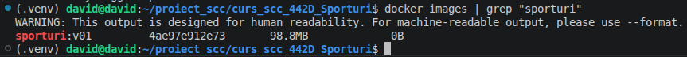

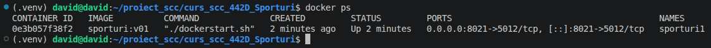

## Testare si integrare continua cu Jenkins

Pipeline-ul declarativ este definit in `Jenkinsfile` si automatizeaza fluxul de
validare al proiectului. Jenkins ruleaza atat verificari de
calitate si teste automate, cat si pasii de build si deploy cu Docker.

Pipeline-ul contine patru etape:

1. **Build** - creeaza mediul virtual si instaleaza dependentele din
   `quickrequirements.txt`.
2. **pylint - calitate cod** - ruleaza analiza statica pentru biblioteca,
   teste si fisierul principal `sporturi.py`.
3. **Unit Testing cu pytest** - ruleaza testele automate.
4. **Deploy** - construieste imaginea Docker si creeaza containerul pentru
   aplicatie.

Imaginea Docker generata de Jenkins foloseste numele:

```text
sporturi:v${BUILD_NUMBER}
```

Containerul este creat cu portul aplicatiei expus astfel:

```text
8021:5012
```

Capturi Jenkins si Blue Ocean disponibile:

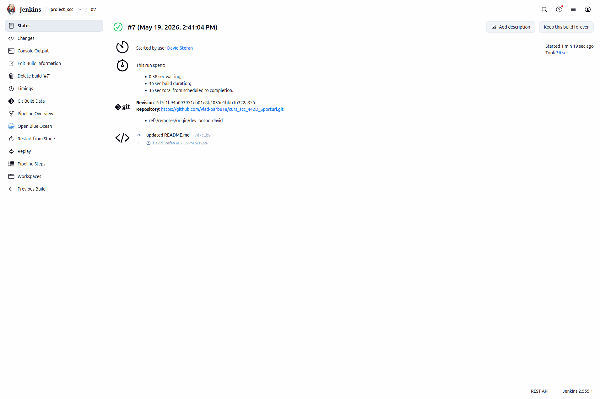
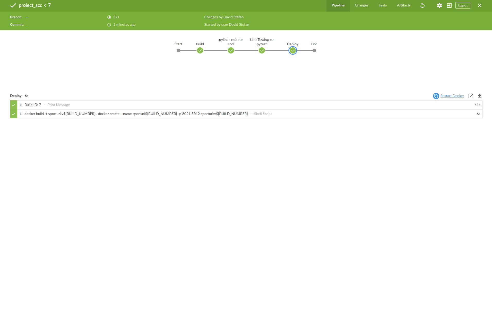

## Concluzii

Proiectul demonstreaza dezvoltarea unei aplicatii Flask simple, dar complete,
pentru tema **Sporturi - Box**. Aplicatia are continut structurat, rute clare,
interfata unitara si integrare cu instrumente folosite intr-un flux DevOps:
GitHub, Jenkins, Docker, `pytest` si `pylint`.

Prin separarea continutului in `app/lib/biblioteca_sporturi.py`, codul devine
mai usor de intretinut si extins. Testele automate confirma functionarea
functiilor principale, iar pipeline-ul Jenkins automatizeaza validarea si
pregatirea aplicatiei pentru rulare containerizata.

## Bibliografie

- Flask: https://flask.palletsprojects.com/
- pytest: https://docs.pytest.org/
- pylint: https://pylint.readthedocs.io/
- Docker: https://docs.docker.com/
- Jenkins: https://www.jenkins.io/doc/
- GitHub repository model: https://github.com/crchende/sysinfo.git


---

# Șah — Bulău Andrei Cristian
[↑ Cuprins](#sporturi-integrate-în-readmemd)

# Proiect SCC - Sporturi

## Dezvoltator

- **Nume:** Bulau Andrei Cristian
- **Grupa:** 442D
- **Element alocat:** Sport - Sah
- **Branch:** `dev_bulau_andrei`

## Cuprins

- [Descriere generala](#descriere-generala)
- [Functionalitate implementata](#functionalitate-implementata)
- [Structura proiectului](#structura-proiectului)
- [Tabel rute](#tabel-rute)
- [Stadiu dezvoltare](#stadiu-dezvoltare)
- [Testare manuala in browser](#testare-manuala-in-browser)
- [Testare automata cu pytest](#testare-automata-cu-pytest)
- [Validare cod cu pylint](#validare-cod-cu-pylint)
- [Testare cu Docker](#testare-cu-docker)
- [DevOps CI](#devops-ci)
- [Concluzii](#concluzii)
- [Bibliografie](#bibliografie)

## Descriere generala

Obiectivul proiectului a fost realizarea unei aplicatii web folosind framework-ul Flask si parcurgerea unui flux complet de dezvoltare software. Proiectul include versionare cu GitHub, testare automata cu `pytest`, analiza statica folosind `pylint`, containerizare cu Docker si automatizare CI/CD prin Jenkins.

Tema proiectului este **Sporturi**, iar elementul ales este **sahul**. Aplicatia prezinta sahul ca sport al strategiei, include o pagina dedicata regulilor de baza si o pagina pentru competitii importante.

## Functionalitate implementata

In acest branch au fost adaugate si personalizate urmatoarele componente:

- Fisierul `app/lib/biblioteca_sporturi.py`, care contine functiile:
  - `genereaza_regulament_sah()` - genereaza sectiunea HTML cu reguli de baza pentru sah.
  - `genereaza_competitii_sah()` - genereaza sectiunea HTML cu competitii importante de sah.
- Fisierul principal `sporturi.py`, care defineste aplicatia Flask, stilul paginilor, meniul de navigatie si rutele web.
- Fisierele de test:
  - `app/tests/test_biblioteca_sporturi.py` - teste pentru functiile din biblioteca.
  - `app/tests/test_rute_sporturi.py` - teste pentru rutele principale ale aplicatiei.
- Fisierele DevOps:
  - `Dockerfile` - imagine Docker pentru rularea aplicatiei.
  - `Jenkinsfile` - pipeline declarativ cu build, pylint, teste si deploy.

## Structura proiectului

| Fisier / director | Rol |
| --- | --- |
| `sporturi.py` | Aplicatia Flask principala si definirea rutelor. |
| `app/lib/biblioteca_sporturi.py` | Continut modular HTML pentru regulament si competitii. |
| `app/tests/test_biblioteca_sporturi.py` | Teste unitare pentru functiile din biblioteca. |
| `app/tests/test_rute_sporturi.py` | Teste pentru raspunsurile rutelor Flask. |
| `Dockerfile` | Configurarea imaginii Docker. |
| `dockerstart.sh` | Scriptul de pornire folosit in container. |
| `Jenkinsfile` | Pipeline CI/CD declarativ. |
| `doc/` | Capturi de ecran pentru Docker si Jenkins. |

## Tabel rute

| Ruta | Functie Flask | Descriere | Rezultat asteptat |
| --- | --- | --- | --- |
| `/` | `index()` | Redirect catre pagina principala a temei. | Redirect la `/sporturi`. |
| `/sporturi` | `sporturi()` | Pagina principala pentru tema Sporturi. | Afiseaza prezentarea sahului ca sport. |
| `/sporturi/sah` | `sah()` | Pagina elementului ales. | Afiseaza informatii generale despre sah. |
| `/sporturi/sah/regulament` | `regulament()` | Pagina pentru prima functionalitate. | Afiseaza reguli de baza pentru sah. |
| `/sporturi/sah/competitii` | `competitii()` | Pagina pentru a doua functionalitate. | Afiseaza competitii importante de sah. |

## Stadiu dezvoltare

- Functionalitate complet implementata pentru tema **Sporturi - Sah**.
- Cod adaugat in branch-ul `dev_bulau_andrei`.
- Rutele Flask sunt functionale si acopera pagina temei, pagina elementului ales si cele doua pagini de continut.
- Testele automate pentru biblioteca si rute sunt incluse in proiect.
- Dockerfile si Jenkinsfile sunt pregatite pentru testare si rulare automatizata.

## Testare manuala in browser

Pentru rulare locala:

```bash
git clone https://github.com/vlad-barbu18/curs_scc_442D_Sporturi.git
cd curs_scc_442D_Sporturi
git checkout dev_bulau_andrei
. ./activeaza_venv
./ruleaza_aplicatia
```

Aplicatia se acceseaza la:

```text
http://127.0.0.1:5012/sporturi
```

Rute verificate manual:

| Pagina | URL local |
| --- | --- |
| Pagina tema | `http://127.0.0.1:5012/sporturi` |
| Pagina element | `http://127.0.0.1:5012/sporturi/sah` |
| Pagina regulament | `http://127.0.0.1:5012/sporturi/sah/regulament` |
| Pagina competitii | `http://127.0.0.1:5012/sporturi/sah/competitii` |

Capturile pentru paginile aplicatiei pot fi salvate in `doc/` cu urmatoarele nume:

| Pagina | Fisier recomandat |
| --- | --- |
| Pagina tema | `doc/paginaTemaLocal.png` |
| Pagina element | `doc/paginaElementLocal.png` |
| Pagina regulament | `doc/paginaFunctie1Local.png` |
| Pagina competitii | `doc/paginaFunctie2Local.png` |

## Testare automata cu pytest

Testele automate verifica atat continutul generat de biblioteca, cat si disponibilitatea rutelor principale.

```bash
pytest
```

Teste incluse:

| Fisier test | Ce valideaza |
| --- | --- |
| `app/tests/test_biblioteca_sporturi.py` | HTML-ul generat pentru regulament si competitii. |
| `app/tests/test_rute_sporturi.py` | Status `200 OK` pentru rutele principale si continutul specific sahului. |

## Validare cod cu pylint

Analiza statica se poate rula pentru modulele principale ale proiectului:

```bash
pylint --exit-zero app/lib/biblioteca_sporturi.py
pylint --exit-zero app/tests/test_biblioteca_sporturi.py
pylint --exit-zero app/tests/test_rute_sporturi.py
pylint --exit-zero sporturi.py
```

In pipeline-ul Jenkins, `pylint` este configurat in mod warning-only prin `--exit-zero`, astfel incat raportarea problemelor de stil sa nu opreasca automat build-ul.

## Testare cu Docker

Construirea imaginii Docker:

```bash
docker build -t sporturi:v01 .
```

Rularea containerului:

```bash
docker run --name sporturi1 -p 8021:5012 sporturi:v01
```

Aplicatia din container se acceseaza la:

```text
http://localhost:8021/sporturi
```

Capturi Docker:

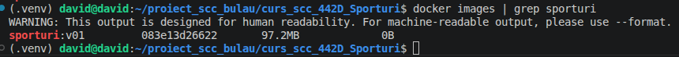

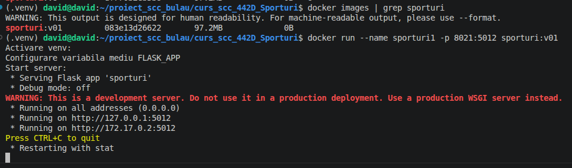


## DevOps CI

Pipeline-ul declarativ este definit in `Jenkinsfile` si contine 4 stage-uri:

| Stage | Rol |
| --- | --- |
| `Build` | Creeaza/activeaza mediul virtual si pregateste dependintele. |
| `pylint - calitate cod` | Ruleaza analiza statica pentru biblioteca, teste si aplicatia Flask. |
| `Unit Testing cu pytest` | Ruleaza testele automate cu `pytest`. |
| `Deploy` | Construieste imaginea Docker si creeaza containerul pentru build-ul curent. |

Capturi Jenkins:

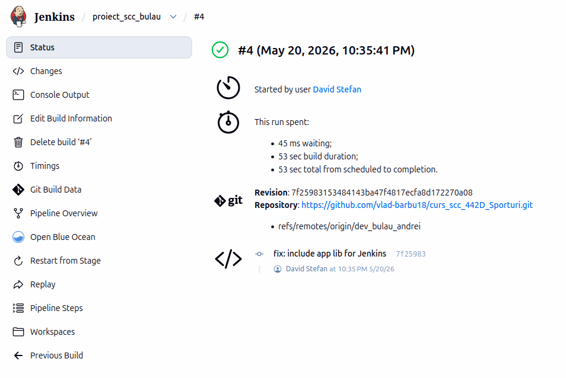

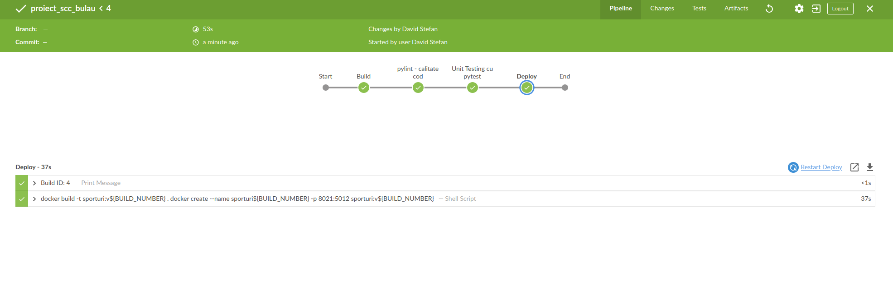

## Concluzii

- **Dezvoltare modulara:** continutul reutilizabil este separat in `app/lib/biblioteca_sporturi.py`.
- **Aplicatie Flask functionala:** rutele principale acopera tema, elementul ales si cele doua functionalitati cerute.
- **Testare automata:** `pytest` valideaza biblioteca si rutele aplicatiei.
- **Portabilitate:** Docker permite rularea aplicatiei intr-un mediu consistent.
- **Automatizare:** Jenkins ruleaza build, analiza statica, teste si deploy containerizat.

## Bibliografie

- https://github.com/crchende/sysinfo.git
- https://github.com/vlad-barbu18/curs_scc_442D_Sporturi.git


---

# Baschet — Dima Tiberiu
[↑ Cuprins](#sporturi-integrate-în-readmemd)

# Proiect SCC - Sporturi

## Dezvoltator

- **Nume:** Dima Tiberiu
- **Grupa:** 442D
- **Tema proiectului:** Sporturi
- **Element ales:** Baschet
- **Branch de dezvoltare:** `dev_dima_tiberiu`

---

## Cuprins

- [Descriere generală](#descriere-generală)
- [Funcționalitate implementată](#funcționalitate-implementată)
- [Structura proiectului](#structura-proiectului)
- [Tehnologii utilizate](#tehnologii-utilizate)
- [Rutele aplicației](#rutele-aplicației)
- [Rulare locală](#rulare-locală)
- [Testare automată cu pytest](#testare-automată-cu-pytest)
- [Validare cod cu pylint](#validare-cod-cu-pylint)
- [Rulare cu Docker](#rulare-cu-docker)
- [Integrare continuă cu Jenkins](#integrare-continuă-cu-jenkins)
- [Capturi de ecran](#capturi-de-ecran)
- [Concluzii](#concluzii)
- [Bibliografie](#bibliografie)

---

## Descriere generală

Acest proiect reprezintă o aplicație web realizată în **Python**, folosind framework-ul **Flask**, pentru tema generală **Sporturi**. Elementul ales în cadrul proiectului este **baschetul**.

Aplicația are rolul de a prezenta informații despre baschet, fiind structurată în mai multe pagini. Sunt incluse informații generale despre sportul ales, competiții importante de baschet și echipamente utilizate în cadrul acestui sport.

Proiectul urmărește parcurgerea unui flux complet de dezvoltare software, incluzând:

- dezvoltarea unei aplicații web;
- organizarea codului în module;
- utilizarea rutelor Flask;
- testarea automată cu `pytest`;
- analiza statică folosind `pylint`;
- containerizarea aplicației cu Docker;
- automatizarea procesului de build și testare cu Jenkins;
- versionarea codului folosind Git și GitHub.

---

## Funcționalitate implementată

În cadrul proiectului au fost implementate următoarele funcționalități:

- aplicație web realizată cu Flask;
- pagină principală pentru tema `sporturi`;
- pagină dedicată elementului ales, `baschet`;
- pagină pentru competiții importante de baschet;
- pagină pentru echipamente folosite în baschet;
- afișarea imaginilor în paginile aplicației;
- bibliotecă Python separată pentru cele două funcții cerute;
- teste automate pentru funcțiile implementate;
- fișier `Dockerfile` pentru containerizarea aplicației;
- fișier `Jenkinsfile` pentru integrare continuă;
- rulare locală și rulare în container Docker.

---

## Structura proiectului

```text
curs_scc_442D_Sporturi/
│
├── app/
│   ├── __init__.py
│   │
│   ├── lib/
│   │   ├── __init__.py
│   │   └── biblioteca_sporturi.py
│   │
│   ├── static/
│   │   └── pictures/
│   │       ├── nba.jpeg
│   │       ├── poza1.jpeg
│   │       └── poza2.jpeg
│   │
│   └── tests/
│       ├── __init__.py
│       └── test_biblioteca_sporturi.py
│
├── doc/
│   ├── blue_ocean.png
│   ├── docker_images.png
│   ├── docker_ps.png
│   ├── docker_run.png
│   ├── pg1.png
│   ├── pg1_container.png
│   ├── pg2.png
│   ├── pg3.png
│   ├── pg4.png
│   └── pylint.png
│
├── sporturi.py
├── activeaza_venv
├── ruleaza_aplicatia
├── dockerstart.sh
├── Dockerfile
├── Jenkinsfile
├── pytest.ini
├── quickrequirements.txt
├── requirements.txt
├── README.md
└── .gitignore
```

---

## Tehnologii utilizate

### Python

Python este limbajul de programare folosit pentru dezvoltarea aplicației.

### Flask

Flask este framework-ul web utilizat pentru definirea rutelor aplicației și pentru afișarea paginilor HTML.

### HTML și CSS

HTML este folosit pentru structura paginilor, iar CSS este folosit pentru stilizarea interfeței web.

### pytest

`pytest` este folosit pentru testarea automată a funcțiilor din biblioteca proiectului.

### pylint

`pylint` este folosit pentru analiza statică a codului Python și pentru verificarea calității acestuia.

### Docker

Docker este utilizat pentru containerizarea aplicației, astfel încât aceasta să poată fi rulată într-un mediu izolat și reproductibil.

### Jenkins

Jenkins este utilizat pentru automatizarea procesului de build, testare și deploy.

### Git și GitHub

Git este folosit pentru versionarea codului, iar GitHub pentru încărcarea proiectului și gestionarea branch-urilor.

---

## Rutele aplicației

Aplicația conține următoarele rute:

| Rută | Descriere |
|---|---|
| `/` | Redirect către pagina principală |
| `/sporturi` | Pagina principală a temei |
| `/sporturi/baschet` | Pagina elementului ales |
| `/sporturi/baschet/functie_1_sport` | Pagina cu informații despre competiții |
| `/sporturi/baschet/functie_2_sport` | Pagina cu informații despre echipamente |

---

## Rulare locală

Pentru rularea aplicației local, se clonează repository-ul și se selectează branch-ul de dezvoltare:

```bash
git clone <url-repository>
cd curs_scc_442D_Sporturi
git checkout dev_dima_tiberiu
```

Se activează mediul virtual:

```bash
. ./activeaza_venv
```

Se pornește aplicația:

```bash
. ./ruleaza_aplicatia
```

Aplicația rulează local la adresa:

```text
http://127.0.0.1:5030/sporturi
```

---

## Testare automată cu pytest

Testele automate se află în folderul:

```text
app/tests/
```

Fișierul de testare este:

```text
app/tests/test_biblioteca_sporturi.py
```

Rularea testelor se face cu:

```bash
pytest
```

Testele verifică dacă funcțiile din biblioteca proiectului returnează conținut HTML valid și dacă includ informațiile specifice despre baschet.

---

## Validare cod cu pylint

Pentru verificarea calității codului se folosește `pylint`.

Comenzile folosite sunt:

```bash
pylint --exit-zero app/lib/*.py
pylint --exit-zero app/tests/*.py
pylint --exit-zero sporturi.py
```

În urma rulării comenzilor, fișierele de test și fișierul principal `sporturi.py` au obținut scorul `10.00/10`, iar biblioteca `biblioteca_sporturi.py` a fost verificată cu avertismente minore legate de lungimea unor linii.

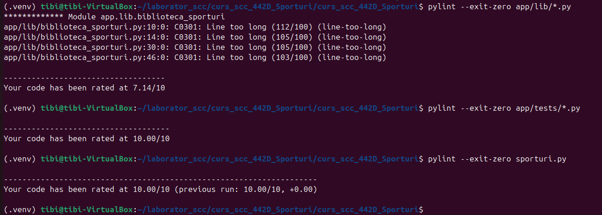

Opțiunea `--exit-zero` permite afișarea avertismentelor fără oprirea pipeline-ului Jenkins.

---

## Rulare cu Docker

Pentru construirea imaginii Docker se folosește comanda:

```bash
docker build -t sporturi:v01 .
```

Pentru verificarea imaginilor Docker existente:

```bash
docker images
```

Pentru rularea aplicației în container:

```bash
docker run --name sporturi1 -p 8030:5030 sporturi:v01
```

Aplicația rulată în container poate fi accesată în browser la adresa:

```text
http://localhost:8030/sporturi
```

Pentru verificarea containerelor active:

```bash
docker ps
```

Pentru oprirea și ștergerea containerului:

```bash
docker stop sporturi1
docker rm sporturi1
```

---

## Integrare continuă cu Jenkins

Pipeline-ul Jenkins este definit în fișierul:

```text
Jenkinsfile
```

Pipeline-ul conține următoarele etape:

1. **Build**
   - afișează folderul curent;
   - listează fișierele din proiect;
   - activează mediul virtual;
   - instalează dependențele.

2. **pylint - calitate cod**
   - rulează analiza statică pentru fișierele Python;
   - verifică fișierele din `app/lib`, `app/tests` și `sporturi.py`.

3. **Unit Testing cu pytest**
   - rulează testele automate ale proiectului.

4. **Deploy**
   - construiește imaginea Docker;
   - creează containerul Docker pentru aplicație.

Configurarea pipeline-ului în Jenkins se face folosind:

- repository-ul GitHub al proiectului;
- branch-ul `dev_dima_tiberiu`;
- fișierul `Jenkinsfile`.

---

## Capturi de ecran

### Pipeline Jenkins - Blue Ocean

Mai jos este prezentată rularea pipeline-ului în interfața Blue Ocean. Se observă faptul că toate etapele au fost finalizate cu succes.

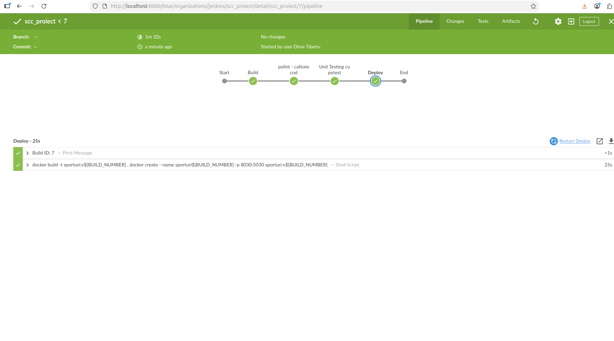

---

### Imagine Docker creată

După rularea comenzii `docker images`, imaginea `sporturi:v01` este disponibilă local.

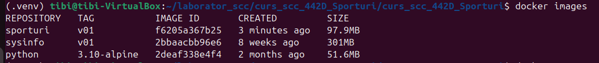

---

### Container Docker activ

Containerul `sporturi1` rulează și expune aplicația pe portul `8030`.


---

### Consola Docker

În consolă se observă pornirea aplicației Flask în container și accesarea rutelor aplicației.

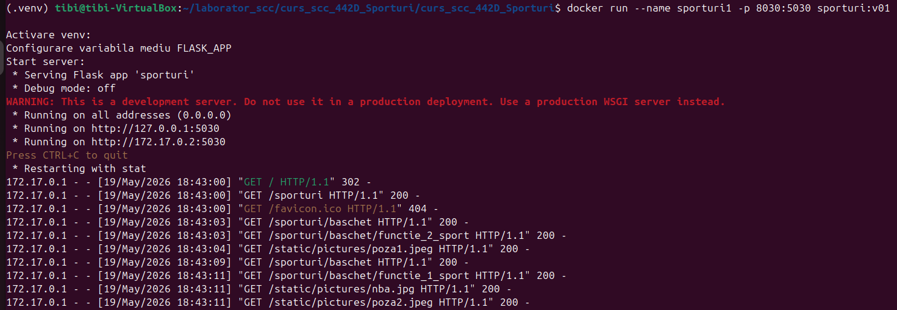

---

### Aplicația rulată local - pagina principală

Pagina principală a aplicației prezintă tema proiectului și elementul ales.


---

### Aplicația rulată în container - pagina principală

Pagina principală este accesibilă și din container, prin portul `8030`.


---

### Pagina elementului ales - Baschet

Această pagină prezintă elementul ales și oferă acces către cele două categorii implementate: competiții și echipamente.

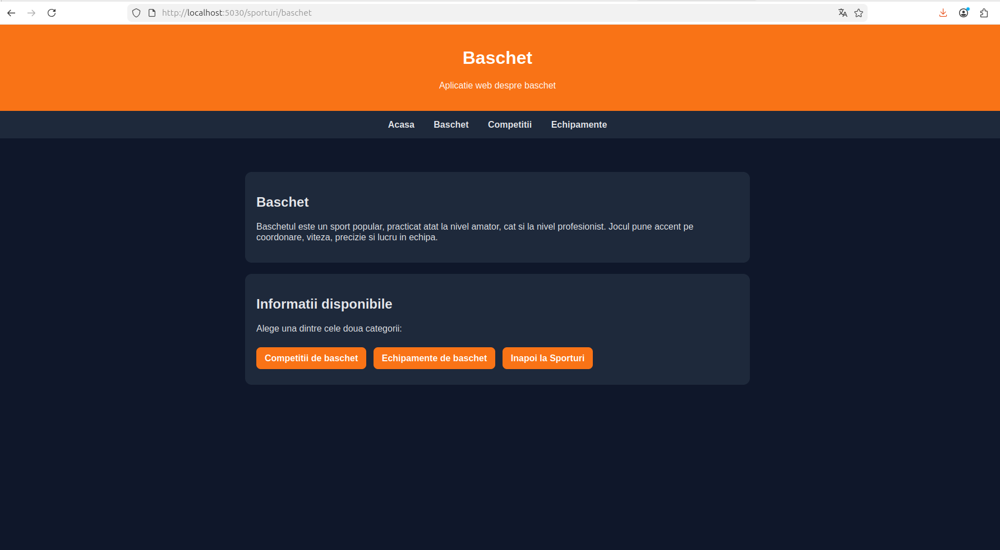

---

### Pagina competițiilor de baschet

Această pagină prezintă competiții importante de baschet, precum NBA, EuroLeague, Campionatul Mondial FIBA și Jocurile Olimpice.


---

### Pagina echipamentelor de baschet

Această pagină prezintă echipamente utilizate în baschet, precum mingea de baschet, coșul, echipamentul sportiv, pantofii de baschet și tabela de scor.


---

## Concluzii

În cadrul acestui proiect a fost realizată o aplicație web simplă și funcțională pentru tema **Sporturi**, având ca element ales **baschetul**.

Proiectul demonstrează utilizarea framework-ului Flask pentru dezvoltarea unei aplicații web, organizarea codului în module, definirea rutelor, integrarea imaginilor statice și testarea automată a funcțiilor implementate.

De asemenea, proiectul include rularea aplicației în container Docker și automatizarea procesului de build, testare și deploy folosind Jenkins.

Aplicația poate fi extinsă ulterior prin adăugarea mai multor sporturi, mai multor pagini, unei interfețe mai complexe și unor funcționalități suplimentare.

---

## Bibliografie

- Flask Documentation: https://flask.palletsprojects.com/
- pytest Documentation: https://docs.pytest.org/
- pylint Documentation: https://pylint.pycqa.org/
- Docker Documentation: https://docs.docker.com/
- Jenkins Documentation: https://www.jenkins.io/doc/
- GitHub Docs: https://docs.github.com/


---

# Tenis de masă — Dinu Christian
[↑ Cuprins](#sporturi-integrate-în-readmemd)

# Proiect SCC - Sporturi

## Dezvoltator
- **Nume:** Dinu Christian
- **Grupa:** 442D
- **Element alocat:** Tenis de masa (ping-pong)

## Cuprins
- [Descriere generala](#descriere-generala)
- [Functionalitate implementata](#functionalitate-implementata)
- [Stadiu dezvoltare](#stadiu-dezvoltare)
- [Testare manuala in browser (rulare locala)](#testare-manuala-in-browser-rulare-locala)
- [Testare automata cu pytest](#testare-automata-cu-pytest)
- [Validare cod cu pylint](#validare-cod-cu-pylint)
- [Testare cu Docker](#testare-cu-docker)
- [DevOps CI](#devops-ci)
- [Pull Requests review](#pull-requests-review)
- [Concluzii](#concluzii)
- [Bibliografie](#bibliografie)

## Descriere generala

Obiectivul proiectului a fost realizarea unei aplicatii web folosind framework-ul Flask, parcurgerea unui proces complet de dezvoltare software in care folosim Jenkins, Docker, Python, GitHub pentru versionare, containerizare, programare si automatizare.

## Functionalitate implementata

In acest branch am adaugat si personalizat:

- Fisierul `app/lib/biblioteca_sporturi.py` cu cele doua functii cerute:
  - `reguli_tenis_de_masa()` - returneaza HTML cu regulile de baza ale tenisului de masa (dimensiuni masa, plasa, minge, punctaj, serviciu, meci).
  - `campioni_tenis_de_masa()` - returneaza HTML cu campioni mondiali celebri (Ma Long, Jan-Ove Waldner, Zhang Jike, Timo Boll, Deng Yaping).

- Fisierul principal `sporturi.py` cu cele patru rute conform cerintei:
  - `/sporturi` - pagina principala a temei.
  - `/sporturi/tenis_de_masa` - pagina elementului ales.
  - `/sporturi/tenis_de_masa/reguli_tenis_de_masa` - regulile tenisului de masa.
  - `/sporturi/tenis_de_masa/campioni_tenis_de_masa` - campionii la tenis de masa.

- Fisierul `app/tests/test_biblioteca_sporturi.py` cu 8 teste automate.

## Stadiu dezvoltare

- Functionalitate complet implementata.
- Cod adaugat in branch-ul `dev_dinu_christian`.
- Dockerfile si Jenkinsfile sunt functionale.
- Testare locala, automata si containerizata realizata cu succes.

## Testare manuala in browser (rulare locala)

```bash
git clone <url-repo>
cd <folder-repo>
git checkout dev_dinu_christian
. ./activeaza_venv
./ruleaza_aplicatia
```

Aplicatia se acceseaza la: `http://127.0.0.1:5012/sporturi`

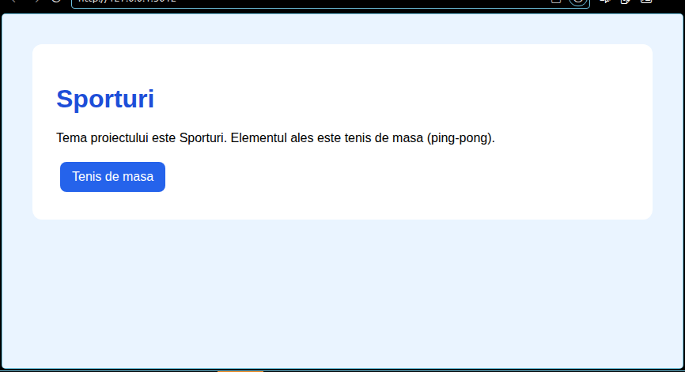
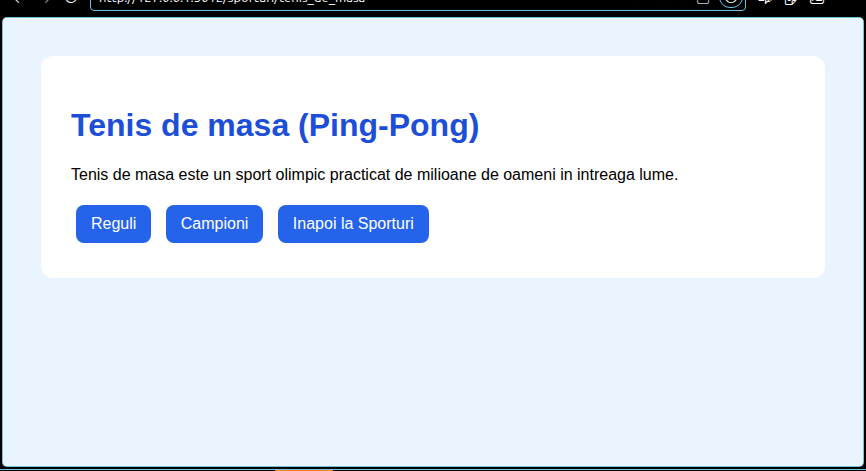


## Testare automata cu `pytest`

```bash
pytest
```

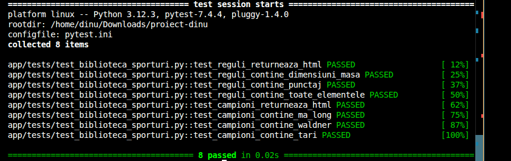

## Validare cod cu `pylint`

```bash
pylint --exit-zero app/lib/biblioteca_sporturi.py
pylint --exit-zero app/tests/test_biblioteca_sporturi.py
pylint --exit-zero sporturi.py
```

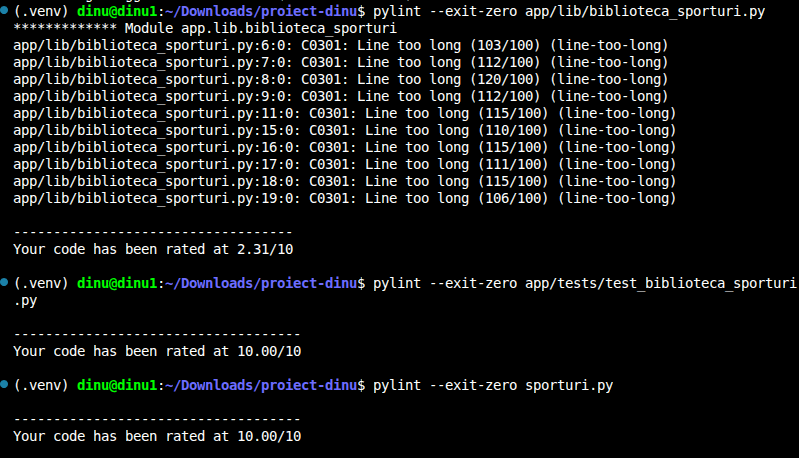

## Testare cu Docker

```bash
docker build -t sporturi:v01 .
docker run --name sporturi1 -p 8021:5012 sporturi:v01
```

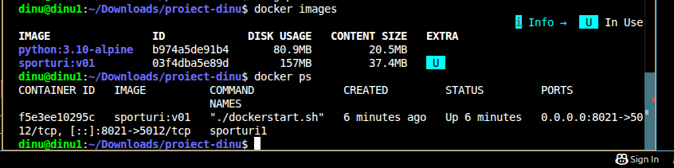
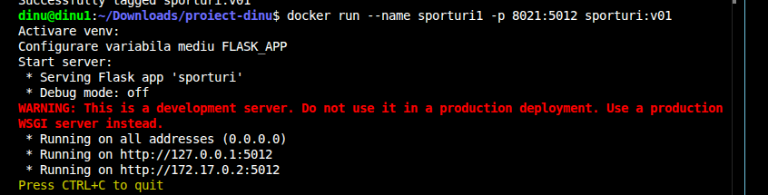

Aplicatia din container, accesata la `http://localhost:8021/sporturi`:


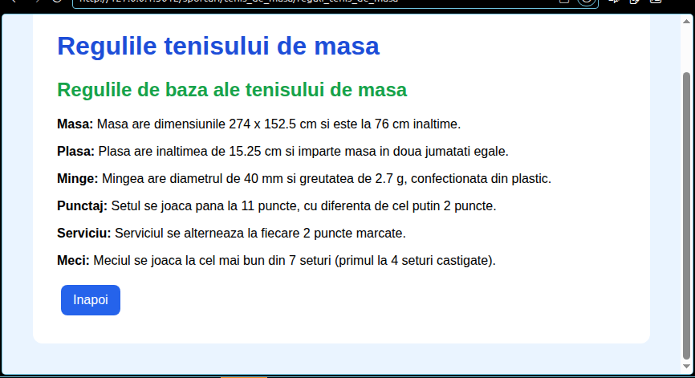


## DevOps CI

Pipeline declarativ definit in `Jenkinsfile`, cu 4 stages:
1. **Build** - creare venv si instalare dependente
2. **pylint** - analiza statica a codului (warning-only, `--exit-zero`)
3. **Unit Tests** - rulare teste cu pytest
4. **Deploy** - build imagine Docker si creare container

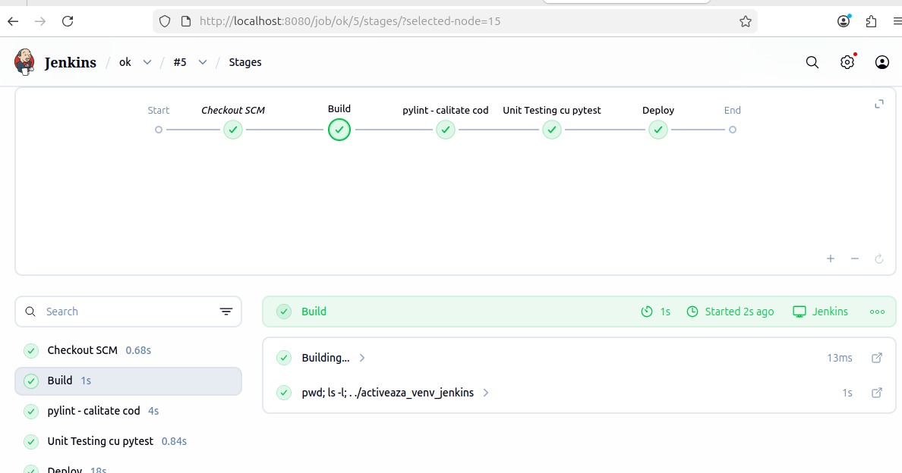
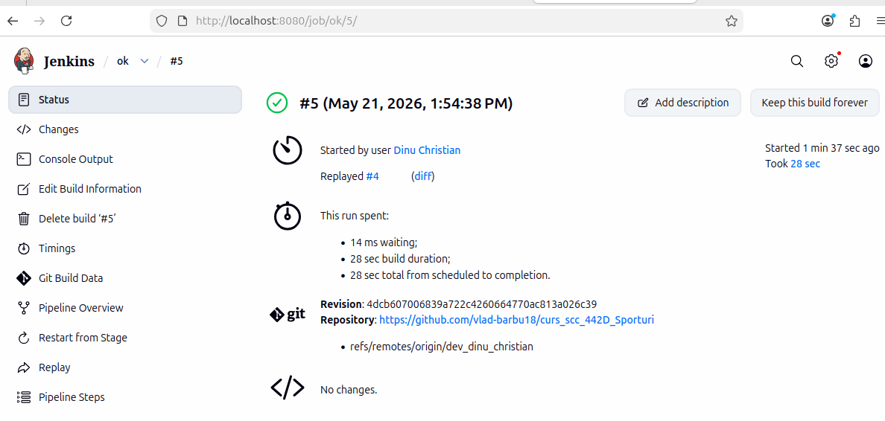

## Pull Requests review

| ID PR | Branch | Descriere | Actiune |
|-------|--------|-----------|---------|
| -     | -      | -         | -       |

*(Se completeaza dupa realizarea review-urilor)*

## Concluzii

- **Dezvoltare modulara:** aplicatie Flask cu separarea datelor si logicii in fisiere dedicate.
- **Portabilitate:** Docker asigura rulare consistenta indiferent de mediu.
- **Automatizare:** Jenkins automatizeaza testarea si deploy-ul la fiecare push.
- **Asigurarea calitatii:** pytest si pylint integrate in pipeline CI/CD.

## Bibliografie

https://github.com/crchende/sysinfo.git


---

# Polo pe apă — Dumitrașcu Alexandru
[↑ Cuprins](#sporturi-integrate-în-readmemd)

# Proiect SCC - Sporturi

## Student
- **Nume:** Dumitrascu Alexandru
- **Grupa:** 442D
- **Element alocat:** Polo pe apa
- **Branch dezvoltare:** `dev_dumitrascu_alexandru`
- **Branch personal main:** `main_dumitrascu_alexandru`

## Cuprins
- [Descriere generală](#descriere-generală)
- [Funcționalitate implementată](#funcționalitate-implementată)
- [Stadiu dezvoltare](#stadiu-dezvoltare)
- [Structura proiectului](#structura-proiectului)
- [Testare manuală în browser (rulare locală)](#testare-manuală-în-browser-rulare-locală)
- [Testare automată cu pytest](#testare-automată-cu-pytest)
- [Validare cod cu pylint](#validare-cod-cu-pylint)
- [Testare cu Docker](#testare-cu-docker)
- [DevOps CI](#devops-ci)
- [Concluzii](#concluzii)
- [Bibliografie](#bibliografie)

## Descriere generală

Acest proiect se concentrează pe dezvoltarea și livrarea automatizată a unei aplicații web dedicate poloului pe apă. Construită pe baza micro-framework-ului Flask (Python), platforma oferă vizitatorilor date esențiale despre regulile acestui sport de echipă și detaliază echipamentul specific necesar jucătorilor.

Dincolo de componenta de programare web, proiectul are rolul de a pune în practică o serie de metodologii moderne din sfera DevOps. Acest lucru este demonstrat prin decuplarea logicii în module independente, validarea funcționalităților prin teste unitare (`pytest`) și asigurarea unui standard ridicat de scriere prin analiză statică (`pylint`). De asemenea, portabilitatea este garantată prin încapsularea aplicației într-un container Docker, în timp ce Jenkins orchestrează și automatizează întregul flux de la testare la lansare, printr-un pipeline CI/CD configurat declarativ.

## Funcționalitate implementată

În acest branch am adăugat și personalizat aplicația pentru tema „Sporturi”, având ca subtemă polo pe apa.

- Fișierul `app/lib/biblioteca_sporturi.py` contine cele două funcții principale cerute:
  - `reguli_polo()` – returnează informații generale despre regulamentul jocului de polo.
  - `echipament_polo()` –  returnează informații despre echipamentul utilizat de jucători.

- Fișierul principal `sporturi.py` implementeaza cele patru rute conform cerinței:
  - `/sporturi` – pagina principală a temei, cu introducere generală despre sporturi și polo.
  - `/sporturi/polo` – pagina dedicată sportului ales.
  - `/sporturi/polo/reguli_polo` – afișează informațiile despre regulament.
  - `/sporturi/polo/echipament_polo` – afișează informațiile despre echipament.

- Interfața aplicației a fost personalizată folosind HTML și CSS, având o structură simplă și ușor de navigat.

- Fișierul `app/tests/test_biblioteca_sporturi.py` conține testele automate realizate cu pytest pentru verificarea funcțiilor implementate.

- Pentru partea DevOps au fost adăugate:
  - `Dockerfile` pentru containerizarea aplicației,
  - `dockerstart.sh` pentru pornirea automată a aplicației în container,
  - `Jenkinsfile` pentru automatizarea etapelor de build, testare și deploy.

## Stadiu dezvoltare


Funcționalitatea aplicației a fost implementată complet.
- Codul sursă a fost dezvoltat și organizat în branch-ul `dev_dumitrascu_alexandru`.
- Rutele Flask și funcțiile bibliotecii Python sunt funcționale și testate.
- Testarea automată cu pytest a fost realizată cu succes.
- Validarea codului folosind pylint a fost integrată în pipeline-ul Jenkins.
- Aplicația a fost containerizată utilizând Docker.
- Pipeline-ul Jenkins pentru build, testare și deploy funcționează corect.
- Capturile de ecran și documentația README au fost adăugate în proiect.
- Testarea locală, automată și containerizată a fost realizată cu succes.

## Structura proiectului 

Structura principală a codului dezvoltat este următoarea:

```text
curs_scc_442D_Sporturi/
│
├── app/
│   ├── __init__.py
│   ├── lib/
│   │   ├── __init__.py
│   │   └── biblioteca_sporturi.py
│   └── tests/
│       ├── __init__.py
│       └── test_biblioteca_sporturi.py
├── doc/
│   ├── dockerconsola.png
│   ├── dockerimages.png
│   ├── dockerps.png
│   ├── jenkinsBlueOcean.png
│   ├── jenkinsConsoleOutput.png
│   ├── jenkinsSimplu.png
│   ├── paginaEchipamentPoloLocal.png
│   ├── paginaElementContainer.png
│   ├── paginaFunctie1Container.png
│   ├── paginaFunctie2Container.png
│   ├── paginaPoloLocal.png
│   ├── paginaReguliPoloLocal.png
│   ├── paginaSporturiLocal.png
│   ├── paginaTemaContainer.png
│   ├── pylint.png
│   ├── pytest.png
├── activeaza_venv
├── activeaza_venv_jenkins
├── dockerstart.sh
├── Dockerfile
├── Jenkinsfile
├── quickrequirements.txt
├── ruleaza_aplicatia
├── sporturi.py
└── README.md
```
  
## Testare manuală în browser (rulare locală)

```bash
git clone https://github.com/vlad-barbu18/curs_scc_442D_Sporturi.git
cd curs_scc_442D_Sporturi
git checkout dev_dumitrascu_alexandru
. ./activeaza_venv
./ruleaza_aplicatia
```

Aplicația se accesează la: `http://127.0.0.1:5012/sporturi`


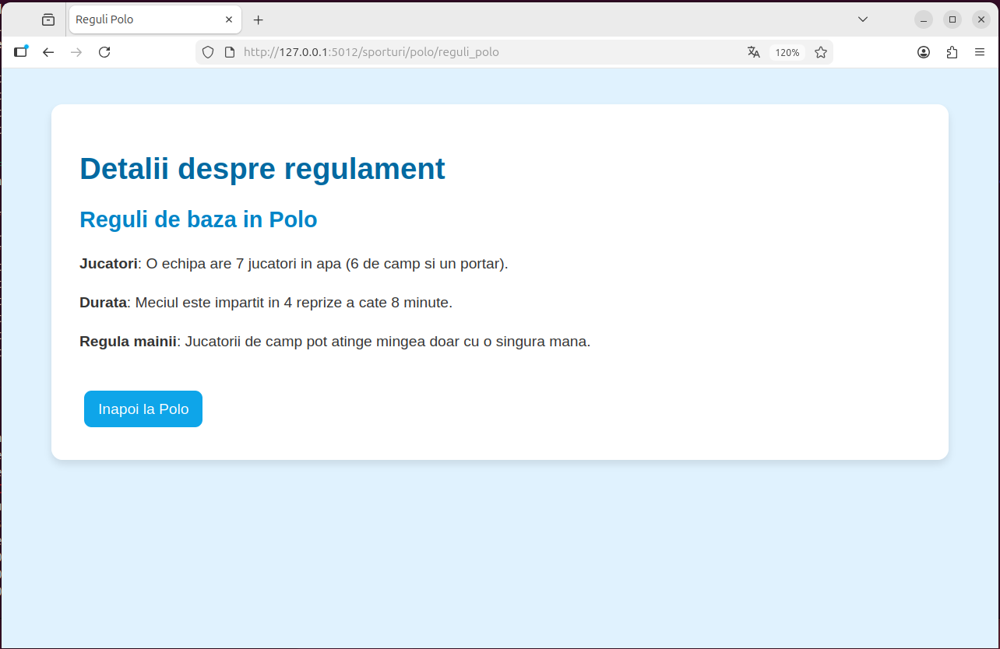


## Testare automată cu `pytest`

```bash
pytest
```
Pentru a ne asigura de corectitudinea funcționalităților înainte de integrarea pe server, am dezvoltat teste unitare folosind `pytest`. 
Aceste teste validează automat faptul că funcțiile de backend (`reguli_polo()` și `echipament_polo()`) returnează cod HTML valid, nu sunt goale și conțin markerii textuali specifici acestui sport (elemente cheie din regulament și echipament).

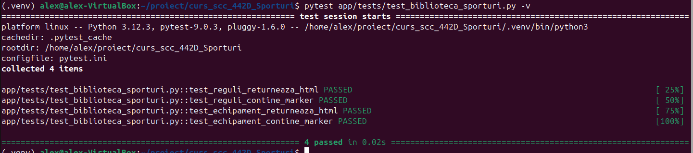

## Validare cod cu `pylint`

```bash
pylint --exit-zero app/lib/biblioteca_sporturi.py
pylint --exit-zero app/tests/test_biblioteca_sporturi.py
pylint --exit-zero sporturi.py
```
Analiza statică a codului a fost realizată cu `pylint` pentru a menține un standard ridicat de programare în Python, verificând formatarea, importurile neutilizate și existența docstring-urilor. 

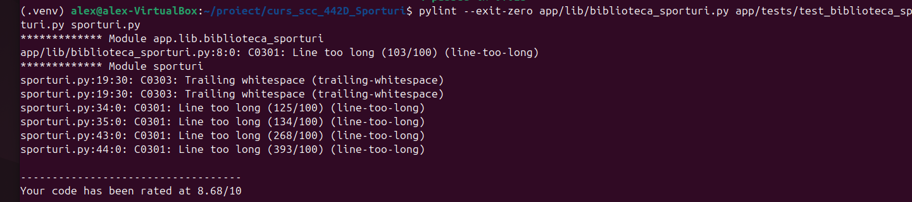

## Testare cu Docker

```bash
docker build -t sporturi:v01 .
docker run --name sporturi1 -p 8021:5012 sporturi:v01
```
Pentru a garanta portabilitatea aplicației pe orice sistem de operare, fără a fi necesară instalarea manuală a dependențelor locale din `quickrequirements.txt`, am containerizat aplicația folosind Docker, asigurând un mediu complet izolat.

- Construirea imaginii: s-a făcut folosind comanda `docker build -t sporturi:v01 .`, creând pachetul de bază al aplicației.
- Rularea containerului: s-a realizat cu `docker run --name sporturi1 -p 8021:5012 sporturi:v01`. Prin această comandă, portul intern `5012` expus de serverul Flask în container a fost mapat pe portul `8021` al mașinii gazdă.
- Managementul containerelor: Pentru un mediu de dezvoltare curat și pentru a evita eroarea `Port already in use` la testări succesive, am utilizat comenzile de curățare `docker stop sporturi1` și `docker rm sporturi1`.

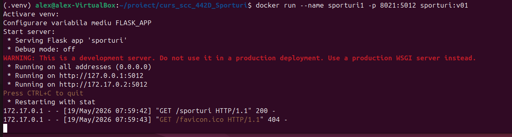
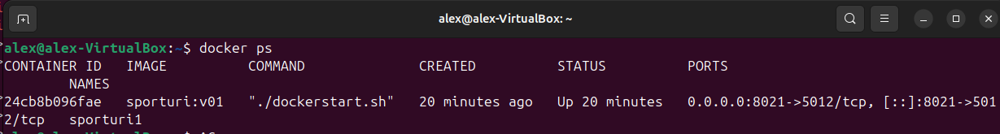

Aplicația din container, accesată la `http://localhost:8021/sporturi`:

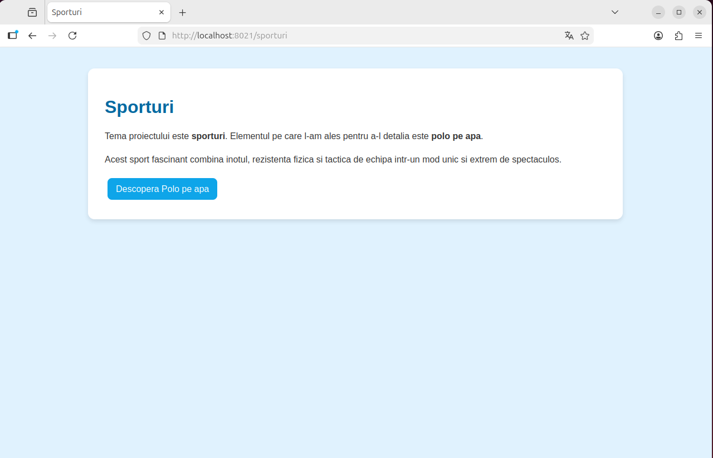
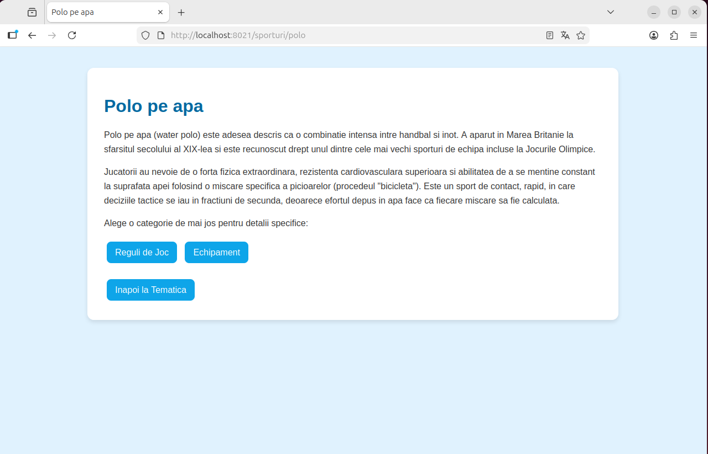
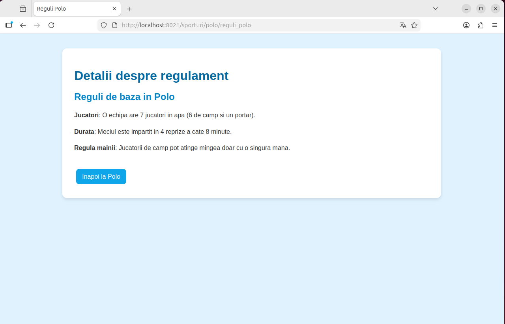
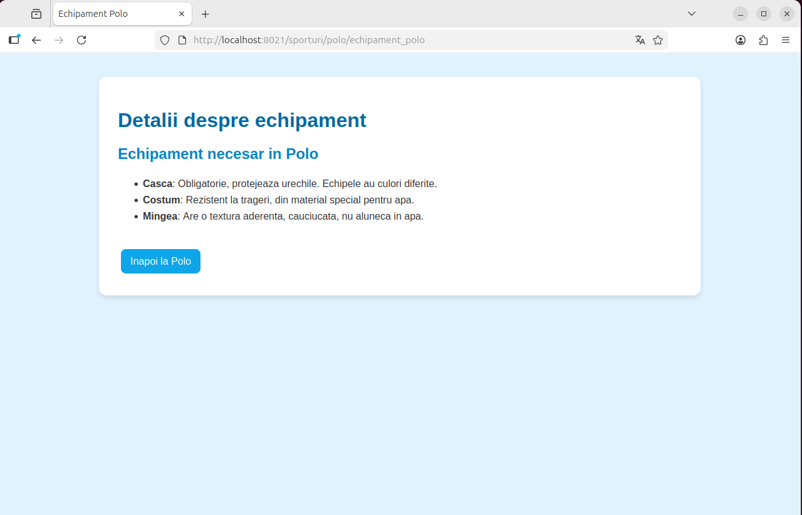

# DevOps CI
Pentru a asigura o integrare și livrare continuă, procesul a fost automatizat complet printr-un pipeline declarativ definit în fișierul `Jenkinsfile`, structurat în 4 etape fundamentale:

* **1. Etapa de Build (Construire mediu):** Jenkins preia codul sursă, instanțiază mediul virtual Python izolat și instalează toate dependențele necesare din fișierul `quickrequirements.txt`.
* **2. Etapa de Analiză a calității (Pylint):** Se rulează linter-ul static pe fișierele sursă pentru a asigura respectarea standardelor de programare. Comenzile utilizează flag-ul `--exit-zero` pentru a afișa avertismentele de stil în consolă, fără a întrerupe prematur execuția pipeline-ului.
* **3. Etapa de Testare Automată (Unit Testing):** Se execută suita de teste folosind framework-ul `pytest` pentru a valida automat corectitudinea funcțiilor dedicate sportului polo pe apă.
* **4. Etapa de Deploy (Lansare):** În faza finală, Jenkins construiește noua imagine Docker și creează instantaneu containerul asociat noului build, pregătind aplicația pentru rulare.
 
## Pipeline Jenkins clasic
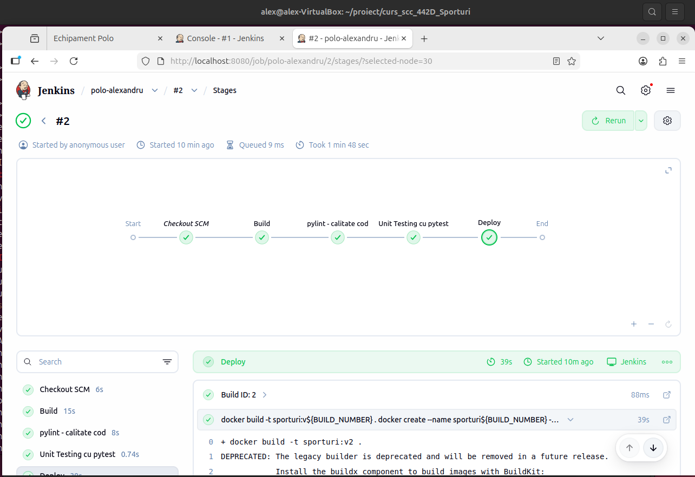

## Pipeline Console Output


## Pipeline Blue Ocean
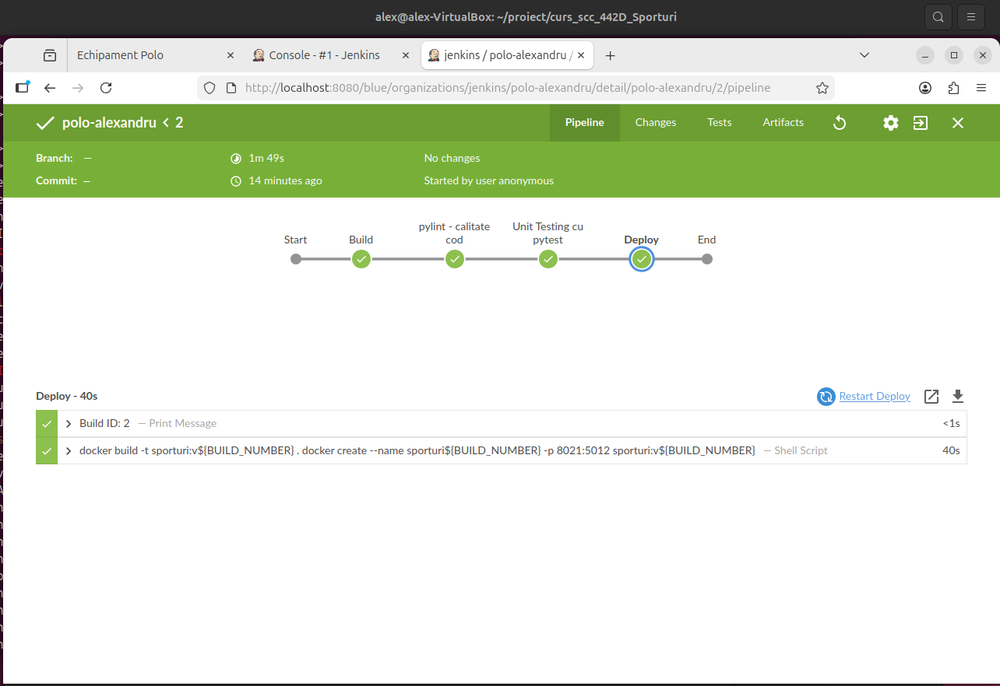

## Concluzii

Proiectul realizat demonstrează dezvoltarea cu succes a unei aplicații web folosind framework-ul Flask împreună cu tehnologii moderne utilizate în zona DevOps.

Principalele rezultate obținute sunt:
- **Proiectare web și modularitate:** Dezvoltarea rutelor Flask și a interfeței aplicației a fost realizată cu o separare clară între logica de rutare și datele specifice (regulamentul și echipamentul de polo), stocate într-o bibliotecă Python independentă (`biblioteca_sporturi.py`).
- **Filtre de calitate și testare:** Pentru asigurarea robusteții funcțiilor, codul a fost supus unor verificări stricte. Validarea automată a rezultatelor HTML s-a realizat prin intermediul `pytest`, iar pentru menținerea unui standard curat de programare a fost integrat utilitarul `pylint`.
* **Încapsulare și portabilitate:** Dependențele mediului local au fost izolate prin construirea unei imagini Docker, garantând astfel o rulare consistentă și independentă a aplicației în propriul container.
- **Orchestrarea proceselor (CI/CD):** Instrumentele menționate anterior au fost integrate și automatizate cu succes prin intermediul Jenkins. Definirea unui pipeline declarativ a demonstrat capacitatea de a executa complet autonom procesele de preluare a codului, testare și lansare în execuție (Deploy).
- **Depanare și infrastructură:** Pe parcursul integrării tehnologiilor au fost identificate și soluționate erori reale de sistem, incluzând conflicte de porturi pe rețea, alocarea permisiunilor de execuție în Docker și remedieri de formatare în mediul Linux.

În urma implementării, aplicația a funcționat corect atât local, cât și în containerul Docker, iar pipeline-ul Jenkins a executat cu succes toate etapele configurate.

## Bibliografie

https://github.com/crchende/sysinfo.git


---

# Echitație — Gulap Andra
[↑ Cuprins](#sporturi-integrate-în-readmemd)

# Proiect SCC - Sporturi - Echitatie

## Andra Gulap - grupa 442D

---

# Cuprins

1. [Scopul proiectului](#scopul-proiectului)
2. [Date generale](#date-generale)
3. [Structura proiectului](#structura-proiectului)
4. [Functionalitati implementate](#functionalitati-implementate)
5. [Descrierea fisierelor](#descrierea-fisierelor)
6. [Descrierea functiilor implementate](#descrierea-functiilor-implementate)
7. [Descrierea rutelor implementate](#descrierea-rutelor-implementate)
8. [Testare locala](#testare-locala)
9. [Rezultatele testarii](#rezultatele-testarii)
10. [Integrare Git si GitHub](#integrare-git-si-github)
11. [Jenkins](#jenkins)
12. [Containerizare Docker](#containerizare-docker)
13. [Screenshots](#screenshots)
14. [Ce urmeaza a fi implementat](#ce-urmeaza-a-fi-implementat)

---

# Scopul proiectului

Acest proiect a fost realizat in cadrul disciplinei Servicii Cloud si Containerizare.

Tema aleasa este Sporturi, iar sportul implementat este Echitatia.

Aplicatia a fost dezvoltata folosind Flask si include:

- dezvoltare intr-o masina virtuala Linux
- versionare Git si GitHub
- rulare teste automate cu pytest
- verificare statica a codului cu pylint
- integrare Jenkins
- containerizare Docker

---

# Date generale

- Student: Andra Gulap
- Grupa: 442D
- Tema proiectului: Sporturi
- Sport ales: Echitatie
- Repository: curs_scc_442D_Sporturi
- Branch dezvoltare: dev_gulap_andra
- Branch principal: main_gulap_andra
- Aplicatie principala: sporturi.py
- Biblioteca: app/lib/biblioteca_sporturi.py

---

# Structura proiectului


---

# Functionalitati implementate

Aplicatia Flask contine mai multe pagini dedicate echitatiei.

Functionalitatile implementate:

- pagina principala pentru tema Sporturi
- pagina de prezentare a echitatiei
- pagina despre disciplinele din echitatie
- pagina despre echipamentele folosite in echitatie
- navigare intre pagini prin butoane Home
- afisare imagini statice
- stilizare HTML si CSS

---

# Descrierea fisierelor

## 1. sporturi.py

Fisierul principal al aplicatiei Flask.

Contine:

- initializarea aplicatiei Flask
- definirea rutelor
- redirect catre pagina principala
- rularea serverului pe portul 5000

---

## 2. app/lib/biblioteca_sporturi.py

Biblioteca aplicatiei.

Contine:

- functia pentru generarea structurii HTML comune
- functia pentru disciplinele din echitatie
- functia pentru echipamentele din echitatie

---

## 3. app/test/test_echitatie.py

Contine testele automate realizate cu pytest.

Testele verifica:

- existenta continutului HTML
- prezenta unor cuvinte cheie
- functionarea corecta a functiilor din biblioteca

---

## 4. Dockerfile

Defineste imaginea Docker folosita pentru containerizarea aplicatiei.

---

## 5. Jenkinsfile

Defineste pipeline-ul Jenkins pentru:

- Build
- pylint
- pytest
- Deploy

---

## 6. pytest.ini

Fisier pentru configurarea pytest.

---

# Descrierea functiilor implementate

## pagina_html()

Genereaza structura HTML comuna pentru toate paginile aplicatiei.

Include:

- stilizare CSS
- container principal
- buton de navigare Home

---

## discipline_echitatie()

Afiseaza informatii despre principalele discipline ecvestre:

- sarituri peste obstacole
- dresaj
- curse de cai
- polo

---

## echipamente_echitatie()

Afiseaza informatii despre echipamentele folosite in echitatie:

- saua
- pad-ul
- ham-ul
- etrierele
- casca


---

# Descrierea rutelor implementate

## Ruta /

Realizeaza redirect catre pagina principala: /sporturi (nu afiseaza pagina proprie).

---

## Ruta /sporturi

Pagina principala a aplicatiei.

Contine link-uri catre:

- pagina despre echitatie
- discipline
- echipamente

---

## Ruta /sporturi/echitatie

Afiseaza informatii generale despre echitatie.

---

## Ruta /sporturi/echitatie/discipline

Afiseaza disciplinele din echitatie.

---

## Ruta /sporturi/echitatie/echipamente

Afiseaza echipamentele folosite in echitatie.

---

# Testare locala

## Activarea mediului virtual

```bash
source .venv/bin/activate
```

---

## Rulare teste

```bash
pytest
```

---

## Verificare pylint

```bash
pylint sporturi.py app/lib/biblioteca_sporturi.py app/test/test_echitatie.py
```

---

## Rulare aplicatie

```bash
python3 sporturi.py
```

---

# Rutele verificate in browser


http://127.0.0.1:5000/sporturi


---

http://127.0.0.1:5000/sporturi/echitatie


---

http://127.0.0.1:5000/sporturi/echitatie/discipline

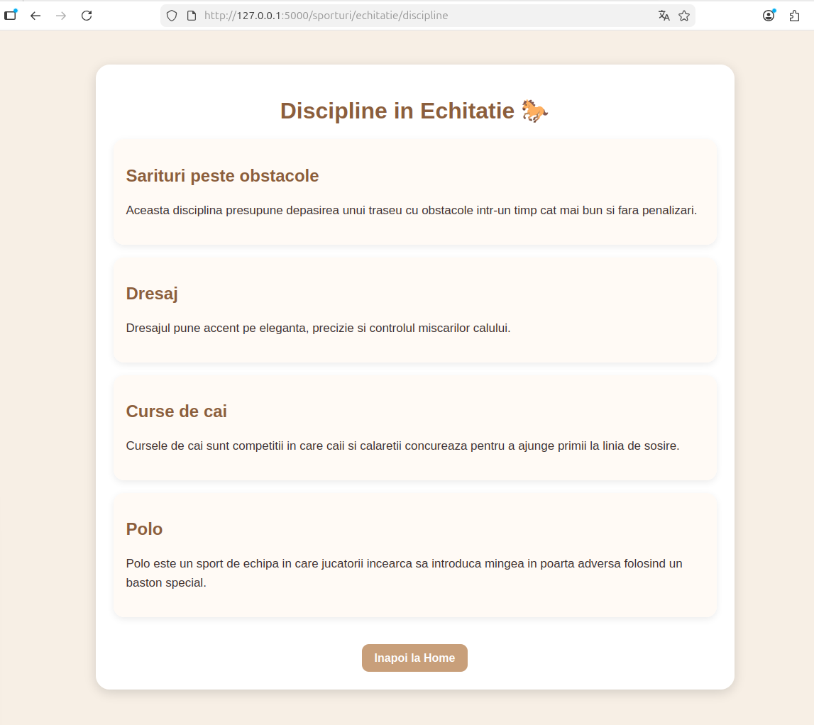

---

http://127.0.0.1:5000/sporturi/echitatie/echipamente


---

# Rezultatele testarii

## Testare automata

- pytest: toate testele au trecut cu succes
- pylint: cod verificat pentru calitate si stil

---

## Testare manuala

Toate paginile au fost accesate in browser si au functionat corect.

---

# Integrare Git si GitHub

Pasi realizati:

- clonarea repository-ului de grupa
- creare branch personal de dezvoltare
- implementarea aplicatiei in masina virtuala Linux
- commit si push pe GitHub
- sincronizare cu branch-ul personal

---

# Jenkins

Pipeline-ul Jenkins executa automat:

1. Build
2. Instalare dependinte
3. pylint
4. pytest
5. Deploy

Pipeline-ul a fost configurat folosind Jenkinsfile.

---

# Containerizare Docker

Aplicatia a fost containerizata folosind Docker.

Etape realizate:

- creare Dockerfile
- creare dockerstart.sh
- build imagine Docker
- pornire container
- verificare accesare aplicatie din browser

---

## Comenzi utilizate

```bash
docker build -t sporturi:v01 .
```

```bash
docker run --name sporturi1 -p 8021:5000 sporturi:v01
```

```bash
docker ps
```

```bash
docker stop sporturi1
```

```bash
docker rm sporturi1
```

---

# Screenshots

## Docker

### Imagine Docker


---

### Container pornit

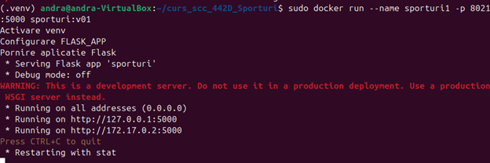

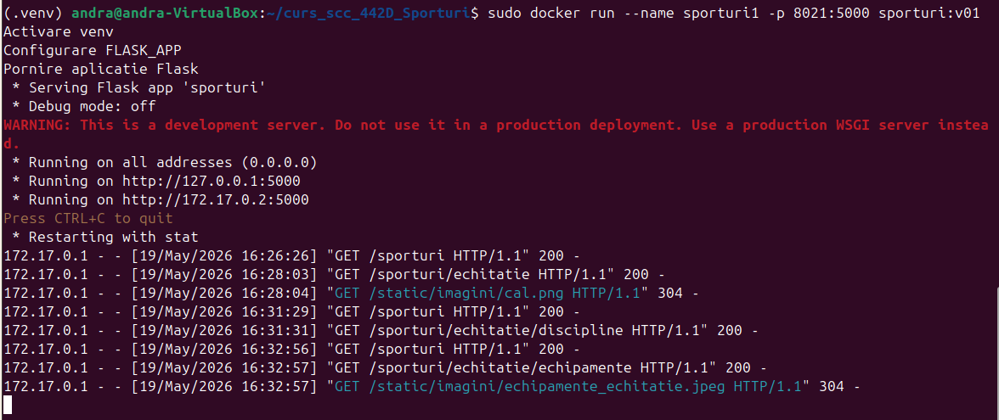

---

### Docker PS

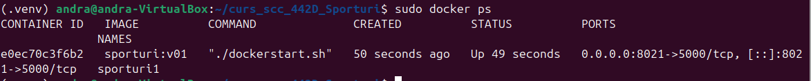

---

## Aplicatia in browser

### Pagina principala

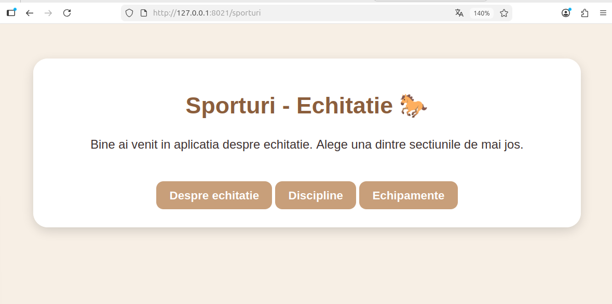

---

### Pagina Echitatie

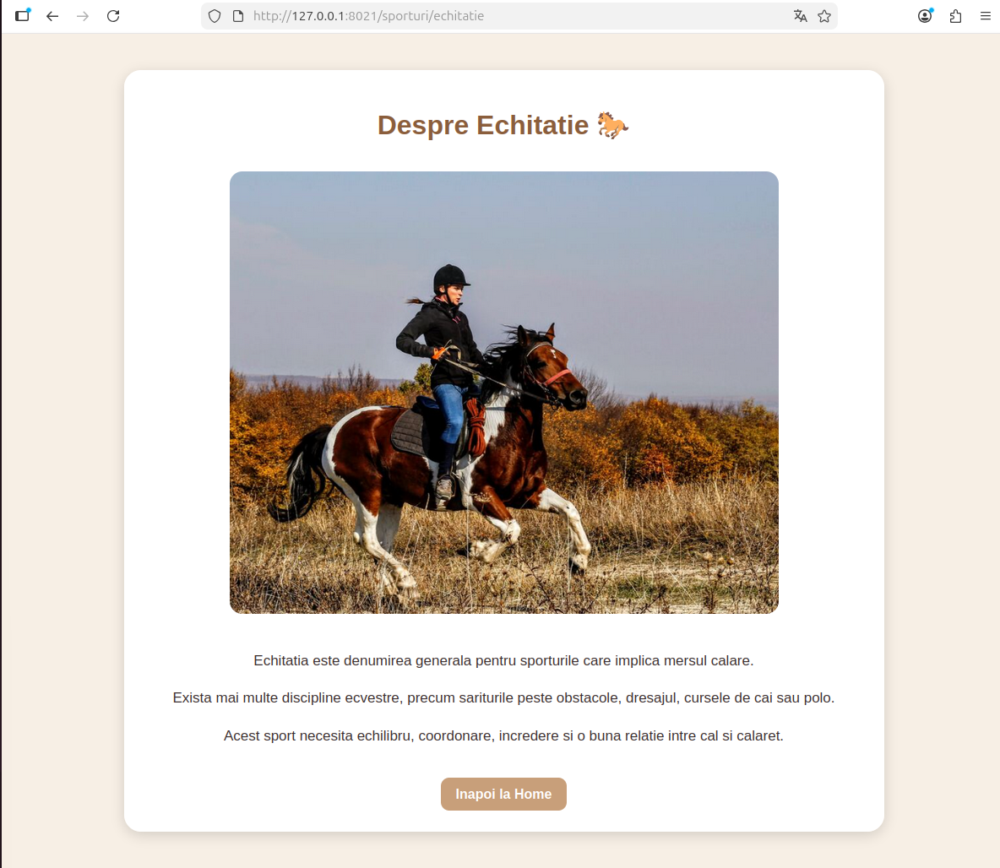

---

### Pagina Discipline

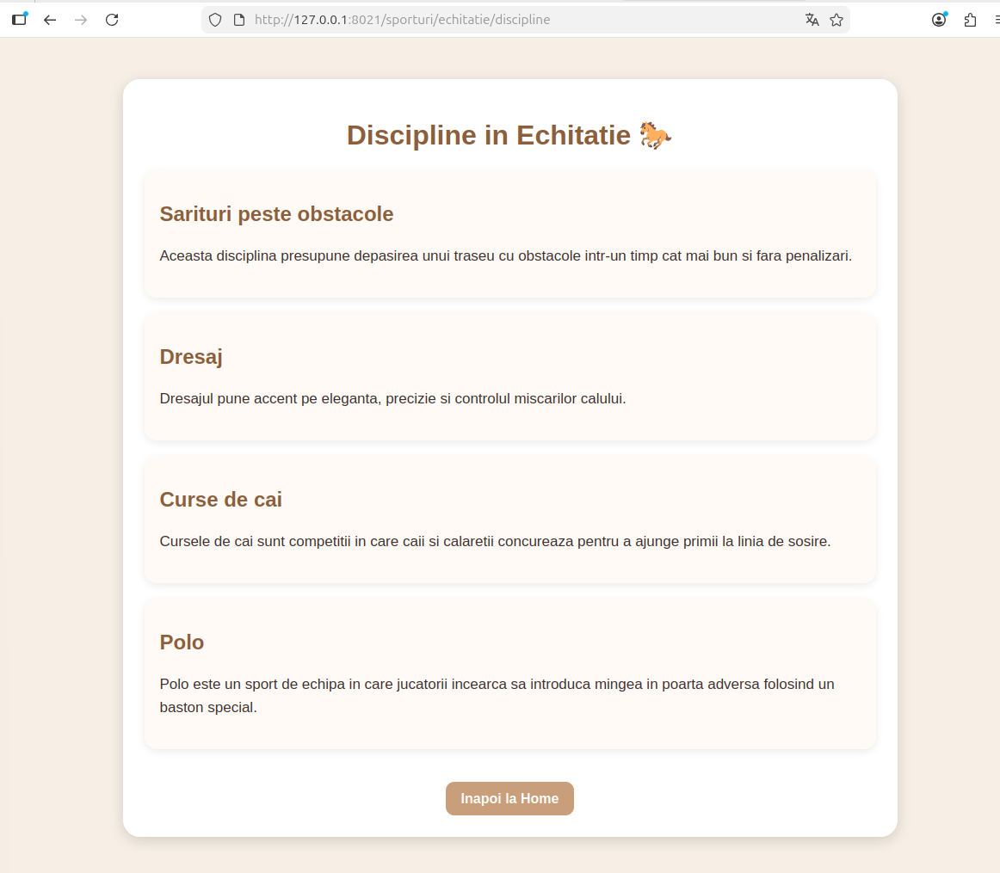

---

### Pagina Echipamente

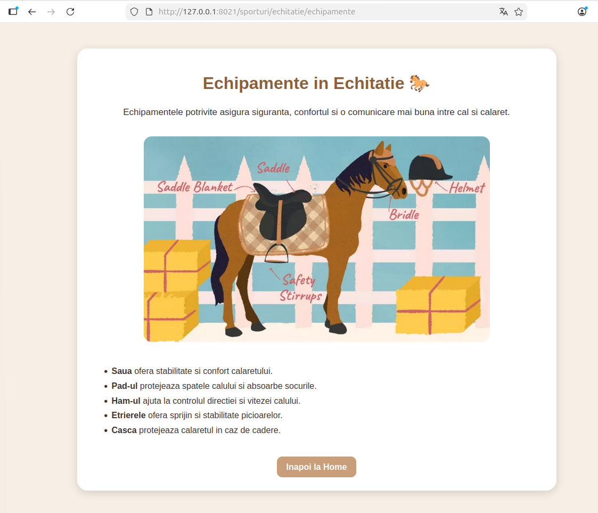

---

## Jenkins

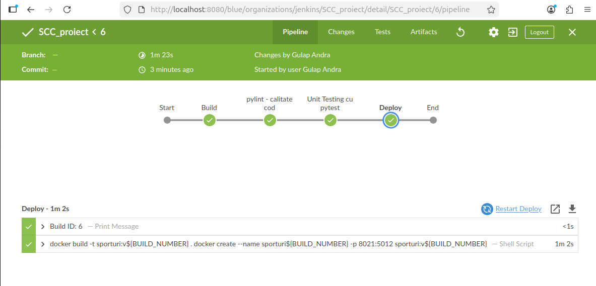

---

## Console Output Jenkins

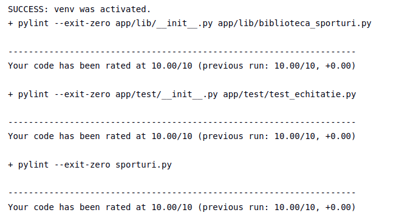

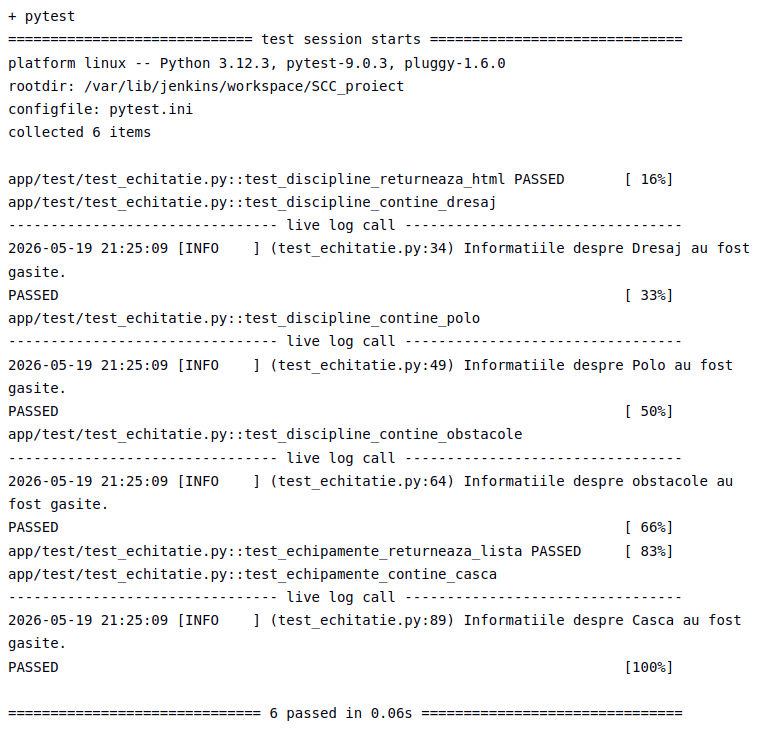

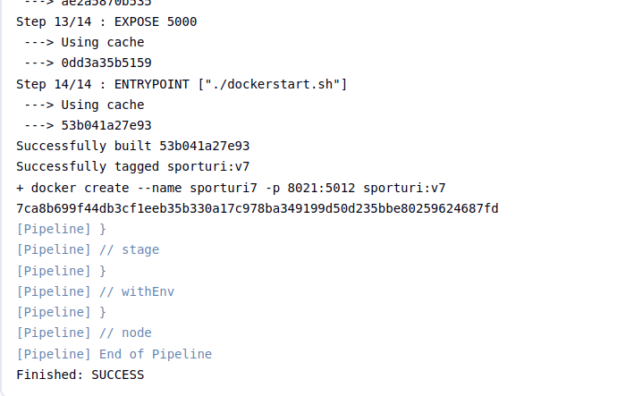


---


# Ce urmeaza a fi implementat:

- crearea Pull Request-ului din `dev_gulap_andra` in `main_gulap_andra`
- obtinerea unui review de la cel putin un coleg
- integrarea README-ului in branch-ul principal
- actualizarea finala a documentatiei dupa review si merge
- verificarea finala a functionarii Jenkins si Docker
- verificarea tuturor screenshot-urilor din folderul `doc`
- sincronizarea finala a branch-urilor

---

# Padel — Iordănescu Răzvan
[↑ Cuprins](#sporturi-integrate-în-readmemd)

# Proiect SCC - Sporturi

## Dezvoltator

- **Nume:** Iordanescu Razvan
- **Grupa:** 442D
- **Element alocat:** Padel

## Cuprins

- [Descriere generală](#descriere-generală)
- [Funcționalitate implementată](#funcționalitate-implementată)
- [Stadiu dezvoltare](#stadiu-dezvoltare)
- [Testare manuală în browser](#testare-manuală-în-browser)
- [Testare automată cu pytest](#testare-automată-cu-pytest)
- [Validare cod cu pylint](#validare-cod-cu-pylint)
- [Testare cu Docker](#testare-cu-docker)
- [DevOps CI](#devops-ci)
- [Concluzii](#concluzii)
- [Bibliografie](#bibliografie)

## Descriere generală

Obiectivul proiectului a fost realizarea unei aplicații web folosind framework-ul Flask, împreună cu un flux complet de dezvoltare software bazat pe GitHub, Docker, Jenkins, pytest și pylint.

Tema proiectului este **sporturi**, iar elementul ales pentru implementare este **padel**.

Aplicația prezintă informații generale despre padel, echipamentul folosit și câteva reguli specifice acestui sport.

## Funcționalitate implementată

În acest branch am adăugat și personalizat aplicația pentru tema **sporturi** și elementul **padel**.

Fișierul `app/lib/biblioteca_sporturi.py` conține cele două funcții cerute:

- `functie_1_padel()` - returnează informații generale despre padel.
- `functie_2_padel()` - returnează informații despre echipament și reguli în padel.

Fișierul principal `sporturi.py` conține cele patru rute cerute:

- `/sporturi` - pagina principală a temei.
- `/sporturi/padel` - pagina elementului ales.
- `/sporturi/padel/functie_1_padel` - pagina cu prima informație despre padel.
- `/sporturi/padel/functie_2_padel` - pagina cu a doua informație despre padel.

Fișierul `app/tests/test_biblioteca_sporturi.py` conține testele automate pentru cele două funcții din bibliotecă.

## Stadiu dezvoltare

- Funcționalitate complet implementată.
- Cod adăugat în branch-ul `dev_iordanescu_razvan`.
- Aplicația Flask rulează local.
- Testele automate cu `pytest` trec cu succes.
- Verificarea codului cu `pylint` este integrată.
- Dockerfile și Jenkinsfile sunt funcționale.
- Aplicația rulează și în container Docker.
- Pipeline-ul Jenkins include etapele Build, pylint, Unit Testing și Deploy.

## Testare manuală în browser

Pentru rularea locală a aplicației:

```bash
git clone https://github.com/vlad-barbu18/curs_scc_442D_Sporturi.git
cd curs_scc_442D_Sporturi
git checkout dev_iordanescu_razvan
source ./activeaza_venv
source ./ruleaza_aplicatia
```

Aplicația se accesează la:

```text
http://127.0.0.1:5012/sporturi
```

Rutele testate manual:

```text
http://127.0.0.1:5012/sporturi
http://127.0.0.1:5012/sporturi/padel
http://127.0.0.1:5012/sporturi/padel/functie_1_padel
http://127.0.0.1:5012/sporturi/padel/functie_2_padel
```

Capturi de ecran pentru rularea locală:

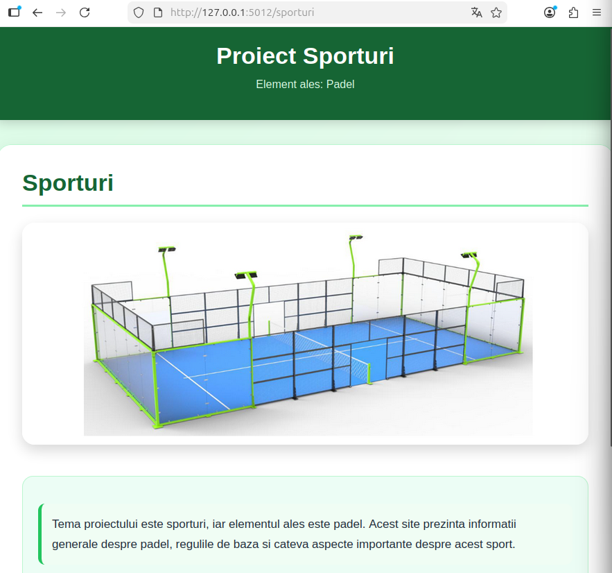


## Testare automată cu pytest

Testele automate se rulează cu:

```bash
pytest
```

Fișierul de teste este:

```text
app/tests/test_biblioteca_sporturi.py
```

Testele verifică dacă funcțiile:

- returnează conținut HTML valid;
- conțin informațiile specifice despre padel;
- returnează conținut nenul.

Captură rezultate pytest:

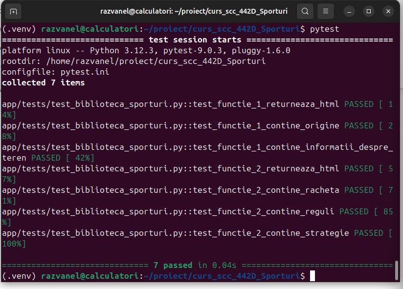

## Validare cod cu pylint

Verificarea codului se face cu:

```bash
pylint --exit-zero app/lib/biblioteca_sporturi.py
pylint --exit-zero app/tests/test_biblioteca_sporturi.py
pylint --exit-zero sporturi.py
```

Flag-ul `--exit-zero` permite afișarea avertismentelor fără oprirea pipeline-ului Jenkins.

## Testare cu Docker

Construirea imaginii Docker:

```bash
docker build -t sporturi:v01 .
```

Verificarea imaginii create:

```bash
docker images | grep sporturi
```

Rularea containerului:

```bash
docker run --name sporturi1 -p 8021:5012 sporturi:v01
```

Aplicația din container se accesează la:

```text
http://127.0.0.1:8021/sporturi
```

Rutele testate în container:

```text
http://127.0.0.1:8021/sporturi
http://127.0.0.1:8021/sporturi/padel
http://127.0.0.1:8021/sporturi/padel/functie_1_padel
http://127.0.0.1:8021/sporturi/padel/functie_2_padel
```

Oprirea și ștergerea containerului:

```bash
docker stop sporturi1
docker rm sporturi1
```

Capturi Docker:

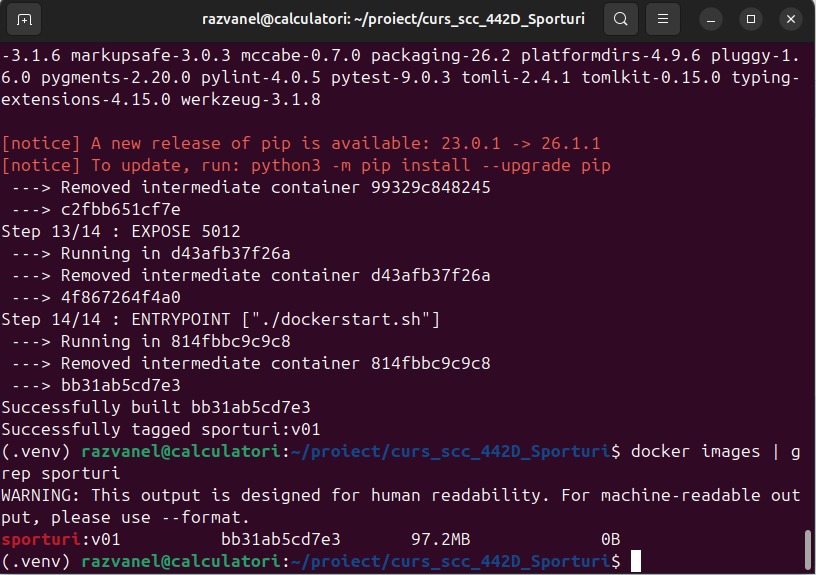
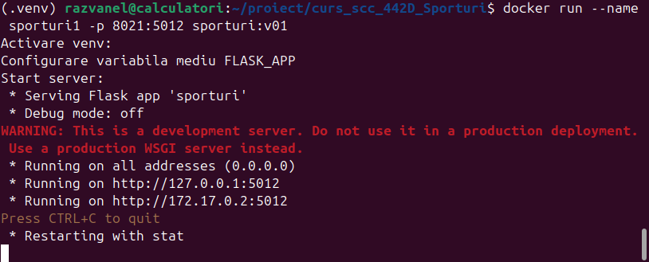
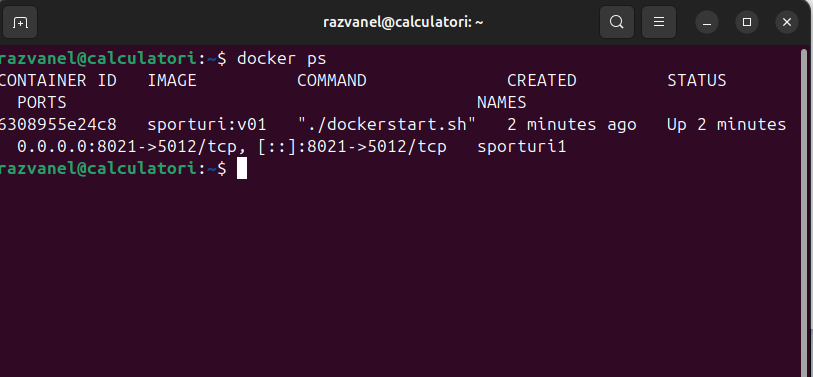

Capturi aplicație rulată în container:

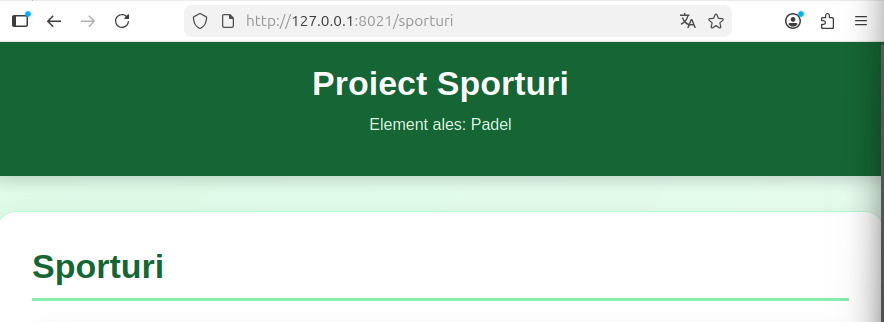

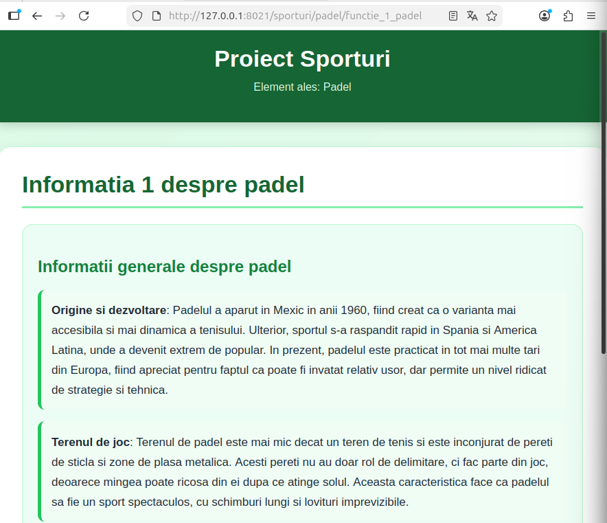
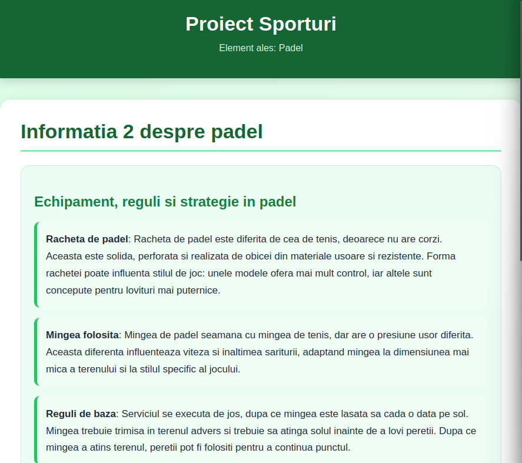

## DevOps CI

Pipeline-ul Jenkins este definit în fișierul `Jenkinsfile`.

Pipeline-ul conține patru etape:

1. **Build** - creează/activează mediul virtual și instalează dependențele.
2. **pylint - calitate cod** - rulează analiza statică a codului.
3. **Unit Testing cu pytest** - rulează testele automate.
4. **Deploy** - construiește imaginea Docker și creează containerul.

Repository-ul folosit în Jenkins:

```text
https://github.com/vlad-barbu18/curs_scc_442D_Sporturi.git
```

Branch-ul folosit în Jenkins:

```text
*/dev_iordanescu_razvan
```

Capturi Jenkins:

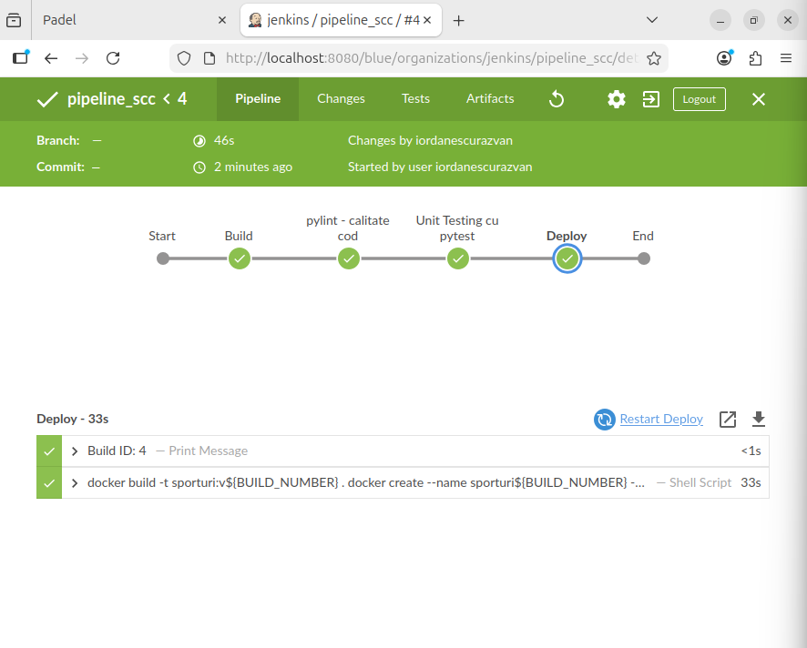
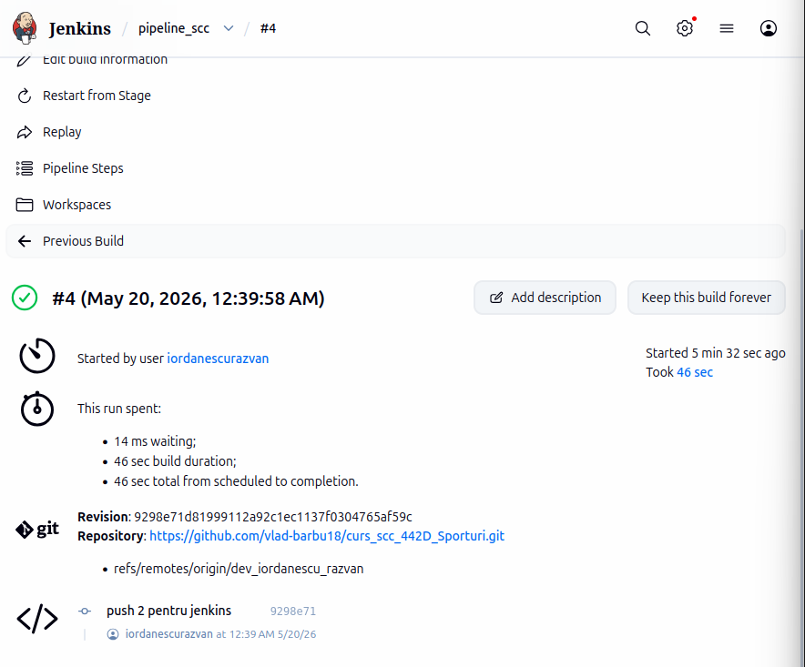

## Concluzii

Prin acest proiect am realizat o aplicație Flask simplă, organizată modular, pentru tema **sporturi** și elementul **padel**.

Proiectul folosește:

- Flask pentru aplicația web;
- GitHub pentru versionare;
- pytest pentru testare automată;
- pylint pentru verificarea calității codului;
- Docker pentru containerizare;
- Jenkins pentru automatizarea procesului de build, testare și deploy.

Aplicația poate fi rulată atât local, cât și într-un container Docker.

## Bibliografie

- https://github.com/crchende/sysinfo.git
- https://flask.palletsprojects.com/
- https://docs.docker.com/
- https://www.jenkins.io/doc/


---

# Minifotbal — Lazăr Iulian
[↑ Cuprins](#sporturi-integrate-în-readmemd)

# Proiect SCC - Sporturi

## Dezvoltator
- **Nume:** Lazar Iulian
- **Grupa:** 442D
- **Element alocat:** Minifotbal

---

## Cuprins
- [Descriere generală](#descriere-generală)
- [Funcționalitate implementată](#funcționalitate-implementată)
- [Stadiu dezvoltare](#stadiu-dezvoltare)
- [Testare manuală în browser (rulare locală)](#testare-manuală-în-browser-rulare-locală)
- [Testare automată cu pytest](#testare-automată-cu-pytest)
- [Validare cod cu pylint](#validare-cod-cu-pylint)
- [Testare cu Docker](#testare-cu-docker)
- [DevOps CI](#devops-ci)
- [Concluzii](#concluzii)
- [Bibliografie](#bibliografie)

---

# Descriere generală

Obiectivul proiectului a fost realizarea unei aplicații web folosind framework-ul Flask și integrarea unui proces complet DevOps folosind:

- Python
- Flask
- GitHub
- Jenkins
- Docker
- pytest
- pylint

Scopul proiectului a fost automatizarea procesului de dezvoltare software și validarea continuă a aplicației.

---

# Funcționalitate implementată

În cadrul proiectului au fost implementate următoarele componente:

### Bibliotecă proprie

Fișier:

```plaintext
app/lib/biblioteca_sporturi.py
```

conține funcțiile:

- `functie_1_sport()` – afișează informații despre primul element ales.
- `functie_2_sport()` – afișează informații despre al doilea element ales.

### Aplicația Flask

Fișier principal:

```plaintext
sporturi.py
```

Rute implementate:

```plaintext
/sporturi
/sporturi/minifotbal
/sporturi/minifotbal/functie_1_sport
/sporturi/minifotbal/functie_2_sport
```

### Testare automată

Fișier:

```plaintext
app/tests/test_biblioteca_sporturi.py
```

conține testele unitare.

---

# Stadiu dezvoltare

✔ Funcționalitate complet implementată  
✔ Testare locală realizată  
✔ Testare automată realizată  
✔ Docker funcțional  
✔ Jenkins Pipeline funcțional  

---

# Testare manuală în browser (rulare locală)

Pornire aplicație:

```bash
git clone https://github.com/vlad-barbu18/curs_scc_442D_Sporturi
cd curs_scc_442D_Sporturi

git checkout dev_lazar_iulian

. ./activeaza_venv

./ruleaza_aplicatia
```

Acces aplicație:

```plaintext
http://127.0.0.1:5012/sporturi
```


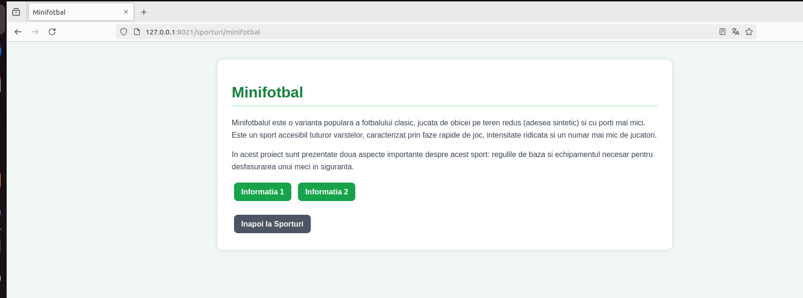


---

# Testare automată cu pytest

Rulare:

```bash
pytest
```

Verifică funcționarea automată a funcțiilor implementate.


---

# Validare cod cu pylint

Comenzi utilizate:

```bash
pylint --exit-zero app/lib/biblioteca_sporturi.py

pylint --exit-zero app/tests/test_biblioteca_sporturi.py

pylint --exit-zero sporturi.py
```

Analiza verifică:

- stil cod
- importuri
- erori statice
- convenții Python


---

# Testare cu Docker

Construire imagine:

```bash
docker build -t sporturi:v01 .
```

Pornire container:

```bash
docker run --name sporturi1 -p 8021:5012 sporturi:v01
```

Imagini rezultate:

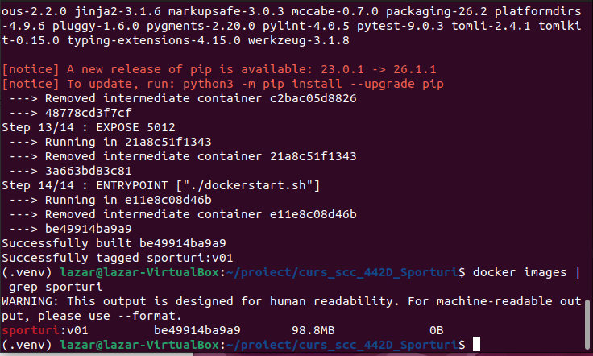


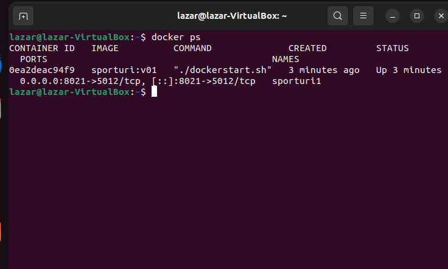

Acces aplicație:

```plaintext
http://localhost:8021/sporturi
```

---

# DevOps CI

Pipeline-ul CI este implementat în:

```plaintext
Jenkinsfile
```

Etape executate:

## 1. Build
- creare mediu virtual
- instalare dependențe

## 2. pylint
- analiză statică cod

## 3. Unit Testing
- rulare teste automate folosind pytest

## 4. Deploy
- construire imagine Docker
- creare container

### Pipeline Blue Ocean

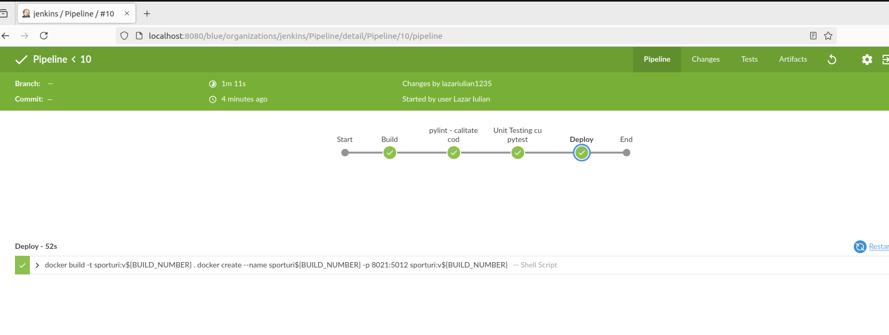

### Pipeline Jenkins clasic

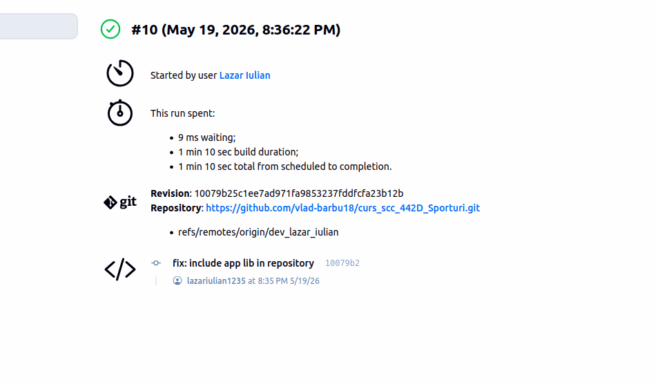

---

# Concluzii

În cadrul proiectului au fost aplicate concepte moderne de dezvoltare software:

- dezvoltare modulară
- testare automată
- containerizare
- integrare continuă
- automatizare pipeline

Jenkins și Docker permit validarea și rularea aplicației într-un mod reproductibil și automatizat.

---

# Bibliografie

https://github.com/crchende/sysinfo.git

Documentație Flask:
https://flask.palletsprojects.com/

Documentație Docker:
https://docs.docker.com/

Documentație Jenkins:
https://www.jenkins.io/doc/


---

# Biatlon — Manea Teodora
[↑ Cuprins](#sporturi-integrate-în-readmemd)

# Proiect SCC - Sporturi

## Student
- **Nume:** Manea Teodora
- **Grupa:** 442D
- **Element alocat:** Biatlon

## Cuprins
- [Descriere generală](#descriere-generală)
- [Funcționalitate implementată](#funcționalitate-implementată)
- [Stadiu dezvoltare](#stadiu-dezvoltare)
- [Testare manuală în browser (rulare locală)](#testare-manuală-în-browser-rulare-locală)
- [Testare automată cu pytest](#testare-automată-cu-pytest)
- [Validare cod cu pylint](#validare-cod-cu-pylint)
- [Testare cu Docker](#testare-cu-docker)
- [DevOps CI](#devops-ci)
- [Concluzii](#concluzii)
- [Bibliografie](#bibliografie)

## Descriere generala

Obiectivul acestui proiect este dezvoltarea unei aplicații web utilizând limbajul Python și framework-ul Flask, având ca temă principală sporturile și ca subtemă biatlonul. Aplicația are rolul de a prezenta informații generale despre acest sport de iarnă, regulile sale și principalele competiții internaționale.

Proiectul urmărește implementarea unor concepte de bază din dezvoltarea aplicațiilor web și din zona DevOps, precum organizarea codului pe module, testarea automată cu pytest, validarea calității codului cu pylint, containerizarea aplicației folosind Docker și automatizarea procesului de build și testare prin Jenkins Pipeline.

## Funcționalitate implementată

În acest branch am adăugat și personalizat aplicația pentru tema „Sporturi”, având ca subtemă biatlonul.

- Fișierul `app/lib/biblioteca_sporturi.py` conține cele două funcții principale cerute:
  - `functie_1_biatlon()` – returnează informații generale despre biatlon, originea și caracteristicile acestui sport.
  - `functie_2_biatlon()` – returnează informații despre regulile biatlonului și principalele competiții.

- Fișierul principal `sporturi.py` implementează cele patru rute conform cerinței:
  - `/sporturi` – pagina principală a temei, cu introducere generală despre sporturi și biatlon.
  - `/sporturi/biatlon` – pagina dedicată sportului ales.
  - `/sporturi/biatlon/functie_1_biatlon` – afișează informațiile generale despre biatlon.
  - `/sporturi/biatlon/functie_2_biatlon` – afișează regulile și competițiile importante.

- Interfața aplicației a fost personalizată folosind elemente HTML și CSS:
  - butoane stilizate,
  - culori și fundal personalizat,
  - structură simplă și ușor de navigat,
  - pagini separate pentru fiecare funcționalitate.

- Fișierul `app/tests/test_biblioteca_sporturi.py` conține testele automate realizate cu pytest pentru verificarea funcțiilor implementate.

- Pentru partea DevOps au fost adăugate:
  - `Dockerfile` pentru containerizarea aplicației,
  - `dockerstart.sh` pentru pornirea automată a aplicației în container,
  - `Jenkinsfile` pentru automatizarea etapelor de build, testare și deploy.


## Stadiu dezvoltare

- Funcționalitatea aplicației a fost implementată complet.
- Codul sursă a fost dezvoltat și organizat în branch-ul `dev_Manea_Teodora`.
- Rutele Flask și funcțiile bibliotecii Python sunt funcționale și testate.
- Testarea automată cu pytest a fost realizată cu succes.
- Validarea codului folosind pylint a fost integrată în pipeline-ul Jenkins.
- Aplicația a fost containerizată utilizând Docker.
- Pipeline-ul Jenkins pentru build, testare și deploy funcționează corect.
- Capturile de ecran și documentația README au fost adăugate în proiect.
- Testarea locală, automată și containerizată a fost realizată cu succes.

## Testare manuală în browser (rulare locală)

```bash
git clone https://github.com/vlad-barbu18/curs_scc_442D_Sporturi.git
cd curs_scc_442D_Sporturi
git checkout dev_Manea_Teodora
. ./activeaza_venv
./ruleaza_aplicatia'

```


Aplicația se accesează la: `http://127.0.0.1:5012/sporturi`

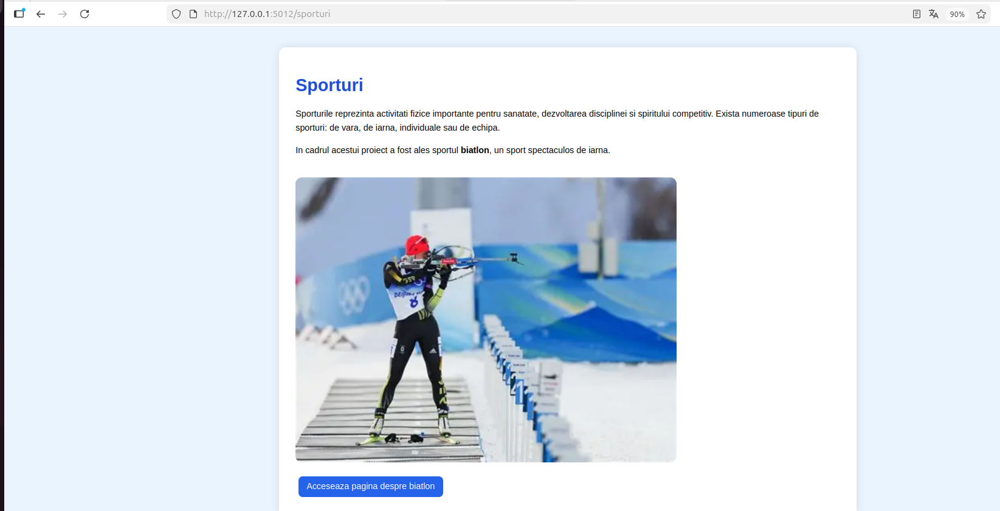
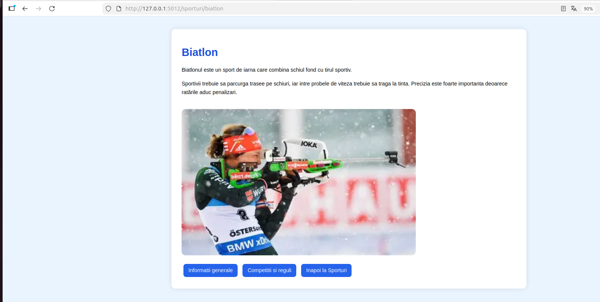
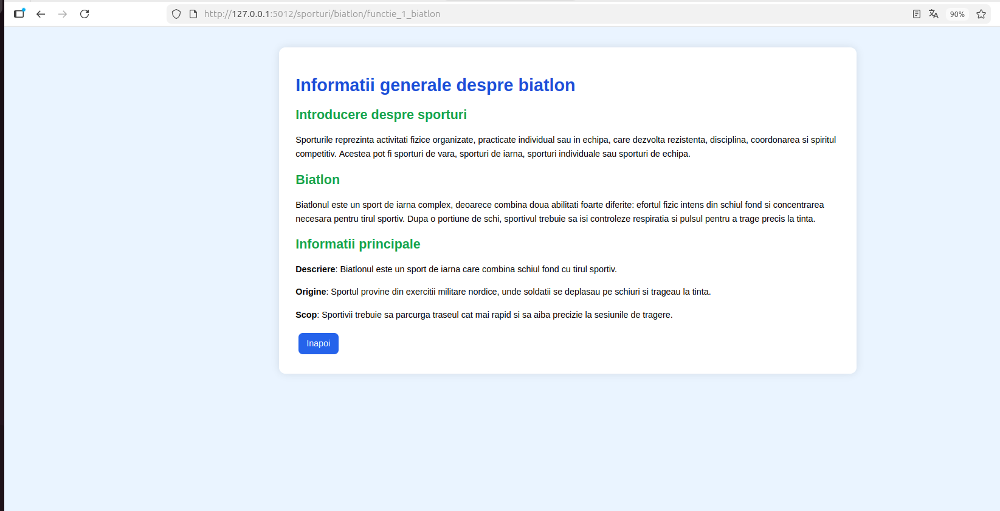
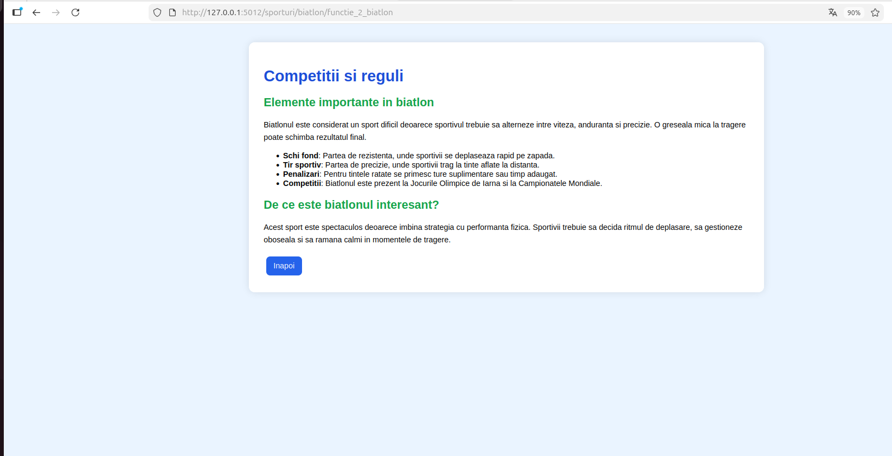

## Testare automată cu `pytest`

```bash
pytest
```

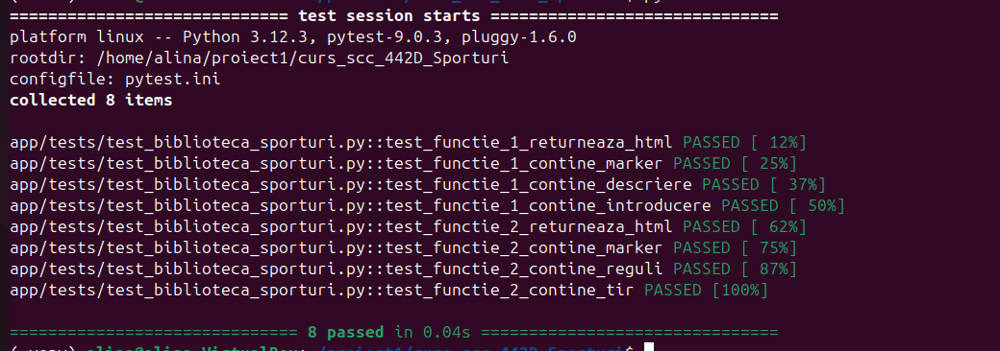

## Validare cod cu `pylint`

```bash
pylint --exit-zero app/lib/biblioteca_sporturi.py
pylint --exit-zero app/tests/test_biblioteca_sporturi.py
pylint --exit-zero sporturi.py
```

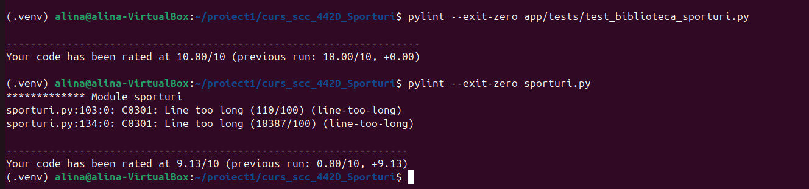

## Testare cu Docker

```bash
docker build -t sporturi:v01 .
docker run --name sporturi1 -p 8021:5012 sporturi:v01
```

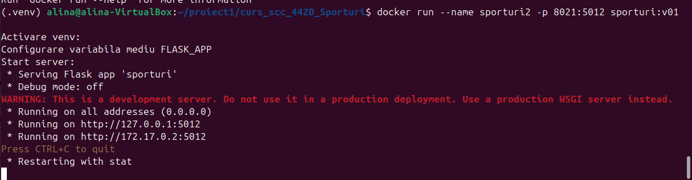
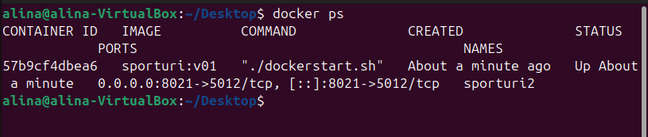

Aplicația din container, accesată la `http://localhost:8021/sporturi`:

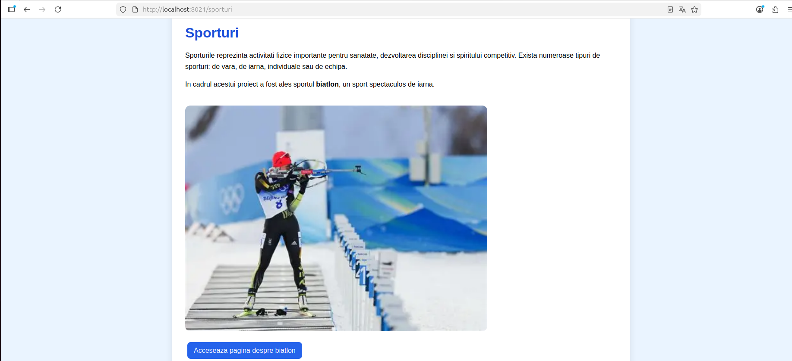
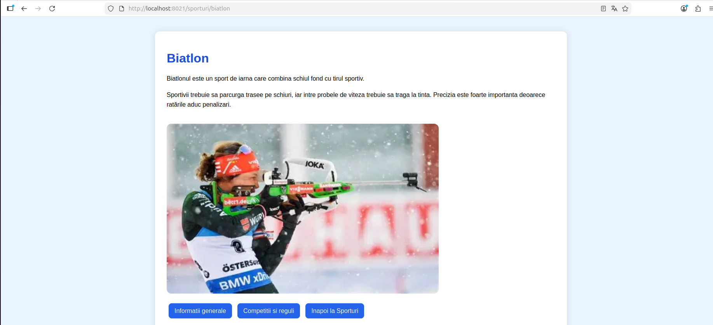
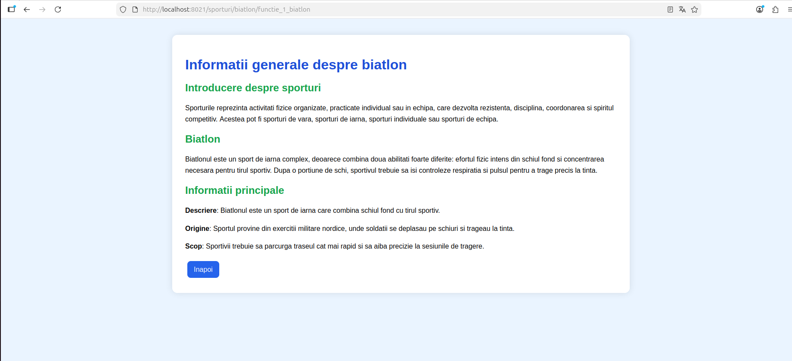
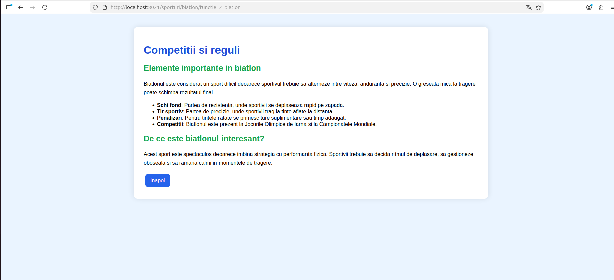

# DevOps CI

Pipeline declarativ definit în `Jenkinsfile`, cu 4 stages:
1. **Build**
   - activarea mediului virtual,
   - verificarea structurii proiectului,
   - pregătirea dependențelor necesare.
2. **pylint** 
   - realizarea analizei statice a codului Python,
   - identificarea warning-urilor și a problemelor de stil.
3. **Unit Tests** - rularea testelor automate folosind 'pytest'
4. **Deploy** - build Docker + creare container
 
##Pipeline Blue Ocean

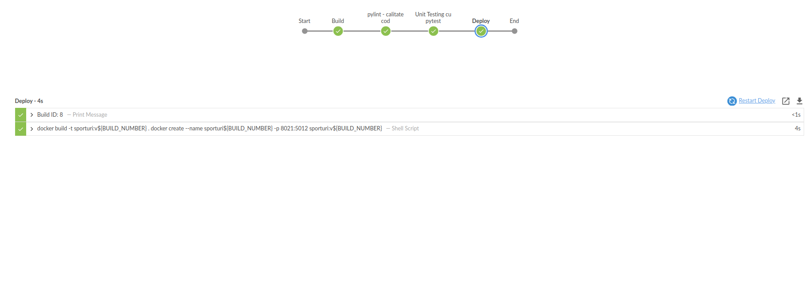

##Pipeline Jenkins clasic

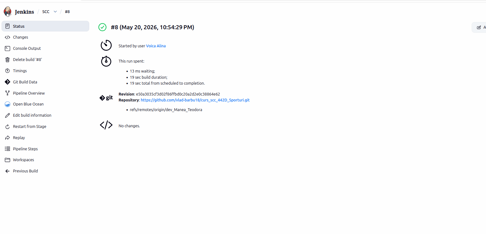


## Concluzii

Proiectul realizat demonstrează dezvoltarea unei aplicații web folosind framework-ul Flask împreună cu tehnologii moderne utilizate în zona DevOps.

Dezvoltare modulară: aplicația a fost organizată pe module și funcții separate pentru o structură mai clară și mai ușor de întreținut.
Interfață web: au fost implementate pagini HTML dinamice și navigare între rute pentru prezentarea informațiilor despre biatlon.
Testare automată: funcționalitățile aplicației au fost verificate utilizând teste automate realizate cu pytest.
Asigurarea calității codului: analiza statică a codului a fost realizată folosind pylint și integrată în pipeline-ul Jenkins.
Portabilitate: utilizarea Docker permite rularea aplicației într-un mediu izolat și consistent.
Automatizare DevOps: Jenkins a fost utilizat pentru automatizarea etapelor de build, testare și deploy ale aplicației.

În urma implementării, aplicația a funcționat corect atât local, cât și în container Docker, iar pipeline-ul Jenkins a executat cu succes toate etapele configurate.
## Bibliografie

https://github.com/crchende/sysinfo.git


---

# MMA — Mitu Marian
[↑ Cuprins](#sporturi-integrate-în-readmemd)

# Proiect SCC - Sporturi

## Dezvoltator

- **Nume:** Mitu Marian
- **Grupa:** 442D
- **Tema proiectului:** Sporturi
- **Element ales:** MMA
- **Branch de dezvoltare:** `dev_mitu_marian`

---

## Cuprins

- [Descriere generală](#descriere-generală)
- [Funcționalitate implementată](#funcționalitate-implementată)
- [Structura proiectului](#structura-proiectului)
- [Rutele aplicației](#rutele-aplicației)
- [Testare manuală în browser](#testare-manuală-în-browser)
- [Testare automată cu pytest](#testare-automată-cu-pytest)
- [Validare cod cu pylint](#validare-cod-cu-pylint)
- [Testare cu Docker](#testare-cu-docker)
- [DevOps CI - Jenkins](#devops-ci---jenkins)
- [Concluzii](#concluzii)
- [Bibliografie](#bibliografie)

---

## Descriere generală

Acest proiect reprezintă o aplicație web realizată în Python, folosind framework-ul Flask.

Tema proiectului este **Sporturi**, iar elementul ales este **MMA**. Aplicația prezintă informații despre MMA, luptători cunoscuți, tehnici importante și reguli de bază.

Scopul proiectului este parcurgerea unui flux complet de dezvoltare software, folosind:

- **Python** pentru implementarea aplicației;
- **Flask** pentru dezvoltarea aplicației web;
- **GitHub** pentru versionare;
- **pytest** pentru testare automată;
- **pylint** pentru verificarea calității codului;
- **Docker** pentru containerizare;
- **Jenkins** pentru automatizarea procesului de build, testare și deploy.

---

## Funcționalitate implementată

În acest branch am adăugat și personalizat următoarele componente:

### Fișierul principal `sporturi.py`

Fișierul `sporturi.py` conține aplicația Flask și rutele principale ale site-ului.

Aplicația are un design modern, cu fundal tematic MMA, navigație între pagini și carduri pentru afișarea informațiilor.

### Biblioteca `app/lib/biblioteca_sporturi.py`

Fișierul conține cele două funcții cerute în proiect:

- `afiseaza_luptatori_mma()` – returnează conținut HTML despre luptători reprezentativi din MMA.
- `afiseaza_tehnici_mma()` – returnează conținut HTML despre tehnici importante folosite în MMA.

### Fișierul de teste `app/tests/test_biblioteca_sporturi.py`

Acest fișier conține teste automate pentru cele două funcții din biblioteca proiectului.

Testele verifică:

- dacă funcțiile returnează conținut HTML;
- dacă rezultatul conține elemente specifice;
- dacă apar informații despre luptători;
- dacă apar informații despre tehnici MMA.

### Dockerfile

Fișierul `Dockerfile` permite construirea unei imagini Docker pentru aplicația Flask.

### Jenkinsfile

Fișierul `Jenkinsfile` definește un pipeline declarativ cu etapele:

1. Build
2. Verificare cod cu pylint
3. Testare automată cu pytest
4. Deploy prin Docker

---

## Structura proiectului

```text
curs_scc_442D_Sporturi/
├── app/
│   ├── __init__.py
│   ├── lib/
│   │   ├── __init__.py
│   │   └── biblioteca_sporturi.py
│   └── tests/
│       ├── __init__.py
│       └── test_biblioteca_sporturi.py
├── doc/
│   ├── docdockerconsola.png
│   ├── docdockerimages.png
│   ├── docdockerps.png
│   ├── docjenkinsBlueOcean.png
│   ├── docjenkinsSimplu.png
│   ├── pagina acasa.png
│   ├── pagina cu luptatori.png
│   ├── pagina cu reguli.png
│   ├── pagina cu tehnici.png
│   └── pagina mma.png
├── Dockerfile
├── Jenkinsfile
├── README.md
├── activeaza_venv
├── activeaza_venv_jenkins
├── dockerstart.sh
├── pytest.ini
├── quickrequirements.txt
├── ruleaza_aplicatia
└── sporturi.py
```

---

## Rutele aplicației

| Rută | Descriere |
|---|---|
| `/` | Redirect către pagina principală `/sporturi` |
| `/sporturi` | Pagina principală a temei Sporturi |
| `/sporturi/mma` | Pagina elementului ales, MMA |
| `/sporturi/mma/afiseaza_luptatori_mma` | Pagina cu luptători reprezentativi din MMA |
| `/sporturi/mma/afiseaza_tehnici_mma` | Pagina cu tehnici importante din MMA |
| `/sporturi/mma/reguli` | Pagina cu reguli de bază în MMA |

---

## Testare manuală în browser

Pentru rularea aplicației local:

```bash
git clone https://github.com/vlad-barbu18/curs_scc_442D_Sporturi.git
cd curs_scc_442D_Sporturi
git checkout dev_mitu_marian
. ./activeaza_venv
./ruleaza_aplicatia
```

Dacă scriptul nu pornește direct, aplicația poate fi rulată și cu:

```bash
export FLASK_APP=sporturi
flask run -h 127.0.0.1 -p 5012 --reload
```

Aplicația se accesează în browser la:

```text
http://127.0.0.1:5012/sporturi
```

### Pagina principală - Sporturi


### Pagina MMA


### Pagina Luptători MMA


### Pagina Tehnici MMA


### Pagina Reguli MMA


---

## Testare automată cu pytest

Testele automate se rulează cu:

```bash
pytest
```

Fișierul de teste este:

```text
app/tests/test_biblioteca_sporturi.py
```

Testele verifică funcțiile:

```python
afiseaza_luptatori_mma()
afiseaza_tehnici_mma()
```

---

## Validare cod cu pylint

Validarea codului se face cu următoarele comenzi:

```bash
pylint --exit-zero app/lib/biblioteca_sporturi.py
pylint --exit-zero app/tests/test_biblioteca_sporturi.py
pylint --exit-zero sporturi.py
```

Opțiunea `--exit-zero` permite afișarea avertismentelor fără oprirea pipeline-ului Jenkins.

---

## Testare cu Docker

### Construirea imaginii Docker

```bash
docker build -t sporturi:v01 .
```

Verificarea imaginii create:

```bash
docker images | grep sporturi
```

### Imagine Docker creată

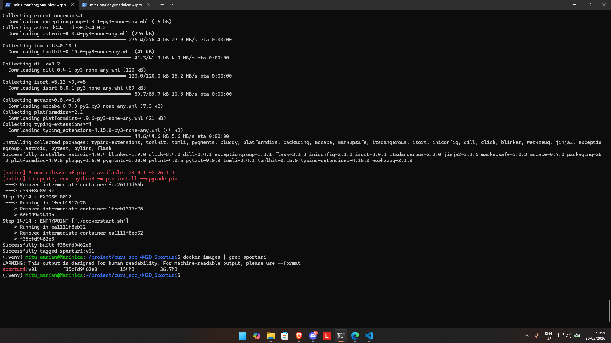

### Rularea containerului

```bash
docker run --name sporturi1 -p 8021:5012 sporturi:v01
```

Aplicația din container se accesează la:

```text
http://127.0.0.1:8021/sporturi
```

### Container Docker pornit

```bash
docker ps
```


### Consolă Docker


### Oprirea și ștergerea containerului

```bash
docker stop sporturi1
docker rm sporturi1
```

---

## DevOps CI - Jenkins

Pipeline-ul Jenkins este definit în fișierul:

```text
Jenkinsfile
```

Pipeline-ul este declarativ și conține următoarele etape:

### 1. Build

În această etapă:

- se afișează directorul curent;
- se listează fișierele proiectului;
- se acordă permisiuni de execuție scripturilor;
- se creează și se activează mediul virtual;
- se instalează dependențele din `quickrequirements.txt`.

### 2. pylint - calitate cod

În această etapă se rulează analiza statică pentru:

```text
app/lib/*.py
app/tests/*.py
sporturi.py
```

### 3. Unit Testing cu pytest

În această etapă se rulează testele automate:

```bash
pytest
```

### 4. Deploy

În această etapă:

- se construiește o imagine Docker;
- se creează un container Docker pe portul `8021`.

Imaginea Docker este creată cu numele:

```text
sporturi:v${BUILD_NUMBER}
```

Containerul este creat cu numele:

```text
sporturi${BUILD_NUMBER}
```

### Capturi Jenkins

Pipeline Blue Ocean:


Pipeline Jenkins clasic:

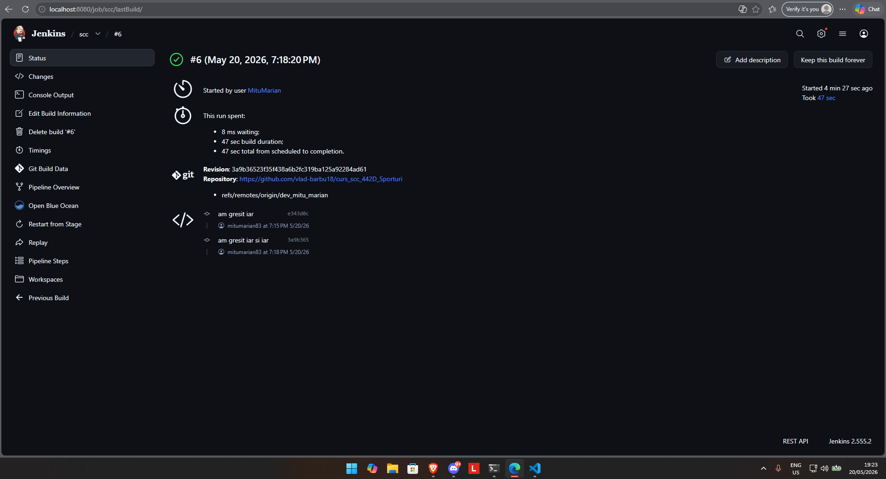

---

## Fișiere importante

### `quickrequirements.txt`

Conține dependențele proiectului:

```text
flask
pytest
pylint
```

### `activeaza_venv`

Script pentru activarea mediului virtual local.

### `activeaza_venv_jenkins`

Script folosit de Jenkins pentru crearea mediului virtual și instalarea dependențelor.

### `ruleaza_aplicatia`

Script pentru rularea aplicației Flask local.

### `dockerstart.sh`

Script folosit la pornirea aplicației în container Docker.

---

## Probleme întâlnite și rezolvări

### Placeholder `<tema>` rămas în fișiere

În unele fișiere trebuie înlocuit `<tema>` cu numele real al temei:

```text
sporturi
```

### Docker - permission denied la `dockerstart.sh`

Rezolvare:

```bash
chmod +x dockerstart.sh
```

sau în `Dockerfile`:

```dockerfile
ENTRYPOINT ["sh", "./dockerstart.sh"]
```

### Testele pytest picau după modificarea designului

Inițial testele verificau existența tagului `<ul>`, dar designul nou folosește carduri HTML cu `div`.

Rezolvarea a fost actualizarea testelor pentru a verifica:

```text
class="grid"
class="stat-card"
```

### Jenkins nu găsea funcțiile din bibliotecă

Problema a apărut când conținutul fișierului de teste a fost copiat din greșeală peste fișierul bibliotecii.

Rezolvarea a fost refacerea corectă a fișierului:

```text
app/lib/biblioteca_sporturi.py
```

---

## Comenzi utile

### Activare proiect

```bash
cd curs_scc_442D_Sporturi
git checkout dev_mitu_marian
. ./activeaza_venv
```

### Rulare aplicație

```bash
./ruleaza_aplicatia
```

sau:

```bash
export FLASK_APP=sporturi
flask run -h 127.0.0.1 -p 5012 --reload
```

### Rulare teste

```bash
pytest
```

### Rulare pylint

```bash
pylint --exit-zero app/lib/biblioteca_sporturi.py
pylint --exit-zero app/tests/test_biblioteca_sporturi.py
pylint --exit-zero sporturi.py
```

### Docker

```bash
docker build -t sporturi:v01 .
docker run --name sporturi1 -p 8021:5012 sporturi:v01
docker stop sporturi1
docker rm sporturi1
```

### Git

```bash
git status
git add .
git commit -m "docs: README complet cu pozele din doc"
git push
```

---

## Concluzii

Prin acest proiect am realizat o aplicație web Flask pentru tema **Sporturi**, având ca element ales **MMA**.

Proiectul demonstrează:

- dezvoltarea unei aplicații web cu Flask;
- separarea logicii în fișiere diferite;
- utilizarea unei biblioteci proprii cu funcții Python;
- testarea automată cu pytest;
- validarea codului cu pylint;
- rularea aplicației într-un container Docker;
- automatizarea procesului de build, testare și deploy cu Jenkins.

Aplicația este organizată modular și poate fi rulată atât local, cât și în container Docker.

---

## Bibliografie

- https://github.com/vlad-barbu18/curs_scc_442D_Sporturi
- https://github.com/crchende/sysinfo.git
- https://flask.palletsprojects.com/
- https://docs.pytest.org/
- https://docs.docker.com/
- https://www.jenkins.io/doc/

---

# Ski — Nedelcu Alexandru
[↑ Cuprins](#sporturi-integrate-în-readmemd)

# Proiect SCC - Sporturi

## Dezvoltator

- **Nume:** Nedelcu Alexandru
- **Grupa:** 442D
- **Tema proiectului:** Sporturi
- **Element ales:** Ski
- **Branch de dezvoltare:** `dev_Nedelcu_Alexandru`
- **Mediu de lucru:** WSL - Ubuntu pe Windows

---

## Cuprins

- [Descriere generală](#descriere-generală)
- [Funcționalitate implementată](#funcționalitate-implementată)
- [Structura proiectului](#structura-proiectului)
- [Rute disponibile](#rute-disponibile)
- [Tehnologii utilizate](#tehnologii-utilizate)
- [Rulare locală în WSL](#rulare-locală-în-wsl)
- [Testare automată cu pytest](#testare-automată-cu-pytest)
- [Validare cod cu pylint](#validare-cod-cu-pylint)
- [Rulare cu Docker](#rulare-cu-docker)
- [DevOps CI - Jenkins](#devops-ci---jenkins)
- [Capturi aplicație web](#capturi-aplicație-web)
- [Capturi Docker](#capturi-docker)
- [Capturi Jenkins](#capturi-jenkins)
- [Concluzii](#concluzii)
- [Bibliografie](#bibliografie)

---

## Descriere generală

Acest proiect a fost realizat pentru disciplina **SCC** și urmărește dezvoltarea unei aplicații web simple folosind framework-ul **Flask**.

Tema generală a proiectului este **Sporturi**, iar elementul ales pentru implementarea individuală este **ski-ul**. Aplicația prezintă o pagină dedicată unei pârtii de ski, cu informații despre programul de funcționare, starea pârtiei, prețuri pentru skipass, urcări individuale, închirieri de echipament și date de contact.

Pagina `/sporturi` este gândită ca pagină generală pentru proiectul de grup, unde pot fi integrate și celelalte sporturi ale colegilor. Componenta individuală este disponibilă la ruta `/sporturi/ski`.

Proiectul a fost dezvoltat și testat în **WSL - Windows Subsystem for Linux**, folosind un mediu Ubuntu rulat direct pe Windows, fără mașină virtuală separată.

---

## Funcționalitate implementată

În cadrul branch-ului `dev_Nedelcu_Alexandru` au fost implementate următoarele componente:

- aplicație web Flask în fișierul `sporturi.py`;
- pagină generală pentru tema **Sporturi**;
- pagină principală pentru sportul ales: **Ski**;
- pagină pentru programul pârtiei și starea acesteia;
- pagină pentru tarife skipass și urcări individuale;
- pagină pentru închirieri echipament;
- pagină pentru reguli și contact;
- bibliotecă Python separată în `app/lib/biblioteca_sporturi.py`;
- teste automate în `app/tests/test_biblioteca_sporturi.py`;
- rulare locală prin virtual environment;
- containerizare cu Docker;
- pipeline CI/CD prin Jenkins.

---

## Structura proiectului

```text
curs_scc_442D_Sporturi/
│
├── app/
│   ├── __init__.py
│   ├── lib/
│   │   ├── __init__.py
│   │   └── biblioteca_sporturi.py
│   └── tests/
│       ├── __init__.py
│       └── test_biblioteca_sporturi.py
│
├── doc/
│   ├── docker_build.png
│   ├── docker_ps.png
│   ├── docker_run.png
│   ├── imagine_creeata.png
│   ├── jenkins_blue_ocean.png
│   ├── jenkins_status.png
│   ├── pagina skipass.png
│   ├── pagina_contact.png
│   ├── pagina_inchirieri.png
│   ├── pagina_program.png
│   ├── pagina_ski.png
│   └── pagina_sporturi.png
│
├── Dockerfile
├── Jenkinsfile
├── README.md
├── activeaza_venv
├── activeaza_venv_jenkins
├── dockerstart.sh
├── pytest.ini
├── quickrequirements.txt
├── ruleaza_aplicatia
└── sporturi.py
```

---

## Rute disponibile

| Rută | Descriere |
|---|---|
| `/` | Redirect către `/sporturi` |
| `/sporturi` | Pagina generală a temei Sporturi |
| `/sporturi/ski` | Pagina principală pentru sportul ales: Ski |
| `/sporturi/ski/functie_1_ski` | Programul pârtiei și starea acesteia |
| `/sporturi/ski/functie_2_ski` | Tarife skipass și urcări individuale |
| `/sporturi/ski/inchirieri` | Prețuri pentru închirieri echipament |
| `/sporturi/ski/contact` | Reguli de siguranță și contact |

---

## Tehnologii utilizate

- **Python 3** - limbajul principal de programare;
- **Flask** - framework web pentru definirea rutelor și afișarea paginilor;
- **HTML/CSS** - structurarea și stilizarea paginilor;
- **pytest** - testare automată;
- **pylint** - analiză statică a codului;
- **Docker** - rularea aplicației într-un container;
- **Jenkins** - automatizarea etapelor de build, testare și deploy;
- **GitHub** - versionarea codului și colaborarea în proiect;
- **WSL** - mediu Linux folosit direct pe Windows.

---

## Rulare locală în WSL

Proiectul a fost rulat local în **WSL**, folosind comenzi Linux.

Clonează repository-ul și intră pe branch-ul de dezvoltare:

```bash
git clone https://github.com/vlad-barbu18/curs_scc_442D_Sporturi.git
cd curs_scc_442D_Sporturi
git checkout dev_Nedelcu_Alexandru
```

Activează mediul virtual:

```bash
source ./activeaza_venv
```

Dacă mediul virtual `.venv` nu există, scriptul apelează `activeaza_venv_jenkins`, care creează mediul virtual și instalează dependențele din `quickrequirements.txt`.

Pornește aplicația:

```bash
source ./ruleaza_aplicatia
```

Aplicația poate fi accesată în browser la:

```text
http://127.0.0.1:5012/sporturi
```

---

## Testare automată cu pytest

Testele automate verifică funcțiile din biblioteca `app/lib/biblioteca_sporturi.py`.

Comanda de rulare:

```bash
pytest
```

Testele verifică:

- generarea HTML pentru programul pârtiei;
- existența informațiilor despre program și nocturnă;
- generarea HTML pentru tarifele skipass;
- existența tarifelor pentru urcări și abonamente;
- existența informațiilor despre închirieri;
- existența regulilor de siguranță.

---

## Validare cod cu pylint

Pentru analiza statică a codului se folosește `pylint`.

Comenzi:

```bash
pylint --exit-zero app/lib/*.py
pylint --exit-zero app/tests/*.py
pylint --exit-zero sporturi.py
```

Flag-ul `--exit-zero` permite afișarea avertismentelor fără oprirea pipeline-ului Jenkins.

---

## Rulare cu Docker

Aplicația poate fi rulată într-un container Docker.

Construirea imaginii:

```bash
docker build -t sporturi:v01 .
```

Pornirea containerului:

```bash
docker run --name sporturi1 -p 8021:5012 sporturi:v01
```

Aplicația din container poate fi accesată la:

```text
http://127.0.0.1:8021/sporturi
```

Oprirea și ștergerea containerului:

```bash
docker stop sporturi1
docker rm sporturi1
```

---

## DevOps CI - Jenkins

Pipeline-ul Jenkins este definit în fișierul `Jenkinsfile`.

Pipeline-ul conține patru etape principale:

1. **Build**  
   Creează mediul virtual și instalează dependențele din `quickrequirements.txt`.

2. **pylint - calitate cod**  
   Rulează analiza statică pentru fișierele Python.

3. **Unit Testing cu pytest**  
   Rulează testele automate definite în `app/tests`.

4. **Deploy**  
   Construiește imaginea Docker și creează containerul asociat build-ului.

Configurarea pipeline-ului în Jenkins se face folosind opțiunea:

```text
Pipeline script from SCM
```

Setări folosite:

```text
Repository URL: https://github.com/vlad-barbu18/curs_scc_442D_Sporturi.git
Branch Specifier: */dev_Nedelcu_Alexandru
Script Path: Jenkinsfile
```

---

# Capturi aplicație web

## Pagina generală Sporturi

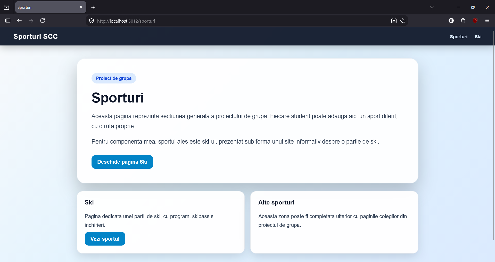

Această pagină reprezintă punctul de intrare în tema generală **Sporturi**. Ea este gândită pentru integrarea mai multor sporturi în proiectul de grup, iar pentru componenta mea există link către pagina dedicată ski-ului.

---

## Pagina principală Ski


Aceasta este pagina principală pentru sportul ales. Pagina prezintă o pârtie de ski fictivă, cu design tematic de iarnă și acces rapid către program, skipass, închirieri și contact.

---

## Pagina Program și stare pârtie


Această pagină afișează programul de funcționare al pârtiei, informații despre nocturnă, starea pârtiei, stratul de zăpadă și instalația de transport pe cablu.

---

## Pagina Skipass și urcări individuale


Această secțiune prezintă tarifele pentru skipass și urcări individuale. Sunt incluse variante pentru adulți și copii, precum și abonamente pe durate diferite.

---

## Pagina Închirieri echipament


Pagina de închirieri afișează echipamentele disponibile, precum set complet de ski, schiuri, clăpari, cască și ochelari, împreună cu prețurile aferente.

---

## Pagina Contact și reguli

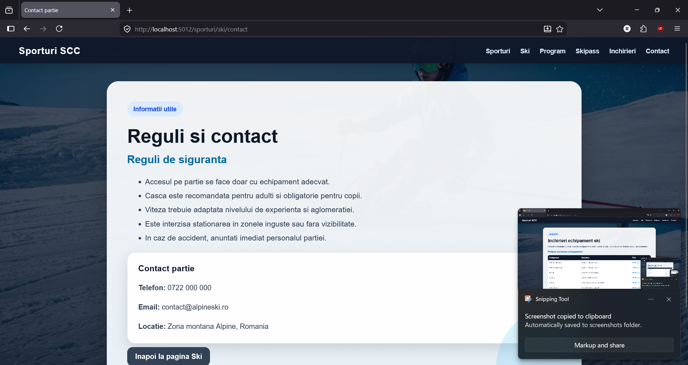

Această pagină include reguli de siguranță pentru utilizarea pârtiei și informații de contact pentru centrul de ski.

---

# Capturi Docker

## Construirea imaginii Docker

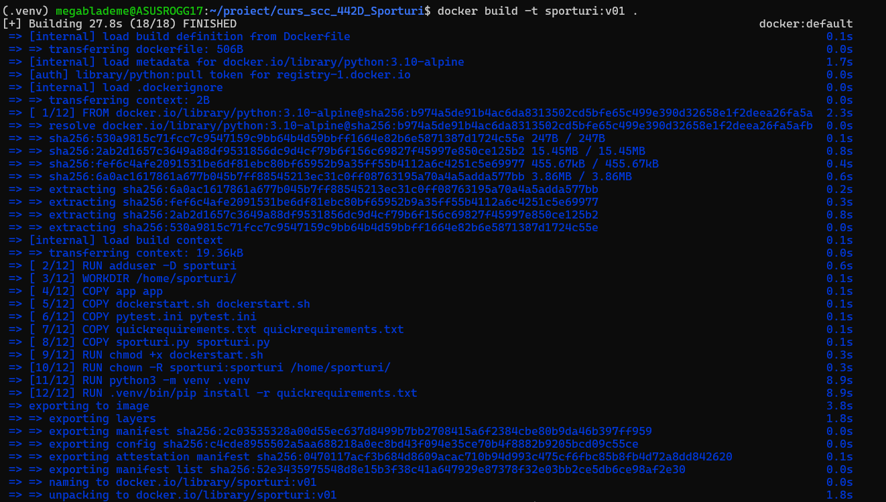

Captura arată procesul de construire a imaginii Docker pe baza fișierului `Dockerfile`. În această etapă sunt copiate fișierele proiectului, este creat mediul virtual și sunt instalate dependențele.

---

## Imagine Docker creată


Această captură confirmă faptul că imaginea Docker pentru proiect a fost creată cu succes și apare în lista imaginilor locale.

---

## Rularea containerului Docker

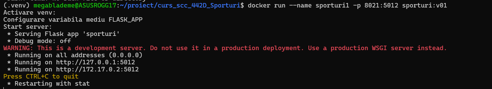

Captura arată pornirea containerului Docker și rularea aplicației Flask în interiorul acestuia.

---

## Container activ

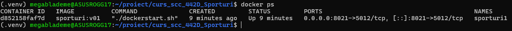

Această captură confirmă că aplicația rulează într-un container activ și că portul containerului este mapat către portul local.

---

# Capturi Jenkins

## Status pipeline Jenkins

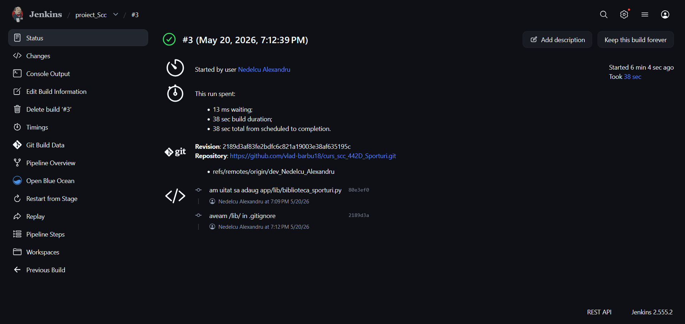

Această captură prezintă rezultatul rulării pipeline-ului Jenkins. Pipeline-ul automatizează pașii de build, analiză statică, testare și deploy.

---

## Pipeline în Blue Ocean


Blue Ocean oferă o reprezentare vizuală a etapelor pipeline-ului Jenkins, fiind util pentru urmărirea clară a stadiului fiecărui pas.

---

## Concluzii

Proiectul demonstrează parcurgerea unui flux complet de dezvoltare software pentru o aplicație web simplă:

- implementare aplicație Flask;
- organizarea codului în module separate;
- folosirea unei biblioteci Python dedicate pentru conținutul paginilor;
- testare automată cu pytest;
- analiză statică folosind pylint;
- rulare locală în WSL;
- containerizare cu Docker;
- automatizare CI/CD folosind Jenkins;
- versionare și colaborare prin GitHub.

Aplicația poate fi extinsă ulterior prin adăugarea altor sporturi în pagina generală `/sporturi`, fiecare sport având propriile rute și funcționalități.

---

## Bibliografie

- Flask Documentation: https://flask.palletsprojects.com/
- Pytest Documentation: https://docs.pytest.org/
- Pylint Documentation: https://pylint.pycqa.org/
- Docker Documentation: https://docs.docker.com/
- Jenkins Documentation: https://www.jenkins.io/doc/
- Repository model curs SCC: https://github.com/crchende/sysinfo.git

---

# Patinaj artistic — Oprea Andreea
[↑ Cuprins](#sporturi-integrate-în-readmemd)

# curs_scc_442D_Sporturi — Patinaj artistic

## Cuprins

1. [Student](#student)
2. [Descriere aplicație](#descriere-aplicație)
3. [Funcționalitate implementată](#funcționalitate-implementată)
4. [Structura proiectului](#structura-proiectului)
5. [Configurare și rulare locală](#configurare-și-rulare-locală)
6. [Pagini WEB](#pagini-web)
7. [Testare cu pytest](#testare-cu-pytest)
8. [Verificare statică cu pylint](#verificare-statică-cu-pylint)
9. [Containerizare Docker](#containerizare-docker)
10. [DevOps CI — Jenkins](#devops-ci--jenkins)
11. [Integrare GitHub](#integrare-github)
12. [Stadiul implementării](#stadiul-implementării)
13. [Concluzii](#concluzii)
14. [Bibliografie](#bibliografie)

---

## Student

- **Nume:** Oprea Andreea
- **Grupă:** 442D
- **Temă:** Sporturi
- **Element ales:** Patinaj artistic
- **Branch dezvoltare:** `dev_oprea_andreea`
- **Branch personal principal:** `main_oprea_andreea`

---

## Descriere aplicație

Aplicația este realizată în **Python**, folosind framework-ul **Flask**. Tema proiectului este **Sporturi**, iar elementul ales pentru implementare este **Patinaj artistic**.

Aplicația prezintă informații despre patinaj artistic, sărituri specifice acestui sport și echipamentele folosite. Proiectul include rulare locală, testare automată, verificare statică a codului, containerizare cu Docker și automatizare prin Jenkins.

Rutele aplicației sunt:

| Rută | Conținut |
|---|---|
| `/sporturi` | Pagina principală a temei Sporturi |
| `/sporturi/patinaj-artistic` | Pagina elementului ales: Patinaj artistic |
| `/sporturi/patinaj-artistic/sarituri` | Informații despre sărituri în patinaj artistic |
| `/sporturi/patinaj-artistic/echipamente` | Informații despre echipamentele folosite |

---

## Funcționalitate implementată

Funcționalitatea principală este împărțită între fișierul Flask `sporturi.py` și biblioteca `app/lib/biblioteca_sporturi.py`.

În `app/lib/biblioteca_sporturi.py` au fost implementate două funcții:

```python
sarituri_patinaj_artistic()
echipamente_patinaj_artistic()
```

Funcția `sarituri_patinaj_artistic()` returnează conținut HTML despre săriturile importante din patinaj artistic, precum Axelul, Toe Loop, Salchow, Loop, Flip și Lutz.

Funcția `echipamente_patinaj_artistic()` returnează conținut HTML despre echipamentele utilizate: patine, costum de concurs, mănuși, protecții și huse pentru lame.

Fișierul `sporturi.py` folosește aceste funcții pentru a construi paginile WEB asociate rutelor aplicației.


---

## Structura proiectului

```text
curs_scc_442D_Sporturi/
├── app/
│   ├── __init__.py
│   ├── lib/
│   │   ├── __init__.py
│   │   └── biblioteca_sporturi.py
│   └── test/
│       ├── __init__.py
│       └── test_biblioteca_sporturi.py
├── doc/
│   └── screenshots/
├── static/
│   └── images/
│       ├── poza_generala.jpeg
│       ├── poza_sarituri.jpeg
│       └── poza_echipamente.png
├── .gitignore
├── Dockerfile
├── Jenkinsfile
├── LICENSE
├── README.md
├── activeaza_venv
├── activeaza_venv_jenkins
├── dockerstart.sh
├── pytest.ini
├── quickrequirements.txt
├── ruleaza_aplicatia
└── sporturi.py
```

Rolul fișierelor principale:

| Fișier / folder | Rol |
|---|---|
| `sporturi.py` | Fișierul principal al aplicației Flask |
| `app/lib/biblioteca_sporturi.py` | Biblioteca în care sunt definite funcțiile pentru conținut |
| `app/test/test_biblioteca_sporturi.py` | Teste unitare pentru funcțiile din bibliotecă |
| `static/images/` | Imaginile afișate în paginile aplicației |
| `activeaza_venv` | Activează mediul virtual local sau îl creează dacă lipsește |
| `activeaza_venv_jenkins` | Creează mediul virtual și instalează dependențele pentru Jenkins |
| `ruleaza_aplicatia` | Pornește aplicația local prin Flask |
| `quickrequirements.txt` | Lista dependențelor folosite de scripturi, Docker și Jenkins |
| `pytest.ini` | Configurare pentru rularea testelor cu pytest |
| `Dockerfile` | Definește imaginea Docker a aplicației |
| `dockerstart.sh` | Pornește aplicația în container |
| `Jenkinsfile` | Definește pipeline-ul Jenkins |
| `doc/screenshots/` | Capturi de ecran folosite în documentație |

---

## Configurare și rulare locală

Pentru a rula proiectul pe un calculator nou, se descarcă repository-ul, se intră pe branch-ul de dezvoltare personal și se pornește aplicația prin scripturile existente în proiect.

### Pregătire proiect

```bash
git clone https://github.com/vlad-barbu18/curs_scc_442D_Sporturi.git
cd curs_scc_442D_Sporturi
git checkout dev_oprea_andreea
```

Pentru confirmare, se poate verifica branch-ul activ:

```bash
git branch
```

În listă trebuie să fie marcat cu `*` branch-ul:

```text
dev_oprea_andreea
```

### Dependențe

Dependențele principale ale proiectului sunt:

```text
flask
pytest
pylint
```

Acestea sunt definite în `quickrequirements.txt`

### Activare mediu virtual

```bash
. ./activeaza_venv
```

Dacă mediul virtual `.venv` există deja, acesta este activat. Dacă nu există, scriptul apelează `activeaza_venv_jenkins`, creează mediul virtual și instalează dependențele.

### Pornire aplicație

```bash
./ruleaza_aplicatia
```

Aplicația este accesibilă în browser la:

```text
http://127.0.0.1:5000/sporturi
```

---

## Pagini WEB

### `/sporturi`


### `/sporturi/patinaj-artistic`


### `/sporturi/patinaj-artistic/sarituri`


### `/sporturi/patinaj-artistic/echipamente`


---

## Testare cu pytest

Testele sunt definite în fișierul:

```text
app/test/test_biblioteca_sporturi.py
```

Sunt testate funcțiile:

```python
sarituri_patinaj_artistic()
echipamente_patinaj_artistic()
```

Testarea verifică dacă funcțiile din bibliotecă returnează informațiile așteptate. Astfel se confirmă că partea de conținut pentru patinaj artistic funcționează corect înainte de integrarea modificărilor.

Comanda folosită:

```bash
PYTHONPATH=. python3 -m pytest app/test
```

Rezultat obținut:

```text
collected 4 items
4 passed
```

Captură rulare teste:


---

## Verificare statică cu pylint

Pentru verificarea calității codului am folosit `pylint`. Acesta analizează fișierele Python și afișează observații despre stil, structură, docstring-uri și posibile probleme de cod.

Comanda folosită:

```bash
pylint --exit-zero app/lib/*.py app/test/*.py sporturi.py
```

Opțiunea `--exit-zero` permite afișarea observațiilor fără ca rularea să fie considerată eșuată.

Rezultat obținut:

```text
Your code has been rated at 10.00/10
```

Captură rulare pylint:


---

## Containerizare Docker

Pentru rularea aplicației într-un mediu izolat am folosit Docker. În acest proiect, imaginea este definită în `Dockerfile`, dependențele sunt instalate din `quickrequirements.txt`, iar aplicația este pornită în container prin scriptul `dockerstart.sh`.

### Construire imagine

Imaginea Docker a fost construită și apoi verificată în lista imaginilor locale:

```bash
docker build -t sporturi-patinaj-app .
docker images
```

Comanda `docker build` creează imaginea `sporturi-patinaj-app` pornind de la fișierele proiectului, iar `docker images` confirmă că imaginea există local.


### Pornire container

Pentru a evita conflictele cu un container mai vechi, acesta poate fi șters înainte de o nouă rulare. Apoi se pornește containerul și se verifică dacă rulează:

```bash
docker rm -f sporturi-patinaj-container
docker run -d -p 5010:5010 --name sporturi-patinaj-container sporturi-patinaj-app
docker ps
```

Portul `5010` din container este legat de portul `5010` al calculatorului, astfel că aplicația poate fi accesată în browser la:

```text
http://127.0.0.1:5010/sporturi
```


### Loguri container

Pentru verificarea accesării aplicației din container am folosit:

```bash
docker logs sporturi-patinaj-container
```

În loguri apar cererile HTTP către rutele aplicației. Codul `200` indică încărcarea cu succes a paginii, iar `304` poate apărea pentru fișiere statice deja salvate în cache de browser.


---

## DevOps CI — Jenkins

Pentru integrarea continuă am folosit Jenkins, pornit local din terminal:

```bash
java -jar /usr/share/java/jenkins.war
```

Interfața Jenkins a fost accesată în browser la:

```text
http://127.0.0.1:8080
```

Pipeline-ul este definit în fișierul `Jenkinsfile` și este configurat să preia codul din repository-ul GitHub, de pe branch-ul:

```text
dev_oprea_andreea
```

Înainte de rularea pipeline-ului, modificările au fost încărcate pe GitHub prin `git add`, `git commit` și `git push`, deoarece Jenkins preia codul din repository, nu direct din directorul local.

### Etape pipeline

| Etapă | Descriere |
|---|---|
| Build | Creează mediul virtual `.venv` și instalează dependențele folosind `activeaza_venv_jenkins` |
| pylint - calitate cod | Rulează verificarea statică pentru `app/lib/*.py`, `app/test/*.py` și `sporturi.py` |
| Unit Testing cu pytest | Rulează testele automate; rezultatul obținut este `4 passed` |
| Deploy | Etapă demonstrativă pentru finalizarea pipeline-ului |

Pipeline-ul a rulat cu succes, iar Jenkins a preluat ultimul commit de pe branch-ul `dev_oprea_andreea`.

### Rezultat Jenkins - interfața clasică

În interfața clasică Jenkins se observă build-ul executat cu succes, repository-ul folosit și commit-ul testat.


### Rezultat Jenkins - Blue Ocean

Pentru o vizualizare mai clară am folosit și Blue Ocean. În această interfață se văd etapele pipeline-ului, toate finalizate cu succes.


---

## Integrare GitHub

Fluxul de lucru folosit în proiect:

1. Dezvoltarea s-a făcut pe branch-ul `dev_oprea_andreea`.
2. Modificările au fost încărcate pe GitHub prin `git push`.
3. Testarea s-a făcut local, în Docker și în Jenkins.
4. A fost creat Pull Request din `dev_oprea_andreea` către `main_oprea_andreea`.
5. A fost realizat review pe Pull Request, apoi modificările au fost integrate.
6. A fost realizat review și pentru Pull Request-ul unui coleg, conform cerinței de lucru colaborativ.

Branch-uri folosite:

| Branch | Rol |
|---|---|
| `dev_oprea_andreea` | Branch personal de dezvoltare |
| `main_oprea_andreea` | Branch personal principal |
| `main` | Branch comun al grupei |

PR #1 dev_oprea_andreea → main_oprea_andreea (intermediar)

Pull Request verificat:

```text
PR #9 — TagaAndrei — Aplicatie Web Ciclism

---

## Stadiul implementării

| Componentă | Status |
|---|---|
| Aplicație Flask | Finalizat |
| Fișier principal `sporturi.py` | Finalizat |
| Bibliotecă `app/lib/biblioteca_sporturi.py` | Finalizat |
| Funcția `sarituri_patinaj_artistic()` | Finalizat |
| Funcția `echipamente_patinaj_artistic()` | Finalizat |
| Rute WEB | Finalizat |
| Imagini statice | Finalizat |
| Scripturi pentru venv | Finalizat |
| `ruleaza_aplicatia` | Finalizat |
| `pytest.ini` | Finalizat |
| Teste pytest | Finalizat |
| Verificare statică pylint | Finalizat |
| Dockerfile | Finalizat |
| `dockerstart.sh` | Finalizat |
| Container Docker | Finalizat |
| Jenkinsfile | Finalizat |
| Pipeline Jenkins | Finalizat |
| Pull Request `dev_oprea_andreea` → `main_oprea_andreea` | Finalizat |
| Review primit de la coleg | Finalizat |
| Review făcut la PR-ul unui coleg | Finalizat |
| Documentație README | Finalizat |

---

## Concluzii

Proiectul implementează o aplicație web Flask pentru tema Sporturi, cu elementul ales Patinaj artistic. Funcționalitatea este separată în fișierul principal al aplicației și într-o bibliotecă dedicată, ceea ce face proiectul mai ușor de organizat și extins.

Testele automate cu `pytest` confirmă funcționarea celor două funcții principale, iar `pylint` a fost folosit pentru verificarea statică a codului. Prin Docker, aplicația poate rula într-un mediu izolat, iar prin Jenkins a fost automatizat procesul de build, verificare statică și testare.

---

## Bibliografie

- Repository model `sysinfo`: https://github.com/crchende/sysinfo
- Repository proiect grupă: https://github.com/vlad-barbu18/curs_scc_442D_Sporturi
- Flask Documentation: https://flask.palletsprojects.com/
- Docker Documentation: https://docs.docker.com/
- Jenkins Documentation: https://www.jenkins.io/doc/
- pytest Documentation: https://docs.pytest.org/
- pylint Documentation: https://pylint.readthedocs.io/


---

# Înot — Ovezea Corina
[↑ Cuprins](#sporturi-integrate-în-readmemd)

# Înot — proiect SCC (tema Sporturi)

Aplicație web Flask care prezintă elementul **Înot** din tema **Sporturi**. Proiectul acoperă tot drumul: cod Python, teste, container Docker și pipeline Jenkins pentru build automat.

> **Autor:** Ovezea Corina • **Grupa:** 442D
> **Branch dezvoltare:** `dev_ovezea_corina`
> **Branch personal main:** `main_ovezea_corina`

---

## Ce face aplicația

Site-ul are 4 pagini, pornind de la tema generală și ajungând la informații concrete despre înot:

| URL | Ce afișează |
|---|---|
| `/sporturi` | Pagina temei — punct de intrare |
| `/sporturi/inot` | Despre proiect: ce este înotul și de ce l-am ales |
| `/sporturi/inot/concursuri` | Cele mai importante competiții internaționale (Jocurile Olimpice, Mondiale, Europene, World Cup, Universiada) |
| `/sporturi/inot/inotatori` | Înotători profesioniști de top (Phelps, Ledecky, Peaty, Sjöström, Dressel, Popovici) |

Fiecare pagină are imagini din `static/images/` și navigare între ele.

---

## Cum am organizat codul

Am ținut codul împărțit pe roluri clare, ca să nu se amestece logica:

- `sporturi.py` — entry point Flask (foarte scurt, doar înregistrează blueprint-ul)
- `app/lib/biblioteca_inot.py` — date + cele 2 funcții care produc HTML
- `app/routes/inot.py` — Blueprint cu cele 4 rute
- `app/tests/test_biblioteca_inot.py` — 10 teste pytest
- `static/images/` — 12 imagini folosite în pagini
- `doc/` — capturile de ecran din README
- `Dockerfile` + `dockerstart.sh` — containerizare
- `Jenkinsfile` — pipeline CI/CD
- `pytest.ini` + `quickrequirements.txt` — configurări
- `activeaza_venv` + `ruleaza_aplicatia` — scripturi utilitare

`sporturi.py` doar înregistrează blueprint-ul — toată logica e în `app/routes/inot.py`, ceea ce face mult mai ușor de extins ulterior.

În `app/lib/biblioteca_inot.py` am scris **două funcții publice** care întorc HTML, conform cerinței:

- `concursuri_inot()` — generează cardurile cu competiții
- `inotatori_inot()` — generează cardurile cu înotători

Datele sunt liste de dicționare la începutul fișierului, ca să fie ușor de adăugat ceva nou fără să umbli prin HTML.

---

## Cum o rulez

Mai întâi clonez repo-ul și trec pe branch-ul de lucru:

    git clone https://github.com/vlad-barbu18/curs_scc_442D_Sporturi.git
    cd curs_scc_442D_Sporturi
    git checkout dev_ovezea_corina

Apoi activez mediul virtual (scriptul îl creează singur prima dată) și pornesc aplicația:

    . ./activeaza_venv
    . ./ruleaza_aplicatia

Aplicația ascultă pe `http://127.0.0.1:5012/sporturi`.

---

## Testare

### Teste automate (pytest)

Am scris **10 teste** care verifică funcțiile din bibliotecă: că întorc string-uri nevide, că HTML-ul conține tagurile așteptate, că apar numele înotătorilor importanți și concursurile principale, și că numărul de carduri HTML reflectă datele din listele Python (consistență).

    pytest


### Verificare statică (pylint)

Am verificat fiecare fișier cu pylint. Codul a obținut **10.00/10** pe toate patru:

    pylint --exit-zero app/lib/biblioteca_inot.py
    pylint --exit-zero app/routes/inot.py
    pylint --exit-zero app/tests/test_biblioteca_inot.py
    pylint --exit-zero sporturi.py

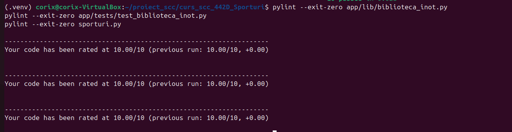

---

## Docker

Aplicația rulează în container pe baza imaginii `python:3.10-alpine`. Am ales Alpine pentru imagine mică (~170 MB final).

    docker build -t sporturi:v01 .
    docker run --name sporturi1 -p 8021:5012 sporturi:v01

Imaginea construită:

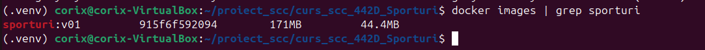

Containerul pornit (ascultă pe 8021 mapat la 5012 din container):

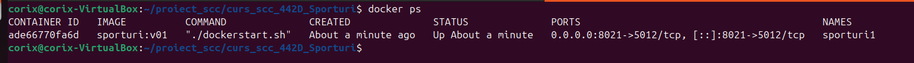

Output-ul din consolă la pornirea Flask în container:

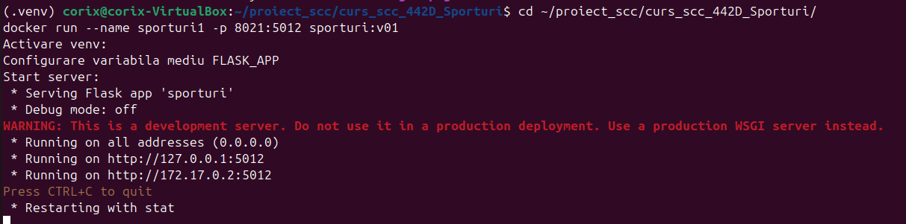

### Aplicația rulând din container

Cu containerul pornit, deschid `http://127.0.0.1:8021/sporturi` în browser și parcurg cele 4 rute:

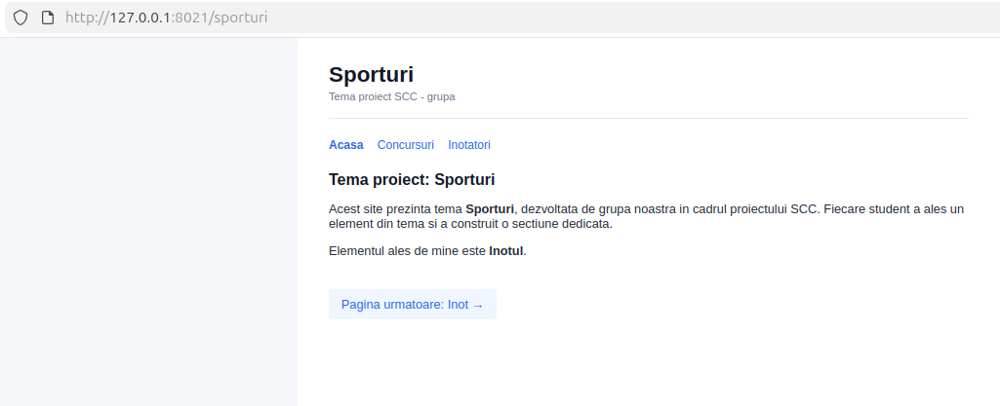

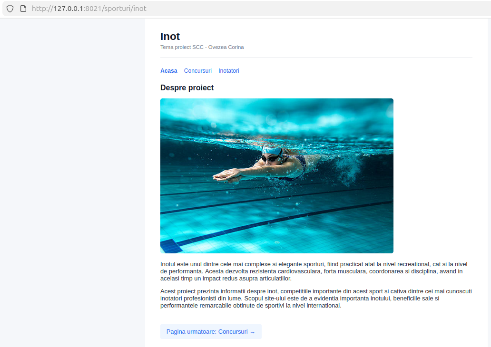

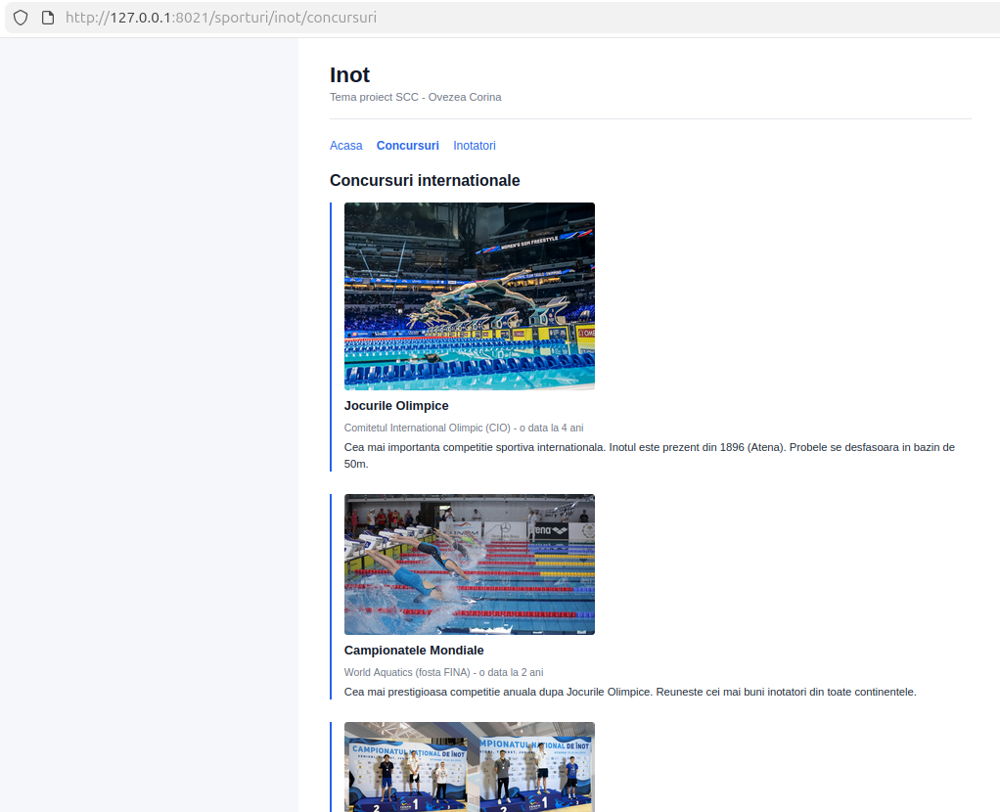

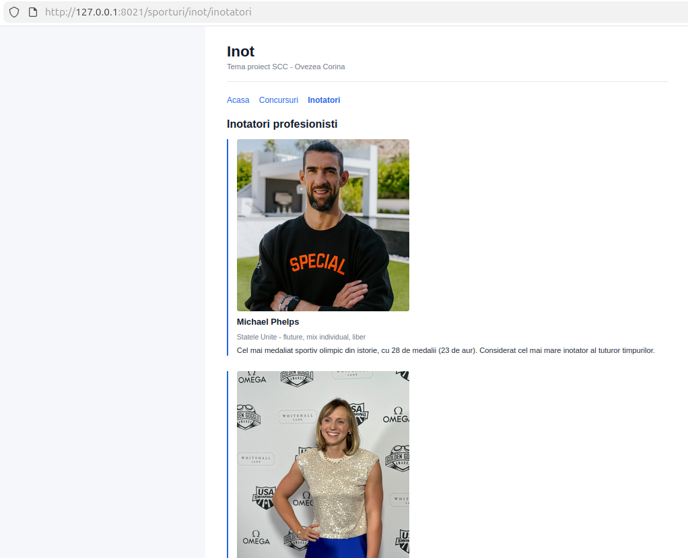

---

## Pipeline Jenkins

Pipeline declarativ în `Jenkinsfile`, cu 4 stages:

1. **Build** — creează venv-ul și instalează dependențele (`activeaza_venv_jenkins`)
2. **pylint** — rulează verificarea statică pe `app/lib/`, `app/routes/`, `app/tests/` și `sporturi.py`
3. **Unit Testing cu pytest** — rulează cele 10 teste
4. **Deploy** — `docker build` urmat de `docker create` cu tag-ul de build (`sporturi:v${BUILD_NUMBER}`)

Pipeline-ul rulat cu succes (vizualizare Blue Ocean):


---

## Workflow Git

Am ținut commit-uri mici și organizate pe etape, în loc de un singur commit gigantic. Asta face istoricul ușor de citit. Mesajele principale ale commit-urilor:

- chore: scripturi venv + quickrequirements + .gitignore
- feat: biblioteca_inot cu cele 2 functii publice
- feat: aplicatie Flask cu 4 rute + imagini statice
- test: 10 teste pytest pentru cele 2 functii
- feat: Dockerfile + dockerstart.sh + capturi de ecran
- ci+docs: Jenkinsfile + README complet
- docs: captura cu pipeline Jenkins
- refactor: muta cele 4 rute in app/routes/inot.py (Blueprint)
- refactor: rename functions to descriptive names

Integrarea în branch-ul personal de main se face printr-un **Pull Request** `dev_ovezea_corina → main_ovezea_corina`. Review-ul pe acest PR a fost făcut de **Voica Alina** (colegă de grupă).

---

## Bibliografie și surse

- Ghid intern al cursului SCC (Flask + Docker + Jenkins)
- Documentație oficială Flask: https://flask.palletsprojects.com/
- Documentație oficială pytest: https://docs.pytest.org/
- Imaginile folosite în pagini provin din surse publice (Wikipedia / site-uri oficiale ale competițiilor)


---

# Tenis de câmp — Petre Ana Maria
[↑ Cuprins](#sporturi-integrate-în-readmemd)

# Proiect SCC - Sporturi

## Dezvoltator

- **Nume:** Ana Maria Petre
- **Grupa:** 442D
- **Element alocat:** Tenis de câmp

---

# Cuprins

- [Descriere generală](#descriere-generală)
- [Funcționalitate implementată](#funcționalitate-implementată)
- [Stadiu dezvoltare](#stadiu-dezvoltare)
- [Testare manuală în browser (rulare-locală)](#testare-manuală-în-browser-rulare-locală)
- [Testare automată cu pytest](#testare-automată-cu-pytest)
- [Validare cod cu pylint](#validare-cod-cu-pylint)
- [Testare cu Docker](#testare-cu-docker)
- [DevOps CI](#devops-ci)
- [Concluzii](#concluzii)
- [Bibliografie](#bibliografie)

---

# Descriere generală

Obiectivul proiectului a fost realizarea unei aplicații web folosind framework-ul Flask, urmărind un proces complet de dezvoltare software în care au fost utilizate tehnologii moderne precum:

- Flask
- Docker
- Jenkins
- Python
- GitHub
- Pytest
- Pylint

Tema aleasă pentru proiect este reprezentată de domeniul sporturilor, iar elementul implementat este **tenisul de câmp**.

Aplicația oferă o prezentare modernă și interactivă a acestui sport, incluzând informații generale, tehnici importante și o structură modulară bazată pe rute Flask și funcții separate în biblioteci Python.

---

# Funcționalitate implementată

În cadrul proiectului au fost implementate următoarele componente:

## Bibliotecă Python dedicată

Fișierul:

```text
app/lib/biblioteca_sporturi.py
```

conține cele două funcții cerute:

- `functie_1_tenis()`  
  → afișează informații generale despre tenisul de câmp.

- `functie_2_tenis()`  
  → afișează tehnici importante utilizate în tenis.

---

## Fișier principal Flask

Fișierul:

```text
sporturi.py
```

conține cele patru rute principale:

| Rută | Descriere |
|---|---|
| `/sporturi` | Pagina principală a temei |
| `/sporturi/tenis` | Pagina dedicată tenisului |
| `/sporturi/tenis/functie_1_tenis` | Informații generale |
| `/sporturi/tenis/functie_2_tenis` | Tehnici importante |

---

## Testare automată

Au fost implementate teste automate în fișierul:

```text
app/tests/test_biblioteca_sporturi.py
```

Testele verifică:
- existența conținutului HTML
- structura paginilor
- prezența markerelor importante
- validarea funcțiilor din bibliotecă

---

# Stadiu dezvoltare

- Funcționalitate complet implementată
- Interfață modernă și responsive realizată
- Dockerfile și Jenkinsfile funcționale
- Testare locală și containerizată realizată cu succes
- Pipeline Jenkins configurat și executat cu succes
- Cod organizat modular pe biblioteci și teste

---

# Testare manuală în browser (rulare locală)

## Rulare aplicație

```bash
git clone <url-repo>
cd <folder-repo>

git checkout dev_nume_prenume

. ./activeaza_venv

./ruleaza_aplicatia
```

Aplicația poate fi accesată la:

```text
http://127.0.0.1:5012/sporturi
```

---

## Pagina principală

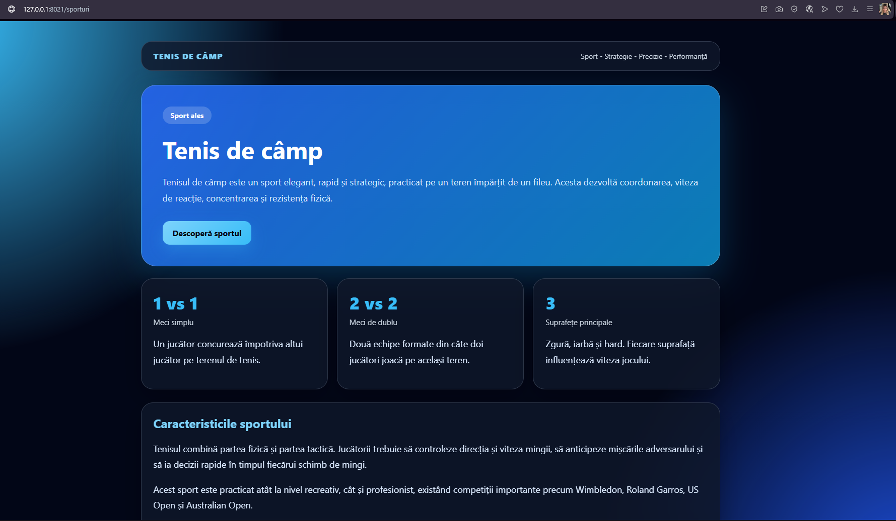

---

## Pagina tenis de câmp

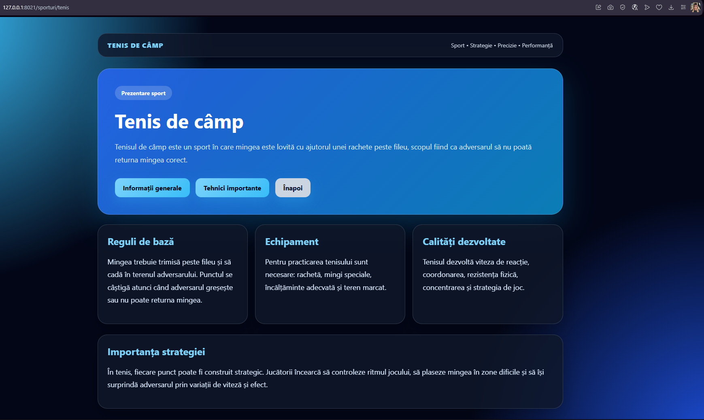

---

## Pagina funcția 1

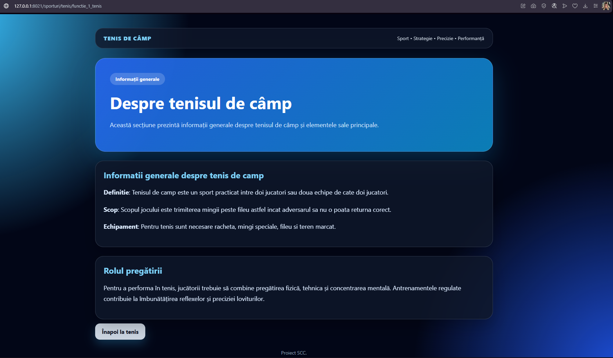

---

## Pagina funcția 2


---

# Testare automată cu pytest

Testele automate sunt rulate folosind:

```bash
pytest
```

Prin aceste teste este verificată funcționarea corectă a funcțiilor și generarea conținutului HTML.

---

# Validare cod cu pylint

Analiza statică a codului se realizează folosind:

```bash
pylint --exit-zero app/lib/biblioteca_sporturi.py

pylint --exit-zero app/tests/test_biblioteca_sporturi.py

pylint --exit-zero sporturi.py
```

Pylint este utilizat pentru verificarea calității codului și identificarea eventualelor probleme de stil sau structură.

---

# Testare cu Docker

## Build imagine Docker

```bash
docker build -t sporturi:v01 .
```

---

## Rulare container

```bash
docker run --name sporturi1 -p 8021:5012 sporturi:v01
```

---

## Imagine Docker creată

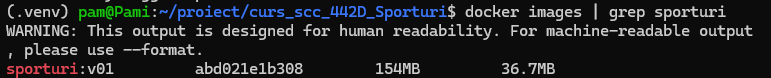

---

## Consolă container Flask

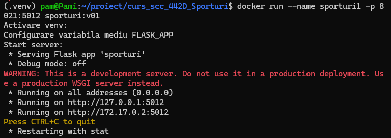

---

## Container activ

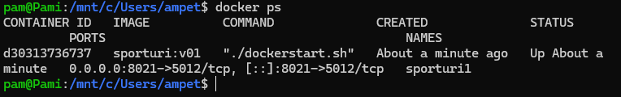

---

Aplicația containerizată poate fi accesată la:

```text
http://localhost:8021/sporturi
```

---

# DevOps CI

Pipeline-ul CI/CD a fost implementat folosind Jenkins și definit în fișierul:

```text
Jenkinsfile
```

Pipeline-ul conține 4 etape principale:

| Stage | Rol |
|---|---|
| Build | activare mediu virtual și instalare dependențe |
| pylint | analiză statică a codului |
| Unit Tests | rulare teste automate pytest |
| Deploy | build Docker și creare container |

---

## Pipeline Jenkins - Blue Ocean

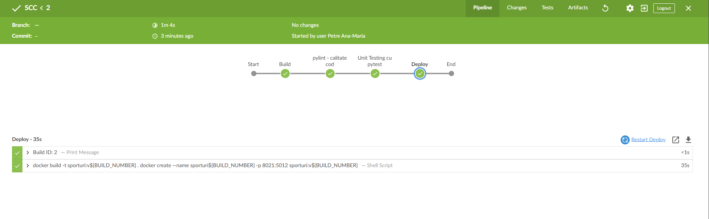

---

## Pipeline Jenkins clasic

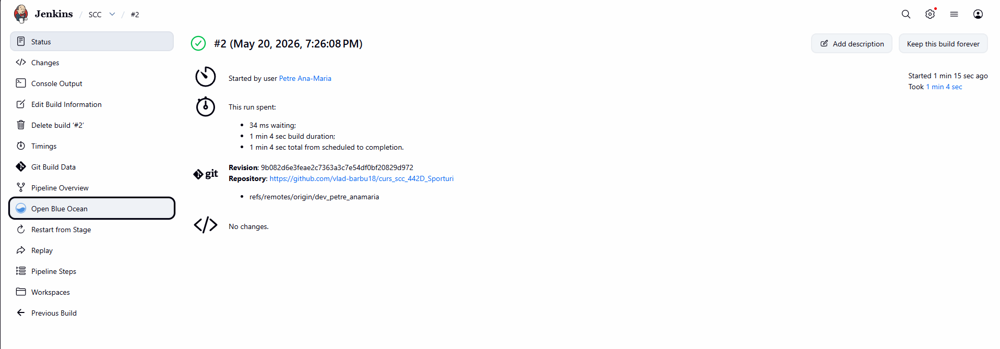

---

# Concluzii

În urma realizării acestui proiect au fost utilizate și integrate multiple tehnologii moderne de dezvoltare software.

Principalele avantaje ale aplicației sunt:

- **Dezvoltare modulară**  
  Separarea logicii în biblioteci și fișiere dedicate.

- **Interfață modernă**  
  Pagini web realizate într-un stil modern și responsive.

- **Portabilitate**  
  Docker permite rularea aplicației într-un mediu izolat și consistent.

- **Automatizare**  
  Jenkins automatizează procesul de build, testare și deploy.

- **Calitatea codului**  
  Testele pytest și verificările pylint asigură stabilitatea aplicației.

---

# Bibliografie

- https://github.com/crchende/sysinfo.git
- https://flask.palletsprojects.com/
- https://docs.docker.com/
- https://www.jenkins.io/doc/
- https://docs.pytest.org/

---

# Badminton — Preda Gabriela-Fabiana
[↑ Cuprins](#sporturi-integrate-în-readmemd)

# Proiect SCC - Badminton

## Dezvoltator
- **Nume:** Preda Gabriela-Fabiana
- **Grupa:** 442D
- **Element alocat:** Sport - Badminton

## Cuprins
- [Descriere generală](#descriere-generală)
- [Funcționalitate implementată](#funcționalitate-implementată)
- [Stadiu dezvoltare](#stadiu-dezvoltare)
- [Testare manuală în browser](#testare-manuală-în-browser-rulare-locală)
- [Testare automată cu pytest](#testare-automată-cu-pytest)
- [Validare cod cu pylint](#validare-cod-cu-pylint)
- [Testare cu Docker](#testare-cu-docker)
- [DevOps CI](#devops-ci)
- [Probleme întâlnite și rezolvare](#probleme-întâlnite-și-rezolvare)
- [Concluzii](#concluzii)
- [Bibliografie](#bibliografie)

## Descriere generală

Obiectivul proiectului a fost realizarea unei aplicații web folosind framework-ul Flask. Proiectul urmărește parcurgerea unui flux complet de dezvoltare software, folosind Python pentru programare, GitHub pentru versionare, Jenkins pentru automatizare și Docker pentru containerizare.

Tema aleasă este **Badminton**, aplicația prezentând informații despre acest sport, regulile de bază și echipamentul necesar pentru practicarea lui.

## Funcționalitate implementată

În acest branch am adăugat și personalizat aplicația pentru tema **Badminton**.

Au fost implementate următoarele fișiere și funcționalități:

- Fișierul `app/lib/biblioteca_badminton.py`, care conține funcțiile:
  - `reguli_badminton()` – afișează informații despre regulile de bază ale badmintonului.
  - `echipament_badminton()` – afișează informații despre echipamentul necesar pentru badminton.

- Fișierul principal `sporturi.py`, care conține rutele aplicației:
  - `/badminton` – pagina principală a temei.
  - `/badminton/prezentare` – pagina de prezentare a sportului.
  - `/badminton/prezentare/reguli_badminton` – pagina cu reguli de badminton.
  - `/badminton/prezentare/echipament_badminton` – pagina cu echipamentul necesar.

- Fișierul `app/tests/test_biblioteca_badminton.py`, care conține testele automate pentru funcțiile implementate.

- Folderul `static/images`, care conține imaginea folosită în aplicație:
  - `static/images/badminton.png`

## Stadiu dezvoltare

- Funcționalitatea aplicației este complet implementată.
- Codul a fost adăugat în branch-ul `main_fabiana_preda`.
- Aplicația rulează local în browser.
- Testele automate cu `pytest` rulează cu succes.
- Verificarea codului cu `pylint` este integrată în pipeline.
- Dockerfile-ul este configurat pentru rularea aplicației în container.
- Jenkinsfile-ul este configurat pentru build, verificare cod, testare și deploy.

## Testare manuală în browser (rulare locală)

Pentru rularea aplicației local:

```bash
git clone <url-repo>
cd curs_scc_442D_Sporturi
git checkout main_fabiana_preda
. ./activeaza_venv
python sporturi.py

Aplicația se accesează la: `http://127.0.0.1:5012/sporturi`


## Validare cod cu `pylint`

```bash
pylint --exit-zero app/lib/biblioteca_<tema>.py
pylint --exit-zero app/tests/test_biblioteca_<tema>.py
pylint --exit-zero <tema>.py
```


## Testare cu Docker

```bash
docker build -t sporturi:v02 .
docker run --name sporturi2 -p 8021:5012 sporturi:v02
```

Aplicația din container, accesată la `http://localhost:8021/sporturi`

# DevOps CI

Pipeline declarativ definit în `Jenkinsfile`, cu 4 stages:
1. **Build** - venv + dependențe
2. **pylint** - analiză statică (warning-only)
3. **Unit Tests** - pytest
4. **Deploy** - build Docker + creare container

## Concluzii

- **Dezvoltare modulară:** aplicație Flask cu separarea datelor și logicii.
- **Portabilitate:** Docker asigură rulare consistentă.
- **Automatizare:** Jenkins automatizează testarea și deploy-ul.
- **Asigurarea calității:** pytest și pylint integrate în pipeline.

## Bibliografie

https://github.com/crchende/sysinfo.git


---

# Formula 1 — Stancu Andreea
[↑ Cuprins](#sporturi-integrate-în-readmemd)

# curs_scc_442D_Sporturi
# Formula 1

Acest proiect reprezintă contribuția individuală pentru tema **Sporturi**, axată pe monitorizarea și afișarea datelor din competiția **Formula 1**.

---

## Cuprins
- [Student](#student)
- [Descriere aplicație](#descriere-aplicatie)
- [Funcționalități adăugate](#functionalitati-adaugate)
- [Structura proiectului](#structura-proiectului)
- [Configurare și rulare locală](#configurare-si-rulare-locala)
- [Pagini WEB](#pagini-web)
- [Testare cu pytest](#testare-cu-pytest)
- [Verificare statică cu pylint](#verificare-statica-cu-pylint)
- [Containerizare Docker](#containerizare-docker)
- [DevOps CI - Jenkins](#devops-ci-jenkins)
- [Integrare GitHub](#integrare-github)
- [Reviewed PRs](#reviewed-pr)
- [Stadiul implementării](#stadiul-implementarii)
- [Ce mai este de făcut](#ce-mai-este-de-facut)
- [Bibliografie](#bibliografie)

---

## <a name="student"></a> 1. Student
* **Nume:** Stancu Andreea
* **Grupă:** 442D
* **Repository:** `curs_scc_442D_Sporturi`
* **Branch Dezvoltare:** `dev_stancu_andreea`

## <a name="descriere-aplicatie"></a> 2. Descriere aplicație
Aplicația este un dashboard interactiv dezvoltat în **Python** folosind framework-ul **Flask**. Obiectivul principal este de a oferi informații rapide despre clasamentul piloților (Podium) și detalii tehnice despre circuitele din calendarul Formula 1.

## <a name="functionalitati-adaugate"></a> 3. Funcționalități adăugate
1.  **Ruta Home (`/`)**: Interfață interactivă cu butoane stilizate pentru navigare ușoară.
2.  **Ruta Podium (`/formula1`)**: Afișează dinamic primii trei piloți (Max Verstappen, Lando Norris, Charles Leclerc).
3.  **Ruta Circuite (`/circuit/<nume>`)**: Afișează descrieri specifice pentru circuite (ex. Monaco, Spa-Francorchamps).
4.  **Logică Backend separată**: Toate datele sunt procesate într-o bibliotecă dedicată în `app/lib/`.

## <a name="structura-proiectului"></a> 4. Structura proiectului
```text
curs_scc_442D_Sporturi/
├── sporturi.py           # Aplicația principală Flask (Rutele)
├── requirements.txt      # Dependențe (Flask, Pytest, Pylint)
├── Dockerfile            # Configurare containerizare
├── Jenkinsfile           # Pipeline CI declarative
├── app/
│   ├── __init__.py       # Marcaj pachet Python
│   └── lib/
│       ├── __init__.py
│       └── f1_logic.py    # Logica de business (Funcții)
├────── test_f1.py        # Teste unitare
└── media/                # Capturi de ecran (Dovezi)
```

## <a name="configurare-si-rulare-locala"></a> 5. Configurare și rulare locală
Pentru rularea aplicației în afara containerului (pentru dezvoltare rapidă), se urmează pașii:
* **Instalare dependințe**: Se utilizează fișierul `requirements.txt`.
  ```bash
  pip install -r requirements.txt
  ```
* **Lansare server Flask**: 
  ```bash
  python sporturi.py
  ```
* **Accesare**: 
  ```bash
  Aplicația este disponibilă la http://127.0.0.1:5000.
  ```

## <a name="pagini-web"></a> 6. Pagini WEB
Interfața este construită conform cerințelor de a avea rute pentru temă, element și informații specifice:
* **Home (`/`)**: Pagina de start cu butoane de navigare.
* **Tema (`/formula1`)**: Afișează podiumul piloților obținut prin funcția `primii_trei_piloti()`.
* **Elemente (`/circuit/Monaco`, `/circuit/Spa`)**: Detalii specifice extrase prin funcția `detalii_circuit()`.

<br>
<br> 
<br>
Captură de ecran: Interfața web accesată din browser, demonstrând accesibilitatea funcționalității
<br>

<br> 
<br>
Captură de ecran: Buton Podium
<br>

<br> 

Captură de ecran: Buton Circuit Spa
<br>

<br> 
<br>
Captură de ecran: Buton Circuit Monaco
<br>
<br>

## <a name="testare-cu-pytest"></a> 7. Testare cu pytest
Verificarea funcționalității se face prin unit-tests pentru a asigura calitatea codului adăugat:
* **Execuție**: Testele verifică dacă lista de piloți are exact 3 elemente și dacă numele sunt corecte conform logicii de business.
* **Comandă**: `pytest tests/test_f1.py`.
* **Integrare**: Rezultatele sunt raportate automat în etapa de testare a pipeline-ului Jenkins.

## <a name="verificare-statica-cu-pylint"></a> 8. Verificare statică cu pylint
Pentru asigurarea calității codului, am folosit analiza statică (code review automatizat):
* Am verificat conformitatea codului din `sporturi.py` și `app/lib/f1_logic.py` cu standardele Python (PEP8).
* Obiectivul este menținerea unui scor ridicat de mentenabilitate și eliminarea erorilor potențiale înainte de integrare.


## <a name="containerizare-docker"></a> 9. Containerizare Docker
Aplicația a fost containerizată folosind un `Dockerfile` prezent pe branch-ul de dezvoltare.

* **Imaginea**: Creată pentru a include tot mediul de rulare și dependințele necesare (Python, Flask).
  

* **Containerul**: Instanțiat și pornit pe baza imaginii pentru a izola execuția aplicației.
  

* **Validare**: Log-urile din consolă demonstrează că apelurile din browser sunt procesate de container, atestând legătura funcțională.
  


## <a name="devops-ci-jenkins"></a> 10. DevOps CI - Jenkins
Procesul de integrare continuă este gestionat printr-un pipeline declarativ definit în fișierul `Jenkinsfile`.

* **Etape automate**: Checkout, Build, Unit Tests (Pytest), Docker Build.
* **Trigger**: Pipeline-ul rulează automat la fiecare `push` pe branch-ul `dev_stancu_andreea`.


## <a name="integrare-github"></a> 11. Integrare GitHub
Sistemul de versionare Git este utilizat pentru managementul codului și colaborare.

* **Colaborare**: Repository-ul `curs_scc_442D_Sporturi` permite lucrul colaborativ prin adăugarea colegilor ca parteneri.
* **Flux Branch-uri**: Se utilizează `dev_stancu_andreea` pentru modificări locale și `main_stancu_andreea` pentru integrare intermediară.
* **Pull Request (PR)**: Orice integrare în `main` necesită minim un review de la un coleg de grupă pentru a asigura calitatea aplicației.

## <a name="reviewed-pr"></a> 12. Reviewed PRs
Conform cerințelor de colaborare, am participat la procesul de evaluare a codului (Code Review) pentru colegii de echipă:
* **PR ID**: #12
* **Coleg**: [Nume Coleg]
* **Status**: **Approved** (Validat după verificarea conformității cu standardele proiectului).

## <a name="stadiul-implementarii"></a> 13. Stadiul implementării
Următorul tabel centralizează progresul final al tuturor componentelor atribuite:

| Componentă | Status | Observații |
| :--- | :--- | :--- |
| **Funcționalitate** | Gata (100%) | Toate rutele Flask sunt operative. |
| **Testare Unitară** | Gata (PASS) | Testele Pytest trec cu succes în Jenkins. |
| **Containerizare** | Gata (Finalizat) | Imagine Docker creată și testată local. |
| **Documentare** | Gata (100%) | README completat conform stilului *sysinfo*. |


## <a name="ce-mai-este-de-facut"></a> 14. Ce mai este de făcut
Planificarea sarcinilor curente și viitoare:
- [x] Integrare logică F1 în aplicația Flask.
- [x] Reparare aserțiuni teste (corectare index `[0]` pentru validarea lui Max Verstappen).
- [ ] **Integrarea finală a README-ului** în branch-ul `main` (după primirea review-ului de la coleg).
- [ ] Închiderea Pull Request-ului după validarea finală a echipei de coordonare.

## <a name="bibliografie"></a> 15. Bibliografie
Resursele utilizate pentru documentarea și implementarea acestui proiect:
1. **Îndrumar Proiect SCC** - Ciprian Chende, Cornelia Bădoi (Ghidul oficial de laborator).
2. **Documentație Flask** - [https://flask.palletsprojects.com/](https://flask.palletsprojects.com/) (Resursa oficială pentru rute și server web).
3. **Exemplu Proiect sysinfo** - [https://github.com/crchende/sysinfo](https://github.

---
*Proiect realizat de: Stancu Andreea-Beatrice, grupa 442D*


---

# Golf — Șelțer Andrei
[↑ Cuprins](#sporturi-integrate-în-readmemd)

# Proiect SCC - Sporturi

## Dezvoltator
- **Nume:** Selter Andrei
- **Grupa:** 442D
- **Element alocat:** Golf

## Cuprins
- [Descriere generala](#descriere-generala)
- [Functionalitate implementata](#functionalitate-implementata)
- [Stadiu dezvoltare](#stadiu-dezvoltare)
- [Testare manuala in browser - rulare locala](#testare-manuala-in-browser---rulare-locala)
- [Testare automata cu pytest](#testare-automata-cu-pytest)
- [Validare cod cu pylint](#validare-cod-cu-pylint)
- [Testare cu Docker](#testare-cu-docker)
- [DevOps CI](#devops-ci)
  - [Exemplu executie pipeline Jenkins](#exemplu-executie-pipeline-jenkins)
- [Concluzii](#concluzii)
- [Bibliografie](#bibliografie)

---

## Descriere generala

Obiectivul proiectului a fost realizarea unei aplicatii web folosind framework-ul Flask si parcurgerea unui proces complet de dezvoltare software. In cadrul proiectului au fost utilizate mai multe unelte specifice dezvoltarii moderne: Python, Flask, GitHub, Docker si Jenkins.

Tema generala a grupei 442D este **Sporturi**, iar elementul ales pentru implementarea individuala este **Golf**.

Aplicatia permite accesarea unor pagini web simple care prezinta informatii despre sportul Golf, regulile de baza, echipamentul utilizat si terenul de joc.

---

## Functionalitate implementata

In acest branch am adaugat si personalizat functionalitatea pentru sportul **Golf**.

Au fost modificate sau adaugate urmatoarele componente:

- Fisierul `app/lib/biblioteca_sporturi.py`, care contine functiile pentru sportul Golf:
  - `reguli_golf()` - returneaza informatii despre regulile principale ale jocului de golf.
  - `echipament_golf()` - returneaza informatii despre echipamentul utilizat in golf.
  - `teren_golf()` - returneaza informatii despre terenul de golf.

- Fisierul principal `sporturi.py`, care contine rutele Flask pentru accesarea paginilor:
  - `/` - pagina principala a aplicatiei.
  - `/golf` - pagina principala a elementului ales.
  - `/golf/reguli` - pagina cu regulile jocului de golf.
  - `/golf/echipament` - pagina cu echipamentul utilizat in golf.
  - `/golf/teren` - pagina cu informatii despre terenul de golf.

- Fisierul `app/test/test_biblioteca_sporturi.py`, care contine testele automate pentru functiile implementate.

- Fisierul `Dockerfile`, folosit pentru containerizarea aplicatiei.

- Fisierul `dockerstart.sh`, folosit pentru pornirea aplicatiei in interiorul containerului Docker.

- Fisierul `Jenkinsfile`, folosit pentru automatizarea etapelor de build, analiza statica, testare si creare container Docker.

---

## Stadiu dezvoltare

- Functionalitatea pentru Golf este implementata.
- Codul a fost adaugat in branch-ul de lucru `dev_selter_andrei`.
- Aplicatia Flask ruleaza local pe portul `5011`.
- Testele automate cu `pytest` au fost rulate cu succes.
- Dockerfile-ul este functional, iar aplicatia ruleaza in container.
- Jenkinsfile-ul a fost configurat pentru pipeline.
- Urmeaza rularea pipeline-ului Jenkins si adaugarea capturilor corespunzatoare.

---

## Testare manuala in browser - rulare locala

Clonarea repository-ului si selectarea branch-ului de dezvoltare:

```bash
mkdir proiect
cd proiect
git clone https://github.com/vlad-barbu18/curs_scc_442D_Sporturi.git
cd curs_scc_442D_Sporturi
git checkout dev_selter_andrei
```

Activarea mediului virtual si pornirea aplicatiei:

```bash
. ./activeaza_venv
. ./ruleaza_aplicatia
```

Daca apar erori de permisiuni, se pot folosi comenzile:

```bash
chmod +x activeaza_venv
chmod +x ruleaza_aplicatia
chmod +x dockerstart.sh
```

Aplicatia poate fi accesata in browser la adresa:

```text
http://127.0.0.1:5011/golf
```

sau, in masina virtuala:

```text
http://10.0.2.15:5011/golf
```

Capturile de mai jos prezinta paginile aplicatiei accesate din browser in timpul rularii locale.

Pagina elementului ales, Golf:


Pagina cu regulile jocului de golf:


Pagina cu echipamentul utilizat in golf:


Pagina cu informatii despre terenul de golf:


---

## Testare automata cu pytest

Testele au fost scrise in fisierul:

```text
app/test/test_biblioteca_sporturi.py
```

Acestea verifica daca functiile pentru Golf returneaza textele asteptate.

Comanda folosita pentru rularea testelor:

```bash
PYTHONPATH=. pytest app/test/test_biblioteca_sporturi.py -v
```

Rezultatul obtinut:

```text
3 passed
```

Captura de mai jos prezinta rularea testelor automate:


---

## Validare cod cu pylint

Pentru verificarea calitatii codului sursa se utilizeaza pachetul `pylint`. Acesta analizeaza codul Python si semnaleaza eventuale probleme legate de stil, conventii de numire, docstring-uri sau alte aspecte.

In cadrul acestui proiect, problemele raportate de `pylint` sunt doar afisate pentru monitorizare, fara a opri executia pipeline-ului Jenkins.

Comenzi de rulare:

```bash
pylint --exit-zero app/lib/biblioteca_sporturi.py
pylint --exit-zero app/test/test_biblioteca_sporturi.py
pylint --exit-zero sporturi.py
```

Captura cu rezultatul validarii codului:


---

## Testare cu Docker

Pentru asigurarea portabilitatii aplicatiei, a fost creat un container Docker pornind de la fisierul `Dockerfile` din radacina proiectului.

### 1. Construirea imaginii Docker

Comanda folosita pentru construirea imaginii:

```bash
docker build -t sporturi-golf:v01 .
```

Imaginea creata poate fi vizualizata cu:

```bash
docker images | grep sporturi-golf
```

Captura cu imaginea Docker creata:


### 2. Rularea containerului Docker

Comanda folosita pentru rularea containerului:

```bash
docker run --name sporturi-golf1 -p 8021:5011 sporturi-golf:v01
```

La pornirea containerului, in consola sunt afisate mesajele de configurare si pornire a serverului Flask:


Containerul activ se poate verifica folosind comanda:

```bash
docker ps
```

Captura cu lista containerelor active:


### 3. Accesarea aplicatiei in browser din container

Aplicatia rulata in container poate fi accesata la adresa:

```text
http://127.0.0.1:8021/golf
```

Capturile de mai jos prezinta rutele aplicatiei accesate din browser, in timp ce aplicatia ruleaza in containerul Docker.

Pagina Golf accesata din container:


Pagina Reguli Golf accesata din container:


Pagina Echipament Golf accesata din container:


Pagina Teren Golf accesata din container:


Dupa testare, containerul poate fi oprit si sters folosind comenzile:

```bash
docker stop sporturi-golf1
docker rm sporturi-golf1
```

---

## DevOps CI

- **CI** = Continuous Integration
- **CD** = Continuous Delivery / Continuous Deployment

Proiectul utilizeaza un flux de automatizare definit in fisierul `Jenkinsfile`. Acesta permite validarea automata a codului si pregatirea aplicatiei pentru rulare in container.

Pipeline-ul Jenkins contine urmatoarele etape:

1. **Build** - verificarea continutului proiectului si pregatirea mediului virtual.
2. **Pylint** - analiza statica a codului.
3. **Unit Testing cu pytest** - rularea testelor automate.
4. **Deploy Docker** - construirea imaginii Docker si crearea containerului.

Fisierul `Jenkinsfile` foloseste branch-ul:

```text
dev_selter_andrei
```

Pentru executia corecta a ultimei etape din pipeline, utilizatorul `jenkins` trebuie sa aiba permisiuni de rulare a comenzilor Docker.

Permisiunile au fost configurate cu:

```bash
sudo usermod -aG docker jenkins
sudo systemctl restart jenkins
```

---

### Exemplu executie pipeline Jenkins

Jenkins se acceseaza local in browser la adresa:

```text
http://127.0.0.1:8080
```

Dupa configurarea job-ului/pipeline-ului, se foloseste optiunea **Build Now** pentru pornirea executiei.

Rezultatul executiei pipeline-ului in Jenkins:


Vizualizarea clasica Jenkins cu detaliile build-ului:


---

## Concluzii

Prin realizarea acestui proiect au fost atinse obiectivele principale legate de dezvoltarea, testarea si containerizarea unei aplicatii web simple.

Aplicatia Flask a fost dezvoltata modular, folosind fisierul principal `sporturi.py` pentru rute si fisierul `app/lib/biblioteca_sporturi.py` pentru logica specifica elementului Golf.

Testarea automata cu `pytest` a confirmat functionarea corecta a functiilor implementate, iar analiza statica prin `pylint` ajuta la imbunatatirea calitatii codului.

Prin Docker, aplicatia poate fi rulata intr-un mediu izolat si portabil, independent de configuratia locala a sistemului. Jenkins permite automatizarea procesului de build, testare si creare a containerului, ceea ce reproduce un flux de lucru apropiat de cel folosit in proiectele software reale.

Proiectul a fost actualizat final pentru etapa de review.

---

## Bibliografie

- https://github.com/crchende/sysinfo.git
- Flask Documentation
- Docker Documentation
- Jenkins Documentation
- GitHub Documentation


---

# Ciclism — Țaga Andrei
[↑ Cuprins](#sporturi-integrate-în-readmemd)

# Proiect SCC - Sporturi: Ciclism

## Cuprins

1. [Descriere aplicație](#descriere-aplicație)
2. [Student](#student)
3. [Funcționalitate implementată](#funcționalitate-implementată)
4. [Structura proiectului](#structura-proiectului)
5. [Configurare și rulare locală](#configurare-și-rulare-locală)
6. [Pagini web implementate](#pagini-web-implementate)
7. [Testare cu pytest](#testare-cu-pytest)
8. [Verificare statică folosind pylint](#verificare-statică-folosind-pylint)
9. [Containerizare Docker](#containerizare-docker)
10. [Pipeline Jenkins](#pipeline-jenkins)
11. [Stadiul implementării](#stadiul-implementării)
12. [Bibliografie](#bibliografie)

---

## Descriere aplicație

Această aplicație web este realizată în Python, folosind framework-ul Flask. Aplicația are la bază scheletul proiectului `sysinfo`, însă funcționalitatea a fost adaptată pentru tema grupei: **Sporturi**.

Elementul ales pentru implementare este **ciclismul**. Aplicația afișează informații despre ciclism, competiții importante de ciclism și echipamente folosite de cicliști.

Aplicația poate fi:
- rulată local;
- testată cu `pytest`;
- verificată static folosind `pylint`;
- rulată într-un container Docker;
- verificată automat printr-un pipeline Jenkins.

---

## Student

Nume: Taga Andrei  
Grupa: 442D  
Tema grupei: Sporturi  
Sport ales: Ciclism  

Branch de dezvoltare:

```text
dev_taga_andrei
```

Branch personal principal:

```text
main_taga_andrei
```

Repository GitHub:

```text
https://github.com/vlad-barbu18/curs_scc_442D_Sporturi.git
```

---

## Funcționalitate implementată

Funcționalitatea adăugată constă în realizarea unei aplicații web Flask care prezintă informații despre ciclism.

Fișierul principal al aplicației este:

```text
sporturi.py
```

Fișierul bibliotecă este:

```text
app/lib/biblioteca_sporturi.py
```

În biblioteca aplicației au fost implementate două funcții principale:

```python
competitii_ciclism()
echipament_ciclism()
```

Funcția `competitii_ciclism()` afișează informații despre competiții importante de ciclism, precum:
- Tour de France;
- Giro d'Italia / Turul Italiei;
- La Vuelta a Espana;
- Campionatele Mondiale UCI;
- Jocurile Olimpice.

Funcția `echipament_ciclism()` afișează informații despre echipamente folosite în ciclism, precum:
- bicicleta;
- casca;
- mănușile;
- ochelarii;
- tricoul de ciclism;
- pantalonii cu bazon;
- încălțămintea specială;
- computerul de bicicletă.

Aplicația include și imagini statice:
- `static/images/stage2.jpeg` - imagine personală de la Turul Italiei 2026, etapa a 2-a;
- `static/images/bicla.jpeg` - imagine cu bicicleta personală de șosea.

---

## Structura proiectului

Structura principală a proiectului este:

```text
curs_scc_442D_Sporturi/
├── .github/
│   └── workflows/
├── app/
│   ├── grafice/
│   ├── lib/
│   │   └── biblioteca_sporturi.py
│   ├── tests/
│   │   └── test_biblioteca_sporturi.py
│   └── test_bash_eroare/
├── doc/
│   ├── dockerdoc.md
│   └── screenshots/
├── static/
│   ├── images/
│   │   ├── bicla.jpeg
│   │   └── stage2.jpeg
│   └── imagini/
├── .gitignore
├── Dockerfile
├── Jenkinsfile
├── README.md
├── activeaza_venv
├── activeaza_venv_jenkins
├── dockerstart.sh
├── pytest.ini
├── quickrequirements.txt
├── ruleaza_aplicatia
└── sporturi.py
```

Rolul fișierelor principale:

| Fișier / folder | Rol |
|---|---|
| `sporturi.py` | Fișierul principal al aplicației Flask |
| `app/lib/biblioteca_sporturi.py` | Biblioteca în care sunt definite funcțiile pentru conținutul paginilor |
| `app/tests/test_biblioteca_sporturi.py` | Teste unitare pentru funcțiile din bibliotecă |
| `static/images/` | Folder pentru imaginile afișate în paginile web |
| `Dockerfile` | Fișier pentru construirea imaginii Docker |
| `dockerstart.sh` | Script folosit pentru pornirea aplicației în container |
| `Jenkinsfile` | Pipeline Jenkins pentru build, verificare statică, teste și Docker build |
| `activeaza_venv` | Script pentru activarea mediului virtual local |
| `activeaza_venv_jenkins` | Script pentru crearea/activarea mediului virtual în Jenkins |
| `quickrequirements.txt` | Lista dependențelor Python necesare |
| `pytest.ini` | Configurare pentru rularea testelor cu pytest |
| `doc/screenshots/` | Folder pentru capturile de ecran folosite în documentație |

---

## Configurare și rulare locală

Pentru rularea locală a aplicației se folosește un mediu virtual Python.

### 1. Clonare repository

```bash
git clone https://github.com/vlad-barbu18/curs_scc_442D_Sporturi.git
cd curs_scc_442D_Sporturi
git checkout main_taga_andrei
```

### 2. Activare mediu virtual

Activarea mediului virtual se face cu:

```bash
source activeaza_venv
```

Dacă mediul virtual există deja, acesta este activat. Dacă nu există, scriptul creează mediul virtual și instalează dependențele necesare.

Dependențele proiectului sunt definite în fișierul:

```text
quickrequirements.txt
```

Conținutul fișierului este:

```text
flask
pytest
pylint
```

### 3. Pornire aplicație local

După activarea mediului virtual, aplicația se rulează cu:

```bash
./ruleaza_aplicatia
```

Aplicația rulează pe portul `5011` și poate fi accesată în browser la:

```text
http://127.0.0.1:5011
```

---

## Pagini web implementate

Aplicația conține următoarele pagini:

| Rută | Descriere |
|---|---|
| `/` | Pagina principală |
| `/ciclism` | Pagina de prezentare a ciclismului |
| `/ciclism/competitii` | Pagina cu informații despre competiții de ciclism |
| `/ciclism/echipament` | Pagina cu informații despre echipamente de ciclism |

### Pagina principală

URL:

```text
http://127.0.0.1:5011/
```

Captură:


### Pagina Ciclism

URL:

```text
http://127.0.0.1:5011/ciclism
```

Captură:


### Pagina Competiții

URL:

```text
http://127.0.0.1:5011/ciclism/competitii
```

Captură:


### Pagina Echipament

URL:

```text
http://127.0.0.1:5011/ciclism/echipament
```

Captură:


---

## Testare cu pytest

Pentru testarea aplicației a fost folosit `pytest`.

Fișierul de testare este:

```text
app/tests/test_biblioteca_sporturi.py
```

Testele verifică funcțiile din biblioteca aplicației:

```python
competitii_ciclism()
echipament_ciclism()
```

Comanda de rulare a testelor este:

```bash
pytest -v
```

Rezultat obținut:

```text
============================= test session starts ==============================
platform linux -- Python 3.12.3, pytest-9.0.3
collected 4 items

app/tests/test_biblioteca_sporturi.py::test_competitii_ciclism_contine_tour_de_france PASSED
app/tests/test_biblioteca_sporturi.py::test_competitii_ciclism_contine_giro PASSED
app/tests/test_biblioteca_sporturi.py::test_echipament_ciclism_contine_casca PASSED
app/tests/test_biblioteca_sporturi.py::test_echipament_ciclism_contine_bicicleta PASSED

============================== 4 passed in 0.01s ===============================
```

Captură:


---

## Verificare statică folosind pylint

Pentru verificarea calității codului a fost folosit `pylint`.

Comenzile folosite în pipeline sunt:

```bash
pylint --exit-zero app/lib/*.py
pylint --exit-zero app/tests/*.py
pylint --exit-zero sporturi.py
```

Opțiunea `--exit-zero` permite afișarea observațiilor fără oprirea pipeline-ului.

În cadrul verificării statice sunt analizate:
- fișierele din `app/lib/`;
- fișierele de test din `app/tests/`;
- fișierul principal `sporturi.py`.

Captură:


---

## Containerizare Docker

Aplicația a fost containerizată folosind Docker.

Fișierul folosit pentru definirea imaginii este:

```text
Dockerfile
```

Scriptul de pornire în container este:

```text
dockerstart.sh
```

### Build imagine Docker

Comanda pentru construirea imaginii Docker este:

```bash
sudo docker build -t sporturi-ciclism:latest .
```

Verificarea imaginii create:

```bash
sudo docker images
```

Captură:


### Rulare container Docker

Comanda pentru rularea containerului este:

```bash
sudo docker run --name sporturi-ciclism-container -p 5011:5011 sporturi-ciclism:latest
```

Dacă există deja un container cu același nume, acesta se poate șterge cu:

```bash
sudo docker rm -f sporturi-ciclism-container
```

Apoi se poate rula din nou:

```bash
sudo docker run --name sporturi-ciclism-container -p 5011:5011 sporturi-ciclism:latest
```

Verificarea containerului pornit:

```bash
sudo docker ps
```

Captură:


### Accesare aplicație din container

Aplicația rulată în container poate fi accesată în browser la:

```text
http://127.0.0.1:5011
```

Captură:


### Verificare loguri container

Pentru a verifica faptul că browserul accesează aplicația din container, se pot consulta logurile:

```bash
sudo docker logs sporturi-ciclism-container
```

În loguri se observă cererile HTTP către aplicație:

```text
GET / HTTP/1.1
GET /ciclism HTTP/1.1
GET /ciclism/competitii HTTP/1.1
GET /ciclism/echipament HTTP/1.1
```

Captură:


---

## Pipeline Jenkins

Pipeline-ul Jenkins este definit în fișierul:

```text
Jenkinsfile
```

Pipeline-ul folosește branch-ul:

```text
dev_taga_andrei
```

Job-ul Jenkins este configurat să preia codul din repository-ul GitHub și să ruleze pașii definiți în `Jenkinsfile`.

### Etape pipeline Jenkins

| Etapă | Descriere |
|---|---|
| Build | Creează mediul virtual și instalează dependențele |
| pylint - calitate cod | Rulează verificarea statică a codului |
| Unit Testing cu pytest | Rulează testele unitare |
| Docker build | Construiește imaginea Docker |
| Deploy | Etapă demonstrativă de finalizare |

### Build

În etapa de build se rulează scriptul:

```bash
. ./activeaza_venv_jenkins
```

Acesta creează mediul virtual `.venv`, îl activează și instalează dependențele din `quickrequirements.txt`.

### Pylint

În etapa de verificare statică se rulează `pylint` pentru:
- `app/lib/*.py`;
- `app/tests/*.py`;
- `sporturi.py`.

Comenzile folosite sunt:

```bash
pylint --exit-zero app/lib/*.py
pylint --exit-zero app/tests/*.py
pylint --exit-zero sporturi.py
```

Opțiunea `--exit-zero` permite afișarea observațiilor fără oprirea pipeline-ului.

### Pytest

În etapa de testare se rulează:

```bash
pytest -v
```

Rezultatul obținut:

```text
4 passed
```

Acest rezultat confirmă faptul că funcțiile implementate în `app/lib/biblioteca_sporturi.py` sunt testate cu succes.

### Docker build

În etapa Docker se construiește imaginea aplicației:

```bash
docker build -t sporturi-ciclism:latest .
```

Această etapă verifică faptul că aplicația poate fi containerizată și că imaginea Docker se construiește corect pe baza fișierului `Dockerfile`.

### Rezultat Jenkins - interfața clasică

Pipeline-ul a fost rulat din Jenkins folosind branch-ul `dev_taga_andrei`. În interfața clasică Jenkins se poate observa rularea job-ului și rezultatul final al execuției.

Captură Jenkins clasic:


### Rezultat Jenkins - Blue Ocean

Pentru o vizualizare mai clară a pipeline-ului, a fost folosit și pluginul **Blue Ocean** din Jenkins. Acesta afișează etapele pipeline-ului într-un mod grafic, fiind mai ușor de urmărit dacă fiecare etapă a fost executată cu succes.

În Blue Ocean se pot observa etapele:
- Build;
- pylint - calitate cod;
- Unit Testing cu pytest;
- Docker build;
- Deploy.

Captură Blue Ocean:


### Concluzie Jenkins

Rularea pipeline-ului Jenkins confirmă faptul că proiectul poate fi verificat automat. Pipeline-ul realizează instalarea dependențelor, verificarea statică a codului, rularea testelor unitare și construirea imaginii Docker.

Rezultatul final al pipeline-ului este:

```text
PASS
```


## Stadiul implementării

| Componentă | Status |
|---|---|
| Aplicație Flask | Finalizat |
| Fișier principal `sporturi.py` | Finalizat |
| Bibliotecă `app/lib/biblioteca_sporturi.py` | Finalizat |
| Funcția `competitii_ciclism()` | Finalizat |
| Funcția `echipament_ciclism()` | Finalizat |
| Rute web | Finalizat |
| Imagini statice | Finalizat |
| Teste unitare pytest | Finalizat |
| Verificare statică pylint | Finalizat |
| Dockerfile | Finalizat |
| Container Docker | Finalizat |
| Jenkinsfile | Finalizat |
| Pipeline Jenkins | Finalizat |
| Pull Request `dev_taga_andrei -> main_taga_andrei` | Finalizat |
| Review primit de la coleg | Finalizat |
| Review făcut la PR-ul unui coleg | Finalizat |
| Integrare în `main` | Finalizat |

---

## Bibliografie

- Repository model `sysinfo`: https://github.com/crchende/sysinfo
- Repository proiect grupă: https://github.com/vlad-barbu18/curs_scc_442D_Sporturi
- Flask Documentation: https://flask.palletsprojects.com/
- Docker Documentation: https://docs.docker.com/
- Jenkins Documentation: https://www.jenkins.io/doc/
- pytest Documentation: https://docs.pytest.org/
- pylint Documentation: https://pylint.readthedocs.io/

---

# Sailing — Verde Mihai Gabriel
[↑ Cuprins](#sporturi-integrate-în-readmemd)

# Proiect SCC - Sporturi

## Dezvoltator
- **Nume:** Verde Mihai Gabriel
- **Grupa:** 442D
- **Element alocat:** Sailing

## Cuprins
- [Descriere generală](#descriere-generală)
- [Funcționalitate implementată](#funcționalitate-implementată)
- [Stadiu dezvoltare](#stadiu-dezvoltare)
- [Testare manuală în browser (rulare locală)](#testare-manuală-în-browser-rulare-locală)
- [Testare automată cu pytest](#testare-automată-cu-pytest)
- [Validare cod cu pylint](#validare-cod-cu-pylint)
- [Testare cu Docker](#testare-cu-docker)
- [DevOps CI](#devops-ci)
  - [Exemplu execuție pipeline Jenkins](#exemplu-execuție-pipeline-jenkins)
- [Concluzii](#concluzii)
- [Bibliografie](#bibliografie)

## Descriere generală

Obiectivul proiectului a fost realizarea unei aplicații web folosind framework-ul Flask, parcurgerea unui proces complet de dezvoltare software în care folosim Jenkins, Docker, Python și GitHub pentru versionare, containerizare, programare și automatizare.

Tema proiectului este **Sporturi**, iar elementul ales pentru implementare este **Sailing**. Aplicația prezintă informații despre acest sport nautic, despre competițiile importante de sailing și despre echipamentul folosit de sportivi.

Sailing-ul este un sport în care deplasarea ambarcațiunii se realizează cu ajutorul vântului, prin utilizarea velelor. Practicarea acestui sport presupune controlul direcției, al vitezei și al poziției bărcii în funcție de vânt, curenți și traseul competiției.

## Funcționalitate implementată

În acest branch am adăugat și personalizat:

- Fișierul `app/lib/biblioteca_sporturi.py` cu cele două funcții cerute:
  - `competitii_sailing()` – returnează codul HTML cu informații despre competiții importante de sailing, precum America's Cup, Sailing World Championships, Olympic Sailing Regatta, Volvo Ocean Race și Rolex Sydney Hobart Yacht Race.
  - `echipament_sailing()` – returnează codul HTML cu informații despre echipamentul folosit în sailing, precum barca cu vele, velele, vesta de salvare, costumul impermeabil și sistemele de control ale ambarcațiunii.

- Fișierul principal `sporturi.py` care are cele patru rute conform cerinței:
  - `/sporturi` – pagina principală a temei.
  - `/sporturi/sailing` – pagina principală a elementului ales.
  - `/sporturi/sailing/competitii_sailing` – informații despre competițiile de sailing.
  - `/sporturi/sailing/echipament_sailing` – informații despre echipamentul folosit în sailing.

- Fișierul `app/tests/test_biblioteca_sporturi.py` care conține testele automate pentru cele două funcții definite. Testele verifică prezența unor markeri specifici în HTML-ul generat, precum `America`, `Cup`, `Olympic`, `Sailing`, `Barca cu vele` și `Vesta de salvare`.

Interfața aplicației a fost personalizată pentru sportul ales. Design-ul folosește un fundal albastru marin cu gradient, un card transparent, butoane rotunjite și un footer cu numele dezvoltatorului.

## Stadiu dezvoltare

- Funcționalitate complet implementată.
- Cod adăugat în branch-ul de lucru `dev_verde_mihai_gabriel`.
- Dockerfile și fișierul `dockerstart.sh` sunt funcționale.
- Testare locală, automată și containerizată realizată cu succes.
- Pipeline-ul Jenkins a fost creat și executat cu succes.
- Capturile de ecran au fost adăugate în folderul `doc/`.
- README-ul documentează etapele principale ale proiectului.

## Testare manuală în browser (rulare locală)

Clonarea repository-ului și selectarea ramurii de dezvoltare:

```bash
git clone https://github.com/vlad-barbu18/curs_scc_442D_Sporturi
cd curs_scc_442D_Sporturi
git checkout dev_verde_mihai_gabriel
```

Se activează mediul virtual și se pornește aplicația cu scripturile bash existente din rădăcina proiectului:

```bash
. ./activeaza_venv
./ruleaza_aplicatia
```

Dacă apar erori de permisiuni, se introduce comanda:

```bash
chmod +x ./activeaza_venv ./activeaza_venv_jenkins ./ruleaza_aplicatia
```

Aplicația poate fi accesată în browser la adresa:

```text
http://127.0.0.1:5012/sporturi
```

Rutele implementate sunt:

```text
http://127.0.0.1:5012/sporturi
http://127.0.0.1:5012/sporturi/sailing
http://127.0.0.1:5012/sporturi/sailing/competitii_sailing
http://127.0.0.1:5012/sporturi/sailing/echipament_sailing
```

Pagina principală a temei (`/sporturi`):

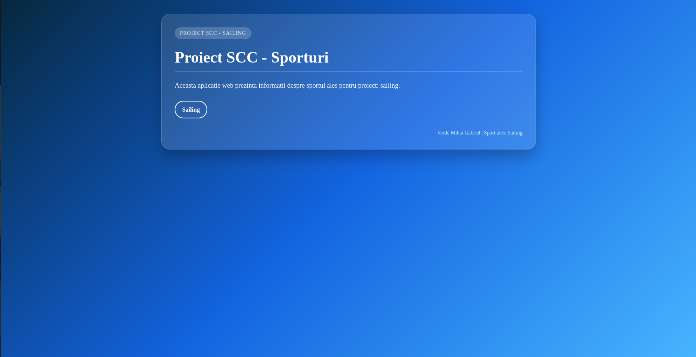

Pagina elementului ales, sailing (`/sporturi/sailing`):


Pagina cu competițiile de sailing (`/sporturi/sailing/competitii_sailing`):

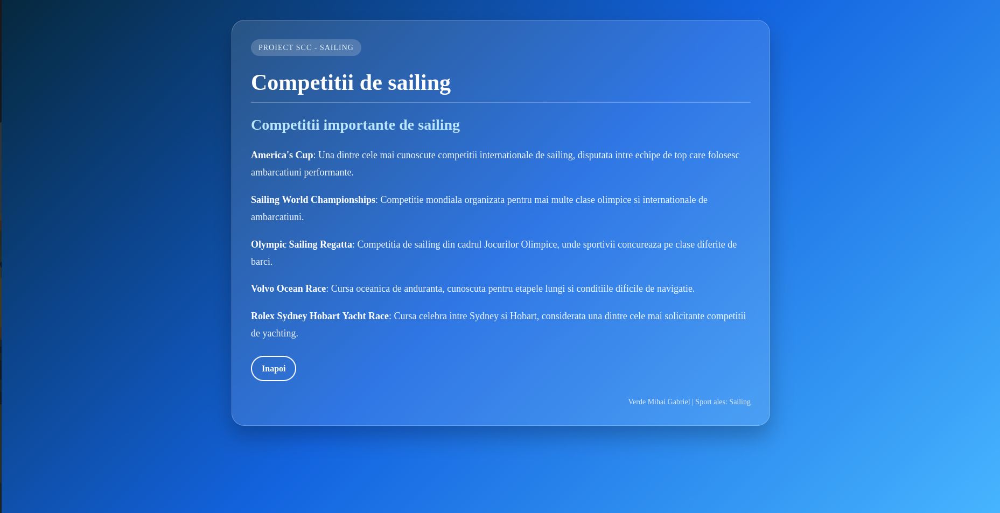

Pagina cu echipamentul de sailing (`/sporturi/sailing/echipament_sailing`):

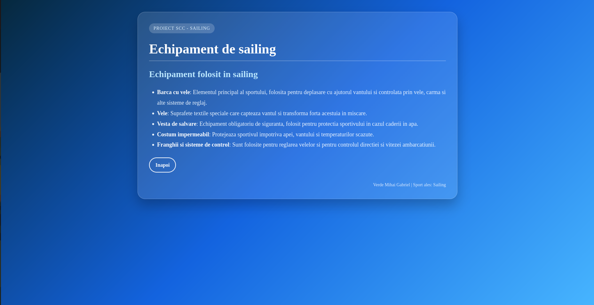

## Testare automată cu `pytest`

Testele au fost scrise în fișierul:

```text
app/tests/test_biblioteca_sporturi.py
```

Cu mediul virtual activ, rularea testelor se face astfel:

```bash
pytest
```

Testele automate verifică următoarele aspecte:

- funcția `competitii_sailing()` returnează conținut HTML;
- pagina de competiții conține markeri specifici, precum `America`, `Cup`, `Olympic` și `Sailing`;
- funcția `echipament_sailing()` returnează o listă HTML;
- pagina de echipament conține elemente specifice, precum `Barca cu vele` și `Vesta de salvare`.

Toate testele au fost executate cu succes, validând corectitudinea celor două funcții definite.


## Validare cod cu `pylint`

Pentru verificarea calității codului sursă se utilizează pachetul **pylint**. Acesta analizează conformitatea codului cu standardele Python, verificând spațierea, convențiile de numire, variabilele neutilizate, prezența docstring-urilor și alte aspecte de stil.

În cadrul acestui proiect, problemele raportate de **pylint** sunt doar afișate pentru monitorizare, nu sunt considerate erori, deoarece se utilizează flag-ul `--exit-zero`.

Comenzile utilizate au fost:

```bash
pylint --exit-zero app/lib/biblioteca_sporturi.py
pylint --exit-zero app/tests/test_biblioteca_sporturi.py
pylint --exit-zero sporturi.py
```

Rezultatul verificării cu pylint:

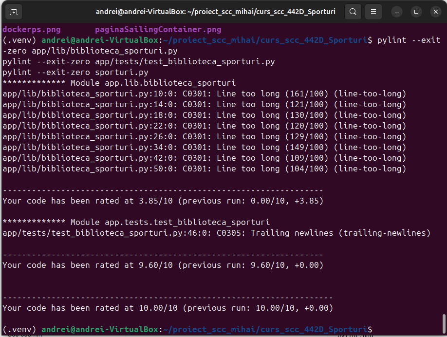

## Testare cu Docker

Pentru asigurarea portabilității aplicației, am creat un container Docker pornind de la `Dockerfile`-ul din rădăcina proiectului. Pașii efectuați au fost:

1. Construirea imaginii Docker:

```bash
docker build -t sporturi:v01 .
```

Imaginea creată poate fi vizualizată în lista locală de imagini Docker:

```bash
docker images | grep sporturi
```

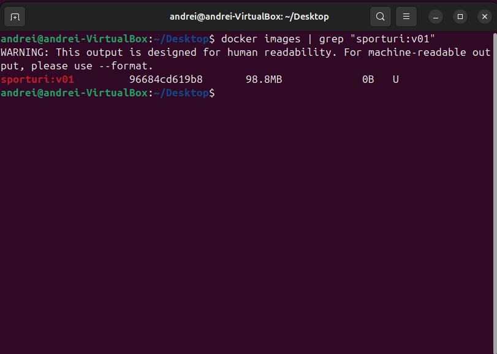

2. Rularea containerului din imaginea creată:

```bash
docker run --name sporturi1 -p 8021:5012 sporturi:v01
```

La pornirea containerului, în consolă sunt afișate mesajele de activare a mediului virtual, configurarea variabilei `FLASK_APP` și pornirea serverului Flask:

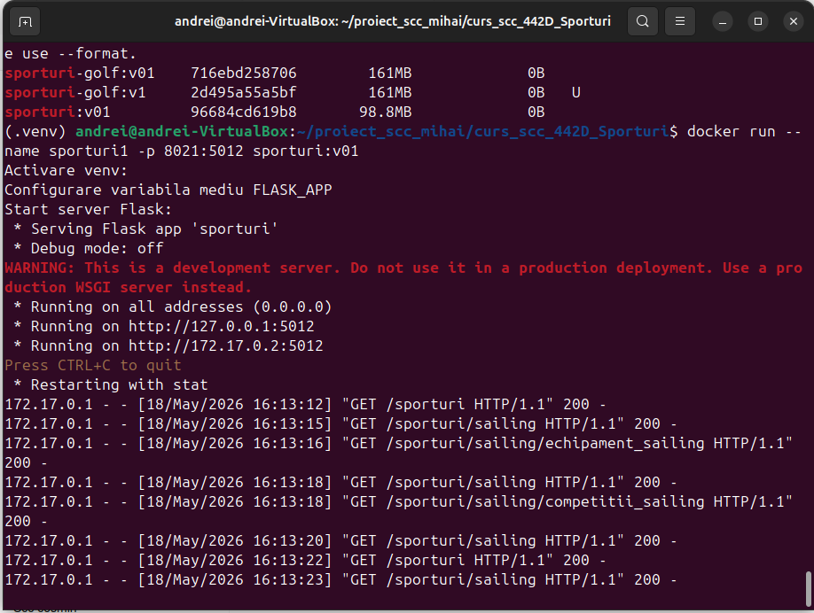

Containerul activ se poate vizualiza cu următoarea comandă:

```bash
docker ps
```

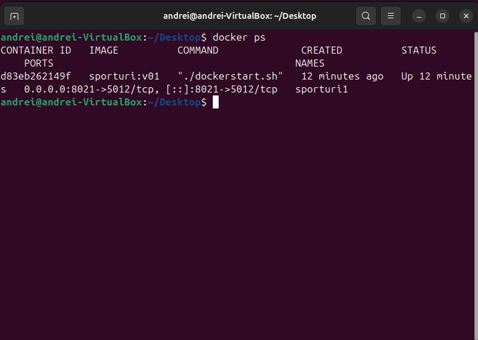

3. Accesarea aplicației în browser, de această dată servită din interiorul containerului Docker:

```text
http://127.0.0.1:8021/sporturi
```

Capturile de mai jos prezintă cele patru rute ale aplicației, accesate din browser în timp ce aplicația rulează în containerul Docker. Comportamentul este identic cu cel din rularea locală, însă aplicația este izolată într-un container, ceea ce confirmă reușita procesului de containerizare.

Pagina principală a temei accesată din container:


Pagina elementului ales accesată din container:


Pagina cu competițiile de sailing accesată din container:


Pagina cu echipamentul de sailing accesată din container:


# DevOps CI

- **CI** = Continuous Integration / Integrare Continuă

Proiectul utilizează un flux de automatizare definit în `Jenkinsfile`, care asigură validarea codului și pregătirea aplicației pentru livrare.

## Exemplu execuție pipeline Jenkins

Pentru executarea pipeline-ului în Jenkins, este necesar ca Jenkins să poată rula comenzile definite în `Jenkinsfile`. Pipeline-ul urmărește etapele principale ale procesului de dezvoltare:

1. **Build** – crearea mediului virtual și instalarea dependențelor din `quickrequirements.txt`.
2. **Linter** – verificarea codului cu `pylint`.
3. **Unit Tests** – rularea testelor automate cu `pytest`.
4. **Deploy** – construirea imaginii Docker și pregătirea containerului aplicației.

Pentru a porni Jenkins local, se rulează:

```bash
jenkins
```

Interfața Jenkins se accesează în browser la adresa:

```text
http://localhost:8080
```

În cadrul proiectului a fost creat pipeline-ul `sailing-pipeline`, conectat la repository-ul GitHub și la branch-ul:

```text
dev_verde_mihai_gabriel
```

Execuția pipeline-ului a fost pornită prin opțiunea **Build Now**. După rezolvarea problemelor de import ale bibliotecii `app/lib`, build-ul a fost executat cu succes.

Vizualizarea etapelor pipeline-ului arată trecerea prin pașii de checkout, build, pylint, testare și deploy:


Detaliile build-ului în interfața clasică Jenkins arată execuția reușită a pipeline-ului:


## Concluzii

Acest proiect atinge obiectivele funcționale și tehnice cerute, evidențiind următoarele aspecte:

- **Dezvoltare modulară:** aplicația Flask este structurată astfel încât logica informațională se află în fișierul `app/lib/biblioteca_sporturi.py`, iar rutele sunt definite în `sporturi.py`.
- **Funcționalitate clară:** aplicația conține patru rute funcționale pentru tema Sporturi și pentru elementul ales, Sailing.
- **Interfață personalizată:** design-ul aplicației a fost adaptat la tema nautică prin folosirea unui fundal albastru marin, card transparent și butoane rotunjite.
- **Testare automată:** funcțiile principale sunt validate prin teste `pytest`, ceea ce confirmă prezența conținutului HTML și a informațiilor specifice.
- **Verificare statică:** codul a fost analizat cu `pylint` pentru monitorizarea calității.
- **Portabilitate:** containerizarea cu Docker permite rularea aplicației într-un mediu izolat și reproductibil.
- **Automatizare:** pipeline-ul Jenkins integrează pașii de build, linting, testare și deploy.

## Bibliografie

https://github.com/crchende/sysinfo.git

https://github.com/vlad-barbu18/curs_scc_442D_Sporturi


---

# Scrimă — Voica Alina-Maria
[↑ Cuprins](#sporturi-integrate-în-readmemd)

# Proiect SCC - Sporturi

## Student
- **Nume:** Voica Alina-Maria
- **Grupa:** 442D
- **Element alocat:** Scrima

## Cuprins
- [Descriere generală](#descriere-generală)
- [Funcționalitate implementată](#funcționalitate-implementată)
- [Stadiu dezvoltare](#stadiu-dezvoltare)
- [Testare manuală în browser (rulare locală)](#testare-manuală-în-browser-rulare-locală)
- [Testare automată cu pytest](#testare-automată-cu-pytest)
- [Validare cod cu pylint](#validare-cod-cu-pylint)
- [Testare cu Docker](#testare-cu-docker)
- [DevOps CI](#devops-ci)
- [Concluzii](#concluzii)
- [Bibliografie](#bibliografie)

## Descriere generală

Obiectivul acestui proiect este dezvoltarea unei aplicații web utilizând limbajul Python și framework-ul Flask, având ca temă principală sporturile și ca subtemă scrima. Aplicația are rolul de a prezenta informații generale despre acest sport olimpic, originea sa și principalele tipuri de arme utilizate în competiții.

Proiectul urmărește implementarea unor concepte de bază din dezvoltarea aplicațiilor web și din zona DevOps, precum organizarea codului pe module, testarea automată cu pytest, validarea calității codului cu pylint, containerizarea aplicației folosind Docker și automatizarea procesului de build și testare prin Jenkins Pipeline.

## Funcționalitate implementată

În acest branch am adăugat și personalizat aplicația pentru tema „Sporturi”, având ca subtemă scrima.

- Fișierul `app/lib/biblioteca_sporturi.py` contine cele două funcții principale cerute:
  - `functie_1_scrima()` – returnează informații generale despre scrimă, precum originea și tipul acestui sport.
  - `functie_2_scrima()` –  returnează informații despre principalele arme utilizate în scrimă: floreta, sabia și spada.

- Fișierul principal `sporturi.py` implementeaza cele patru rute conform cerinței:
  - `/sporturi` – pagina principală a temei, cu introducere generală despre sporturi și scrimă.
  - `/sporturi/scrima` – pagina dedicată sportului ales.
  - `/sporturi/scrima/functie_1_scrima` – afișează informațiile generale despre scrimă.
  - `/sporturi/scrima/functie_2_scrima` – afișează tipurile de arme utilizate în scrimă.

- Interfața aplicației a fost personalizată folosind elemente HTML și CSS:
  - butoane stilizate,
  - imagini reprezentative pentru scrimă,
  - fundal și culori personalizate,
  - structură simplă și ușor de navigat.

- Fișierul `app/tests/test_biblioteca_sporturi.py` conține testele automate realizate cu pytest pentru verificarea funcțiilor implementate.

- Pentru partea DevOps au fost adăugate:
  - `Dockerfile` pentru containerizarea aplicației,
  - `dockerstart.sh` pentru pornirea automată a aplicației în container,
  - `Jenkinsfile` pentru automatizarea etapelor de build, testare și deploy.

## Stadiu dezvoltare


- Funcționalitatea aplicației a fost implementată complet.
- Codul sursă a fost dezvoltat și organizat în branch-ul `dev_Voica_Alina`.
- Rutele Flask și funcțiile bibliotecii Python sunt funcționale și testate.
- Testarea automată cu pytest a fost realizată cu succes.
- Validarea codului folosind pylint a fost integrată în pipeline-ul Jenkins.
- Aplicația a fost containerizată utilizând Docker.
- Pipeline-ul Jenkins pentru build, testare și deploy funcționează corect.
- Capturile de ecran și documentația README au fost adăugate în proiect.
- Testarea locală, automată și containerizată a fost realizată cu succes.

## Testare manuală în browser (rulare locală)

```bash
git clone https://github.com/vlad-barbu18/curs_scc_442D_Sporturi.git
cd curs_scc_442D_Sporturi
git checkout dev_Voica_Alina
. ./activeaza_venv
./ruleaza_aplicatia
```

Aplicația se accesează la: `http://127.0.0.1:5012/sporturi`


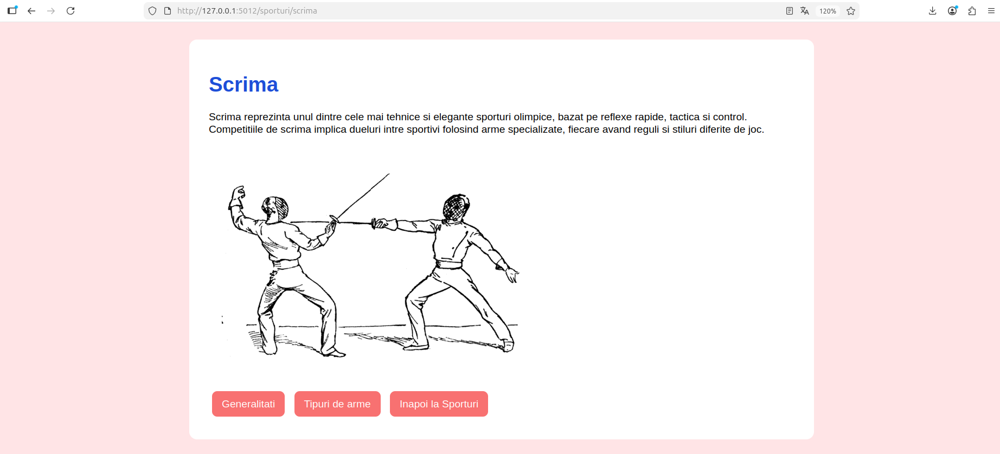
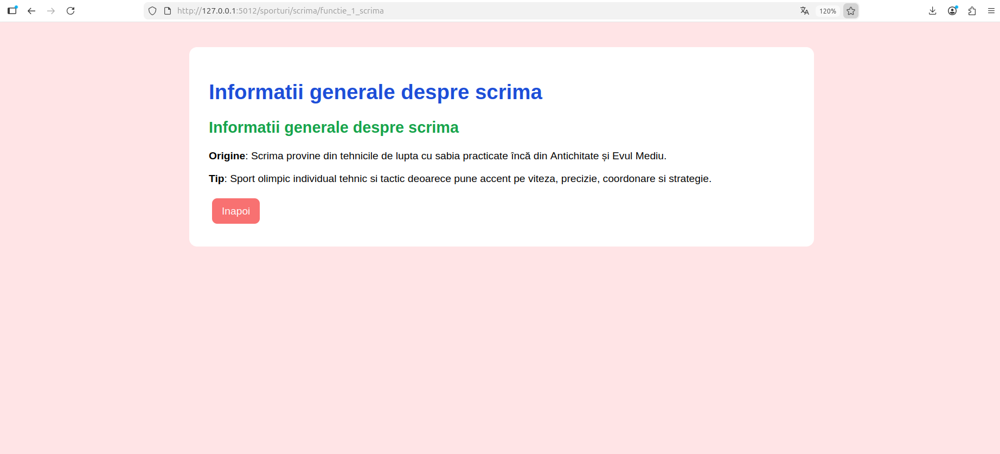
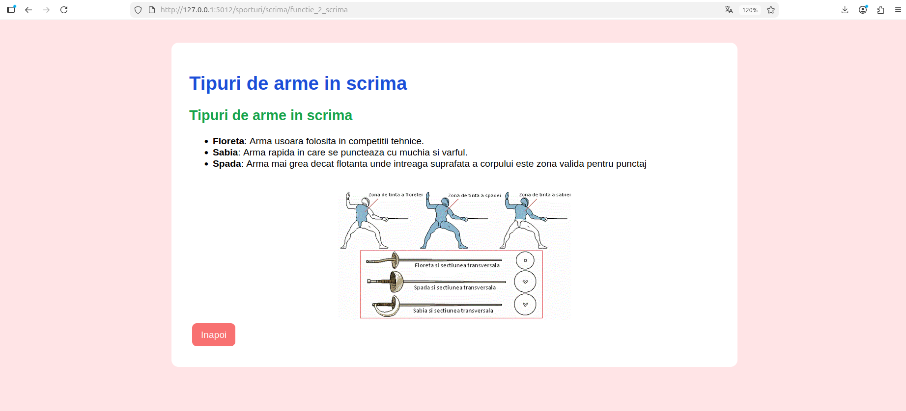

## Testare automată cu `pytest`

```bash
pytest
```


## Validare cod cu `pylint`

```bash
pylint --exit-zero app/lib/biblioteca_sporturi.py
pylint --exit-zero app/tests/test_biblioteca_sporturi.py
pylint --exit-zero sporturi.py
```

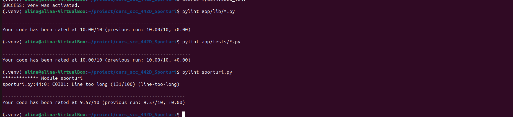

## Testare cu Docker

```bash
docker build -t sporturi:v01 .
docker run --name sporturi1 -p 8021:5012 sporturi:v01
```

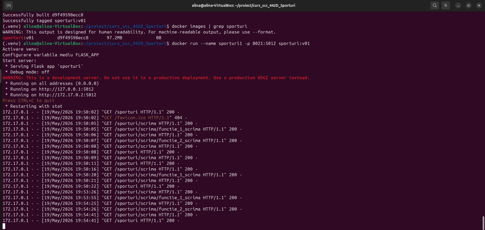
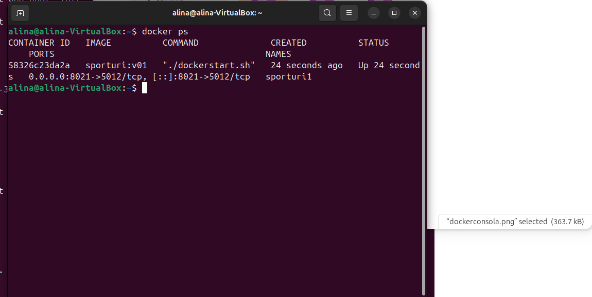

Aplicația din container, accesată la `http://localhost:8021/sporturi`:

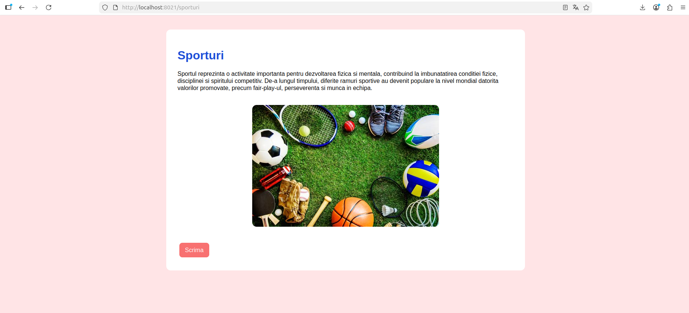
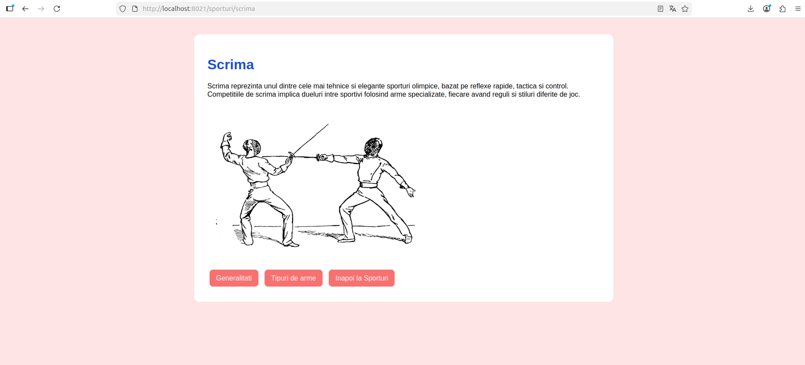

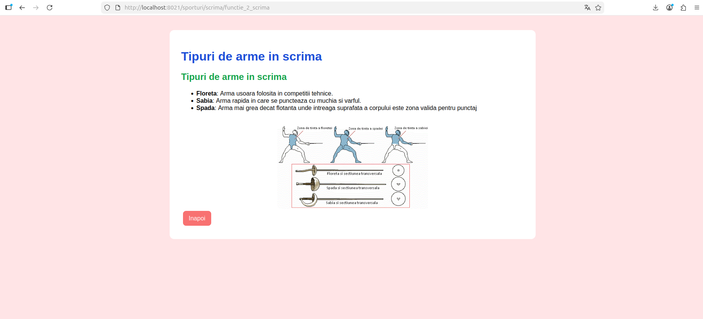

# DevOps CI

Pipeline declarativ definit în `Jenkinsfile`, cu 4 stages:
1. **Build**
   - activarea mediului virtual,
   - verificarea structurii proiectului,
   - pregătirea dependențelor necesare.
2. **pylint** 
   - realizarea analizei statice a codului Python,
   - identificarea warning-urilor și a problemelor de stil.
3. **Unit Tests** - rularea testelor automate folosind 'pytest'
4. **Deploy** - build Docker + creare container
 
##Pipeline Blue Ocean

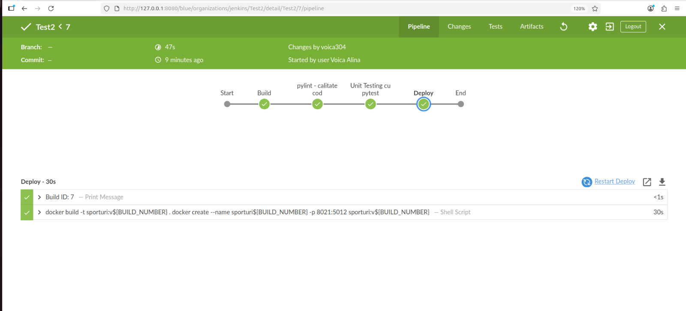

##Pipeline Jenkins clasic

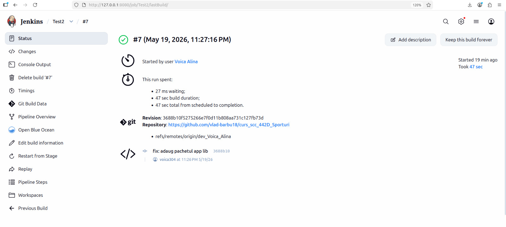


## Concluzii

Proiectul realizat demonstrează dezvoltarea unei aplicații web folosind
framework-ul Flask împreună cu tehnologii moderne utilizate în zona DevOps.

- **Dezvoltare modulară:** aplicația a fost organizată pe module și funcții separate pentru o structură mai clară și mai ușor de întreținut.

- **Interfață web:** au fost implementate pagini HTML dinamice, elemente vizuale și navigare între rute pentru prezentarea informațiilor despre scrimă.

- **Testare automată:** funcționalitățile aplicației au fost verificate utilizând teste automate realizate cu pytest.

- **Asigurarea calității codului:** analiza statică a codului a fost realizată folosind pylint și integrată în pipeline-ul Jenkins.

- **Portabilitate:** utilizarea Docker permite rularea aplicației într-un mediu izolat și consistent.

- **Automatizare DevOps:** Jenkins a fost utilizat pentru automatizarea etapelor de build, testare și deploy ale aplicației.

În urma implementării, aplicația a funcționat corect atât local, cât și în container Docker, iar pipeline-ul Jenkins a executat cu succes toate etapele configurate.

## Bibliografie

https://github.com/crchende/sysinfo.git


---
