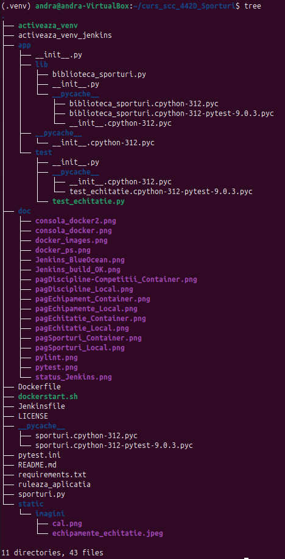
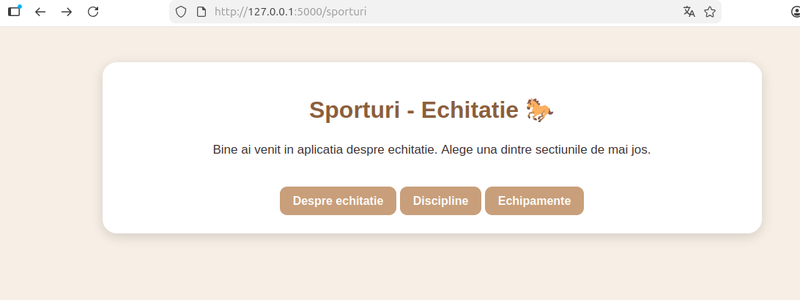
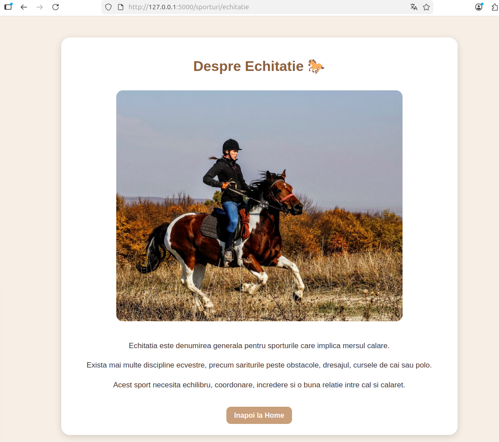
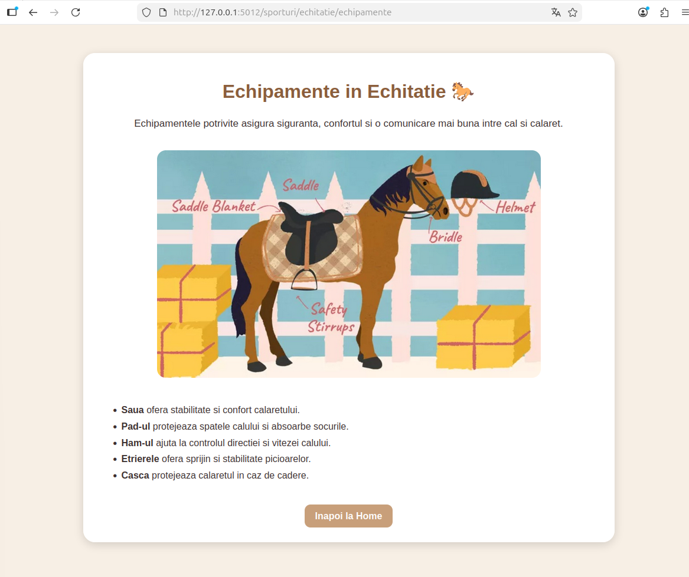

# Proiect SCC - Sporturi - Echitatie

## Andra Gulap - grupa 442D

---

# Cuprins

1. Scopul proiectului
2. Date generale
3. Structura proiectului
4. Functionalitati implementate
5. Descrierea fisierelor
6. Descrierea functiilor implementate
7. Descrierea rutelor implementate
8. Testare locala
9. Rezultatele testarii
10. Integrare Git si GitHub
11. Jenkins
12. Containerizare Docker
13. Screenshots

---

# Scopul proiectului

Acest proiect a fost realizat in cadrul disciplinei Servicii Cloud si Containerizare.

Tema aleasa este Sporturi, iar sportul implementat este Echitatia.

Aplicatia a fost dezvoltata folosind Flask si include:

- dezvoltare intr-o masina virtuala Linux
- versionare Git si GitHub
- rulare teste automate cu pytest
- verificare statica a codului cu pylint
- integrare Jenkins
- containerizare Docker

---

# Date generale

- Student: Andra Gulap
- Grupa: 442D
- Tema proiectului: Sporturi
- Sport ales: Echitatie
- Repository: curs_scc_442D_Sporturi
- Branch dezvoltare: dev_gulap_andra
- Branch principal: main_gulap_andra
- Aplicatie principala: sporturi.py
- Biblioteca: app/lib/biblioteca_sporturi.py

---

# Structura proiectului



---

# Functionalitati implementate

Aplicatia Flask contine mai multe pagini dedicate echitatiei.

Functionalitatile implementate:

- pagina principala pentru tema Sporturi
- pagina de prezentare a echitatiei
- pagina despre disciplinele din echitatie
- pagina despre echipamentele folosite in echitatie
- navigare intre pagini prin butoane Home
- afisare imagini statice
- stilizare HTML si CSS

---

# Descrierea fisierelor

## 1. sporturi.py

Fisierul principal al aplicatiei Flask.

Contine:

- initializarea aplicatiei Flask
- definirea rutelor
- redirect catre pagina principala
- rularea serverului pe portul 5000

---

## 2. app/lib/biblioteca_sporturi.py

Biblioteca aplicatiei.

Contine:

- functia pentru generarea structurii HTML comune
- functia pentru disciplinele din echitatie
- functia pentru echipamentele din echitatie

---

## 3. app/test/test_echitatie.py

Contine testele automate realizate cu pytest.

Testele verifica:

- existenta continutului HTML
- prezenta unor cuvinte cheie
- functionarea corecta a functiilor din biblioteca

---

## 4. Dockerfile

Defineste imaginea Docker folosita pentru containerizarea aplicatiei.

---

## 5. Jenkinsfile

Defineste pipeline-ul Jenkins pentru:

- Build
- pylint
- pytest
- Deploy

---

## 6. pytest.ini

Fisier pentru configurarea pytest.

---

# Descrierea functiilor implementate

## pagina_html()

Genereaza structura HTML comuna pentru toate paginile aplicatiei.

Include:

- stilizare CSS
- container principal
- buton de navigare Home

---

## discipline_echitatie()

Afiseaza informatii despre principalele discipline ecvestre:

- sarituri peste obstacole
- dresaj
- curse de cai
- polo

---

## echipamente_echitatie()

Afiseaza informatii despre echipamentele folosite in echitatie:

- saua
- pad-ul
- ham-ul
- etrierele
- casca


---

# Descrierea rutelor implementate

## Ruta /

Realizeaza redirect catre pagina principala.

---

## Ruta /sporturi

Pagina principala a aplicatiei.

Contine link-uri catre:

- pagina despre echitatie
- discipline
- echipamente

---

## Ruta /sporturi/echitatie

Afiseaza informatii generale despre echitatie.

---

## Ruta /sporturi/echitatie/discipline

Afiseaza disciplinele din echitatie.

---

## Ruta /sporturi/echitatie/echipamente

Afiseaza echipamentele folosite in echitatie.

---

# Testare locala

## Activarea mediului virtual

```bash
source .venv/bin/activate
```

---

## Rulare teste

```bash
pytest
```

---

## Verificare pylint

```bash
pylint sporturi.py app/lib/biblioteca_sporturi.py app/test/test_echitatie.py
```

---

## Rulare aplicatie

```bash
python3 sporturi.py
```

---

# Rutele verificate in browser

```text
http://127.0.0.1:5000/sporturi



http://127.0.0.1:5000/sporturi/echitatie



http://127.0.0.1:5000/sporturi/echitatie/discipline


http://127.0.0.1:5000/sporturi/echitatie/echipamente



```

---

# Rezultatele testarii

## Testare automata

- pytest: toate testele au trecut cu succes
- pylint: cod verificat pentru calitate si stil

---

## Testare manuala

Toate paginile au fost accesate in browser si au functionat corect.

---

# Integrare Git si GitHub

Pasi realizati:

- clonarea repository-ului de grupa
- creare branch personal de dezvoltare
- implementarea aplicatiei in masina virtuala Linux
- commit si push pe GitHub
- sincronizare cu branch-ul personal

---

# Jenkins

Pipeline-ul Jenkins executa automat:

1. Build
2. Instalare dependinte
3. pylint
4. pytest
5. Deploy

Pipeline-ul a fost configurat folosind Jenkinsfile.

---

# Containerizare Docker

Aplicatia a fost containerizata folosind Docker.

Etape realizate:

- creare Dockerfile
- creare dockerstart.sh
- build imagine Docker
- pornire container
- verificare accesare aplicatie din browser

---

## Comenzi utilizate

```bash
docker build -t sporturi:v01 .
```

```bash
docker run --name sporturi1 -p 8021:5000 sporturi:v01
```

```bash
docker ps
```

```bash
docker stop sporturi1
```

```bash
docker rm sporturi1
```

---

# Screenshots

## Docker

### Imagine Docker


---

### Container pornit


---

### Docker PS


---

## Aplicatia in browser

### Pagina principala


---

### Pagina Echitatie


---

### Pagina Discipline


---

### Pagina Echipamente


---

## Jenkins


# Ce urmeaza a fi implementat:

- crearea Pull Request-ului din `dev_gulap_andra` in `main_gulap_andra`
- obtinerea unui review de la cel putin un coleg
- integrarea README-ului in branch-ul principal
- actualizarea finala a documentatiei dupa review si merge
- verificarea finala a functionarii Jenkins si Docker
- verificarea tuturor screenshot-urilor din folderul `doc`
- sincronizarea finala a branch-urilor