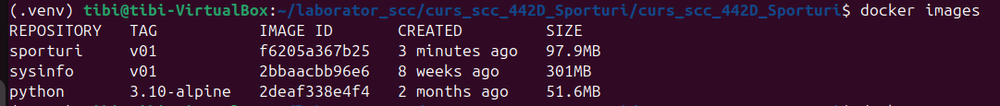
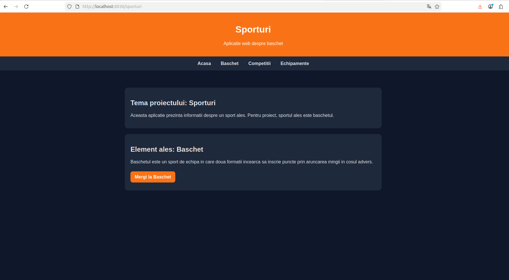
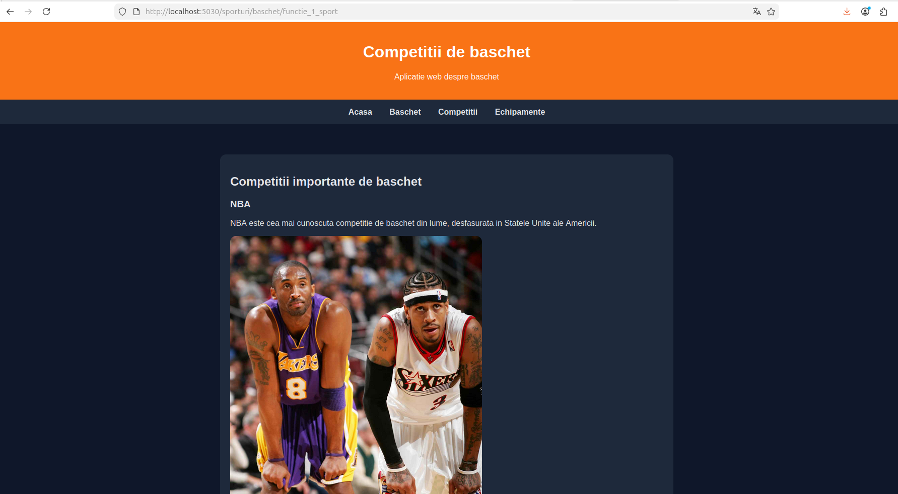
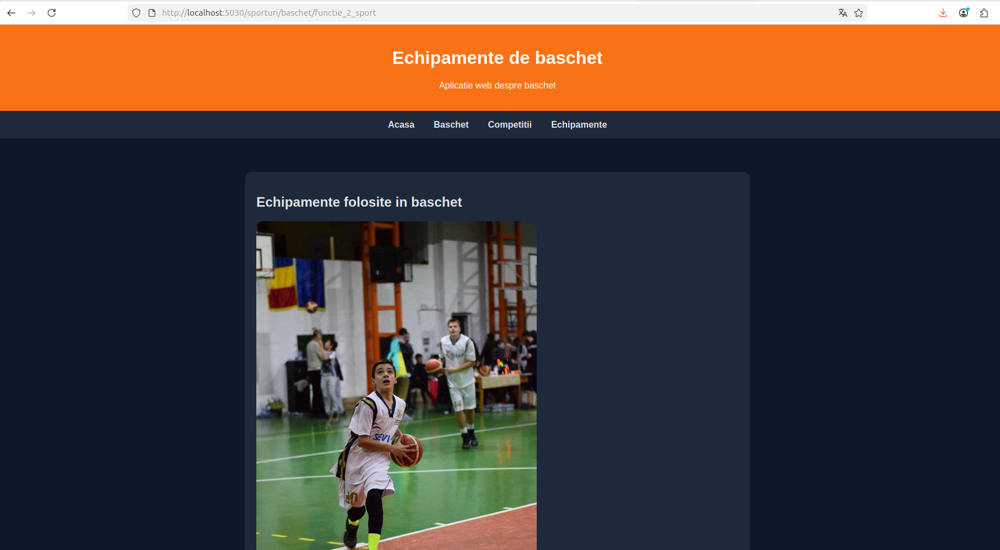

# Proiect SCC - Sporturi

## Dezvoltator

- **Nume:** Dima Tiberiu
- **Grupa:** 442D
- **Tema proiectului:** Sporturi
- **Element ales:** Baschet
- **Branch de dezvoltare:** `dev_dima_tiberiu`

---

## Cuprins

- [Descriere generală](#descriere-generală)
- [Funcționalitate implementată](#funcționalitate-implementată)
- [Structura proiectului](#structura-proiectului)
- [Tehnologii utilizate](#tehnologii-utilizate)
- [Rutele aplicației](#rutele-aplicației)
- [Rulare locală](#rulare-locală)
- [Testare automată cu pytest](#testare-automată-cu-pytest)
- [Validare cod cu pylint](#validare-cod-cu-pylint)
- [Rulare cu Docker](#rulare-cu-docker)
- [Integrare continuă cu Jenkins](#integrare-continuă-cu-jenkins)
- [Capturi de ecran](#capturi-de-ecran)
- [Concluzii](#concluzii)
- [Bibliografie](#bibliografie)

---

## Descriere generală

Acest proiect reprezintă o aplicație web realizată în **Python**, folosind framework-ul **Flask**, pentru tema generală **Sporturi**. Elementul ales în cadrul proiectului este **baschetul**.

Aplicația are rolul de a prezenta informații despre baschet, fiind structurată în mai multe pagini. Sunt incluse informații generale despre sportul ales, competiții importante de baschet și echipamente utilizate în cadrul acestui sport.

Proiectul urmărește parcurgerea unui flux complet de dezvoltare software, incluzând:

- dezvoltarea unei aplicații web;
- organizarea codului în module;
- utilizarea rutelor Flask;
- testarea automată cu `pytest`;
- analiza statică folosind `pylint`;
- containerizarea aplicației cu Docker;
- automatizarea procesului de build și testare cu Jenkins;
- versionarea codului folosind Git și GitHub.

---

## Funcționalitate implementată

În cadrul proiectului au fost implementate următoarele funcționalități:

- aplicație web realizată cu Flask;
- pagină principală pentru tema `sporturi`;
- pagină dedicată elementului ales, `baschet`;
- pagină pentru competiții importante de baschet;
- pagină pentru echipamente folosite în baschet;
- afișarea imaginilor în paginile aplicației;
- bibliotecă Python separată pentru cele două funcții cerute;
- teste automate pentru funcțiile implementate;
- fișier `Dockerfile` pentru containerizarea aplicației;
- fișier `Jenkinsfile` pentru integrare continuă;
- rulare locală și rulare în container Docker.

---

## Structura proiectului

```text
curs_scc_442D_Sporturi/
│
├── app/
│   ├── __init__.py
│   │
│   ├── lib/
│   │   ├── __init__.py
│   │   └── biblioteca_sporturi.py
│   │
│   ├── static/
│   │   └── pictures/
│   │       ├── nba.jpeg
│   │       ├── poza1.jpeg
│   │       └── poza2.jpeg
│   │
│   └── tests/
│       ├── __init__.py
│       └── test_biblioteca_sporturi.py
│
├── doc/
│   ├── blue_ocean.png
│   ├── docker_images.png
│   ├── docker_ps.png
│   ├── docker_run.png
│   ├── pg1.png
│   ├── pg1_container.png
│   ├── pg2.png
│   ├── pg3.png
│   ├── pg4.png
│   └── pylint.png
│
├── sporturi.py
├── activeaza_venv
├── ruleaza_aplicatia
├── dockerstart.sh
├── Dockerfile
├── Jenkinsfile
├── pytest.ini
├── quickrequirements.txt
├── requirements.txt
├── README.md
└── .gitignore
```

---

## Tehnologii utilizate

### Python

Python este limbajul de programare folosit pentru dezvoltarea aplicației.

### Flask

Flask este framework-ul web utilizat pentru definirea rutelor aplicației și pentru afișarea paginilor HTML.

### HTML și CSS

HTML este folosit pentru structura paginilor, iar CSS este folosit pentru stilizarea interfeței web.

### pytest

`pytest` este folosit pentru testarea automată a funcțiilor din biblioteca proiectului.

### pylint

`pylint` este folosit pentru analiza statică a codului Python și pentru verificarea calității acestuia.

### Docker

Docker este utilizat pentru containerizarea aplicației, astfel încât aceasta să poată fi rulată într-un mediu izolat și reproductibil.

### Jenkins

Jenkins este utilizat pentru automatizarea procesului de build, testare și deploy.

### Git și GitHub

Git este folosit pentru versionarea codului, iar GitHub pentru încărcarea proiectului și gestionarea branch-urilor.

---

## Rutele aplicației

Aplicația conține următoarele rute:

| Rută | Descriere |
|---|---|
| `/` | Redirect către pagina principală |
| `/sporturi` | Pagina principală a temei |
| `/sporturi/baschet` | Pagina elementului ales |
| `/sporturi/baschet/functie_1_sport` | Pagina cu informații despre competiții |
| `/sporturi/baschet/functie_2_sport` | Pagina cu informații despre echipamente |

---

## Rulare locală

Pentru rularea aplicației local, se clonează repository-ul și se selectează branch-ul de dezvoltare:

```bash
git clone <url-repository>
cd curs_scc_442D_Sporturi
git checkout dev_dima_tiberiu
```

Se activează mediul virtual:

```bash
. ./activeaza_venv
```

Se pornește aplicația:

```bash
. ./ruleaza_aplicatia
```

Aplicația rulează local la adresa:

```text
http://127.0.0.1:5030/sporturi
```

---

## Testare automată cu pytest

Testele automate se află în folderul:

```text
app/tests/
```

Fișierul de testare este:

```text
app/tests/test_biblioteca_sporturi.py
```

Rularea testelor se face cu:

```bash
pytest
```

Testele verifică dacă funcțiile din biblioteca proiectului returnează conținut HTML valid și dacă includ informațiile specifice despre baschet.

---

## Validare cod cu pylint

Pentru verificarea calității codului se folosește `pylint`.

Comenzile folosite sunt:

```bash
pylint --exit-zero app/lib/*.py
pylint --exit-zero app/tests/*.py
pylint --exit-zero sporturi.py
```

În urma rulării comenzilor, fișierele de test și fișierul principal `sporturi.py` au obținut scorul `10.00/10`, iar biblioteca `biblioteca_sporturi.py` a fost verificată cu avertismente minore legate de lungimea unor linii.


Opțiunea `--exit-zero` permite afișarea avertismentelor fără oprirea pipeline-ului Jenkins.

---

## Rulare cu Docker

Pentru construirea imaginii Docker se folosește comanda:

```bash
docker build -t sporturi:v01 .
```

Pentru verificarea imaginilor Docker existente:

```bash
docker images
```

Pentru rularea aplicației în container:

```bash
docker run --name sporturi1 -p 8030:5030 sporturi:v01
```

Aplicația rulată în container poate fi accesată în browser la adresa:

```text
http://localhost:8030/sporturi
```

Pentru verificarea containerelor active:

```bash
docker ps
```

Pentru oprirea și ștergerea containerului:

```bash
docker stop sporturi1
docker rm sporturi1
```

---

## Integrare continuă cu Jenkins

Pipeline-ul Jenkins este definit în fișierul:

```text
Jenkinsfile
```

Pipeline-ul conține următoarele etape:

1. **Build**
   - afișează folderul curent;
   - listează fișierele din proiect;
   - activează mediul virtual;
   - instalează dependențele.

2. **pylint - calitate cod**
   - rulează analiza statică pentru fișierele Python;
   - verifică fișierele din `app/lib`, `app/tests` și `sporturi.py`.

3. **Unit Testing cu pytest**
   - rulează testele automate ale proiectului.

4. **Deploy**
   - construiește imaginea Docker;
   - creează containerul Docker pentru aplicație.

Configurarea pipeline-ului în Jenkins se face folosind:

- repository-ul GitHub al proiectului;
- branch-ul `dev_dima_tiberiu`;
- fișierul `Jenkinsfile`.

---

## Capturi de ecran

### Pipeline Jenkins - Blue Ocean

Mai jos este prezentată rularea pipeline-ului în interfața Blue Ocean. Se observă faptul că toate etapele au fost finalizate cu succes.


---

### Imagine Docker creată

După rularea comenzii `docker images`, imaginea `sporturi:v01` este disponibilă local.



---

### Container Docker activ

Containerul `sporturi1` rulează și expune aplicația pe portul `8030`.


---

### Consola Docker

În consolă se observă pornirea aplicației Flask în container și accesarea rutelor aplicației.


---

### Aplicația rulată local - pagina principală

Pagina principală a aplicației prezintă tema proiectului și elementul ales.


---

### Aplicația rulată în container - pagina principală

Pagina principală este accesibilă și din container, prin portul `8030`.



---

### Pagina elementului ales - Baschet

Această pagină prezintă elementul ales și oferă acces către cele două categorii implementate: competiții și echipamente.


---

### Pagina competițiilor de baschet

Această pagină prezintă competiții importante de baschet, precum NBA, EuroLeague, Campionatul Mondial FIBA și Jocurile Olimpice.



---

### Pagina echipamentelor de baschet

Această pagină prezintă echipamente utilizate în baschet, precum mingea de baschet, coșul, echipamentul sportiv, pantofii de baschet și tabela de scor.



---

## Concluzii

În cadrul acestui proiect a fost realizată o aplicație web simplă și funcțională pentru tema **Sporturi**, având ca element ales **baschetul**.

Proiectul demonstrează utilizarea framework-ului Flask pentru dezvoltarea unei aplicații web, organizarea codului în module, definirea rutelor, integrarea imaginilor statice și testarea automată a funcțiilor implementate.

De asemenea, proiectul include rularea aplicației în container Docker și automatizarea procesului de build, testare și deploy folosind Jenkins.

Aplicația poate fi extinsă ulterior prin adăugarea mai multor sporturi, mai multor pagini, unei interfețe mai complexe și unor funcționalități suplimentare.

---

## Bibliografie

- Flask Documentation: https://flask.palletsprojects.com/
- pytest Documentation: https://docs.pytest.org/
- pylint Documentation: https://pylint.pycqa.org/
- Docker Documentation: https://docs.docker.com/
- Jenkins Documentation: https://www.jenkins.io/doc/
- GitHub Docs: https://docs.github.com/
