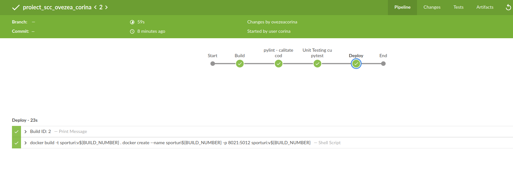

# Înot — proiect SCC (tema Sporturi)

Aplicație web Flask care prezintă elementul **Înot** din tema **Sporturi**. Proiectul acoperă tot drumul: cod Python, teste, container Docker și pipeline Jenkins pentru build automat.

> **Autor:** Ovezea Corina • **Grupa:** 442D
> **Branch dezvoltare:** `dev_ovezea_corina`
> **Branch personal main:** `main_ovezea_corina`

---

## Ce face aplicația

Site-ul are 4 pagini, pornind de la tema generală și ajungând la informații concrete despre înot:

| URL | Ce afișează |
|---|---|
| `/sporturi` | Pagina temei — punct de intrare |
| `/sporturi/inot` | Despre proiect: ce este înotul și de ce l-am ales |
| `/sporturi/inot/concursuri` | Cele mai importante competiții internaționale (Jocurile Olimpice, Mondiale, Europene, World Cup, Universiada) |
| `/sporturi/inot/inotatori` | Înotători profesioniști de top (Phelps, Ledecky, Peaty, Sjöström, Dressel, Popovici) |

Fiecare pagină are imagini din `static/images/` și navigare între ele.

---

## Cum am organizat codul

Am ținut codul împărțit pe roluri clare, ca să nu se amestece logica:

- `sporturi.py` — entry point Flask (foarte scurt, doar înregistrează blueprint-ul)
- `app/lib/biblioteca_inot.py` — date + cele 2 funcții care produc HTML
- `app/routes/inot.py` — Blueprint cu cele 4 rute
- `app/tests/test_biblioteca_inot.py` — 10 teste pytest
- `static/images/` — 12 imagini folosite în pagini
- `doc/` — capturile de ecran din README
- `Dockerfile` + `dockerstart.sh` — containerizare
- `Jenkinsfile` — pipeline CI/CD
- `pytest.ini` + `quickrequirements.txt` — configurări
- `activeaza_venv` + `ruleaza_aplicatia` — scripturi utilitare

`sporturi.py` doar înregistrează blueprint-ul — toată logica e în `app/routes/inot.py`, ceea ce face mult mai ușor de extins ulterior.

În `app/lib/biblioteca_inot.py` am scris **două funcții publice** care întorc HTML, conform cerinței:

- `concursuri_inot()` — generează cardurile cu competiții
- `inotatori_inot()` — generează cardurile cu înotători

Datele sunt liste de dicționare la începutul fișierului, ca să fie ușor de adăugat ceva nou fără să umbli prin HTML.

---

## Cum o rulez

Mai întâi clonez repo-ul și trec pe branch-ul de lucru:

    git clone https://github.com/vlad-barbu18/curs_scc_442D_Sporturi.git
    cd curs_scc_442D_Sporturi
    git checkout dev_ovezea_corina

Apoi activez mediul virtual (scriptul îl creează singur prima dată) și pornesc aplicația:

    . ./activeaza_venv
    . ./ruleaza_aplicatia

Aplicația ascultă pe `http://127.0.0.1:5012/sporturi`.

---

## Testare

### Teste automate (pytest)

Am scris **10 teste** care verifică funcțiile din bibliotecă: că întorc string-uri nevide, că HTML-ul conține tagurile așteptate, că apar numele înotătorilor importanți și concursurile principale, și că numărul de carduri HTML reflectă datele din listele Python (consistență).

    pytest

### Verificare statică (pylint)

Am verificat fiecare fișier cu pylint. Codul a obținut **10.00/10** pe toate patru:

    pylint --exit-zero app/lib/biblioteca_inot.py
    pylint --exit-zero app/routes/inot.py
    pylint --exit-zero app/tests/test_biblioteca_inot.py
    pylint --exit-zero sporturi.py

---

## Docker

Aplicația rulează în container pe baza imaginii `python:3.10-alpine`. Am ales Alpine pentru imagine mică (~170 MB final).

    docker build -t sporturi:v01 .
    docker run --name sporturi1 -p 8021:5012 sporturi:v01

Imaginea construită:

Containerul pornit (ascultă pe 8021 mapat la 5012 din container):

Output-ul din consolă la pornirea Flask în container:

### Aplicația rulând din container

Cu containerul pornit, deschid `http://127.0.0.1:8021/sporturi` în browser și parcurg cele 4 rute:

---

## Pipeline Jenkins

Pipeline declarativ în `Jenkinsfile`, cu 4 stages:

1. **Build** — creează venv-ul și instalează dependențele (`activeaza_venv_jenkins`)
2. **pylint** — rulează verificarea statică pe `app/lib/`, `app/routes/`, `app/tests/` și `sporturi.py`
3. **Unit Testing cu pytest** — rulează cele 10 teste
4. **Deploy** — `docker build` urmat de `docker create` cu tag-ul de build (`sporturi:v${BUILD_NUMBER}`)

Pipeline-ul rulat cu succes (vizualizare Blue Ocean):

---

## Workflow Git

Am ținut commit-uri mici și organizate pe etape, în loc de un singur commit gigantic. Asta face istoricul ușor de citit. Mesajele principale ale commit-urilor:

- chore: scripturi venv + quickrequirements + .gitignore
- feat: biblioteca_inot cu cele 2 functii publice
- feat: aplicatie Flask cu 4 rute + imagini statice
- test: 10 teste pytest pentru cele 2 functii
- feat: Dockerfile + dockerstart.sh + capturi de ecran
- ci+docs: Jenkinsfile + README complet
- docs: captura cu pipeline Jenkins
- refactor: muta cele 4 rute in app/routes/inot.py (Blueprint)
- refactor: rename functions to descriptive names

Integrarea în branch-ul personal de main se face printr-un **Pull Request** `dev_ovezea_corina → main_ovezea_corina`. Review-ul pe acest PR a fost făcut de **Voica Alina** (colegă de grupă).

---

## Bibliografie și surse

- Ghid intern al cursului SCC (Flask + Docker + Jenkins)
- Documentație oficială Flask: https://flask.palletsprojects.com/
- Documentație oficială pytest: https://docs.pytest.org/
- Imaginile folosite în pagini provin din surse publice (Wikipedia / site-uri oficiale ale competițiilor)
