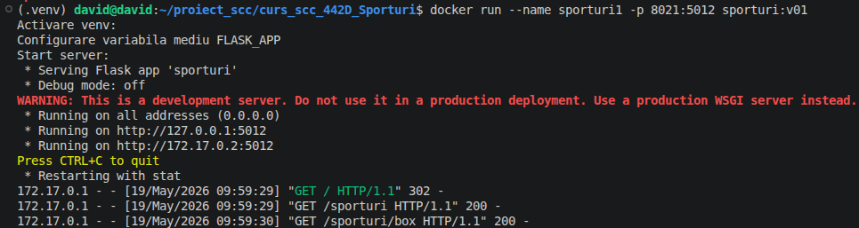
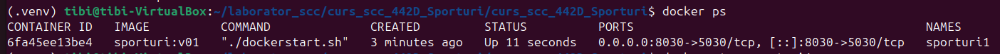

# Proiect SCC - Sporturi

## Dezvoltator

- **Nume:** David Stefan Botoc
- **Grupa:** 442D
- **Element alocat:** Sport - Box

## Cuprins

- [Descriere generala](#descriere-generala)
- [Functionalitate implementata](#functionalitate-implementata)
- [Structura aplicatiei](#structura-aplicatiei)
- [Stadiu dezvoltare](#stadiu-dezvoltare)
- [Testare manuala in browser](#testare-manuala-in-browser)
- [Testare automata cu pytest](#testare-automata-cu-pytest)
- [Validare cod cu pylint](#validare-cod-cu-pylint)
- [Testare cu Docker](#testare-cu-docker)
- [DevOps CI](#devops-ci)
- [Concluzii](#concluzii)
- [Bibliografie](#bibliografie)

## Descriere generala

Acest proiect reprezinta o aplicatie web dezvoltata in Python cu framework-ul
Flask. Tema grupei este **Sporturi**, iar sportul ales pentru implementare este
**boxul**.

Aplicatia prezinta boxul intr-o forma clara si usor de parcurs: pagina temei,
pagina sportului ales, o pagina dedicata echipamentului necesar si o pagina
dedicata competitiilor disponibile. Interfata are un stil vizual unitar pe toate
paginile, cu navigare prin meniul principal din partea de sus.

Proiectul acopera un flux complet de dezvoltare software:

- implementare aplicatie web cu Flask;
- separarea continutului in module Python;
- testare automata cu `pytest`;
- validare statica folosind `pylint`;
- containerizare cu Docker;
- automatizare CI prin Jenkins;
- versionare cu Git si GitHub.

## Functionalitate implementata

In acest branch a fost implementata tema **Sporturi - Box**.

### Rute Flask

Aplicatia expune urmatoarele rute:

| Ruta | Descriere |
| --- | --- |
| `/` | Redirectioneaza catre pagina principala `/sporturi`. |
| `/sporturi` | Prezinta tema grupei si sportul ales: boxul. |
| `/sporturi/box` | Ofera o descriere generala a boxului. |
| `/sporturi/box/echipament` | Prezinta echipamentul folosit in box, cu descriere si rol pentru fiecare element. |
| `/sporturi/box/competitii` | Prezinta o lista de competitii disponibile pentru boxeri amatori si profesionisti. |

### Functii principale

Fisierul `app/lib/biblioteca_sporturi.py` contine continutul generat pentru
paginile detaliate:

- `echipament_box()` - construieste sectiunea HTML pentru echipamentul de box:
  manusi, bandaje, protectie dentara, casca, incaltaminte si accesorii de
  antrenament.
- `competitii_box()` - construieste sectiunea HTML pentru competitiile de box:
  Jocurile Olimpice, campionate mondiale, campionate europene, campionate
  nationale, turnee locale si gale profesioniste.

Fisierul `sporturi.py` contine aplicatia Flask, stilul comun al paginilor si
rutele proiectului.

## Structura aplicatiei

```text
.
├── app
│   ├── lib
│   │   ├── __init__.py
│   │   └── biblioteca_sporturi.py
│   └── tests
│       ├── __init__.py
│       └── test_biblioteca_sporturi.py
├── doc
│   ├── docker_console.png
│   ├── docker_image.png
│   └── docker_ps.png
├── Dockerfile
├── Jenkinsfile
├── quickrequirements.txt
├── pytest.ini
├── sporturi.py
└── README.md
```

## Stadiu dezvoltare

- Functionalitatea principala este implementata.
- Cele patru pagini cerute sunt disponibile si au design consistent.
- Functiile vechi generice au fost inlocuite cu functii relevante pentru tema:
  `echipament_box()` si `competitii_box()`.
- Testele automate sunt actualizate pentru noua structura.
- Dockerfile si Jenkinsfile sunt configurate pentru build, testare si deploy.
- Codul este validat cu `pytest` si `pylint`.

## Testare manuala in browser

Pentru rulare locala:

```bash
git clone https://github.com/vlad-barbu18/curs_scc_442D_Sporturi.git
cd curs_scc_442D_Sporturi
git checkout dev_botoc_david
. ./activeaza_venv
./ruleaza_aplicatia
```

Aplicatia se acceseaza la:

```text
http://127.0.0.1:5012/sporturi
```

Pagini disponibile pentru verificare manuala:

- `http://127.0.0.1:5012/sporturi`
- `http://127.0.0.1:5012/sporturi/box`
- `http://127.0.0.1:5012/sporturi/box/echipament`
- `http://127.0.0.1:5012/sporturi/box/competitii`

## Testare automata cu pytest

Testele verifica faptul ca functiile din biblioteca genereaza continut HTML si
ca includ informatii relevante despre box.

Rulare:

```bash
pytest
```

Fisier de test:

```text
app/tests/test_biblioteca_sporturi.py
```

## Validare cod cu pylint

Analiza statica se poate rula cu:

```bash
pylint --exit-zero app/lib/*.py
pylint --exit-zero app/tests/*.py
pylint --exit-zero sporturi.py
```

In pipeline-ul Jenkins, `pylint` este rulat cu `--exit-zero`, deci mesajele de
stil sunt raportate, dar nu blocheaza automat build-ul.

## Testare cu Docker

Build imagine:

```bash
docker build -t sporturi:v01 .
```

Creare si rulare container:

```bash
docker run --name sporturi1 -p 8021:5012 sporturi:v01
```

Aplicatia din container se acceseaza la:

```text
http://localhost:8021/sporturi
```

Capturi Docker disponibile:





## DevOps CI

Pipeline-ul declarativ este definit in `Jenkinsfile` si contine patru etape:

1. **Build** - creeaza mediul virtual si instaleaza dependentele din
   `quickrequirements.txt`.
2. **pylint - calitate cod** - ruleaza analiza statica pentru biblioteca,
   teste si fisierul principal `sporturi.py`.
3. **Unit Testing cu pytest** - ruleaza testele automate.
4. **Deploy** - construieste imaginea Docker si creeaza containerul pentru
   aplicatie.

Imaginea Docker generata de Jenkins foloseste numele:

```text
sporturi:v${BUILD_NUMBER}
```

Containerul este creat cu portul aplicatiei expus astfel:

```text
8021:5012
```

## Concluzii

Proiectul demonstreaza dezvoltarea unei aplicatii Flask simple, dar complete,
pentru tema **Sporturi - Box**. Aplicatia are continut structurat, rute clare,
interfata unitara si integrare cu instrumente folosite intr-un flux DevOps:
GitHub, Jenkins, Docker, `pytest` si `pylint`.

Prin separarea continutului in `app/lib/biblioteca_sporturi.py`, codul devine
mai usor de intretinut si extins. Testele automate confirma functionarea
functiilor principale, iar pipeline-ul Jenkins automatizeaza validarea si
pregatirea aplicatiei pentru rulare containerizata.

## Bibliografie

- Flask: https://flask.palletsprojects.com/
- pytest: https://docs.pytest.org/
- pylint: https://pylint.readthedocs.io/
- Docker: https://docs.docker.com/
- Jenkins: https://www.jenkins.io/doc/
- GitHub repository model: https://github.com/crchende/sysinfo.git
