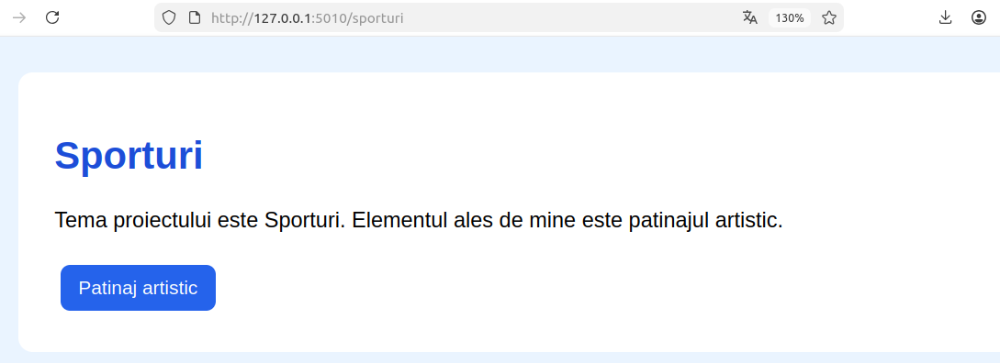
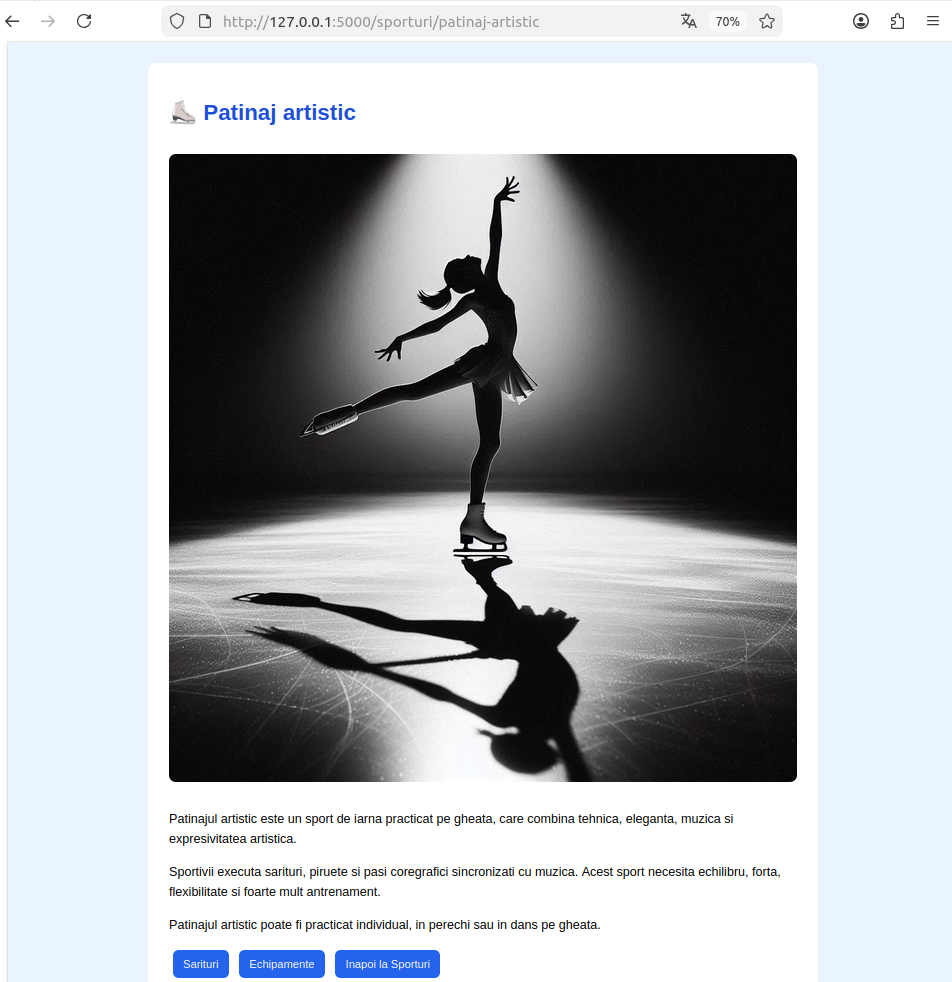
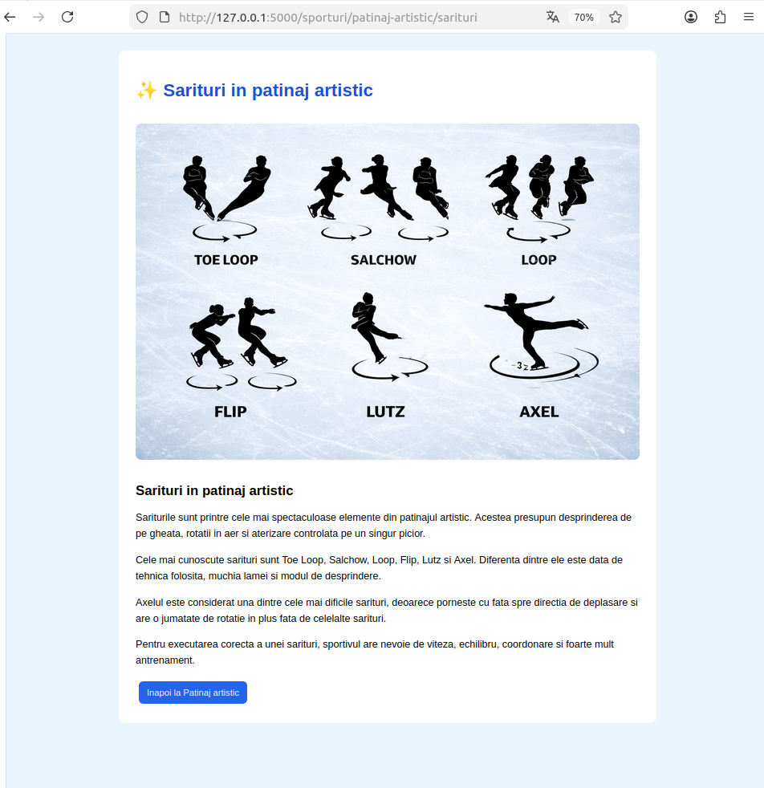
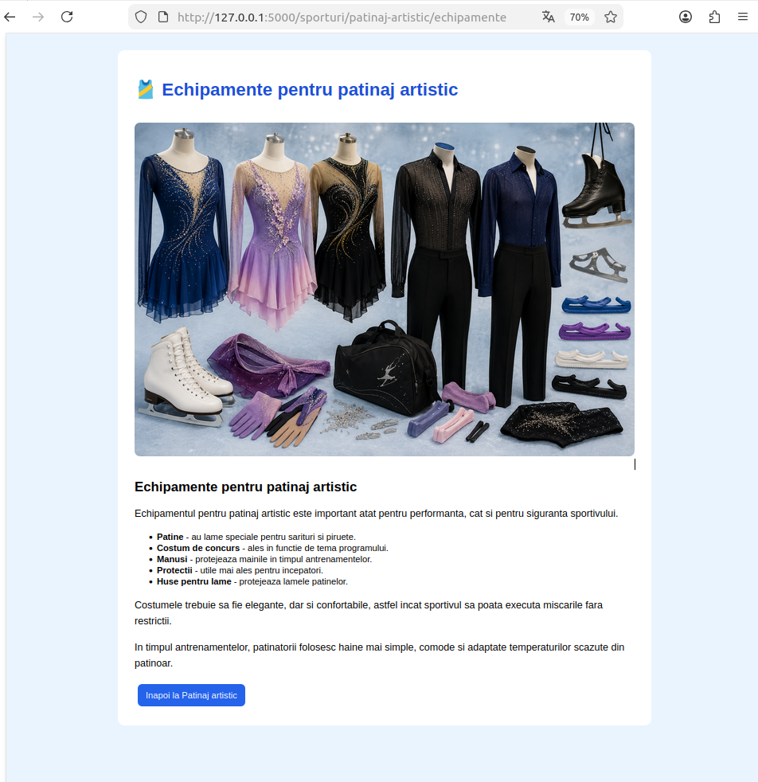
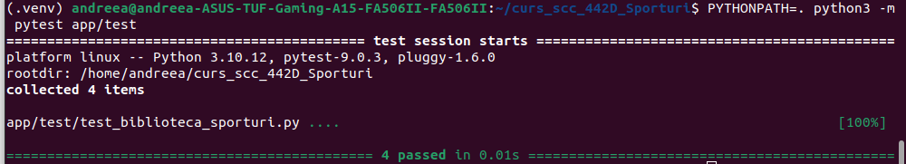
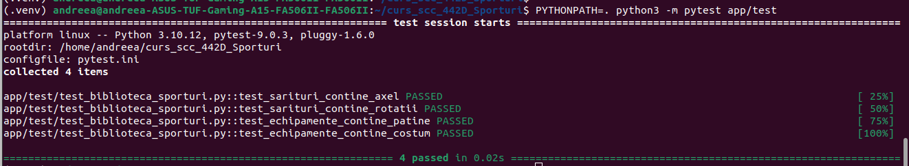
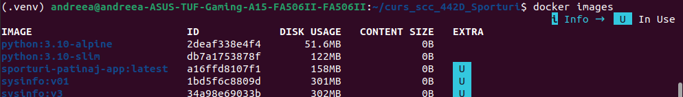
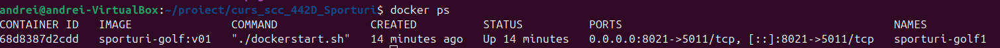
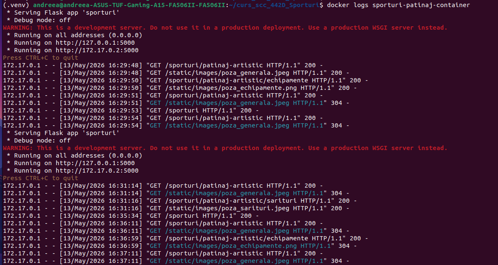
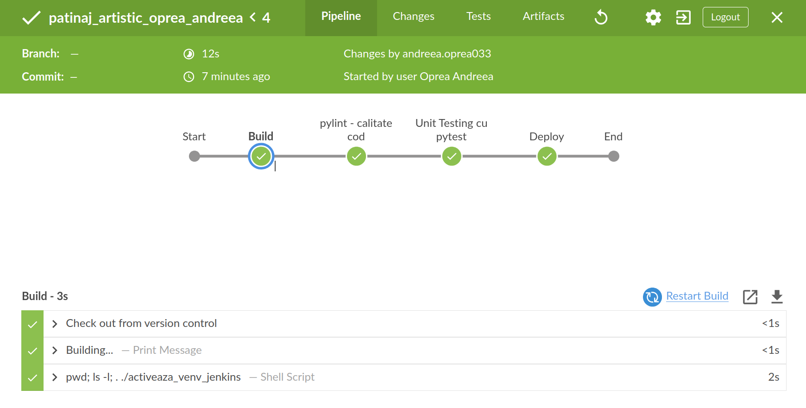

# curs_scc_442D_Sporturi — Patinaj artistic

## Cuprins

1. [Student](#student)
2. [Descriere aplicație](#descriere-aplicație)
3. [Funcționalitate implementată](#funcționalitate-implementată)
4. [Structura proiectului](#structura-proiectului)
5. [Configurare și rulare locală](#configurare-și-rulare-locală)
6. [Pagini WEB](#pagini-web)
7. [Testare cu pytest](#testare-cu-pytest)
8. [Verificare statică cu pylint](#verificare-statică-cu-pylint)
9. [Containerizare Docker](#containerizare-docker)
10. [DevOps CI — Jenkins](#devops-ci--jenkins)
11. [Integrare GitHub](#integrare-github)
12. [Stadiul implementării](#stadiul-implementării)
13. [Concluzii](#concluzii)
14. [Bibliografie](#bibliografie)

---

## Student

- **Nume:** Oprea Andreea
- **Grupă:** 442D
- **Temă:** Sporturi
- **Element ales:** Patinaj artistic
- **Branch dezvoltare:** `dev_oprea_andreea`
- **Branch personal principal:** `main_oprea_andreea`

---

## Descriere aplicație

Aplicația este realizată în **Python**, folosind framework-ul **Flask**. Tema proiectului este **Sporturi**, iar elementul ales pentru implementare este **Patinaj artistic**.

Aplicația prezintă informații despre patinaj artistic, sărituri specifice acestui sport și echipamentele folosite. Proiectul include rulare locală, testare automată, verificare statică a codului, containerizare cu Docker și automatizare prin Jenkins.

Rutele aplicației sunt:

| Rută | Conținut |
|---|---|
| `/sporturi` | Pagina principală a temei Sporturi |
| `/sporturi/patinaj-artistic` | Pagina elementului ales: Patinaj artistic |
| `/sporturi/patinaj-artistic/sarituri` | Informații despre sărituri în patinaj artistic |
| `/sporturi/patinaj-artistic/echipamente` | Informații despre echipamentele folosite |

---

## Funcționalitate implementată

Funcționalitatea principală este împărțită între fișierul Flask `sporturi.py` și biblioteca `app/lib/biblioteca_sporturi.py`.

În `app/lib/biblioteca_sporturi.py` au fost implementate două funcții:

```python
sarituri_patinaj_artistic()
echipamente_patinaj_artistic()
```

Funcția `sarituri_patinaj_artistic()` returnează conținut HTML despre săriturile importante din patinaj artistic, precum Axelul, Toe Loop, Salchow, Loop, Flip și Lutz.

Funcția `echipamente_patinaj_artistic()` returnează conținut HTML despre echipamentele utilizate: patine, costum de concurs, mănuși, protecții și huse pentru lame.

Fișierul `sporturi.py` folosește aceste funcții pentru a construi paginile WEB asociate rutelor aplicației.


---

## Structura proiectului

```text
curs_scc_442D_Sporturi/
├── app/
│   ├── __init__.py
│   ├── lib/
│   │   ├── __init__.py
│   │   └── biblioteca_sporturi.py
│   └── test/
│       ├── __init__.py
│       └── test_biblioteca_sporturi.py
├── doc/
│   └── screenshots/
├── static/
│   └── images/
│       ├── poza_generala.jpeg
│       ├── poza_sarituri.jpeg
│       └── poza_echipamente.png
├── .gitignore
├── Dockerfile
├── Jenkinsfile
├── LICENSE
├── README.md
├── activeaza_venv
├── activeaza_venv_jenkins
├── dockerstart.sh
├── pytest.ini
├── quickrequirements.txt
├── ruleaza_aplicatia
└── sporturi.py
```

Rolul fișierelor principale:

| Fișier / folder | Rol |
|---|---|
| `sporturi.py` | Fișierul principal al aplicației Flask |
| `app/lib/biblioteca_sporturi.py` | Biblioteca în care sunt definite funcțiile pentru conținut |
| `app/test/test_biblioteca_sporturi.py` | Teste unitare pentru funcțiile din bibliotecă |
| `static/images/` | Imaginile afișate în paginile aplicației |
| `activeaza_venv` | Activează mediul virtual local sau îl creează dacă lipsește |
| `activeaza_venv_jenkins` | Creează mediul virtual și instalează dependențele pentru Jenkins |
| `ruleaza_aplicatia` | Pornește aplicația local prin Flask |
| `quickrequirements.txt` | Lista dependențelor folosite de scripturi, Docker și Jenkins |
| `pytest.ini` | Configurare pentru rularea testelor cu pytest |
| `Dockerfile` | Definește imaginea Docker a aplicației |
| `dockerstart.sh` | Pornește aplicația în container |
| `Jenkinsfile` | Definește pipeline-ul Jenkins |
| `doc/screenshots/` | Capturi de ecran folosite în documentație |

---

## Configurare și rulare locală

Pentru a rula proiectul pe un calculator nou, se descarcă repository-ul, se intră pe branch-ul de dezvoltare personal și se pornește aplicația prin scripturile existente în proiect.

### Pregătire proiect

```bash
git clone https://github.com/vlad-barbu18/curs_scc_442D_Sporturi.git
cd curs_scc_442D_Sporturi
git checkout dev_oprea_andreea
```

Pentru confirmare, se poate verifica branch-ul activ:

```bash
git branch
```

În listă trebuie să fie marcat cu `*` branch-ul:

```text
dev_oprea_andreea
```

### Dependențe

Dependențele principale ale proiectului sunt:

```text
flask
pytest
pylint
```

Acestea sunt definite în `quickrequirements.txt`

### Activare mediu virtual

```bash
. ./activeaza_venv
```

Dacă mediul virtual `.venv` există deja, acesta este activat. Dacă nu există, scriptul apelează `activeaza_venv_jenkins`, creează mediul virtual și instalează dependențele.

### Pornire aplicație

```bash
./ruleaza_aplicatia
```

Aplicația este accesibilă în browser la:

```text
http://127.0.0.1:5000/sporturi
```

---

## Pagini WEB

### `/sporturi`



### `/sporturi/patinaj-artistic`



### `/sporturi/patinaj-artistic/sarituri`



### `/sporturi/patinaj-artistic/echipamente`



---

## Testare cu pytest

Testele sunt definite în fișierul:

```text
app/test/test_biblioteca_sporturi.py
```

Sunt testate funcțiile:

```python
sarituri_patinaj_artistic()
echipamente_patinaj_artistic()
```

Testarea verifică dacă funcțiile din bibliotecă returnează informațiile așteptate. Astfel se confirmă că partea de conținut pentru patinaj artistic funcționează corect înainte de integrarea modificărilor.

Comanda folosită:

```bash
PYTHONPATH=. python3 -m pytest app/test
```

Rezultat obținut:

```text
collected 4 items
4 passed
```

Captură rulare teste:



---

## Verificare statică cu pylint

Pentru verificarea calității codului am folosit `pylint`. Acesta analizează fișierele Python și afișează observații despre stil, structură, docstring-uri și posibile probleme de cod.

Comanda folosită:

```bash
pylint --exit-zero app/lib/*.py app/test/*.py sporturi.py
```

Opțiunea `--exit-zero` permite afișarea observațiilor fără ca rularea să fie considerată eșuată.

Rezultat obținut:

```text
Your code has been rated at 10.00/10
```

Captură rulare pylint:



---

## Containerizare Docker

Pentru rularea aplicației într-un mediu izolat am folosit Docker. În acest proiect, imaginea este definită în `Dockerfile`, dependențele sunt instalate din `quickrequirements.txt`, iar aplicația este pornită în container prin scriptul `dockerstart.sh`.

### Construire imagine

Imaginea Docker a fost construită și apoi verificată în lista imaginilor locale:

```bash
docker build -t sporturi-patinaj-app .
docker images
```

Comanda `docker build` creează imaginea `sporturi-patinaj-app` pornind de la fișierele proiectului, iar `docker images` confirmă că imaginea există local.



### Pornire container

Pentru a evita conflictele cu un container mai vechi, acesta poate fi șters înainte de o nouă rulare. Apoi se pornește containerul și se verifică dacă rulează:

```bash
docker rm -f sporturi-patinaj-container
docker run -d -p 5010:5000 --name sporturi-patinaj-container sporturi-patinaj-app
docker ps
```

Portul `5000` din container este legat de portul `5000` al calculatorului, astfel că aplicația poate fi accesată în browser la:

```text
http://127.0.0.1:5010/sporturi
```



### Loguri container

Pentru verificarea accesării aplicației din container am folosit:

```bash
docker logs sporturi-patinaj-container
```

În loguri apar cererile HTTP către rutele aplicației. Codul `200` indică încărcarea cu succes a paginii, iar `304` poate apărea pentru fișiere statice deja salvate în cache de browser.



---

## DevOps CI — Jenkins

Pipeline-ul este definit în fișierul `Jenkinsfile` și rulează automat pașii principali pentru verificarea aplicației.

Job-ul Jenkins este configurat pe repository-ul proiectului și pe branch-ul:

```text
dev_oprea_andreea
```

Etapele pipeline-ului sunt:

| Etapă | Descriere |
|---|---|
| Build | Creează mediul virtual `.venv` și instalează dependențele folosind `activeaza_venv_jenkins` |
| pylint - calitate cod | Verifică static fișierele `app/lib/*.py`, `app/test/*.py` și `sporturi.py` |
| Unit Testing cu pytest | Rulează testele automate; rezultatul obținut este `4 passed` |
| Deploy | Etapă demonstrativă pentru finalizarea pipeline-ului |

Pipeline-ul a fost rulat cu succes în Jenkins. Pentru vizualizare a fost folosit și Blue Ocean, unde se văd toate etapele finalizate cu succes.

Captură Jenkins / Blue Ocean:



---

## Integrare GitHub

Fluxul de lucru folosit în proiect:

1. Dezvoltarea s-a făcut pe branch-ul `dev_oprea_andreea`.
2. Modificările au fost încărcate pe GitHub prin `git push`.
3. Testarea s-a făcut local, în Docker și în Jenkins.
4. A fost creat Pull Request din `dev_oprea_andreea` către `main_oprea_andreea`.
5. A fost realizat review pe Pull Request, apoi modificările au fost integrate.
6. A fost realizat review și pentru Pull Request-ul unui coleg, conform cerinței de lucru colaborativ.

Branch-uri folosite:

| Branch | Rol |
|---|---|
| `dev_oprea_andreea` | Branch personal de dezvoltare |
| `main_oprea_andreea` | Branch personal principal |
| `main` | Branch comun al grupei |

---

## Stadiul implementării

| Componentă | Status |
|---|---|
| Aplicație Flask | Finalizat |
| Fișier principal `sporturi.py` | Finalizat |
| Bibliotecă `app/lib/biblioteca_sporturi.py` | Finalizat |
| Funcția `sarituri_patinaj_artistic()` | Finalizat |
| Funcția `echipamente_patinaj_artistic()` | Finalizat |
| Rute WEB | Finalizat |
| Imagini statice | Finalizat |
| Scripturi pentru venv | Finalizat |
| `ruleaza_aplicatia` | Finalizat |
| `pytest.ini` | Finalizat |
| Teste pytest | Finalizat |
| Verificare statică pylint | Finalizat |
| Dockerfile | Finalizat |
| `dockerstart.sh` | Finalizat |
| Container Docker | Finalizat |
| Jenkinsfile | Finalizat |
| Pipeline Jenkins | Finalizat |
| Pull Request `dev_oprea_andreea` → `main_oprea_andreea` | Finalizat |
| Review primit de la coleg | Finalizat |
| Review făcut la PR-ul unui coleg | Finalizat |
| Documentație README | Finalizat |

---

## Concluzii

Proiectul implementează o aplicație web Flask pentru tema Sporturi, cu elementul ales Patinaj artistic. Funcționalitatea este separată în fișierul principal al aplicației și într-o bibliotecă dedicată, ceea ce face proiectul mai ușor de organizat și extins.

Testele automate cu `pytest` confirmă funcționarea celor două funcții principale, iar `pylint` a fost folosit pentru verificarea statică a codului. Prin Docker, aplicația poate rula într-un mediu izolat, iar prin Jenkins a fost automatizat procesul de build, verificare statică și testare.

---

## Bibliografie

- Repository model `sysinfo`: https://github.com/crchende/sysinfo
- Repository proiect grupă: https://github.com/vlad-barbu18/curs_scc_442D_Sporturi
- Flask Documentation: https://flask.palletsprojects.com/
- Docker Documentation: https://docs.docker.com/
- Jenkins Documentation: https://www.jenkins.io/doc/
- pytest Documentation: https://docs.pytest.org/
- pylint Documentation: https://pylint.readthedocs.io/
