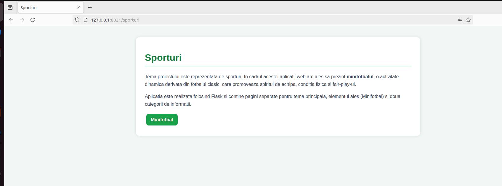
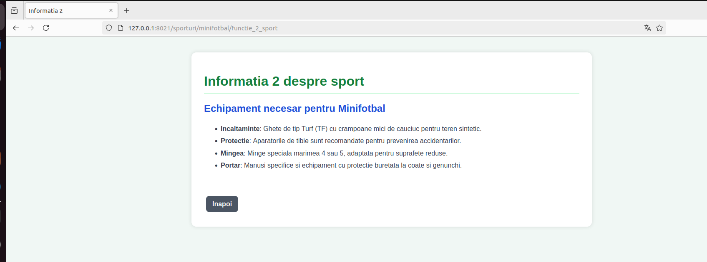
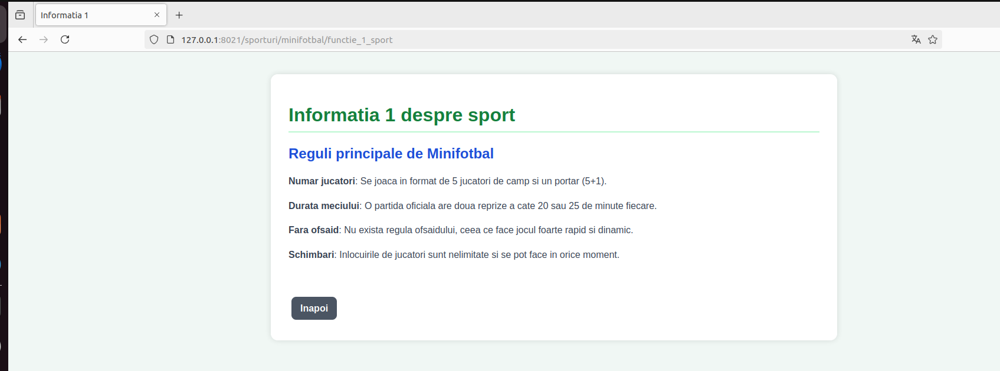
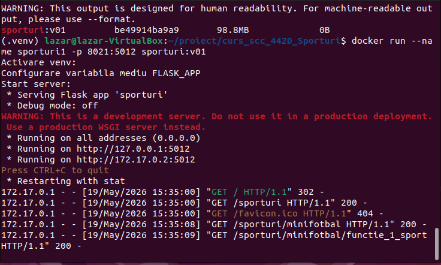

# Proiect SCC - Sporturi

## Dezvoltator
- **Nume:** Lazar Iulian
- **Grupa:** 442D
- **Element alocat:** Minifotbal

---

## Cuprins
- [Descriere generală](#descriere-generală)
- [Funcționalitate implementată](#funcționalitate-implementată)
- [Stadiu dezvoltare](#stadiu-dezvoltare)
- [Testare manuală în browser (rulare locală)](#testare-manuală-în-browser-rulare-locală)
- [Testare automată cu pytest](#testare-automată-cu-pytest)
- [Validare cod cu pylint](#validare-cod-cu-pylint)
- [Testare cu Docker](#testare-cu-docker)
- [DevOps CI](#devops-ci)
- [Concluzii](#concluzii)
- [Bibliografie](#bibliografie)

---

# Descriere generală

Obiectivul proiectului a fost realizarea unei aplicații web folosind framework-ul Flask și integrarea unui proces complet DevOps folosind:

- Python
- Flask
- GitHub
- Jenkins
- Docker
- pytest
- pylint

Scopul proiectului a fost automatizarea procesului de dezvoltare software și validarea continuă a aplicației.

---

# Funcționalitate implementată

În cadrul proiectului au fost implementate următoarele componente:

### Bibliotecă proprie

Fișier:

```plaintext
app/lib/biblioteca_sporturi.py
```

conține funcțiile:

- `functie_1_sport()` – afișează informații despre primul element ales.
- `functie_2_sport()` – afișează informații despre al doilea element ales.

### Aplicația Flask

Fișier principal:

```plaintext
sporturi.py
```

Rute implementate:

```plaintext
/sporturi
/sporturi/minifotbal
/sporturi/minifotbal/functie_1_sport
/sporturi/minifotbal/functie_2_sport
```

### Testare automată

Fișier:

```plaintext
app/tests/test_biblioteca_sporturi.py
```

conține testele unitare.

---

# Stadiu dezvoltare

✔ Funcționalitate complet implementată  
✔ Testare locală realizată  
✔ Testare automată realizată  
✔ Docker funcțional  
✔ Jenkins Pipeline funcțional  

---

# Testare manuală în browser (rulare locală)

Pornire aplicație:

```bash
git clone https://github.com/vlad-barbu18/curs_scc_442D_Sporturi
cd curs_scc_442D_Sporturi

git checkout dev_lazar_iulian

. ./activeaza_venv

./ruleaza_aplicatia
```

Acces aplicație:

```plaintext
http://127.0.0.1:5012/sporturi
```








---

# Testare automată cu pytest

Rulare:

```bash
pytest
```

Verifică funcționarea automată a funcțiilor implementate.


---

# Validare cod cu pylint

Comenzi utilizate:

```bash
pylint --exit-zero app/lib/biblioteca_sporturi.py

pylint --exit-zero app/tests/test_biblioteca_sporturi.py

pylint --exit-zero sporturi.py
```

Analiza verifică:

- stil cod
- importuri
- erori statice
- convenții Python


---

# Testare cu Docker

Construire imagine:

```bash
docker build -t sporturi:v01 .
```

Pornire container:

```bash
docker run --name sporturi1 -p 8021:5012 sporturi:v01
```

Imagini rezultate:





Acces aplicație:

```plaintext
http://localhost:8021/sporturi
```

---

# DevOps CI

Pipeline-ul CI este implementat în:

```plaintext
Jenkinsfile
```

Etape executate:

## 1. Build
- creare mediu virtual
- instalare dependențe

## 2. pylint
- analiză statică cod

## 3. Unit Testing
- rulare teste automate folosind pytest

## 4. Deploy
- construire imagine Docker
- creare container

### Pipeline Blue Ocean


### Pipeline Jenkins clasic


---

# Concluzii

În cadrul proiectului au fost aplicate concepte moderne de dezvoltare software:

- dezvoltare modulară
- testare automată
- containerizare
- integrare continuă
- automatizare pipeline

Jenkins și Docker permit validarea și rularea aplicației într-un mod reproductibil și automatizat.

---

# Bibliografie

https://github.com/crchende/sysinfo.git

Documentație Flask:
https://flask.palletsprojects.com/

Documentație Docker:
https://docs.docker.com/

Documentație Jenkins:
https://www.jenkins.io/doc/
