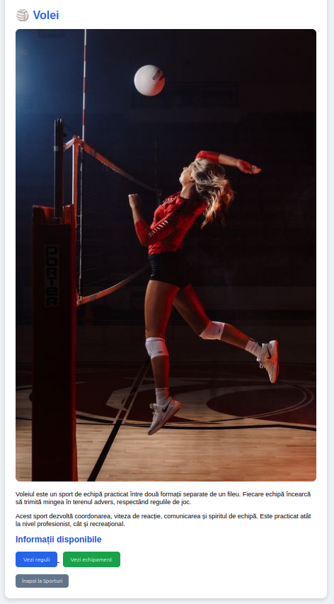
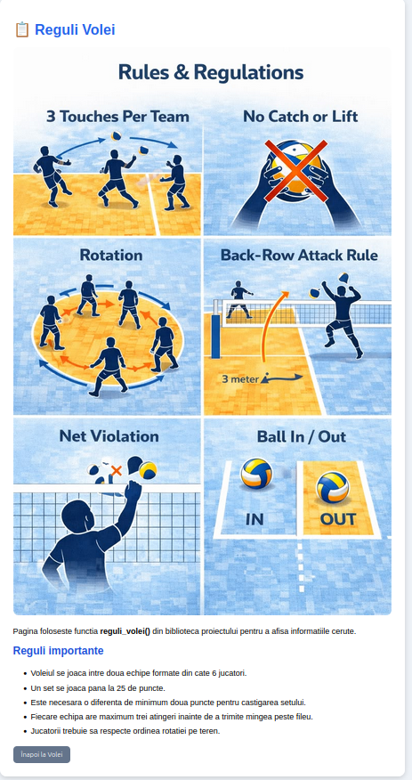
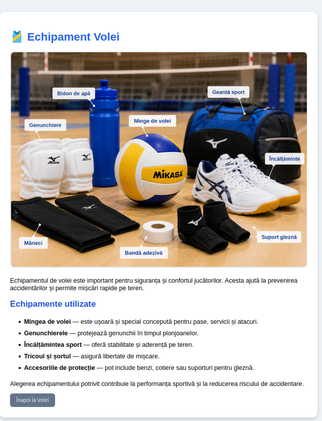

# curs_scc_442D_Sporturi — Volei

---

# Cuprins

1. [Student](#student)
2. [Prezentare proiect](#prezentare-proiect)
3. [Functionalitate implementata](#functionalitate-implementata)
4. [Structura aplicatiei](#structura-aplicatiei)
5. [Rulare locala](#rulare-locala)
6. [Pagini WEB disponibile](#pagini-web-disponibile)
7. [Testare automata](#testare-automata)
8. [Analiza statica cu pylint](#analiza-statica-cu-pylint)
9. [Containerizare Docker](#containerizare-docker)
10. [Integrare Jenkins](#integrare-jenkins)
11. [Utilizare GitHub](#utilizare-github)
12. [Review pentru Pull Request-uri](#review-pentru-pull-request-uri)
13. [Stadiul proiectului](#stadiul-proiectului)
14. [Posibile imbunatatiri](#posibile-imbunatatiri)
15. [Resurse utilizate](#resurse-utilizate)

---

# Student

Nume: Bocai Alexandra
Grupa: 442D
Tema: Sporturi
Element ales: Volei
---

# Prezentare proiect

Acest proiect a fost realizat folosind limbajul Python si framework-ul Flask.
Tema aleasa pentru implementare este sportul Volei.

Aplicatia WEB permite utilizatorului sa navigheze intre mai multe pagini
care contin informatii despre:
- sportul Volei
- regulile de joc
- echipamentele utilizate

Scopul proiectului este dezvoltarea unei aplicatii simple folosind concepte
de programare, testare automata si containerizare Docker.

---

# Functionalitate implementata

In cadrul aplicatiei au fost dezvoltate urmatoarele functionalitati:

- pagina principala pentru sporturi
- pagina dedicata sportului Volei
- prezentarea regulilor principale din volei
- prezentarea echipamentelor utilizate
- utilizarea imaginilor statice
- navigare intre pagini prin link-uri si butoane
- stilizare HTML/CSS simpla

Aplicatia foloseste Flask pentru gestionarea rutelor si afisarea template-urilor HTML.

---

# Structura aplicatiei

```text
app/
static/
templates/
sporturi.py
requirements.txt
Dockerfile
Jenkinsfile
README.md
```


---

# Rulare locala

Activarea mediului virtual:

```bash
source venv/bin/activate
```
Pornirea aplicatiei:
```bash
python sporturi.py
```
Accesarea aplicatiei:
```bash
http://127.0.0.1:5000
```
# Pagini WEB disponibile
## /sporturi

Pagina principala a aplicatiei.

## /sporturi/volei

Pagina dedicata sportului Volei.

## /sporturi/volei/reguli

Pagina care prezinta regulile jocului de volei.

## /sporturi/volei/echipament

Pagina care prezinta echipamentele utilizate in volei.

# Capturi aplicatie

## Pagina principala


## Pagina Volei



## Pagina Reguli



## Pagina Echipament



# Testare automata

Aplicatia a fost testata folosind pytest.

Comanda utilizata:

```bash
PYTHONPATH=. pytest
```
Rezultat:

- 2 teste au trecut cu succes

# Analiza statica cu pylint

Exemplu de rulare:

```bash
pylint sporturi.py
```
Rezultat:
- scor pylint: 10/10
# Containerizare Docker

Build imagine:

```bash
sudo docker build -t sporturi-volei .
```
Rulare container:

```bash
sudo docker run -p 5000:5000 sporturi-volei
```
# Integrare Jenkins

Proiectul contine fisierul Jenkinsfile pentru automatizarea testelor.

# Utilizare GitHub

Branch utilizat:

```bash
dev_bocai_alexandra
```
# Review pentru Pull Request-uri

Aceasta sectiune va fi completata dupa realizarea review-urilor.

# Stadiul proiectului

Functionalitatea pentru Volei este implementata si functionala.

# Posibile imbunatatiri
- adaugarea mai multor sporturi
- utilizarea unei baze de date
- design responsive

# Resurse utilizate
- Flask Documentation
- Docker Documentation
- Jenkins Documentation

