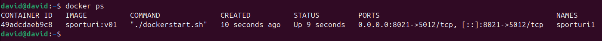

# Proiect SCC - Sporturi

## Dezvoltator

- **Nume:** Bulau Andrei Cristian
- **Grupa:** 442D
- **Element alocat:** Sport - Sah
- **Branch:** `dev_bulau_andrei`

## Cuprins

- [Descriere generala](#descriere-generala)
- [Functionalitate implementata](#functionalitate-implementata)
- [Structura proiectului](#structura-proiectului)
- [Tabel rute](#tabel-rute)
- [Stadiu dezvoltare](#stadiu-dezvoltare)
- [Testare manuala in browser](#testare-manuala-in-browser)
- [Testare automata cu pytest](#testare-automata-cu-pytest)
- [Validare cod cu pylint](#validare-cod-cu-pylint)
- [Testare cu Docker](#testare-cu-docker)
- [DevOps CI](#devops-ci)
- [Concluzii](#concluzii)
- [Bibliografie](#bibliografie)

## Descriere generala

Obiectivul proiectului a fost realizarea unei aplicatii web folosind framework-ul Flask si parcurgerea unui flux complet de dezvoltare software. Proiectul include versionare cu GitHub, testare automata cu `pytest`, analiza statica folosind `pylint`, containerizare cu Docker si automatizare CI/CD prin Jenkins.

Tema proiectului este **Sporturi**, iar elementul ales este **sahul**. Aplicatia prezinta sahul ca sport al strategiei, include o pagina dedicata regulilor de baza si o pagina pentru competitii importante.

## Functionalitate implementata

In acest branch au fost adaugate si personalizate urmatoarele componente:

- Fisierul `app/lib/biblioteca_sporturi.py`, care contine functiile:
  - `genereaza_regulament_sah()` - genereaza sectiunea HTML cu reguli de baza pentru sah.
  - `genereaza_competitii_sah()` - genereaza sectiunea HTML cu competitii importante de sah.
- Fisierul principal `sporturi.py`, care defineste aplicatia Flask, stilul paginilor, meniul de navigatie si rutele web.
- Fisierele de test:
  - `app/tests/test_biblioteca_sporturi.py` - teste pentru functiile din biblioteca.
  - `app/tests/test_rute_sporturi.py` - teste pentru rutele principale ale aplicatiei.
- Fisierele DevOps:
  - `Dockerfile` - imagine Docker pentru rularea aplicatiei.
  - `Jenkinsfile` - pipeline declarativ cu build, pylint, teste si deploy.

## Structura proiectului

| Fisier / director | Rol |
| --- | --- |
| `sporturi.py` | Aplicatia Flask principala si definirea rutelor. |
| `app/lib/biblioteca_sporturi.py` | Continut modular HTML pentru regulament si competitii. |
| `app/tests/test_biblioteca_sporturi.py` | Teste unitare pentru functiile din biblioteca. |
| `app/tests/test_rute_sporturi.py` | Teste pentru raspunsurile rutelor Flask. |
| `Dockerfile` | Configurarea imaginii Docker. |
| `dockerstart.sh` | Scriptul de pornire folosit in container. |
| `Jenkinsfile` | Pipeline CI/CD declarativ. |
| `doc/` | Capturi de ecran pentru Docker si Jenkins. |

## Tabel rute

| Ruta | Functie Flask | Descriere | Rezultat asteptat |
| --- | --- | --- | --- |
| `/` | `index()` | Redirect catre pagina principala a temei. | Redirect la `/sporturi`. |
| `/sporturi` | `sporturi()` | Pagina principala pentru tema Sporturi. | Afiseaza prezentarea sahului ca sport. |
| `/sporturi/sah` | `sah()` | Pagina elementului ales. | Afiseaza informatii generale despre sah. |
| `/sporturi/sah/regulament` | `regulament()` | Pagina pentru prima functionalitate. | Afiseaza reguli de baza pentru sah. |
| `/sporturi/sah/competitii` | `competitii()` | Pagina pentru a doua functionalitate. | Afiseaza competitii importante de sah. |

## Stadiu dezvoltare

- Functionalitate complet implementata pentru tema **Sporturi - Sah**.
- Cod adaugat in branch-ul `dev_bulau_andrei`.
- Rutele Flask sunt functionale si acopera pagina temei, pagina elementului ales si cele doua pagini de continut.
- Testele automate pentru biblioteca si rute sunt incluse in proiect.
- Dockerfile si Jenkinsfile sunt pregatite pentru testare si rulare automatizata.

## Testare manuala in browser

Pentru rulare locala:

```bash
git clone https://github.com/vlad-barbu18/curs_scc_442D_Sporturi.git
cd curs_scc_442D_Sporturi
git checkout dev_bulau_andrei
. ./activeaza_venv
./ruleaza_aplicatia
```

Aplicatia se acceseaza la:

```text
http://127.0.0.1:5012/sporturi
```

Rute verificate manual:

| Pagina | URL local |
| --- | --- |
| Pagina tema | `http://127.0.0.1:5012/sporturi` |
| Pagina element | `http://127.0.0.1:5012/sporturi/sah` |
| Pagina regulament | `http://127.0.0.1:5012/sporturi/sah/regulament` |
| Pagina competitii | `http://127.0.0.1:5012/sporturi/sah/competitii` |

Capturile pentru paginile aplicatiei pot fi salvate in `doc/` cu urmatoarele nume:

| Pagina | Fisier recomandat |
| --- | --- |
| Pagina tema | `doc/paginaTemaLocal.png` |
| Pagina element | `doc/paginaElementLocal.png` |
| Pagina regulament | `doc/paginaFunctie1Local.png` |
| Pagina competitii | `doc/paginaFunctie2Local.png` |

## Testare automata cu pytest

Testele automate verifica atat continutul generat de biblioteca, cat si disponibilitatea rutelor principale.

```bash
pytest
```

Teste incluse:

| Fisier test | Ce valideaza |
| --- | --- |
| `app/tests/test_biblioteca_sporturi.py` | HTML-ul generat pentru regulament si competitii. |
| `app/tests/test_rute_sporturi.py` | Status `200 OK` pentru rutele principale si continutul specific sahului. |

## Validare cod cu pylint

Analiza statica se poate rula pentru modulele principale ale proiectului:

```bash
pylint --exit-zero app/lib/biblioteca_sporturi.py
pylint --exit-zero app/tests/test_biblioteca_sporturi.py
pylint --exit-zero app/tests/test_rute_sporturi.py
pylint --exit-zero sporturi.py
```

In pipeline-ul Jenkins, `pylint` este configurat in mod warning-only prin `--exit-zero`, astfel incat raportarea problemelor de stil sa nu opreasca automat build-ul.

## Testare cu Docker

Construirea imaginii Docker:

```bash
docker build -t sporturi:v01 .
```

Rularea containerului:

```bash
docker run --name sporturi1 -p 8021:5012 sporturi:v01
```

Aplicatia din container se acceseaza la:

```text
http://localhost:8021/sporturi
```

Capturi Docker:




## DevOps CI

Pipeline-ul declarativ este definit in `Jenkinsfile` si contine 4 stage-uri:

| Stage | Rol |
| --- | --- |
| `Build` | Creeaza/activeaza mediul virtual si pregateste dependintele. |
| `pylint - calitate cod` | Ruleaza analiza statica pentru biblioteca, teste si aplicatia Flask. |
| `Unit Testing cu pytest` | Ruleaza testele automate cu `pytest`. |
| `Deploy` | Construieste imaginea Docker si creeaza containerul pentru build-ul curent. |

Capturi Jenkins:


## Concluzii

- **Dezvoltare modulara:** continutul reutilizabil este separat in `app/lib/biblioteca_sporturi.py`.
- **Aplicatie Flask functionala:** rutele principale acopera tema, elementul ales si cele doua functionalitati cerute.
- **Testare automata:** `pytest` valideaza biblioteca si rutele aplicatiei.
- **Portabilitate:** Docker permite rularea aplicatiei intr-un mediu consistent.
- **Automatizare:** Jenkins ruleaza build, analiza statica, teste si deploy containerizat.

## Bibliografie

- https://github.com/crchende/sysinfo.git
- https://github.com/vlad-barbu18/curs_scc_442D_Sporturi.git
