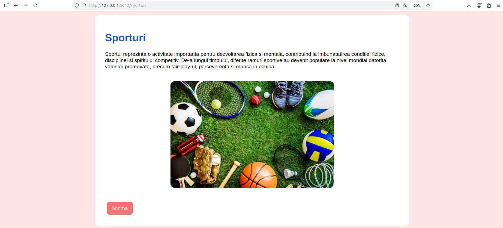
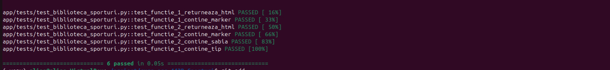
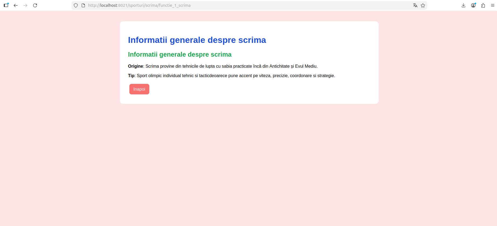

# Proiect SCC - Sporturi
#Voica Alina - Sporturi/ Scrima

## Student
- **Nume:** Voica Alina-Maria
- **Grupa:** 442D
- **Element alocat:** Scrima

## Cuprins
- [Descriere generală](#descriere-generală)
- [Funcționalitate implementată](#funcționalitate-implementată)
- [Stadiu dezvoltare](#stadiu-dezvoltare)
- [Testare manuală în browser (rulare locală)](#testare-manuală-în-browser-rulare-locală)
- [Testare automată cu pytest](#testare-automată-cu-pytest)
- [Validare cod cu pylint](#validare-cod-cu-pylint)
- [Testare cu Docker](#testare-cu-docker)
- [DevOps CI](#devops-ci)
- [Concluzii](#concluzii)
- [Bibliografie](#bibliografie)

## Descriere generală

Obiectivul acestui proiect este dezvoltarea unei aplicații web utilizând limbajul Python și framework-ul Flask, având ca temă principală sporturile și ca subtemă scrima. Aplicația are rolul de a prezenta informații generale despre acest sport olimpic, originea sa și principalele tipuri de arme utilizate în competiții.

Proiectul urmărește implementarea unor concepte de bază din dezvoltarea aplicațiilor web și din zona DevOps, precum organizarea codului pe module, testarea automată cu pytest, validarea calității codului cu pylint, containerizarea aplicației folosind Docker și automatizarea procesului de build și testare prin Jenkins Pipeline.

## Funcționalitate implementată

În acest branch am adăugat și personalizat aplicația pentru tema „Sporturi”, având ca subtemă scrima.

- Fișierul `app/lib/biblioteca_sporturi.py` contine cele două funcții principale cerute:
  - `functie_1_scrima()` – returnează informații generale despre scrimă, precum originea și tipul acestui sport.
  - `functie_2_scrima()` –  returnează informații despre principalele arme utilizate în scrimă: floreta, sabia și spada.

- Fișierul principal `sporturi.py` implementeaza cele patru rute conform cerinței:
  - `/sporturi` – pagina principală a temei, cu introducere generală despre sporturi și scrimă.
  - `/sporturi/scrima` – pagina dedicată sportului ales.
  - `/sporturi/scrima/functie_1_scrima` – afișează informațiile generale despre scrimă.
  - `/sporturi/scrima/functie_2_scrima` – afișează tipurile de arme utilizate în scrimă.

- Interfața aplicației a fost personalizată folosind elemente HTML și CSS:
  - butoane stilizate,
  - imagini reprezentative pentru scrimă,
  - fundal și culori personalizate,
  - structură simplă și ușor de navigat.

- Fișierul `app/tests/test_biblioteca_sporturi.py` conține testele automate realizate cu pytest pentru verificarea funcțiilor implementate.

- Pentru partea DevOps au fost adăugate:
  - `Dockerfile` pentru containerizarea aplicației,
  - `dockerstart.sh` pentru pornirea automată a aplicației în container,
  - `Jenkinsfile` pentru automatizarea etapelor de build, testare și deploy.

## Stadiu dezvoltare


- Funcționalitatea aplicației a fost implementată complet.
- Codul sursă a fost dezvoltat și organizat în branch-ul `dev_Voica_Alina`.
- Rutele Flask și funcțiile bibliotecii Python sunt funcționale și testate.
- Testarea automată cu pytest a fost realizată cu succes.
- Validarea codului folosind pylint a fost integrată în pipeline-ul Jenkins.
- Aplicația a fost containerizată utilizând Docker.
- Pipeline-ul Jenkins pentru build, testare și deploy funcționează corect.
- Capturile de ecran și documentația README au fost adăugate în proiect.
- Testarea locală, automată și containerizată a fost realizată cu succes.

## Testare manuală în browser (rulare locală)

```bash
git clone https://github.com/vlad-barbu18/curs_scc_442D_Sporturi.git
cd curs_scc_442D_Sporturi
git checkout dev_Voica_Alina
. ./activeaza_venv
./ruleaza_aplicatia
```

Aplicația se accesează la: `http://127.0.0.1:5012/sporturi`




## Testare automată cu `pytest`

```bash
pytest
```



## Validare cod cu `pylint`

```bash
pylint --exit-zero app/lib/biblioteca_sporturi.py
pylint --exit-zero app/tests/test_biblioteca_sporturi.py
pylint --exit-zero sporturi.py
```


## Testare cu Docker

```bash
docker build -t sporturi:v01 .
docker run --name sporturi1 -p 8021:5012 sporturi:v01
```


Aplicația din container, accesată la `http://localhost:8021/sporturi`:





# DevOps CI

Pipeline declarativ definit în `Jenkinsfile`, cu 4 stages:
1. **Build**
   - activarea mediului virtual,
   - verificarea structurii proiectului,
   - pregătirea dependențelor necesare.
2. **pylint** 
   - realizarea analizei statice a codului Python,
   - identificarea warning-urilor și a problemelor de stil.
3. **Unit Tests** - rularea testelor automate folosind 'pytest'
4. **Deploy** - build Docker + creare container
 
##Pipeline Blue Ocean


##Pipeline Jenkins clasic


## Concluzii

Proiectul realizat demonstrează dezvoltarea unei aplicații web folosind
framework-ul Flask împreună cu tehnologii moderne utilizate în zona DevOps.

- **Dezvoltare modulară:** aplicația a fost organizată pe module și funcții separate pentru o structură mai clară și mai ușor de întreținut.

- **Interfață web:** au fost implementate pagini HTML dinamice, elemente vizuale și navigare între rute pentru prezentarea informațiilor despre scrimă.

- **Testare automată:** funcționalitățile aplicației au fost verificate utilizând teste automate realizate cu pytest.

- **Asigurarea calității codului:** analiza statică a codului a fost realizată folosind pylint și integrată în pipeline-ul Jenkins.

- **Portabilitate:** utilizarea Docker permite rularea aplicației într-un mediu izolat și consistent.

- **Automatizare DevOps:** Jenkins a fost utilizat pentru automatizarea etapelor de build, testare și deploy ale aplicației.

În urma implementării, aplicația a funcționat corect atât local, cât și în container Docker, iar pipeline-ul Jenkins a executat cu succes toate etapele configurate.

## Bibliografie

https://github.com/crchende/sysinfo.git
