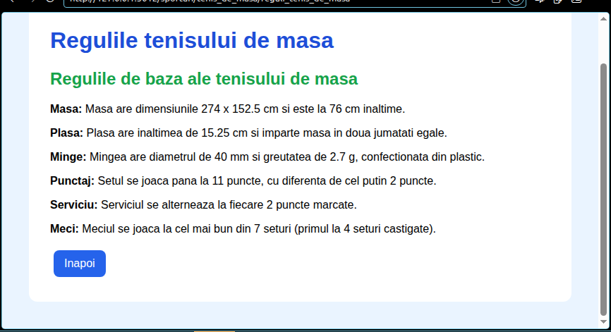
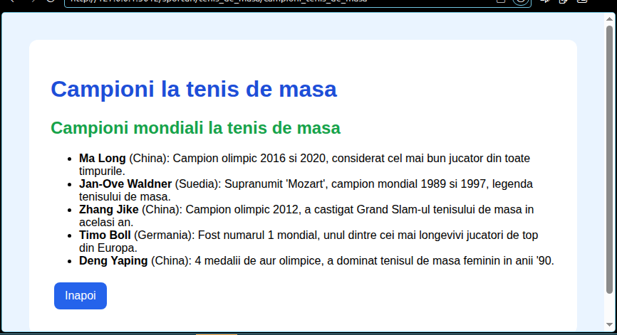
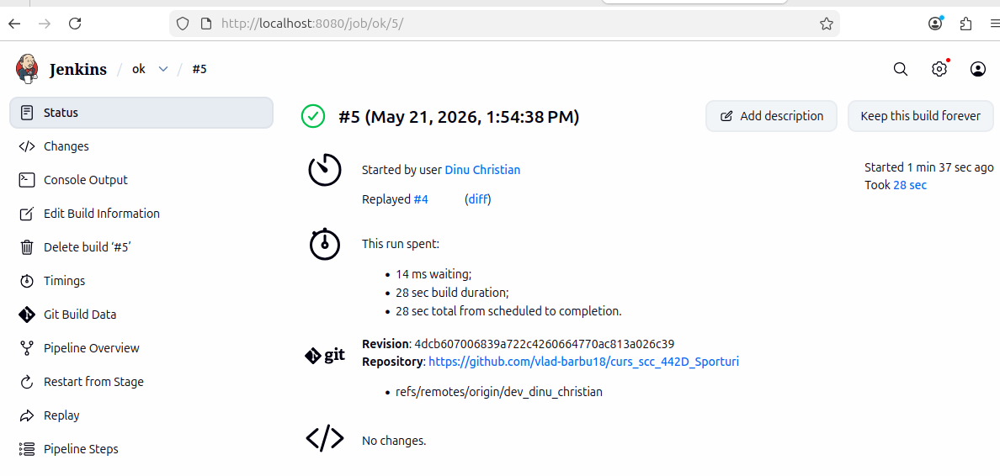

# Proiect SCC - Sporturi

## Dezvoltator
- **Nume:** Dinu Christian
- **Grupa:** 442D
- **Element alocat:** Tenis de masa (ping-pong)

## Cuprins
- [Descriere generala](#descriere-generala)
- [Functionalitate implementata](#functionalitate-implementata)
- [Stadiu dezvoltare](#stadiu-dezvoltare)
- [Testare manuala in browser (rulare locala)](#testare-manuala-in-browser-rulare-locala)
- [Testare automata cu pytest](#testare-automata-cu-pytest)
- [Validare cod cu pylint](#validare-cod-cu-pylint)
- [Testare cu Docker](#testare-cu-docker)
- [DevOps CI](#devops-ci)
- [Pull Requests review](#pull-requests-review)
- [Concluzii](#concluzii)
- [Bibliografie](#bibliografie)

## Descriere generala

Obiectivul proiectului a fost realizarea unei aplicatii web folosind framework-ul Flask, parcurgerea unui proces complet de dezvoltare software in care folosim Jenkins, Docker, Python, GitHub pentru versionare, containerizare, programare si automatizare.

## Functionalitate implementata

In acest branch am adaugat si personalizat:

- Fisierul `app/lib/biblioteca_sporturi.py` cu cele doua functii cerute:
  - `reguli_tenis_de_masa()` - returneaza HTML cu regulile de baza ale tenisului de masa (dimensiuni masa, plasa, minge, punctaj, serviciu, meci).
  - `campioni_tenis_de_masa()` - returneaza HTML cu campioni mondiali celebri (Ma Long, Jan-Ove Waldner, Zhang Jike, Timo Boll, Deng Yaping).

- Fisierul principal `sporturi.py` cu cele patru rute conform cerintei:
  - `/sporturi` - pagina principala a temei.
  - `/sporturi/tenis_de_masa` - pagina elementului ales.
  - `/sporturi/tenis_de_masa/reguli_tenis_de_masa` - regulile tenisului de masa.
  - `/sporturi/tenis_de_masa/campioni_tenis_de_masa` - campionii la tenis de masa.

- Fisierul `app/tests/test_biblioteca_sporturi.py` cu 8 teste automate.

## Stadiu dezvoltare

- Functionalitate complet implementata.
- Cod adaugat in branch-ul `dev_dinu_christian`.
- Dockerfile si Jenkinsfile sunt functionale.
- Testare locala, automata si containerizata realizata cu succes.

## Testare manuala in browser (rulare locala)

```bash
git clone <url-repo>
cd <folder-repo>
git checkout dev_dinu_christian
. ./activeaza_venv
./ruleaza_aplicatia
```

Aplicatia se acceseaza la: `http://127.0.0.1:5012/sporturi`





## Testare automata cu `pytest`

```bash
pytest
```


## Validare cod cu `pylint`

```bash
pylint --exit-zero app/lib/biblioteca_sporturi.py
pylint --exit-zero app/tests/test_biblioteca_sporturi.py
pylint --exit-zero sporturi.py
```


## Testare cu Docker

```bash
docker build -t sporturi:v01 .
docker run --name sporturi1 -p 8021:5012 sporturi:v01
```


Aplicatia din container, accesata la `http://localhost:8021/sporturi`:




## DevOps CI

Pipeline declarativ definit in `Jenkinsfile`, cu 4 stages:
1. **Build** - creare venv si instalare dependente
2. **pylint** - analiza statica a codului (warning-only, `--exit-zero`)
3. **Unit Tests** - rulare teste cu pytest
4. **Deploy** - build imagine Docker si creare container




## Pull Requests review

| ID PR | Branch | Descriere | Actiune |
|-------|--------|-----------|---------|
| -     | -      | -         | -       |

*(Se completeaza dupa realizarea review-urilor)*

## Concluzii

- **Dezvoltare modulara:** aplicatie Flask cu separarea datelor si logicii in fisiere dedicate.
- **Portabilitate:** Docker asigura rulare consistenta indiferent de mediu.
- **Automatizare:** Jenkins automatizeaza testarea si deploy-ul la fiecare push.
- **Asigurarea calitatii:** pytest si pylint integrate in pipeline CI/CD.

## Bibliografie

https://github.com/crchende/sysinfo.git
