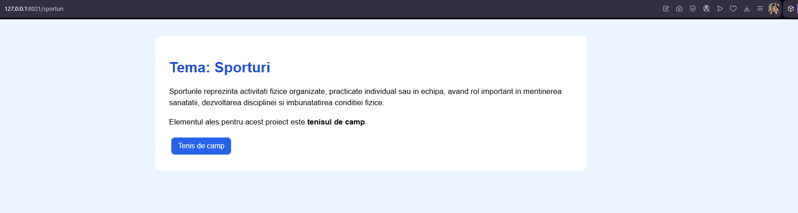
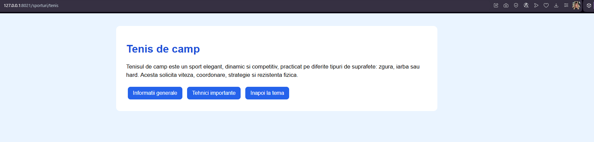
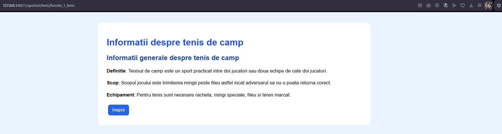
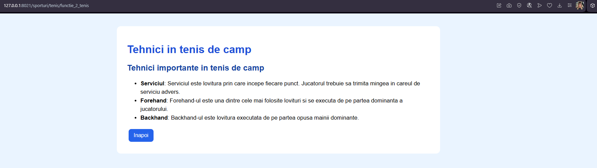

# Proiect SCC - Sporturi

## Dezvoltator

- **Nume:** Ana Maria Petre
- **Grupa:** 442D
- **Element alocat:** Tenis de câmp

---

# Cuprins

- [Descriere generală](#descriere-generală)
- [Funcționalitate implementată](#funcționalitate-implementată)
- [Stadiu dezvoltare](#stadiu-dezvoltare)
- [Testare manuală în browser (rulare-locală)](#testare-manuală-în-browser-rulare-locală)
- [Testare automată cu pytest](#testare-automată-cu-pytest)
- [Validare cod cu pylint](#validare-cod-cu-pylint)
- [Testare cu Docker](#testare-cu-docker)
- [DevOps CI](#devops-ci)
- [Concluzii](#concluzii)
- [Bibliografie](#bibliografie)

---

# Descriere generală

Obiectivul proiectului a fost realizarea unei aplicații web folosind framework-ul Flask, urmărind un proces complet de dezvoltare software în care au fost utilizate tehnologii moderne precum:

- Flask
- Docker
- Jenkins
- Python
- GitHub
- Pytest
- Pylint

Tema aleasă pentru proiect este reprezentată de domeniul sporturilor, iar elementul implementat este **tenisul de câmp**.

Aplicația oferă o prezentare modernă și interactivă a acestui sport, incluzând informații generale, tehnici importante și o structură modulară bazată pe rute Flask și funcții separate în biblioteci Python.

---

# Funcționalitate implementată

În cadrul proiectului au fost implementate următoarele componente:

## Bibliotecă Python dedicată

Fișierul:

```text
app/lib/biblioteca_sporturi.py
```

conține cele două funcții cerute:

- `functie_1_tenis()`  
  → afișează informații generale despre tenisul de câmp.

- `functie_2_tenis()`  
  → afișează tehnici importante utilizate în tenis.

---

## Fișier principal Flask

Fișierul:

```text
sporturi.py
```

conține cele patru rute principale:

| Rută | Descriere |
|---|---|
| `/sporturi` | Pagina principală a temei |
| `/sporturi/tenis` | Pagina dedicată tenisului |
| `/sporturi/tenis/functie_1_tenis` | Informații generale |
| `/sporturi/tenis/functie_2_tenis` | Tehnici importante |

---

## Testare automată

Au fost implementate teste automate în fișierul:

```text
app/tests/test_biblioteca_sporturi.py
```

Testele verifică:
- existența conținutului HTML
- structura paginilor
- prezența markerelor importante
- validarea funcțiilor din bibliotecă

---

# Stadiu dezvoltare

- Funcționalitate complet implementată
- Interfață modernă și responsive realizată
- Dockerfile și Jenkinsfile funcționale
- Testare locală și containerizată realizată cu succes
- Pipeline Jenkins configurat și executat cu succes
- Cod organizat modular pe biblioteci și teste

---

# Testare manuală în browser (rulare locală)

## Rulare aplicație

```bash
git clone <url-repo>
cd <folder-repo>

git checkout dev_nume_prenume

. ./activeaza_venv

./ruleaza_aplicatia
```

Aplicația poate fi accesată la:

```text
http://127.0.0.1:5012/sporturi
```

---

## Pagina principală



---

## Pagina tenis de câmp



---

## Pagina funcția 1



---

## Pagina funcția 2



---

# Testare automată cu pytest

Testele automate sunt rulate folosind:

```bash
pytest
```

Prin aceste teste este verificată funcționarea corectă a funcțiilor și generarea conținutului HTML.

---

# Validare cod cu pylint

Analiza statică a codului se realizează folosind:

```bash
pylint --exit-zero app/lib/biblioteca_sporturi.py

pylint --exit-zero app/tests/test_biblioteca_sporturi.py

pylint --exit-zero sporturi.py
```

Pylint este utilizat pentru verificarea calității codului și identificarea eventualelor probleme de stil sau structură.

---

# Testare cu Docker

## Build imagine Docker

```bash
docker build -t sporturi:v01 .
```

---

## Rulare container

```bash
docker run --name sporturi1 -p 8021:5012 sporturi:v01
```

---

## Imagine Docker creată


---

## Consolă container Flask


---

## Container activ


---

Aplicația containerizată poate fi accesată la:

```text
http://localhost:8021/sporturi
```

---

# DevOps CI

Pipeline-ul CI/CD a fost implementat folosind Jenkins și definit în fișierul:

```text
Jenkinsfile
```

Pipeline-ul conține 4 etape principale:

| Stage | Rol |
|---|---|
| Build | activare mediu virtual și instalare dependențe |
| pylint | analiză statică a codului |
| Unit Tests | rulare teste automate pytest |
| Deploy | build Docker și creare container |

---

## Pipeline Jenkins - Blue Ocean


---

## Pipeline Jenkins clasic


---

# Concluzii

În urma realizării acestui proiect au fost utilizate și integrate multiple tehnologii moderne de dezvoltare software.

Principalele avantaje ale aplicației sunt:

- **Dezvoltare modulară**  
  Separarea logicii în biblioteci și fișiere dedicate.

- **Interfață modernă**  
  Pagini web realizate într-un stil modern și responsive.

- **Portabilitate**  
  Docker permite rularea aplicației într-un mediu izolat și consistent.

- **Automatizare**  
  Jenkins automatizează procesul de build, testare și deploy.

- **Calitatea codului**  
  Testele pytest și verificările pylint asigură stabilitatea aplicației.

---

# Bibliografie

- https://github.com/crchende/sysinfo.git
- https://flask.palletsprojects.com/
- https://docs.docker.com/
- https://www.jenkins.io/doc/
- https://docs.pytest.org/