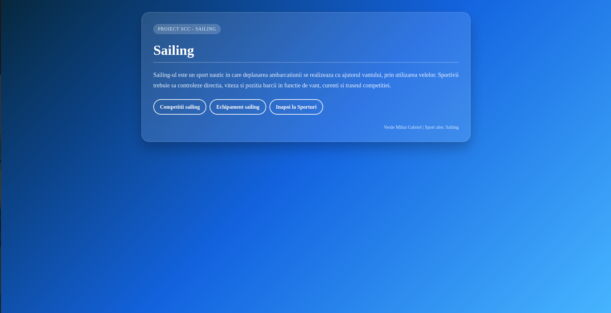

# Proiect SCC - Sporturi

## Dezvoltator
- **Nume:** Verde Mihai Gabriel
- **Grupa:** 442D
- **Element alocat:** Sailing

## Cuprins
- [Descriere generală](#descriere-generală)
- [Funcționalitate implementată](#funcționalitate-implementată)
- [Stadiu dezvoltare](#stadiu-dezvoltare)
- [Testare manuală în browser (rulare locală)](#testare-manuală-în-browser-rulare-locală)
- [Testare automată cu pytest](#testare-automată-cu-pytest)
- [Validare cod cu pylint](#validare-cod-cu-pylint)
- [Testare cu Docker](#testare-cu-docker)
- [DevOps CI](#devops-ci)
  - [Exemplu execuție pipeline Jenkins](#exemplu-execuție-pipeline-jenkins)
- [Concluzii](#concluzii)
- [Bibliografie](#bibliografie)

## Descriere generală

Obiectivul proiectului a fost realizarea unei aplicații web folosind framework-ul Flask, parcurgerea unui proces complet de dezvoltare software în care folosim Jenkins, Docker, Python și GitHub pentru versionare, containerizare, programare și automatizare.

Tema proiectului este **Sporturi**, iar elementul ales pentru implementare este **Sailing**. Aplicația prezintă informații despre acest sport nautic, despre competițiile importante de sailing și despre echipamentul folosit de sportivi.

Sailing-ul este un sport în care deplasarea ambarcațiunii se realizează cu ajutorul vântului, prin utilizarea velelor. Practicarea acestui sport presupune controlul direcției, al vitezei și al poziției bărcii în funcție de vânt, curenți și traseul competiției.

## Funcționalitate implementată

În acest branch am adăugat și personalizat:

- Fișierul `app/lib/biblioteca_sporturi.py` cu cele două funcții cerute:
  - `competitii_sailing()` – returnează codul HTML cu informații despre competiții importante de sailing, precum America's Cup, Sailing World Championships, Olympic Sailing Regatta, Volvo Ocean Race și Rolex Sydney Hobart Yacht Race.
  - `echipament_sailing()` – returnează codul HTML cu informații despre echipamentul folosit în sailing, precum barca cu vele, velele, vesta de salvare, costumul impermeabil și sistemele de control ale ambarcațiunii.

- Fișierul principal `sporturi.py` care are cele patru rute conform cerinței:
  - `/sporturi` – pagina principală a temei.
  - `/sporturi/sailing` – pagina principală a elementului ales.
  - `/sporturi/sailing/competitii_sailing` – informații despre competițiile de sailing.
  - `/sporturi/sailing/echipament_sailing` – informații despre echipamentul folosit în sailing.

- Fișierul `app/tests/test_biblioteca_sporturi.py` care conține testele automate pentru cele două funcții definite. Testele verifică prezența unor markeri specifici în HTML-ul generat, precum `America`, `Cup`, `Olympic`, `Sailing`, `Barca cu vele` și `Vesta de salvare`.

Interfața aplicației a fost personalizată pentru sportul ales. Design-ul folosește un fundal albastru marin cu gradient, un card transparent, butoane rotunjite și un footer cu numele dezvoltatorului.

## Stadiu dezvoltare

- Funcționalitate complet implementată.
- Cod adăugat în branch-ul de lucru `dev_verde_mihai_gabriel`.
- Dockerfile și fișierul `dockerstart.sh` sunt funcționale.
- Testare locală, automată și containerizată realizată cu succes.
- Pipeline-ul Jenkins a fost creat și executat cu succes.
- Capturile de ecran au fost adăugate în folderul `doc/`.
- README-ul documentează etapele principale ale proiectului.

## Testare manuală în browser (rulare locală)

Clonarea repository-ului și selectarea ramurii de dezvoltare:

```bash
git clone https://github.com/vlad-barbu18/curs_scc_442D_Sporturi
cd curs_scc_442D_Sporturi
git checkout dev_verde_mihai_gabriel
```

Se activează mediul virtual și se pornește aplicația cu scripturile bash existente din rădăcina proiectului:

```bash
. ./activeaza_venv
./ruleaza_aplicatia
```

Dacă apar erori de permisiuni, se introduce comanda:

```bash
chmod +x ./activeaza_venv ./activeaza_venv_jenkins ./ruleaza_aplicatia
```

Aplicația poate fi accesată în browser la adresa:

```text
http://127.0.0.1:5012/sporturi
```

Rutele implementate sunt:

```text
http://127.0.0.1:5012/sporturi
http://127.0.0.1:5012/sporturi/sailing
http://127.0.0.1:5012/sporturi/sailing/competitii_sailing
http://127.0.0.1:5012/sporturi/sailing/echipament_sailing
```

Pagina principală a temei (`/sporturi`):


Pagina elementului ales, sailing (`/sporturi/sailing`):



Pagina cu competițiile de sailing (`/sporturi/sailing/competitii_sailing`):


Pagina cu echipamentul de sailing (`/sporturi/sailing/echipament_sailing`):


## Testare automată cu `pytest`

Testele au fost scrise în fișierul:

```text
app/tests/test_biblioteca_sporturi.py
```

Cu mediul virtual activ, rularea testelor se face astfel:

```bash
pytest
```

Testele automate verifică următoarele aspecte:

- funcția `competitii_sailing()` returnează conținut HTML;
- pagina de competiții conține markeri specifici, precum `America`, `Cup`, `Olympic` și `Sailing`;
- funcția `echipament_sailing()` returnează o listă HTML;
- pagina de echipament conține elemente specifice, precum `Barca cu vele` și `Vesta de salvare`.

Toate testele au fost executate cu succes, validând corectitudinea celor două funcții definite.


## Validare cod cu `pylint`

Pentru verificarea calității codului sursă se utilizează pachetul **pylint**. Acesta analizează conformitatea codului cu standardele Python, verificând spațierea, convențiile de numire, variabilele neutilizate, prezența docstring-urilor și alte aspecte de stil.

În cadrul acestui proiect, problemele raportate de **pylint** sunt doar afișate pentru monitorizare, nu sunt considerate erori, deoarece se utilizează flag-ul `--exit-zero`.

Comenzile utilizate au fost:

```bash
pylint --exit-zero app/lib/biblioteca_sporturi.py
pylint --exit-zero app/tests/test_biblioteca_sporturi.py
pylint --exit-zero sporturi.py
```

Rezultatul verificării cu pylint:


## Testare cu Docker

Pentru asigurarea portabilității aplicației, am creat un container Docker pornind de la `Dockerfile`-ul din rădăcina proiectului. Pașii efectuați au fost:

1. Construirea imaginii Docker:

```bash
docker build -t sporturi:v01 .
```

Imaginea creată poate fi vizualizată în lista locală de imagini Docker:

```bash
docker images | grep sporturi
```


2. Rularea containerului din imaginea creată:

```bash
docker run --name sporturi1 -p 8021:5012 sporturi:v01
```

La pornirea containerului, în consolă sunt afișate mesajele de activare a mediului virtual, configurarea variabilei `FLASK_APP` și pornirea serverului Flask:


Containerul activ se poate vizualiza cu următoarea comandă:

```bash
docker ps
```


3. Accesarea aplicației în browser, de această dată servită din interiorul containerului Docker:

```text
http://127.0.0.1:8021/sporturi
```

Capturile de mai jos prezintă cele patru rute ale aplicației, accesate din browser în timp ce aplicația rulează în containerul Docker. Comportamentul este identic cu cel din rularea locală, însă aplicația este izolată într-un container, ceea ce confirmă reușita procesului de containerizare.

Pagina principală a temei accesată din container:


Pagina elementului ales accesată din container:


Pagina cu competițiile de sailing accesată din container:


Pagina cu echipamentul de sailing accesată din container:


# DevOps CI

- **CI** = Continuous Integration / Integrare Continuă

Proiectul utilizează un flux de automatizare definit în `Jenkinsfile`, care asigură validarea codului și pregătirea aplicației pentru livrare.

## Exemplu execuție pipeline Jenkins

Pentru executarea pipeline-ului în Jenkins, este necesar ca Jenkins să poată rula comenzile definite în `Jenkinsfile`. Pipeline-ul urmărește etapele principale ale procesului de dezvoltare:

1. **Build** – crearea mediului virtual și instalarea dependențelor din `quickrequirements.txt`.
2. **Linter** – verificarea codului cu `pylint`.
3. **Unit Tests** – rularea testelor automate cu `pytest`.
4. **Deploy** – construirea imaginii Docker și pregătirea containerului aplicației.

Pentru a porni Jenkins local, se rulează:

```bash
jenkins
```

Interfața Jenkins se accesează în browser la adresa:

```text
http://localhost:8080
```

În cadrul proiectului a fost creat pipeline-ul `sailing-pipeline`, conectat la repository-ul GitHub și la branch-ul:

```text
dev_verde_mihai_gabriel
```

Execuția pipeline-ului a fost pornită prin opțiunea **Build Now**. După rezolvarea problemelor de import ale bibliotecii `app/lib`, build-ul a fost executat cu succes.

Vizualizarea etapelor pipeline-ului arată trecerea prin pașii de checkout, build, pylint, testare și deploy:


Detaliile build-ului în interfața clasică Jenkins arată execuția reușită a pipeline-ului:


## Concluzii

Acest proiect atinge obiectivele funcționale și tehnice cerute, evidențiind următoarele aspecte:

- **Dezvoltare modulară:** aplicația Flask este structurată astfel încât logica informațională se află în fișierul `app/lib/biblioteca_sporturi.py`, iar rutele sunt definite în `sporturi.py`.
- **Funcționalitate clară:** aplicația conține patru rute funcționale pentru tema Sporturi și pentru elementul ales, Sailing.
- **Interfață personalizată:** design-ul aplicației a fost adaptat la tema nautică prin folosirea unui fundal albastru marin, card transparent și butoane rotunjite.
- **Testare automată:** funcțiile principale sunt validate prin teste `pytest`, ceea ce confirmă prezența conținutului HTML și a informațiilor specifice.
- **Verificare statică:** codul a fost analizat cu `pylint` pentru monitorizarea calității.
- **Portabilitate:** containerizarea cu Docker permite rularea aplicației într-un mediu izolat și reproductibil.
- **Automatizare:** pipeline-ul Jenkins integrează pașii de build, linting, testare și deploy.

## Bibliografie

https://github.com/crchende/sysinfo.git

https://github.com/vlad-barbu18/curs_scc_442D_Sporturi
