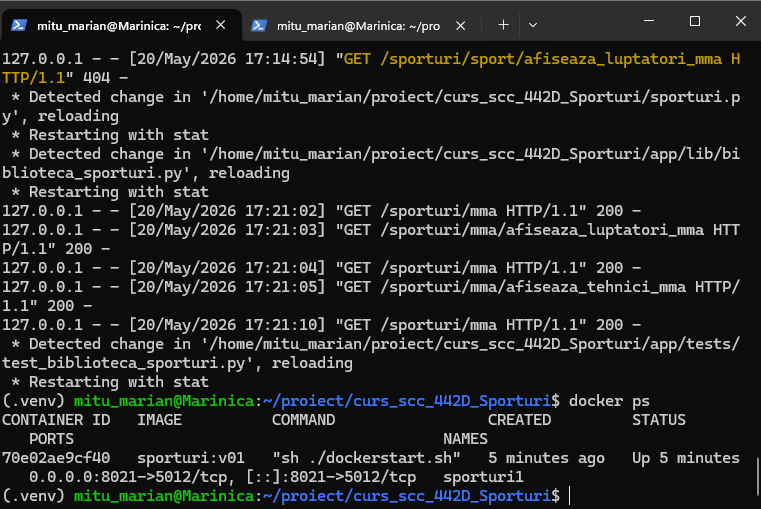
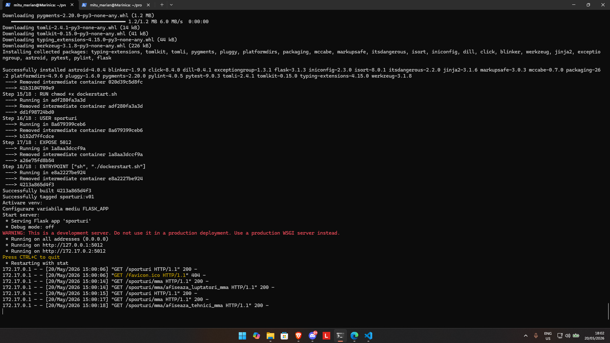
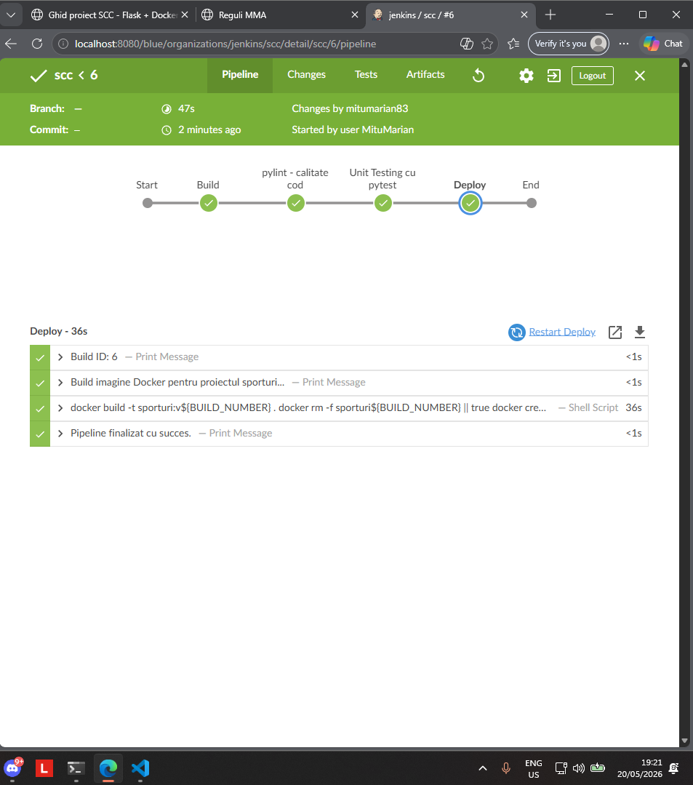

# Proiect SCC - Sporturi

## Dezvoltator

- **Nume:** Mitu Marian
- **Grupa:** 442D
- **Tema proiectului:** Sporturi
- **Element ales:** MMA
- **Branch de dezvoltare:** `dev_mitu_marian`

---

## Cuprins

- [Descriere generală](#descriere-generală)
- [Funcționalitate implementată](#funcționalitate-implementată)
- [Structura proiectului](#structura-proiectului)
- [Rutele aplicației](#rutele-aplicației)
- [Testare manuală în browser](#testare-manuală-în-browser)
- [Testare automată cu pytest](#testare-automată-cu-pytest)
- [Validare cod cu pylint](#validare-cod-cu-pylint)
- [Testare cu Docker](#testare-cu-docker)
- [DevOps CI - Jenkins](#devops-ci---jenkins)
- [Concluzii](#concluzii)
- [Bibliografie](#bibliografie)

---

## Descriere generală

Acest proiect reprezintă o aplicație web realizată în Python, folosind framework-ul Flask.

Tema proiectului este **Sporturi**, iar elementul ales este **MMA**. Aplicația prezintă informații despre MMA, luptători cunoscuți, tehnici importante și reguli de bază.

Scopul proiectului este parcurgerea unui flux complet de dezvoltare software, folosind:

- **Python** pentru implementarea aplicației;
- **Flask** pentru dezvoltarea aplicației web;
- **GitHub** pentru versionare;
- **pytest** pentru testare automată;
- **pylint** pentru verificarea calității codului;
- **Docker** pentru containerizare;
- **Jenkins** pentru automatizarea procesului de build, testare și deploy.

---

## Funcționalitate implementată

În acest branch am adăugat și personalizat următoarele componente:

### Fișierul principal `sporturi.py`

Fișierul `sporturi.py` conține aplicația Flask și rutele principale ale site-ului.

Aplicația are un design modern, cu fundal tematic MMA, navigație între pagini și carduri pentru afișarea informațiilor.

### Biblioteca `app/lib/biblioteca_sporturi.py`

Fișierul conține cele două funcții cerute în proiect:

- `afiseaza_luptatori_mma()` – returnează conținut HTML despre luptători reprezentativi din MMA.
- `afiseaza_tehnici_mma()` – returnează conținut HTML despre tehnici importante folosite în MMA.

### Fișierul de teste `app/tests/test_biblioteca_sporturi.py`

Acest fișier conține teste automate pentru cele două funcții din biblioteca proiectului.

Testele verifică:

- dacă funcțiile returnează conținut HTML;
- dacă rezultatul conține elemente specifice;
- dacă apar informații despre luptători;
- dacă apar informații despre tehnici MMA.

### Dockerfile

Fișierul `Dockerfile` permite construirea unei imagini Docker pentru aplicația Flask.

### Jenkinsfile

Fișierul `Jenkinsfile` definește un pipeline declarativ cu etapele:

1. Build
2. Verificare cod cu pylint
3. Testare automată cu pytest
4. Deploy prin Docker

---

## Structura proiectului

```text
curs_scc_442D_Sporturi/
├── app/
│   ├── __init__.py
│   ├── lib/
│   │   ├── __init__.py
│   │   └── biblioteca_sporturi.py
│   └── tests/
│       ├── __init__.py
│       └── test_biblioteca_sporturi.py
├── doc/
│   ├── docdockerconsola.png
│   ├── docdockerimages.png
│   ├── docdockerps.png
│   ├── docjenkinsBlueOcean.png
│   ├── docjenkinsSimplu.png
│   ├── pagina acasa.png
│   ├── pagina cu luptatori.png
│   ├── pagina cu reguli.png
│   ├── pagina cu tehnici.png
│   └── pagina mma.png
├── Dockerfile
├── Jenkinsfile
├── README.md
├── activeaza_venv
├── activeaza_venv_jenkins
├── dockerstart.sh
├── pytest.ini
├── quickrequirements.txt
├── ruleaza_aplicatia
└── sporturi.py
```

---

## Rutele aplicației

| Rută | Descriere |
|---|---|
| `/` | Redirect către pagina principală `/sporturi` |
| `/sporturi` | Pagina principală a temei Sporturi |
| `/sporturi/mma` | Pagina elementului ales, MMA |
| `/sporturi/mma/afiseaza_luptatori_mma` | Pagina cu luptători reprezentativi din MMA |
| `/sporturi/mma/afiseaza_tehnici_mma` | Pagina cu tehnici importante din MMA |
| `/sporturi/mma/reguli` | Pagina cu reguli de bază în MMA |

---

## Testare manuală în browser

Pentru rularea aplicației local:

```bash
git clone https://github.com/vlad-barbu18/curs_scc_442D_Sporturi.git
cd curs_scc_442D_Sporturi
git checkout dev_mitu_marian
. ./activeaza_venv
./ruleaza_aplicatia
```

Dacă scriptul nu pornește direct, aplicația poate fi rulată și cu:

```bash
export FLASK_APP=sporturi
flask run -h 127.0.0.1 -p 5012 --reload
```

Aplicația se accesează în browser la:

```text
http://127.0.0.1:5012/sporturi
```

### Pagina principală - Sporturi


### Pagina MMA


### Pagina Luptători MMA


### Pagina Tehnici MMA


### Pagina Reguli MMA


---

## Testare automată cu pytest

Testele automate se rulează cu:

```bash
pytest
```

Fișierul de teste este:

```text
app/tests/test_biblioteca_sporturi.py
```

Testele verifică funcțiile:

```python
afiseaza_luptatori_mma()
afiseaza_tehnici_mma()
```

---

## Validare cod cu pylint

Validarea codului se face cu următoarele comenzi:

```bash
pylint --exit-zero app/lib/biblioteca_sporturi.py
pylint --exit-zero app/tests/test_biblioteca_sporturi.py
pylint --exit-zero sporturi.py
```

Opțiunea `--exit-zero` permite afișarea avertismentelor fără oprirea pipeline-ului Jenkins.

---

## Testare cu Docker

### Construirea imaginii Docker

```bash
docker build -t sporturi:v01 .
```

Verificarea imaginii create:

```bash
docker images | grep sporturi
```

### Imagine Docker creată


### Rularea containerului

```bash
docker run --name sporturi1 -p 8021:5012 sporturi:v01
```

Aplicația din container se accesează la:

```text
http://127.0.0.1:8021/sporturi
```

### Container Docker pornit

```bash
docker ps
```



### Consolă Docker



### Oprirea și ștergerea containerului

```bash
docker stop sporturi1
docker rm sporturi1
```

---

## DevOps CI - Jenkins

Pipeline-ul Jenkins este definit în fișierul:

```text
Jenkinsfile
```

Pipeline-ul este declarativ și conține următoarele etape:

### 1. Build

În această etapă:

- se afișează directorul curent;
- se listează fișierele proiectului;
- se acordă permisiuni de execuție scripturilor;
- se creează și se activează mediul virtual;
- se instalează dependențele din `quickrequirements.txt`.

### 2. pylint - calitate cod

În această etapă se rulează analiza statică pentru:

```text
app/lib/*.py
app/tests/*.py
sporturi.py
```

### 3. Unit Testing cu pytest

În această etapă se rulează testele automate:

```bash
pytest
```

### 4. Deploy

În această etapă:

- se construiește o imagine Docker;
- se creează un container Docker pe portul `8021`.

Imaginea Docker este creată cu numele:

```text
sporturi:v${BUILD_NUMBER}
```

Containerul este creat cu numele:

```text
sporturi${BUILD_NUMBER}
```

### Capturi Jenkins

Pipeline Blue Ocean:



Pipeline Jenkins clasic:


---

## Fișiere importante

### `quickrequirements.txt`

Conține dependențele proiectului:

```text
flask
pytest
pylint
```

### `activeaza_venv`

Script pentru activarea mediului virtual local.

### `activeaza_venv_jenkins`

Script folosit de Jenkins pentru crearea mediului virtual și instalarea dependențelor.

### `ruleaza_aplicatia`

Script pentru rularea aplicației Flask local.

### `dockerstart.sh`

Script folosit la pornirea aplicației în container Docker.

---

## Probleme întâlnite și rezolvări

### Placeholder `<tema>` rămas în fișiere

În unele fișiere trebuie înlocuit `<tema>` cu numele real al temei:

```text
sporturi
```

### Docker - permission denied la `dockerstart.sh`

Rezolvare:

```bash
chmod +x dockerstart.sh
```

sau în `Dockerfile`:

```dockerfile
ENTRYPOINT ["sh", "./dockerstart.sh"]
```

### Testele pytest picau după modificarea designului

Inițial testele verificau existența tagului `<ul>`, dar designul nou folosește carduri HTML cu `div`.

Rezolvarea a fost actualizarea testelor pentru a verifica:

```text
class="grid"
class="stat-card"
```

### Jenkins nu găsea funcțiile din bibliotecă

Problema a apărut când conținutul fișierului de teste a fost copiat din greșeală peste fișierul bibliotecii.

Rezolvarea a fost refacerea corectă a fișierului:

```text
app/lib/biblioteca_sporturi.py
```

---

## Comenzi utile

### Activare proiect

```bash
cd curs_scc_442D_Sporturi
git checkout dev_mitu_marian
. ./activeaza_venv
```

### Rulare aplicație

```bash
./ruleaza_aplicatia
```

sau:

```bash
export FLASK_APP=sporturi
flask run -h 127.0.0.1 -p 5012 --reload
```

### Rulare teste

```bash
pytest
```

### Rulare pylint

```bash
pylint --exit-zero app/lib/biblioteca_sporturi.py
pylint --exit-zero app/tests/test_biblioteca_sporturi.py
pylint --exit-zero sporturi.py
```

### Docker

```bash
docker build -t sporturi:v01 .
docker run --name sporturi1 -p 8021:5012 sporturi:v01
docker stop sporturi1
docker rm sporturi1
```

### Git

```bash
git status
git add .
git commit -m "docs: README complet cu pozele din doc"
git push
```

---

## Concluzii

Prin acest proiect am realizat o aplicație web Flask pentru tema **Sporturi**, având ca element ales **MMA**.

Proiectul demonstrează:

- dezvoltarea unei aplicații web cu Flask;
- separarea logicii în fișiere diferite;
- utilizarea unei biblioteci proprii cu funcții Python;
- testarea automată cu pytest;
- validarea codului cu pylint;
- rularea aplicației într-un container Docker;
- automatizarea procesului de build, testare și deploy cu Jenkins.

Aplicația este organizată modular și poate fi rulată atât local, cât și în container Docker.

---

## Bibliografie

- https://github.com/vlad-barbu18/curs_scc_442D_Sporturi
- https://github.com/crchende/sysinfo.git
- https://flask.palletsprojects.com/
- https://docs.pytest.org/
- https://docs.docker.com/
- https://www.jenkins.io/doc/