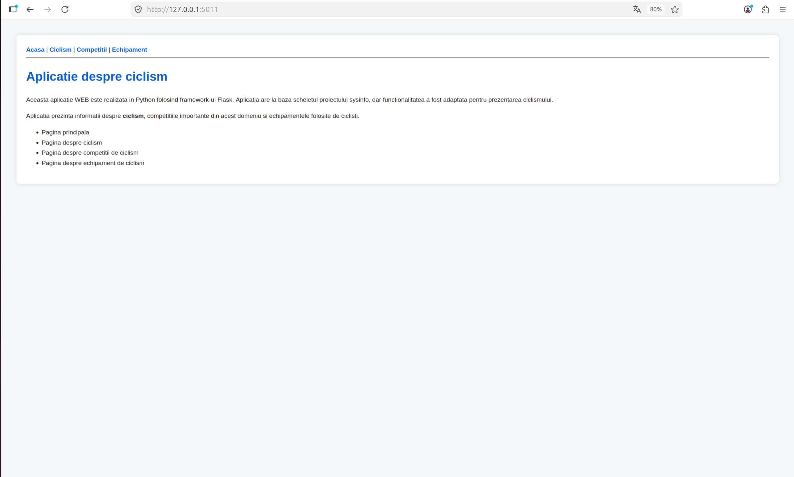
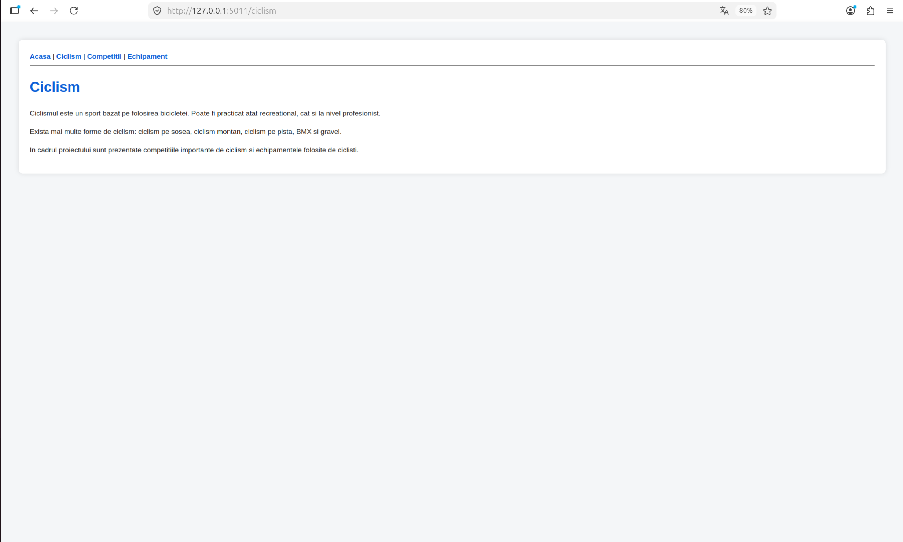
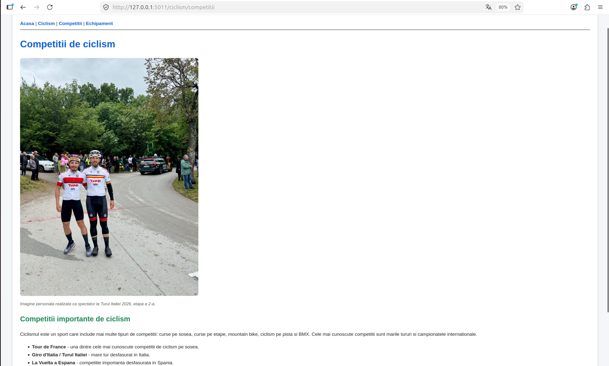
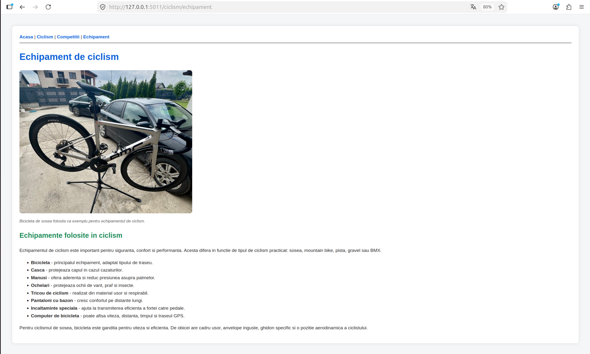
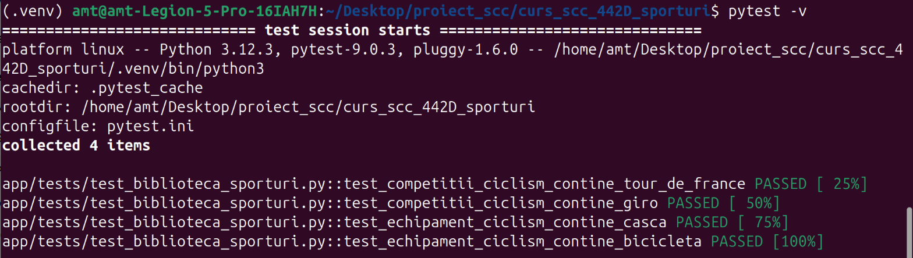
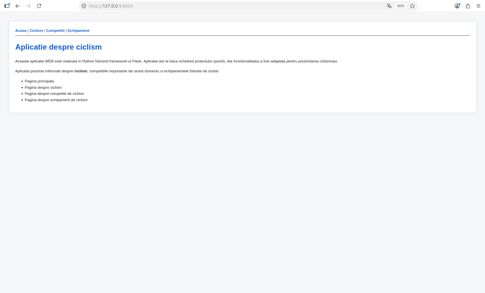
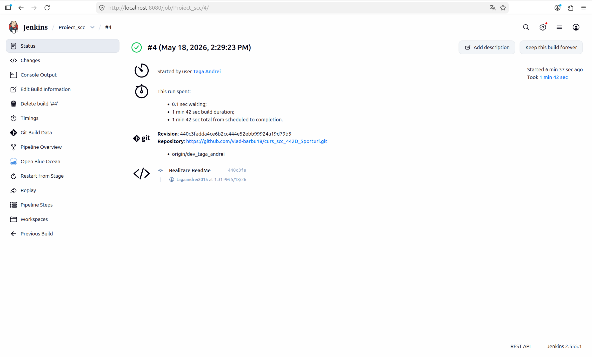
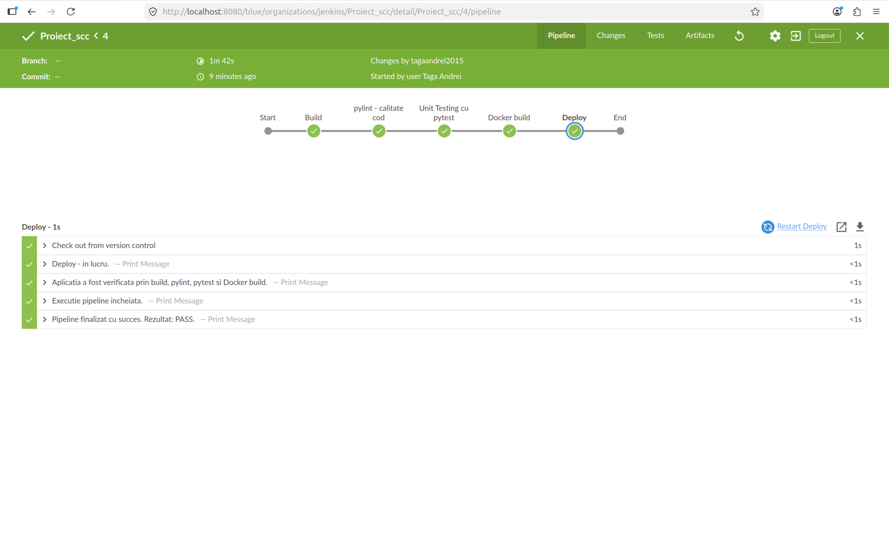

# Proiect SCC - Sporturi: Ciclism

## Cuprins

1. [Descriere aplicație](#descriere-aplicație)
2. [Student](#student)
3. [Funcționalitate implementată](#funcționalitate-implementată)
4. [Structura proiectului](#structura-proiectului)
5. [Configurare și rulare locală](#configurare-și-rulare-locală)
6. [Pagini web implementate](#pagini-web-implementate)
7. [Testare cu pytest](#testare-cu-pytest)
8. [Verificare statică folosind pylint](#verificare-statică-folosind-pylint)
9. [Containerizare Docker](#containerizare-docker)
10. [Pipeline Jenkins](#pipeline-jenkins)
11. [Stadiul implementării](#stadiul-implementării)
12. [Bibliografie](#bibliografie)

---

## Descriere aplicație

Această aplicație web este realizată în Python, folosind framework-ul Flask. Aplicația are la bază scheletul proiectului `sysinfo`, însă funcționalitatea a fost adaptată pentru tema grupei: **Sporturi**.

Elementul ales pentru implementare este **ciclismul**. Aplicația afișează informații despre ciclism, competiții importante de ciclism și echipamente folosite de cicliști.

Aplicația poate fi:
- rulată local;
- testată cu `pytest`;
- verificată static folosind `pylint`;
- rulată într-un container Docker;
- verificată automat printr-un pipeline Jenkins.

---

## Student

Nume: Taga Andrei  
Grupa: 442D  
Tema grupei: Sporturi  
Sport ales: Ciclism  

Branch de dezvoltare:

```text
dev_taga_andrei
```

Branch personal principal:

```text
main_taga_andrei
```

Repository GitHub:

```text
https://github.com/vlad-barbu18/curs_scc_442D_Sporturi.git
```

---

## Funcționalitate implementată

Funcționalitatea adăugată constă în realizarea unei aplicații web Flask care prezintă informații despre ciclism.

Fișierul principal al aplicației este:

```text
sporturi.py
```

Fișierul bibliotecă este:

```text
app/lib/biblioteca_sporturi.py
```

În biblioteca aplicației au fost implementate două funcții principale:

```python
competitii_ciclism()
echipament_ciclism()
```

Funcția `competitii_ciclism()` afișează informații despre competiții importante de ciclism, precum:
- Tour de France;
- Giro d'Italia / Turul Italiei;
- La Vuelta a Espana;
- Campionatele Mondiale UCI;
- Jocurile Olimpice.

Funcția `echipament_ciclism()` afișează informații despre echipamente folosite în ciclism, precum:
- bicicleta;
- casca;
- mănușile;
- ochelarii;
- tricoul de ciclism;
- pantalonii cu bazon;
- încălțămintea specială;
- computerul de bicicletă.

Aplicația include și imagini statice:
- `static/images/stage2.jpeg` - imagine personală de la Turul Italiei 2026, etapa a 2-a;
- `static/images/bicla.jpeg` - imagine cu bicicleta personală de șosea.

---

## Structura proiectului

Structura principală a proiectului este:

```text
curs_scc_442D_Sporturi/
├── .github/
│   └── workflows/
├── app/
│   ├── grafice/
│   ├── lib/
│   │   └── biblioteca_sporturi.py
│   ├── tests/
│   │   └── test_biblioteca_sporturi.py
│   └── test_bash_eroare/
├── doc/
│   ├── dockerdoc.md
│   └── screenshots/
├── static/
│   ├── images/
│   │   ├── bicla.jpeg
│   │   └── stage2.jpeg
│   └── imagini/
├── .gitignore
├── Dockerfile
├── Jenkinsfile
├── README.md
├── activeaza_venv
├── activeaza_venv_jenkins
├── dockerstart.sh
├── pytest.ini
├── quickrequirements.txt
├── ruleaza_aplicatia
└── sporturi.py
```

Rolul fișierelor principale:

| Fișier / folder | Rol |
|---|---|
| `sporturi.py` | Fișierul principal al aplicației Flask |
| `app/lib/biblioteca_sporturi.py` | Biblioteca în care sunt definite funcțiile pentru conținutul paginilor |
| `app/tests/test_biblioteca_sporturi.py` | Teste unitare pentru funcțiile din bibliotecă |
| `static/images/` | Folder pentru imaginile afișate în paginile web |
| `Dockerfile` | Fișier pentru construirea imaginii Docker |
| `dockerstart.sh` | Script folosit pentru pornirea aplicației în container |
| `Jenkinsfile` | Pipeline Jenkins pentru build, verificare statică, teste și Docker build |
| `activeaza_venv` | Script pentru activarea mediului virtual local |
| `activeaza_venv_jenkins` | Script pentru crearea/activarea mediului virtual în Jenkins |
| `quickrequirements.txt` | Lista dependențelor Python necesare |
| `pytest.ini` | Configurare pentru rularea testelor cu pytest |
| `doc/screenshots/` | Folder pentru capturile de ecran folosite în documentație |

---

## Configurare și rulare locală

Pentru rularea locală a aplicației se folosește un mediu virtual Python.

### 1. Clonare repository

```bash
git clone https://github.com/vlad-barbu18/curs_scc_442D_Sporturi.git
cd curs_scc_442D_Sporturi
git checkout main_taga_andrei
```

### 2. Activare mediu virtual

Activarea mediului virtual se face cu:

```bash
source activeaza_venv
```

Dacă mediul virtual există deja, acesta este activat. Dacă nu există, scriptul creează mediul virtual și instalează dependențele necesare.

Dependențele proiectului sunt definite în fișierul:

```text
quickrequirements.txt
```

Conținutul fișierului este:

```text
flask
pytest
pylint
```

### 3. Pornire aplicație local

După activarea mediului virtual, aplicația se rulează cu:

```bash
./ruleaza_aplicatia
```

Aplicația rulează pe portul `5011` și poate fi accesată în browser la:

```text
http://127.0.0.1:5011
```

---

## Pagini web implementate

Aplicația conține următoarele pagini:

| Rută | Descriere |
|---|---|
| `/` | Pagina principală |
| `/ciclism` | Pagina de prezentare a ciclismului |
| `/ciclism/competitii` | Pagina cu informații despre competiții de ciclism |
| `/ciclism/echipament` | Pagina cu informații despre echipamente de ciclism |

### Pagina principală

URL:

```text
http://127.0.0.1:5011/
```

Captură:



### Pagina Ciclism

URL:

```text
http://127.0.0.1:5011/ciclism
```

Captură:



### Pagina Competiții

URL:

```text
http://127.0.0.1:5011/ciclism/competitii
```

Captură:



### Pagina Echipament

URL:

```text
http://127.0.0.1:5011/ciclism/echipament
```

Captură:



---

## Testare cu pytest

Pentru testarea aplicației a fost folosit `pytest`.

Fișierul de testare este:

```text
app/tests/test_biblioteca_sporturi.py
```

Testele verifică funcțiile din biblioteca aplicației:

```python
competitii_ciclism()
echipament_ciclism()
```

Comanda de rulare a testelor este:

```bash
pytest -v
```

Rezultat obținut:

```text
============================= test session starts ==============================
platform linux -- Python 3.12.3, pytest-9.0.3
collected 4 items

app/tests/test_biblioteca_sporturi.py::test_competitii_ciclism_contine_tour_de_france PASSED
app/tests/test_biblioteca_sporturi.py::test_competitii_ciclism_contine_giro PASSED
app/tests/test_biblioteca_sporturi.py::test_echipament_ciclism_contine_casca PASSED
app/tests/test_biblioteca_sporturi.py::test_echipament_ciclism_contine_bicicleta PASSED

============================== 4 passed in 0.01s ===============================
```

Captură:



---

## Verificare statică folosind pylint

Pentru verificarea calității codului a fost folosit `pylint`.

Comenzile folosite în pipeline sunt:

```bash
pylint --exit-zero app/lib/*.py
pylint --exit-zero app/tests/*.py
pylint --exit-zero sporturi.py
```

Opțiunea `--exit-zero` permite afișarea observațiilor fără oprirea pipeline-ului.

În cadrul verificării statice sunt analizate:
- fișierele din `app/lib/`;
- fișierele de test din `app/tests/`;
- fișierul principal `sporturi.py`.

Captură:


---

## Containerizare Docker

Aplicația a fost containerizată folosind Docker.

Fișierul folosit pentru definirea imaginii este:

```text
Dockerfile
```

Scriptul de pornire în container este:

```text
dockerstart.sh
```

### Build imagine Docker

Comanda pentru construirea imaginii Docker este:

```bash
sudo docker build -t sporturi-ciclism:latest .
```

Verificarea imaginii create:

```bash
sudo docker images
```

Captură:


### Rulare container Docker

Comanda pentru rularea containerului este:

```bash
sudo docker run --name sporturi-ciclism-container -p 5011:5011 sporturi-ciclism:latest
```

Dacă există deja un container cu același nume, acesta se poate șterge cu:

```bash
sudo docker rm -f sporturi-ciclism-container
```

Apoi se poate rula din nou:

```bash
sudo docker run --name sporturi-ciclism-container -p 5011:5011 sporturi-ciclism:latest
```

Verificarea containerului pornit:

```bash
sudo docker ps
```

Captură:


### Accesare aplicație din container

Aplicația rulată în container poate fi accesată în browser la:

```text
http://127.0.0.1:5011
```

Captură:



### Verificare loguri container

Pentru a verifica faptul că browserul accesează aplicația din container, se pot consulta logurile:

```bash
sudo docker logs sporturi-ciclism-container
```

În loguri se observă cererile HTTP către aplicație:

```text
GET / HTTP/1.1
GET /ciclism HTTP/1.1
GET /ciclism/competitii HTTP/1.1
GET /ciclism/echipament HTTP/1.1
```

Captură:


---

## Pipeline Jenkins

Pipeline-ul Jenkins este definit în fișierul:

```text
Jenkinsfile
```

Pipeline-ul folosește branch-ul:

```text
dev_taga_andrei
```

Job-ul Jenkins este configurat să preia codul din repository-ul GitHub și să ruleze pașii definiți în `Jenkinsfile`.

### Etape pipeline Jenkins

| Etapă | Descriere |
|---|---|
| Build | Creează mediul virtual și instalează dependențele |
| pylint - calitate cod | Rulează verificarea statică a codului |
| Unit Testing cu pytest | Rulează testele unitare |
| Docker build | Construiește imaginea Docker |
| Deploy | Etapă demonstrativă de finalizare |

### Build

În etapa de build se rulează scriptul:

```bash
. ./activeaza_venv_jenkins
```

Acesta creează mediul virtual `.venv`, îl activează și instalează dependențele din `quickrequirements.txt`.

### Pylint

În etapa de verificare statică se rulează `pylint` pentru:
- `app/lib/*.py`;
- `app/tests/*.py`;
- `sporturi.py`.

Comenzile folosite sunt:

```bash
pylint --exit-zero app/lib/*.py
pylint --exit-zero app/tests/*.py
pylint --exit-zero sporturi.py
```

Opțiunea `--exit-zero` permite afișarea observațiilor fără oprirea pipeline-ului.

### Pytest

În etapa de testare se rulează:

```bash
pytest -v
```

Rezultatul obținut:

```text
4 passed
```

Acest rezultat confirmă faptul că funcțiile implementate în `app/lib/biblioteca_sporturi.py` sunt testate cu succes.

### Docker build

În etapa Docker se construiește imaginea aplicației:

```bash
docker build -t sporturi-ciclism:latest .
```

Această etapă verifică faptul că aplicația poate fi containerizată și că imaginea Docker se construiește corect pe baza fișierului `Dockerfile`.

### Rezultat Jenkins - interfața clasică

Pipeline-ul a fost rulat din Jenkins folosind branch-ul `dev_taga_andrei`. În interfața clasică Jenkins se poate observa rularea job-ului și rezultatul final al execuției.

Captură Jenkins clasic:



### Rezultat Jenkins - Blue Ocean

Pentru o vizualizare mai clară a pipeline-ului, a fost folosit și pluginul **Blue Ocean** din Jenkins. Acesta afișează etapele pipeline-ului într-un mod grafic, fiind mai ușor de urmărit dacă fiecare etapă a fost executată cu succes.

În Blue Ocean se pot observa etapele:
- Build;
- pylint - calitate cod;
- Unit Testing cu pytest;
- Docker build;
- Deploy.

Captură Blue Ocean:



### Concluzie Jenkins

Rularea pipeline-ului Jenkins confirmă faptul că proiectul poate fi verificat automat. Pipeline-ul realizează instalarea dependențelor, verificarea statică a codului, rularea testelor unitare și construirea imaginii Docker.

Rezultatul final al pipeline-ului este:

```text
PASS
```


## Stadiul implementării

| Componentă | Status |
|---|---|
| Aplicație Flask | Finalizat |
| Fișier principal `sporturi.py` | Finalizat |
| Bibliotecă `app/lib/biblioteca_sporturi.py` | Finalizat |
| Funcția `competitii_ciclism()` | Finalizat |
| Funcția `echipament_ciclism()` | Finalizat |
| Rute web | Finalizat |
| Imagini statice | Finalizat |
| Teste unitare pytest | Finalizat |
| Verificare statică pylint | Finalizat |
| Dockerfile | Finalizat |
| Container Docker | Finalizat |
| Jenkinsfile | Finalizat |
| Pipeline Jenkins | Finalizat |
| Pull Request `dev_taga_andrei -> main_taga_andrei` | Finalizat |
| Review primit de la coleg | Finalizat |
| Review făcut la PR-ul unui coleg | Finalizat |
| Integrare în `main` | Finalizat |

---

## Bibliografie

- Repository model `sysinfo`: https://github.com/crchende/sysinfo
- Repository proiect grupă: https://github.com/vlad-barbu18/curs_scc_442D_Sporturi
- Flask Documentation: https://flask.palletsprojects.com/
- Docker Documentation: https://docs.docker.com/
- Jenkins Documentation: https://www.jenkins.io/doc/
- pytest Documentation: https://docs.pytest.org/
- pylint Documentation: https://pylint.readthedocs.io/