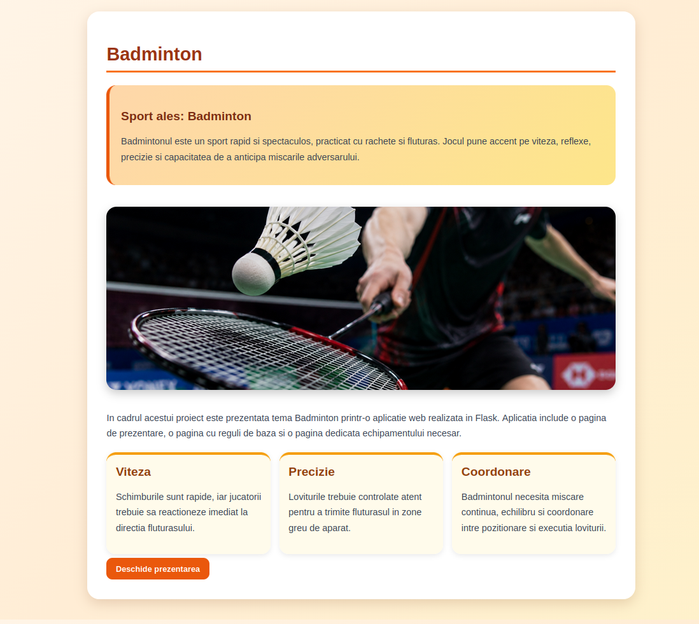
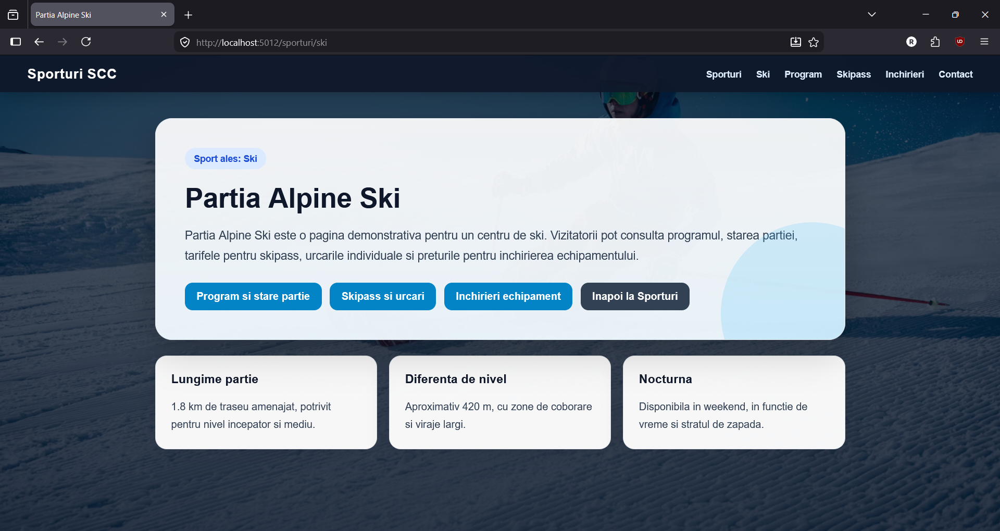
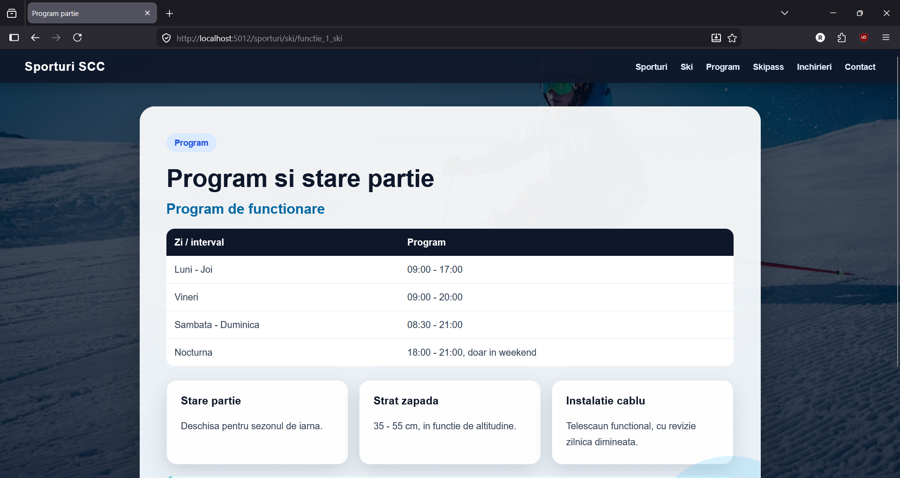
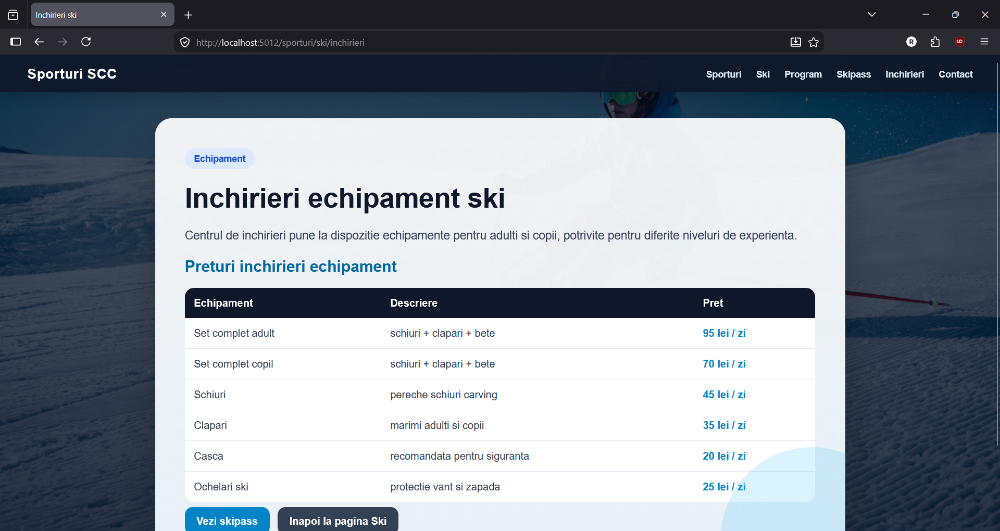
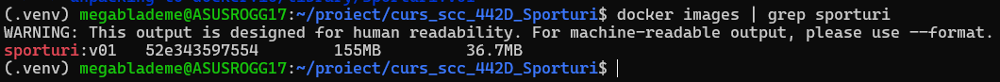
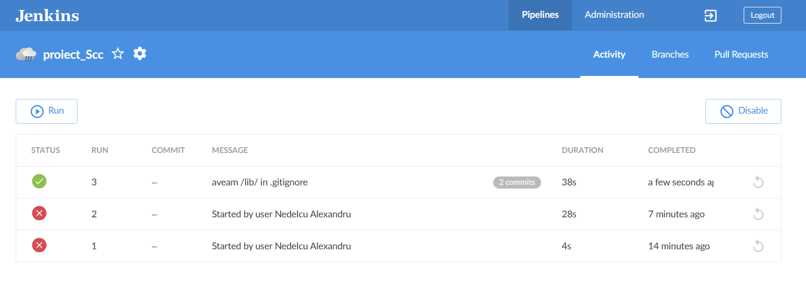

# Proiect SCC - Sporturi

## Dezvoltator

- **Nume:** Nedelcu Alexandru
- **Grupa:** 442D
- **Tema proiectului:** Sporturi
- **Element ales:** Ski
- **Branch de dezvoltare:** `dev_Nedelcu_Alexandru`
- **Mediu de lucru:** WSL - Ubuntu pe Windows

---

## Cuprins

- [Descriere generală](#descriere-generală)
- [Funcționalitate implementată](#funcționalitate-implementată)
- [Structura proiectului](#structura-proiectului)
- [Rute disponibile](#rute-disponibile)
- [Tehnologii utilizate](#tehnologii-utilizate)
- [Rulare locală în WSL](#rulare-locală-în-wsl)
- [Testare automată cu pytest](#testare-automată-cu-pytest)
- [Validare cod cu pylint](#validare-cod-cu-pylint)
- [Rulare cu Docker](#rulare-cu-docker)
- [DevOps CI - Jenkins](#devops-ci---jenkins)
- [Capturi aplicație web](#capturi-aplicație-web)
- [Capturi Docker](#capturi-docker)
- [Capturi Jenkins](#capturi-jenkins)
- [Concluzii](#concluzii)
- [Bibliografie](#bibliografie)

---

## Descriere generală

Acest proiect a fost realizat pentru disciplina **SCC** și urmărește dezvoltarea unei aplicații web simple folosind framework-ul **Flask**.

Tema generală a proiectului este **Sporturi**, iar elementul ales pentru implementarea individuală este **ski-ul**. Aplicația prezintă o pagină dedicată unei pârtii de ski, cu informații despre programul de funcționare, starea pârtiei, prețuri pentru skipass, urcări individuale, închirieri de echipament și date de contact.

Pagina `/sporturi` este gândită ca pagină generală pentru proiectul de grup, unde pot fi integrate și celelalte sporturi ale colegilor. Componenta individuală este disponibilă la ruta `/sporturi/ski`.

Proiectul a fost dezvoltat și testat în **WSL - Windows Subsystem for Linux**, folosind un mediu Ubuntu rulat direct pe Windows, fără mașină virtuală separată.

---

## Funcționalitate implementată

În cadrul branch-ului `dev_Nedelcu_Alexandru` au fost implementate următoarele componente:

- aplicație web Flask în fișierul `sporturi.py`;
- pagină generală pentru tema **Sporturi**;
- pagină principală pentru sportul ales: **Ski**;
- pagină pentru programul pârtiei și starea acesteia;
- pagină pentru tarife skipass și urcări individuale;
- pagină pentru închirieri echipament;
- pagină pentru reguli și contact;
- bibliotecă Python separată în `app/lib/biblioteca_sporturi.py`;
- teste automate în `app/tests/test_biblioteca_sporturi.py`;
- rulare locală prin virtual environment;
- containerizare cu Docker;
- pipeline CI/CD prin Jenkins.

---

## Structura proiectului

```text
curs_scc_442D_Sporturi/
│
├── app/
│   ├── __init__.py
│   ├── lib/
│   │   ├── __init__.py
│   │   └── biblioteca_sporturi.py
│   └── tests/
│       ├── __init__.py
│       └── test_biblioteca_sporturi.py
│
├── doc/
│   ├── docker_build.png
│   ├── docker_ps.png
│   ├── docker_run.png
│   ├── imagine_creeata.png
│   ├── jenkins_blue_ocean.png
│   ├── jenkins_status.png
│   ├── pagina skipass.png
│   ├── pagina_contact.png
│   ├── pagina_inchirieri.png
│   ├── pagina_program.png
│   ├── pagina_ski.png
│   └── pagina_sporturi.png
│
├── Dockerfile
├── Jenkinsfile
├── README.md
├── activeaza_venv
├── activeaza_venv_jenkins
├── dockerstart.sh
├── pytest.ini
├── quickrequirements.txt
├── ruleaza_aplicatia
└── sporturi.py
```

---

## Rute disponibile

| Rută | Descriere |
|---|---|
| `/` | Redirect către `/sporturi` |
| `/sporturi` | Pagina generală a temei Sporturi |
| `/sporturi/ski` | Pagina principală pentru sportul ales: Ski |
| `/sporturi/ski/functie_1_ski` | Programul pârtiei și starea acesteia |
| `/sporturi/ski/functie_2_ski` | Tarife skipass și urcări individuale |
| `/sporturi/ski/inchirieri` | Prețuri pentru închirieri echipament |
| `/sporturi/ski/contact` | Reguli de siguranță și contact |

---

## Tehnologii utilizate

- **Python 3** - limbajul principal de programare;
- **Flask** - framework web pentru definirea rutelor și afișarea paginilor;
- **HTML/CSS** - structurarea și stilizarea paginilor;
- **pytest** - testare automată;
- **pylint** - analiză statică a codului;
- **Docker** - rularea aplicației într-un container;
- **Jenkins** - automatizarea etapelor de build, testare și deploy;
- **GitHub** - versionarea codului și colaborarea în proiect;
- **WSL** - mediu Linux folosit direct pe Windows.

---

## Rulare locală în WSL

Proiectul a fost rulat local în **WSL**, folosind comenzi Linux.

Clonează repository-ul și intră pe branch-ul de dezvoltare:

```bash
git clone https://github.com/vlad-barbu18/curs_scc_442D_Sporturi.git
cd curs_scc_442D_Sporturi
git checkout dev_Nedelcu_Alexandru
```

Activează mediul virtual:

```bash
source ./activeaza_venv
```

Dacă mediul virtual `.venv` nu există, scriptul apelează `activeaza_venv_jenkins`, care creează mediul virtual și instalează dependențele din `quickrequirements.txt`.

Pornește aplicația:

```bash
source ./ruleaza_aplicatia
```

Aplicația poate fi accesată în browser la:

```text
http://127.0.0.1:5012/sporturi
```

---

## Testare automată cu pytest

Testele automate verifică funcțiile din biblioteca `app/lib/biblioteca_sporturi.py`.

Comanda de rulare:

```bash
pytest
```

Testele verifică:

- generarea HTML pentru programul pârtiei;
- existența informațiilor despre program și nocturnă;
- generarea HTML pentru tarifele skipass;
- existența tarifelor pentru urcări și abonamente;
- existența informațiilor despre închirieri;
- existența regulilor de siguranță.

---

## Validare cod cu pylint

Pentru analiza statică a codului se folosește `pylint`.

Comenzi:

```bash
pylint --exit-zero app/lib/*.py
pylint --exit-zero app/tests/*.py
pylint --exit-zero sporturi.py
```

Flag-ul `--exit-zero` permite afișarea avertismentelor fără oprirea pipeline-ului Jenkins.

---

## Rulare cu Docker

Aplicația poate fi rulată într-un container Docker.

Construirea imaginii:

```bash
docker build -t sporturi:v01 .
```

Pornirea containerului:

```bash
docker run --name sporturi1 -p 8021:5012 sporturi:v01
```

Aplicația din container poate fi accesată la:

```text
http://127.0.0.1:8021/sporturi
```

Oprirea și ștergerea containerului:

```bash
docker stop sporturi1
docker rm sporturi1
```

---

## DevOps CI - Jenkins

Pipeline-ul Jenkins este definit în fișierul `Jenkinsfile`.

Pipeline-ul conține patru etape principale:

1. **Build**  
   Creează mediul virtual și instalează dependențele din `quickrequirements.txt`.

2. **pylint - calitate cod**  
   Rulează analiza statică pentru fișierele Python.

3. **Unit Testing cu pytest**  
   Rulează testele automate definite în `app/tests`.

4. **Deploy**  
   Construiește imaginea Docker și creează containerul asociat build-ului.

Configurarea pipeline-ului în Jenkins se face folosind opțiunea:

```text
Pipeline script from SCM
```

Setări folosite:

```text
Repository URL: https://github.com/vlad-barbu18/curs_scc_442D_Sporturi.git
Branch Specifier: */dev_Nedelcu_Alexandru
Script Path: Jenkinsfile
```

---

# Capturi aplicație web

## Pagina generală Sporturi



Această pagină reprezintă punctul de intrare în tema generală **Sporturi**. Ea este gândită pentru integrarea mai multor sporturi în proiectul de grup, iar pentru componenta mea există link către pagina dedicată ski-ului.

---

## Pagina principală Ski



Aceasta este pagina principală pentru sportul ales. Pagina prezintă o pârtie de ski fictivă, cu design tematic de iarnă și acces rapid către program, skipass, închirieri și contact.

---

## Pagina Program și stare pârtie



Această pagină afișează programul de funcționare al pârtiei, informații despre nocturnă, starea pârtiei, stratul de zăpadă și instalația de transport pe cablu.

---

## Pagina Skipass și urcări individuale


Această secțiune prezintă tarifele pentru skipass și urcări individuale. Sunt incluse variante pentru adulți și copii, precum și abonamente pe durate diferite.

---

## Pagina Închirieri echipament



Pagina de închirieri afișează echipamentele disponibile, precum set complet de ski, schiuri, clăpari, cască și ochelari, împreună cu prețurile aferente.

---

## Pagina Contact și reguli


Această pagină include reguli de siguranță pentru utilizarea pârtiei și informații de contact pentru centrul de ski.

---

# Capturi Docker

## Construirea imaginii Docker


Captura arată procesul de construire a imaginii Docker pe baza fișierului `Dockerfile`. În această etapă sunt copiate fișierele proiectului, este creat mediul virtual și sunt instalate dependențele.

---

## Imagine Docker creată



Această captură confirmă faptul că imaginea Docker pentru proiect a fost creată cu succes și apare în lista imaginilor locale.

---

## Rularea containerului Docker


Captura arată pornirea containerului Docker și rularea aplicației Flask în interiorul acestuia.

---

## Container activ


Această captură confirmă că aplicația rulează într-un container activ și că portul containerului este mapat către portul local.

---

# Capturi Jenkins

## Status pipeline Jenkins


Această captură prezintă rezultatul rulării pipeline-ului Jenkins. Pipeline-ul automatizează pașii de build, analiză statică, testare și deploy.

---

## Pipeline în Blue Ocean



Blue Ocean oferă o reprezentare vizuală a etapelor pipeline-ului Jenkins, fiind util pentru urmărirea clară a stadiului fiecărui pas.

---

## Concluzii

Proiectul demonstrează parcurgerea unui flux complet de dezvoltare software pentru o aplicație web simplă:

- implementare aplicație Flask;
- organizarea codului în module separate;
- folosirea unei biblioteci Python dedicate pentru conținutul paginilor;
- testare automată cu pytest;
- analiză statică folosind pylint;
- rulare locală în WSL;
- containerizare cu Docker;
- automatizare CI/CD folosind Jenkins;
- versionare și colaborare prin GitHub.

Aplicația poate fi extinsă ulterior prin adăugarea altor sporturi în pagina generală `/sporturi`, fiecare sport având propriile rute și funcționalități.

---

## Bibliografie

- Flask Documentation: https://flask.palletsprojects.com/
- Pytest Documentation: https://docs.pytest.org/
- Pylint Documentation: https://pylint.pycqa.org/
- Docker Documentation: https://docs.docker.com/
- Jenkins Documentation: https://www.jenkins.io/doc/
- Repository model curs SCC: https://github.com/crchende/sysinfo.git